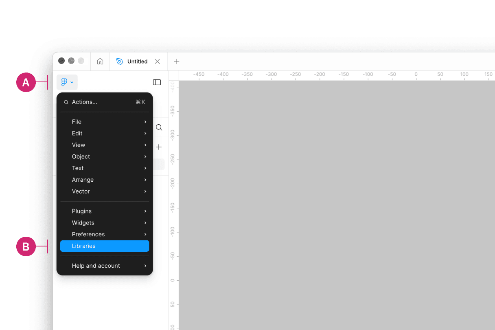
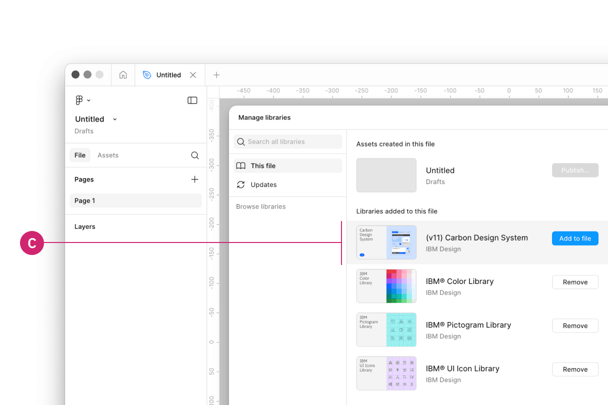
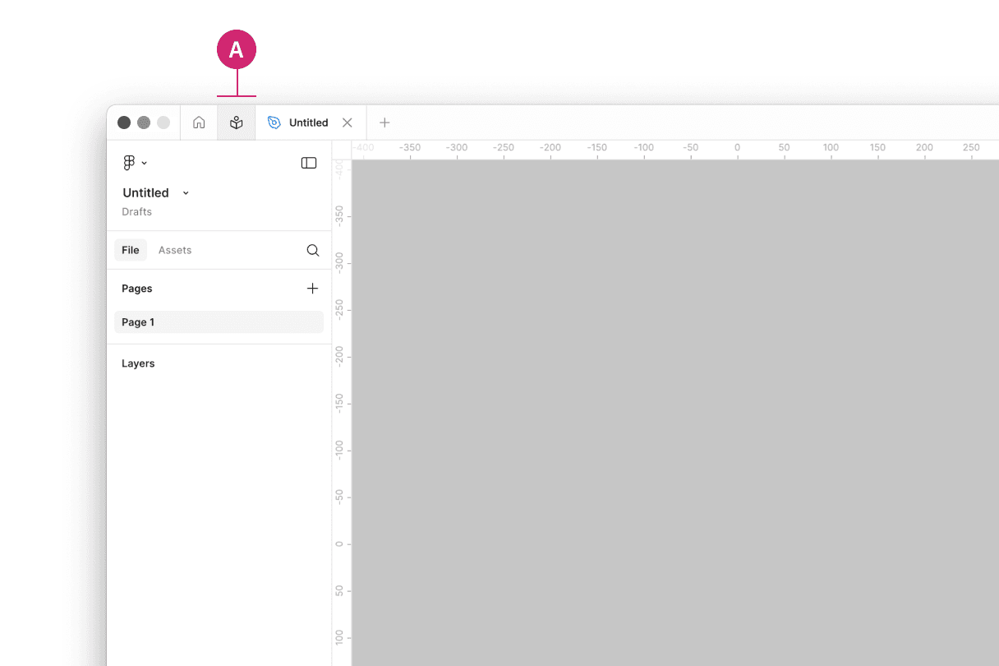
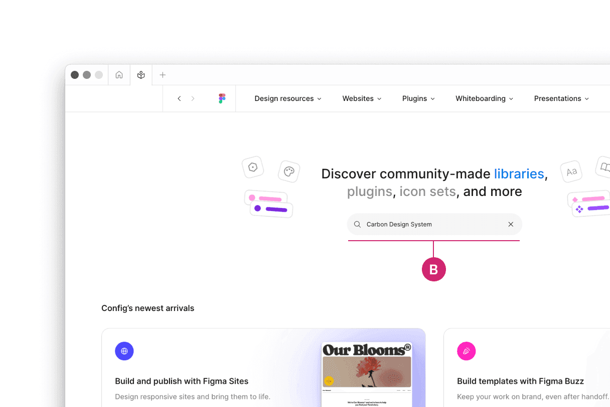
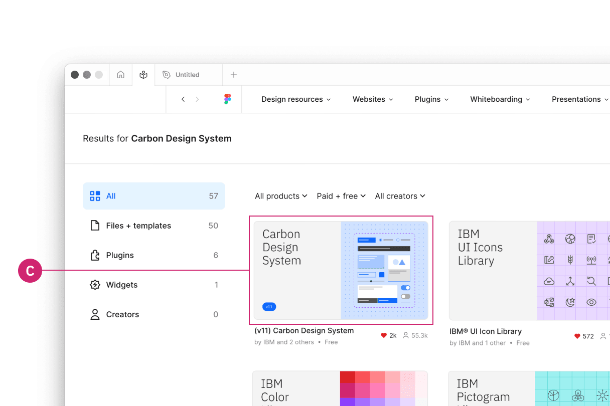

<PageDescription>

Rapidly build beautiful and accessible experiences. The Carbon kit for Figma
contains all resources you need to get started.

</PageDescription>

<AnchorLinks>
  <AnchorLink>Overview</AnchorLink>
  <AnchorLink>Internal users</AnchorLink>
  <AnchorLink>External users</AnchorLink>
  <AnchorLink>Start designing</AnchorLink>
  <AnchorLink>Feedback</AnchorLink>
</AnchorLinks>

## Overview

Carbon provides separate Figma kits for internal IBMers and external users. To
get started, follow the instructions that align with your role in the
[Internal users](/designing/kits/figma/#internal-users) or
[External users](/designing/kits/figma/#external-users) sections below.

## Internal users

### Get the libraries

#### 1. Sign into Figma using IBM SSO

You should be added to the IBM Figma organization automatically once you sign
in. You do not need to join or request to join any specific team to access the
libraries.

#### 2. Turn on the Carbon themes library

The `(v11) Carbon Design System` library includes all four Carbon themes,
including two light (White and Gray 10) and two dark (Gray 90 and Gray 100).

Inside of a design file, navigate to the **Main menu** panel in the top left of
the toolbar (A). Open the menu and select **Libraries** from the list (B).

<Row>
<Column colLg={8}>

</Column>
</Row>

Then in the Libraries modal that appears, find the `(v11) Carbon Design System`
library (C) and select the "Add to file" button to add the library.

<Row>
<Column colLg={8}>

</Column>
</Row>

<Row className="resource-card-group">
<Column colMd={4} colLg={4} noGutterSm>
  <ResourceCard
    subTitle="(v11) Carbon Design System"
    href="https://www.figma.com/design/YAnB1jKx0yCUL29j6uSLpg/-v11--Carbon-Design-System?m=auto"
    actionIcon="launch">

  </ResourceCard>
</Column>
</Row>

 

#### 3. Turn on IBM Design Language libraries 

You can optionally also turn on the following IBM Design Language libraries or
visit these view-only links.

- (v11) Carbon Type Sets - IBM Design Language
- IBM® Color Library - IBM Design Language
- IBM® UI Icon Library - IBM Design Language
- IBM® Pictogram Library - IBM Design Language

<Row className="resource-card-group">
<Column colMd={4} colLg={4} noGutterSm>
  <ResourceCard
    subTitle="(v11) Carbon Type Sets"
    href="https://www.figma.com/design/rK06GY6bvEfokuzrFGdtWB/-v11--Carbon-Type-Sets-%E2%80%93-Carbon-Design-System?m=auto"
    actionIcon="launch">

  </ResourceCard>
</Column>
<Column colMd={4} colLg={4} noGutterSm>
  <ResourceCard
    subTitle="IBM® Color Library"
    href="https://www.figma.com/design/Gvwx2RnAZzDKTjVuC5xOlO/IBM%C2%AE-Color-Library?m=auto"
    actionIcon="launch">

  </ResourceCard>
</Column>
<Column colMd={4} colLg={4} noGutterSm>
  <ResourceCard
    subTitle="IBM® UI Icon Library"
    href="https://www.figma.com/design/J5c0d85dSJn9JnBhSYYLmD/IBM%C2%AE-UI-Icon-Library?m=auto"
    actionIcon="launch">

  </ResourceCard>
</Column>
<Column colMd={4} colLg={4} noGutterSm>
  <ResourceCard
    subTitle="IBM® Pictogram Library"
    href="https://www.figma.com/design/PkUl9UBuvA41GPpyl84NBc/IBM%C2%AE-Pictogram-Library?m=auto"
    actionIcon="launch">

  </ResourceCard>
</Column>
</Row>

## External users

### Get the libraries

#### 1. Sign into Figma

#### 2. Get the theme libraries

The `(v11) Carbon Design System` library includes all four Carbon themes,
including two light (White and Gray 10) and two dark (Gray 90 and Gray 100).

Navigate to the **Community** icon in the header (A).

<Row>
<Column colLg={8}>

</Column>
</Row>

Search for **Carbon Design System** (B).

<Row>
<Column colLg={8}>

</Column>
</Row>

See the `(v11) Carbon Design System` library file.

<Row>
<Column colLg={8}>

</Column>
</Row>

#### 3. Duplicate the file of your choice to your workspace

#### 4. Publish as a library to your workspace

To preview the `(v11) Carbon Design System` library, visit the following
view-only link.

<Row className="resource-card-group">
<Column colMd={4} colLg={4} noGutterSm>
  <ResourceCard
    subTitle="(v11) Carbon Design System"
    href="https://www.figma.com/community/file/1157761560874207208"
    actionIcon="launch">

  </ResourceCard>
</Column>
</Row>

#### 5. Bring in additional colors and icons

Use these additional IBM Design Language libraries to have access to type sets,
color, icons, and pictograms.

<Row className="resource-card-group">
<Column colMd={4} colLg={4} noGutterSm>
  <ResourceCard
    subTitle="(v11) Carbon Type Sets"
    href="https://www.figma.com/community/file/1127113732861637625"
    actionIcon="launch">

  </ResourceCard>
</Column>
<Column colMd={4} colLg={4} noGutterSm>
  <ResourceCard
    subTitle="IBM® Color Library"
    href="https://www.figma.com/community/file/1089055766693968230"
    actionIcon="launch">

  </ResourceCard>
</Column>
<Column colMd={4} colLg={4} noGutterSm>
  <ResourceCard
    subTitle="IBM® UI Icon Library"
    href="https://www.figma.com/community/file/1089055340263947620"
    actionIcon="launch">

  </ResourceCard>
</Column>
<Column colMd={4} colLg={4} noGutterSm>
  <ResourceCard
    subTitle="IBM® Pictogram Library"
    href="https://www.figma.com/community/file/1089047716352012639"
    actionIcon="launch">

  </ResourceCard>
</Column>
</Row>

## Start designing

### Components

Included in the library are all of the Carbon components and their variants. To
insert a component, go to the **Asset** panel and find the component you would
like to use. Drag it from the asset panel onto the canvas.

View the name of the component in the right sidebar. If the component has
variants, you'll see fields and controls underneath the component name to
configure the properties and values of that component set.

For more help on how to use Figma components, see the
[Figma docs](https://help.figma.com/hc/en-us/articles/360056440594-Create-and-use-variants#Use_variants).

### Grids and screens

Included in the library is an asset called `Screens`. These screens provide a
canvas that can be configured at the five 2x grid breakpoints. It also includes
the 16 column grid both with and without a left panel grid influencer.

### Color variables

The Carbon color tokens are surfaced in Figma using variables. To apply a color
variable, select an object. Then in the fill or stroke sections in the right
panel, open the menu to select a variable from the Carbon theme libraries or the
IBM Design Language libraries. In addition to applying color variables to
objects, you can also apply them to text layers.

To learn more about applying color variables in Figma, see the
[Figma docs](https://help.figma.com/hc/en-us/articles/15343107263511-Apply-variables-to-designs).

### Text styles

To apply a text style, select a text layer, then in the properties panel, choose
a text style from the `(v11) Carbon Type Sets` library depending on which
version you are on. Use color styles to change the color of a text style.

To learn more about applying text styles in Figma, see the
[Figma docs](https://help.figma.com/hc/en-us/articles/360039957034-Create-and-Apply-Text-Styles#apply).

## Feedback

Help us improve this component by providing feedback, asking questions, and
leaving any other comments on
[GitHub](https://github.com/carbon-design-system/carbon-design-kit/issues).
