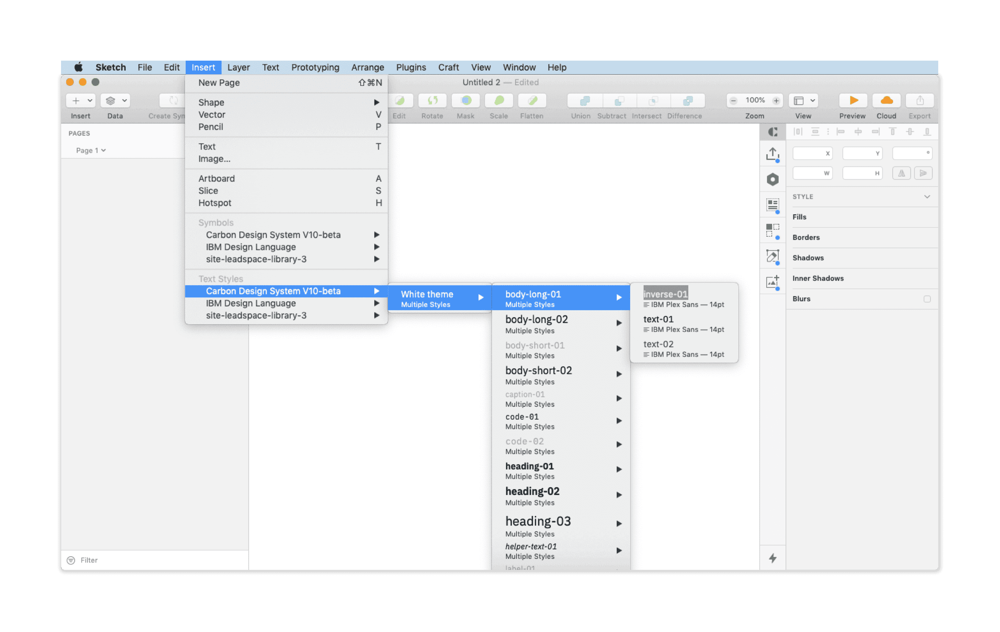

<PageDescription>

Rapidly build beautiful and accessible experiences. The Carbon kit Sketch
contains all resources you need to get started.

</PageDescription>

<AnchorLinks>

<AnchorLink>Get the kit</AnchorLink>
<AnchorLink>Start designing</AnchorLink>
<AnchorLink>How to use</AnchorLink>
<AnchorLink>Info</AnchorLink>

</AnchorLinks>

## Get the kit

#### 1. **Install Sketch**.

To design with Carbon you must have the **most recent version** of
[Sketch](https://www.sketch.com/) installed.

#### 2. **Choose a theme**.

There are [four Carbon themes](/guidelines/color/overview#themes), two light
(White and Gray 10) and two dark (Gray 90 and Gray 100). Each theme lives in its
own Sketch library. You can subscribe to as many libraries as you'd like.

<Row className="resource-card-group">
  <Column colMd={4} colLg={4} noGutterSm>
    <ResourceCard
      onClick={() => fathom.trackGoal('P0OEN9TS', 0)}
      subTitle="White theme"
      href="sketch://add-library/cloud/557b75ff-67d3-41ab-ada5-fa25447218c1"
    >
      <MdxIcon name="sketch" />
    </ResourceCard>
  </Column>
  <Column colMd={4} colLg={4} noGutterSm>
    <ResourceCard
      onClick={() => fathom.trackGoal('T7D1HJ3L', 0)}
      subTitle="Gray 10 theme"
      href="sketch://add-library/cloud/b4ea2a21-4b1a-4c64-99dc-a1365eff5d5f"
    >
      <MdxIcon name="sketch" />
    </ResourceCard>
  </Column>
  <Column colMd={4} colLg={4} noGutterSm>
    <ResourceCard
      onClick={() => fathom.trackGoal('LYFJTPDE', 0)}
      subTitle="Gray 90 theme"
      href="sketch://add-library/cloud/a324c6dd-df97-435e-b79f-3a29e04922fc"
    >
      <MdxIcon name="sketch" />
    </ResourceCard>
  </Column>
  <Column colMd={4} colLg={4} noGutterSm>
    <ResourceCard
      onClick={() => fathom.trackGoal('3XH0SIBJ', 0)}
      subTitle="Gray 100 theme"
      href="sketch://add-library/cloud/9d47a4fd-70dd-44ff-bc57-22c79da8e477"
    >
      <MdxIcon name="sketch" />
    </ResourceCard>
  </Column>
</Row>

 
 

#### 3. **Bring in additional colors and icons**.

Additional color collections live in the IBM Design Language library. Icons live
in two different libraries separated by size.

<Row className="resource-card-group">
  <Column colMd={4} colLg={4} noGutterSm>
    <ResourceCard
      subTitle="IBM Design Language"
      href="sketch://add-library/cloud/4f1cbe6c-6626-405e-8c46-a9ae41a30cba"
    >
      <MdxIcon name="sketch" />
    </ResourceCard>
  </Column>
  <Column colMd={4} colLg={4} noGutterSm>
    <ResourceCard
      subTitle="IBM Icons (16px, 20px) library"
      href="sketch://add-library/cloud/028e0598-591e-428c-a490-f6ec64b15ea7"
    >
      <MdxIcon name="sketch" />
    </ResourceCard>
  </Column>
  <Column colMd={4} colLg={4} noGutterSm>
    <ResourceCard
      subTitle="IBM Icons (24px, 32px) library"
      href="sketch://add-library/cloud/d530998a-c94c-4f1c-bc0e-c05417e067e3"
    >
      <MdxIcon name="sketch" />
    </ResourceCard>
  </Column>
</Row>

 
 

#### 4. **Download the grid templates**.

Visit the
[Sketch library](https://www.sketch.com/s/3a3f3f2d-94d7-4c16-8e2e-88ba80a6382e)
page and choose `Download Document` from the right-side panel.

Open the file in Sketch. Navigate to `File → Save as Template`. You can now
access the saved grid template at `File → New file from Template`.

<Row className="resource-card-group">
  <Column colLg={4} colMd={4} noGutterSm>
    <ResourceCard
      subTitle="IBM Grid template"
      href="https://www.sketch.com/s/3a3f3f2d-94d7-4c16-8e2e-88ba80a6382e"
    >
      <MdxIcon name="sketch" />
    </ResourceCard>
  </Column>
  <Column colLg={4} colMd={4} noGutterSm>
    <ResourceCard
      subTitle="UI Shell template"
      href="https://www.sketch.com/s/6a8e1d7b-f00a-4d8d-9d83-79ecf4dc12a0"
    >
      <MdxIcon name="sketch" />
    </ResourceCard>
  </Column>
</Row>

## Start designing

To get started with Carbon, familiarize yourself with the contents of each
library.

#### **Start with the grid**.

At the top of your screen, navigate to `File → New file from Template` and
select your grid template. You'll always be able to find the template here.

#### **Icons and color swatches**.

Symbols from both the IBM Design Language library and the Carbon library are
accessible from any Sketch document. Navigate to
`Insert → Symbols → Carbon Design System` or `IBM Design Language`.

#### **You're all set**.

Refer to the content below for a more detailed breakdown of the kit, or head to
Sketch to begin designing.

## How to use

<AnchorLinks small>

<AnchorLink>Grid</AnchorLink>
<AnchorLink>Symbols</AnchorLink>
<AnchorLink>Text styles</AnchorLink>
<AnchorLink>Layer styles</AnchorLink>

</AnchorLinks>

### Grid

The [IBM 2x Grid](/guidelines/2x-grid/overview/) is fundamental to everything we
design. It is the geometric foundation of all the visual elements in the IBM
Design Language, from typography to columns, boxes, icons, and illustrations.
The grid provides structure and guidance for all creative decision-making.

<Caption>2x Grid overview</Caption>

#### Getting started

All designs should start with the 2x Grid. Once you
have [saved the grid](/designing/kits/sketch/#get-the-kit) as a template, in
Sketch navigate to **File → New file from Template** and select the
`IBM Grid template` to open a new document with preset grid artboards. Either
begin working in the new file or copy/paste an artboard into your working file.

#### Layout

The grid layout feature controls and shows the 2x grid columns, gutters, and
page margins. To create or edit the layout go to **View → Canvas → Layout
Settings...**.

To toggle seeing the 2x grid columns on an artboard go to **View → Show layout**
or use the keyboard shortcut  `Control+L`.

#### Grid

To toggle seeing the mini unit grid go to **View → Show grid** or use the
keyboard shortcut `Control+G`.

#### Breakpoints

The layout settings change depending on which size screen you are designing for.
See
[breakpoints](https://www.carbondesignsystem.com/guidelines/2x-grid/overview/#breakpoints).

### Basic grid

This basic grid is not affected by any influencers and would simply react to the
product's breakpoints. Every layout and break points are included in the grid
template on the page labeled "Basic grid".

### Grids with an influencer

An influencer is a component that affects the content on the page. It can either
appears on a page as the result of a user action or be part of your product's
page. These [influencers](/guidelines/2x-grid/overview/#grid-influencers) effect
the layout grid by scaling and resizing the columns and its content. You can
find an assortment of examples of grids with an influences in the grid template
file on the page labeled "Grid influencers".

### Calculating the Sketch grid

#### Sketch layout settings

Slide-in panels influence the page layout grid; below are some of the
specifications for panel combinations and how they impact the grid at all sizes.

- Breakpoint width\* = **Artboard width**
- Breakpoint gutter\* = **Left and right outside margins**
- Total panel width (“sidebar nav”) + Left outside margin + Right outside margin
  = **Total margins**
- Artboard width - Total margins = **Total width**
- Total panel width + Left margin = **Offset**

\*Since we are following the Carbon Design responsive guidelines, we referenced
[this table](https://www.carbondesignsystem.com/guidelines/2x-grid/implementation#responsive-options)
to determine our common breakpoint widths and respective gutter specs.

#### Example

Let’s say we want to create a custom grid for a new design that uses the extra
small panel (256px wide) on our x-large 1312px breakpoint. Applying the formula
above, your calculations would look like this:

- Breakpoint width (1312px) = 1312px wide artboard
- Breakpoint gutter (32px) = 32px Left outside margin and 32px Right outside
  margin
- Total panel width (256px) + 16px Left + 16px Right = 288px Total margins
- Artboard width (1312px) - Total margins (272px) = **1,056px Total width**
- Total panel width (256px) + 16px Left = **272px Offset**

\*If the grid influencer would cause the content view size to be smaller than
1056, then it would follow the next grid breakpoint setting the columns to 8.
Which also avoids columns that are smaller than 32.

### Symbols

Carbon [components](/components/overview), [add-ons](/contributing/add-ons), and
[icons](/guidelines/icons/library) live in the design kit as Sketch symbols.

#### Library menu navigation

There are two kinds of symbols — library symbols and document symbols. Library
symbols are available in any Sketch document, while document symbols are
specific to the document in which they are found.

From the main menu select **Insert → Symbols → Carbon Design System** then
select the desired symbol to add onto your page.

Carbon symbols are built to be flexible, and designers should not detach symbols
from the library. Once a symbol is detached, you will no longer receive updates
as they are released.

#### Structure

Symbols are organized by component; after selecting a component, you'll see the
variations and states of that component.

- To add the whole component, select the desired variant and place it on your
  artboard.

- For even more configurability, use the individual building blocks found under
  the `Items` folder within the symbol. Be sure your custom design adheres to
  our [design guidelines](/guidelines/accessibility/overview).

### Text styles

Text styles are based on typography rules defined by the
[IBM Design Language](https://www.ibm.com/design/language/elements/type-basics).

#### Library menu navigation

From the main menu select **Insert → Text Styles → Carbon Design System** to
insert a Carbon type token text style.

Text styles within components are carefully considered. We do not recommend
detaching the symbol to change default styles.

#### Structure

Carbon text styles in Sketch are organized similarly to symbols.

- The first text style level displays
  [theme options](/guidelines/themes/overview) (i.e., white theme).
- The second level shows the [Carbon type](/guidelines/typography/overview)
  tokens (i.e., body-long-01).
- The third level selects the type color, which is labeled with a
  [Carbon color](/guidelines/color/overview) token name.

### Layer styles

Layer styles are color selections for any shape in Sketch.

<Caption>Use predetermined overrides when possible</Caption>

#### Library menu navigation

[Color](/guidelines/color/overview) in Carbon is carefully considered, and we
discourage custom layer styles.

The first layer is the theme selection (i.e., 01 White theme). The second layer
is core Carbon color tokens (i.e., field-01) for the selected them. The
interaction state tokens are nested in a third layer under “state.”

## Info

If you're brand new to Sketch, they offer some great
[tutorials and help docs](https://www.sketchapp.com/docs/).

### Updates

We make small adjustments and bug fixes to the kit on a regular basis. When we
make a change to any of the libraries, you will be notified via a red pop-up in
the top right corner of the Sketch window.

The updates are opt-in, however we recommend you keep your kit as up to date as
possible. Once a change is accepted, you will not be able to revert to the
previous version.

### Migration

If you're using an older version of Carbon, check out the v10
[migration docs](/help/migration-guide/design/) when you're ready to make the
switch.

### Support

Can't find an answer to your question? Open up an issue on
[GitHub](https://github.com/carbon-design-system/carbon/issues/new/choose).
