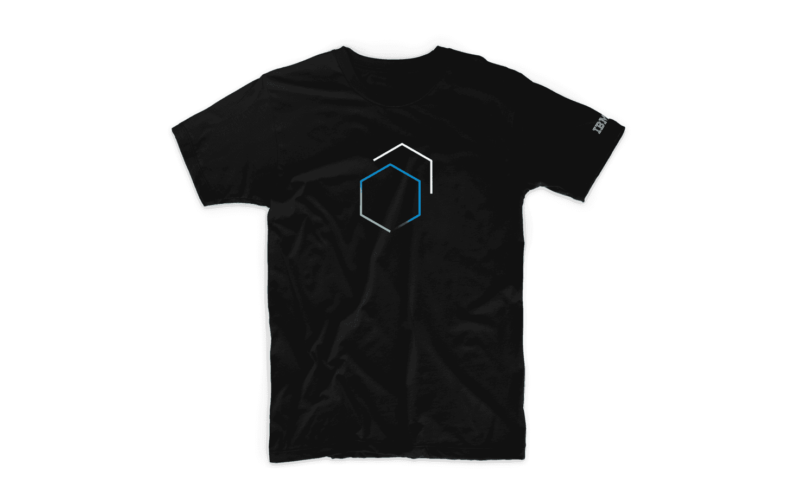

### Thanks for completing our tutorial and helping us improve it along the way. As a way to say thanks, you can apply for an IBM Digital Badge and a free shirt!

<AnchorLinks>

<AnchorLink>Badging</AnchorLink>
<AnchorLink>Free t-shirt</AnchorLink>
<AnchorLink>Application</AnchorLink>

</AnchorLinks>

## Badging

Once you complete all five steps of the tutorial, you can apply for the IBM
Digital Badge. These badges are available to anybody—not just IBM employees.

<Row>
<Column colLg={8}>

<Caption>IBM Digital Badge</Caption>

</Column>
</Row>

### IBM Design System Angular Components

This badge demonstrates knowledge about Carbon's Angular components. To earn the
badge:

1. Complete steps 1 through 5 of the Angular Carbon tutorial
   - Step 1. [Installing Carbon](/developing/angular-tutorial/step-1)
   - Step 2. [Building pages](/developing/angular-tutorial/step-2)
   - Step 3. [Using APIs](/developing/angular-tutorial/step-3)
   - Step 4. [Creating components](/developing/angular-tutorial/step-4)
   - Step 5. [Deploying to IBM Cloud](/developing/angular-tutorial/step-5)
2. Submit links to approved pull requests for steps 1 through 5 of the Angular
   Carbon tutorial in the
   [carbon-tutorial-angular repository](https://github.com/carbon-design-system/carbon-tutorial-angular).
   - To quickly find your submitted PRs, you can
     [filter by author](https://github.com/carbon-design-system/carbon-tutorial-angular/pulls?utf8=%E2%9C%93&q=author%3Ausername)
     (e.g. `author:${username}`)

### FAQ and help

Badge issuer contact: matt.rosno@ibm.com

For questions related to your Acclaim badge earner account and profile, as well
as issues related to claiming your badge after receiving a notification, go to
[http://support.youracclaim.com](http://support.youracclaim.com) for account
issues.

### Privacy statement

NOTICE: IBM leverages the services of Credly's Acclaim platform, a 3rd party
data processor authorized by IBM and located in the United States, to assist in
the administration of the IBM Digital Badge program. In order to issue you an
IBM Digital Badge, your personal information (name, email address, and badge
earned) will be shared with the Credly's Acclaim platform. You will receive an
email notification from Acclaim with instructions for claiming the badge. Your
personal information is used to issue your badge and for program reporting and
operational purposes. It will be handled in a manner consistent with IBM privacy
practices. The IBM Privacy Statement can be viewed here:
[https://www.ibm.com/privacy/us/en/](https://www.ibm.com/privacy/us/en/). IBM
employees can view the IBM Internal Privacy Statement here:
[https://w3.ibm.com/w3publisher/w3-privacy-notice](https://w3.ibm.com/w3publisher/w3-privacy-notice).

## Free t-shirt

Submit your completed IBM Digital Badge application by March 27, 2020, and
receive a free\* Carbon t-shirt.

<Row>
<Column colLg={8}>

<Caption>Carbon t-shirt, #swag #threads #highfashion</Caption>

</Column>
</Row>

## Application

Complete the
[application form](https://www.surveygizmo.com/s3/5215497/IBM-Carbon-Design-System-Developer-Essentials-Angular)
to request the digital badge and t-shirt. Once you submit the application,
please allow a few weeks for issuing the badge and 4-6 weeks to receive the
t-shirt. Once the badge is issued, you will be notified and must accept the
badge via Acclaim.

_\* Shirts are available for a limited time while supplies last to U.S. shipping
addresses and outside the U.S. to participating FED@IBM branches._
