import { Link } from 'gatsby';

<PageDescription>

Follow these steps to configure your AI application or AI agent to use Carbon
MCP.

</PageDescription>

<AnchorLinks>
  <AnchorLink>Step 1: Using your IBMid (w3id) or functional ID</AnchorLink>
  <AnchorLink>Step 2: Getting access credentials</AnchorLink>
  <AnchorLink>Step 3: Connecting to IBM Bob and other MCP clients</AnchorLink>
  <AnchorLink>Step 4: Adding the carbon-builder skill</AnchorLink>
</AnchorLinks>

## Step 1: Using your IBMid (w3id) or functional ID

When going through the OAuth onboarding process, you will need to authenticate
with your IBMid (w3id for IBMers). If you need an IBMid, create one
[here](https://www.ibm.com/account/reg/us-en/signup?formid=urx-19776).

IBM product teams also have the option of authenticating via a functional ID. If
your team needs a functional ID, create one
[here](https://w3.ibm.com/#/support/article/04535/drms_addrecord?section=fid).

## Step 2: Getting access credentials

This step will launch the authorization flow to generate Carbon MCP
authentication credentials, which can be provided to your MCP client.

<InlineNotification kind="info">
  IBMers will be provided authentication credentials immediately upon clicking
  the link below and signing in. All other users will be prompted to request
  access.
</InlineNotification>

### Access request workflow

1. <Link
     href="https://mcp.carbondesignsystem.com/mcp/auth/ibmid/web"
     target="_blank">
     {' '}
     Visit this link to generate your token and session ID
   </Link>
2. Request access if prompted
3. Check your email for the activation link
4. Copy your credentials: to add to your Carbon MCP configuration

## Step 3: Connecting to IBM Bob and other MCP clients

The IBM Cloud deployment of the Carbon MCP is available at
`https://mcp.carbondesignsystem.com/mcp`.

Here's how to set it up in Bob and other common MCP clients:

<Accordion>
<AccordionItem title="Bob">

There are **two steps** required to set up Carbon MCP in Bob. First, you need to
install **Carbon MCP** from the Bob Marketplace. Then, you need to install the

<a href="/developing/carbon-mcp/onboarding-and-setup/#step-4:-adding-the-carbon-builder-skill">
  carbon-builder skill
</a>
.

#### Step 1: Installing Carbon MCP

<br />

In Bob, select the settings icon in the upper right.

<br />

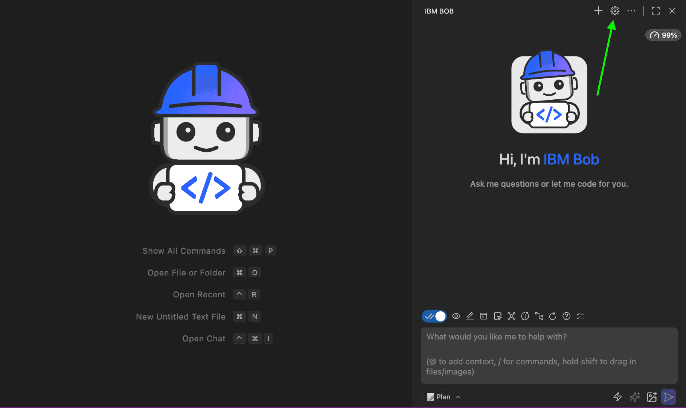

<br />
<br />

Select the **MCP** tab, then search for **"Carbon"** in the text field. Click
the **Install** button.

<br />

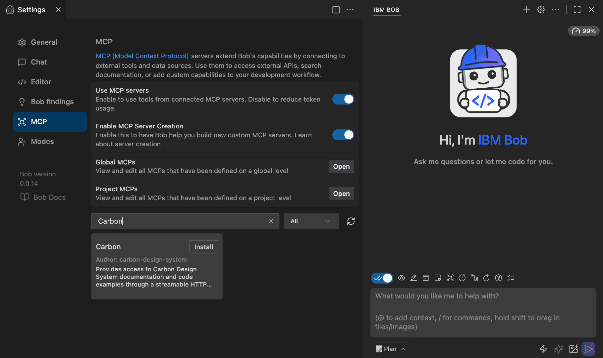

<br />
<br />

Enter your Carbon **access token** and **session ID** in the modal dialogue,
then click **Install**.

<br />
<div style={{ marginInline: '-1rem' }}>
  <InlineNotification kind="warning">
    It is not recommended to choose "Project (current workspace)" as it can
    potentially introduce the risk of your token being committed to your
    repository.
  </InlineNotification>
</div>
<br />

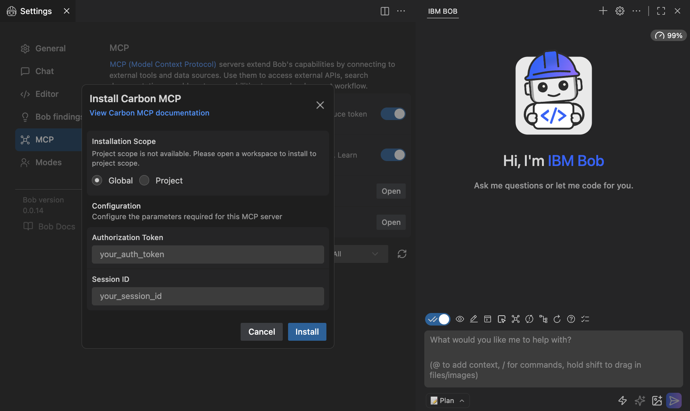

<br />
<br />

You will see a confirmation of a successful installation.

<br />

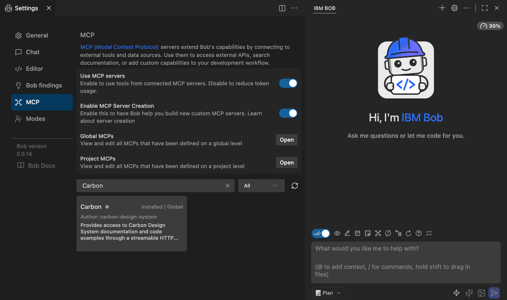

#### Step 2: Installing the carbon-builder skill

<br />

Now that you've installed Carbon MCP, you need to install the carbon-builder
skill, which provides Carbon-specific guidance to help the model generate better
output.

<br />

Follow the instructions in _Step 4: Adding the carbon-builder skill_ to install
the

[carbon-builder skill](/developing/carbon-mcp/onboarding-and-setup/#step-4:-adding-the-carbon-builder-skill)
for Bob.

</AccordionItem>

<AccordionItem title="Claude Code">

- Use the Claude Code CLI and replace the `<TOKEN>` and `<SESSION>` with your
  Carbon MCP auth credentials

<br />

```bash
claude mcp add-json carbon-mcp '{"type":"http","url":"https://mcp.carbondesignsystem.com/mcp","headers":{"Authorization":"Bearer <TOKEN>","X-MCP-Session":"<SESSION>"}}'
```

<br />

- Verify that Claude Code recognizes Carbon MCP by running `claude mcp list`

</AccordionItem>

<AccordionItem title="Claude Desktop">

Carbon MCP can be set up in Claude Desktop as an Extension or Custom Connector.
This section describes how to make both connections.

#### Adding Carbon MCP as an Extension

- Open Settings > Extensions > Advanced Settings

<br />
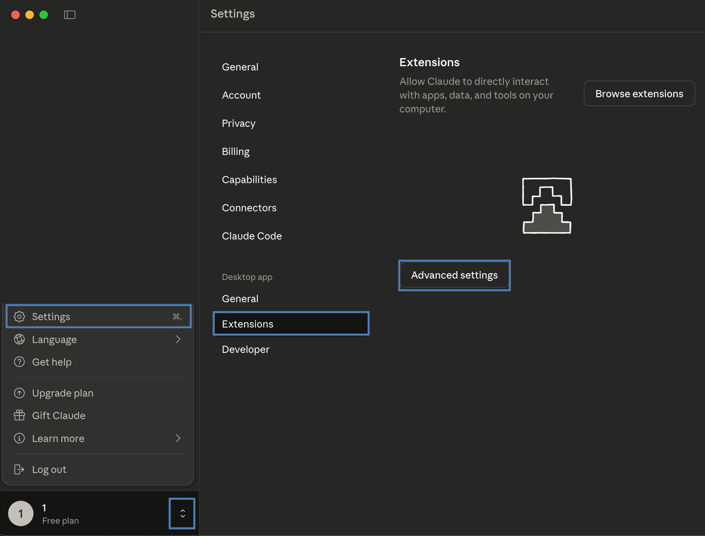
<br />

- Click Install Extension

<br />
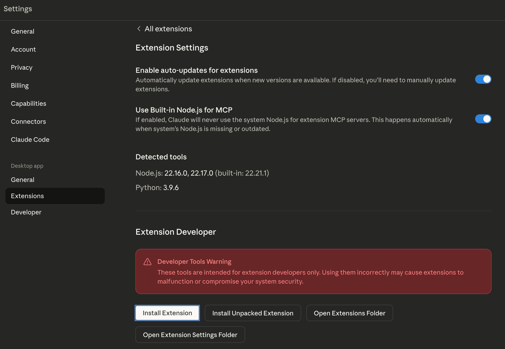
<br />

- Install the `Carbon MCP Claude Desktop extension`, which can be downloaded
  [here](/developing/carbon-mcp/files/carbon-mcp-claude-extension.mcpb).

<br />
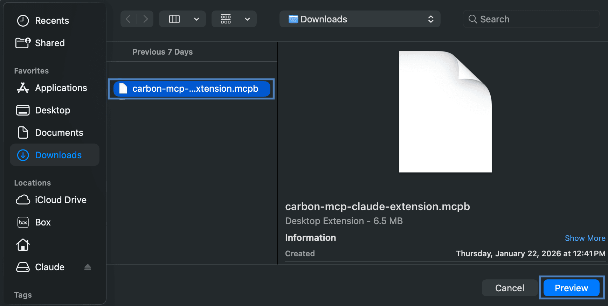
<br />
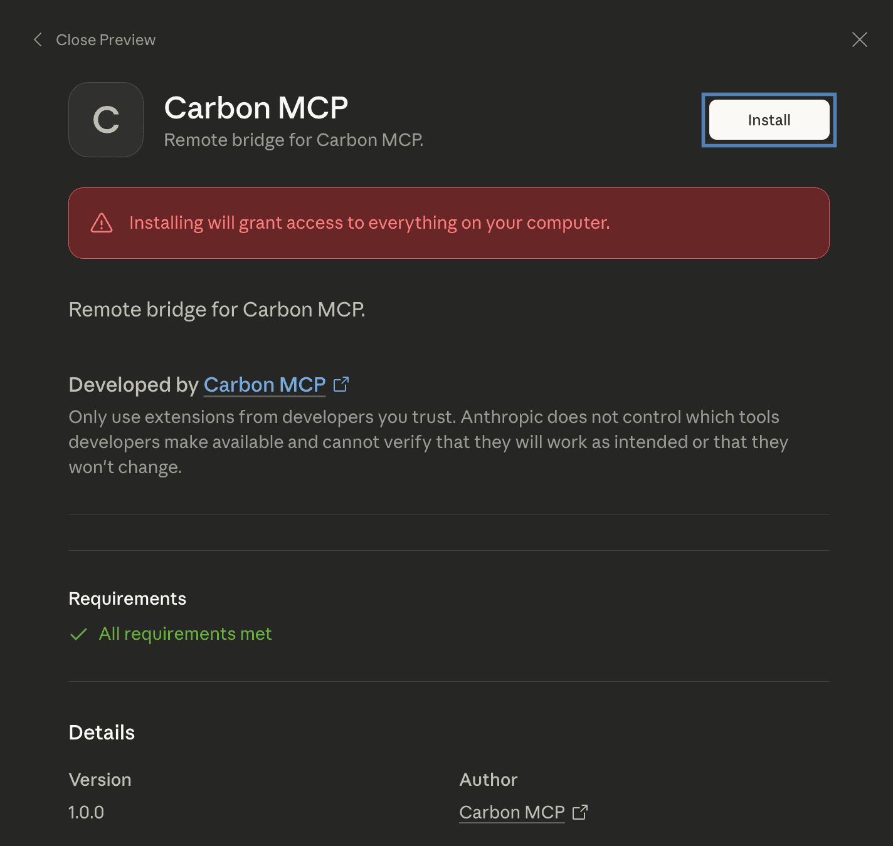
<br />

- Enter your Carbon MCP auth token and session ID in the modal, click Save to
  confirm.

<br />
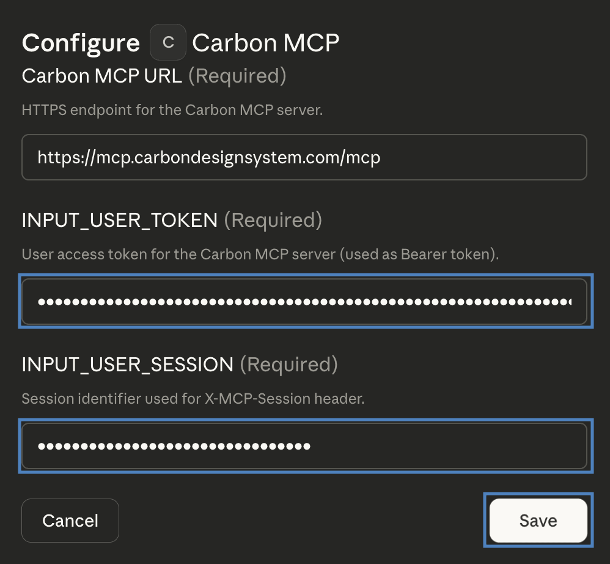
<br />

- Verify that the Carbon MCP extension is configured by ensuring the toggle is
  switched on and shows as Enabled.

<br />
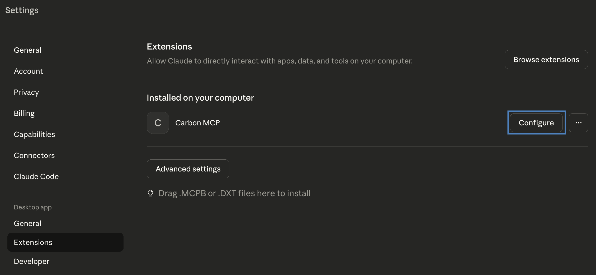
<br />
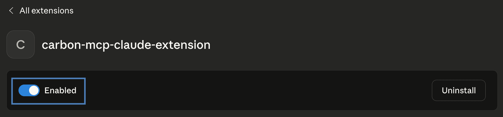
<br />
<br />

#### Adding Carbon MCP as a Custom Connector

- Open Settings > Connectors
- Click on Add Custom Connector
- When prompted for a name, enter `carbon-mcp`
- Under the Remote MCP server URL input, use
  `https://mcp.carbondesignsystem.com/mcp`
- Click Add

</AccordionItem>

<AccordionItem title="Cursor">
[](https://cursor.com/en-US/install-mcp?name=carbon-mcp&config=eyJ0eXBlIjoic3RyZWFtYWJsZS1odHRwIiwidXJsIjoiaHR0cHM6Ly9tY3AuY2FyYm9uZGVzaWduc3lzdGVtLmNvbS9tY3AiLCJkaXNhYmxlZCI6ZmFsc2UsInRpbWVvdXQiOjYwMCwiaGVhZGVycyI6eyJBdXRob3JpemF0aW9uIjoiIiwiWC1NQ1AtU2Vzc2lvbiI6IiJ9LCJhbHdheXNBbGxvdyI6WyJjb2RlX3NlYXJjaCIsImRvY3Nfc2VhcmNoIl19)

- Or manually open the command palette
- Select “View: Open MCP Settings”
- Click on “Add custom MCP”
- It will open a file with your MCP servers where you can add the following
  configuration:
  <br />
  <br />

```markdown
{ "mcpServers": { "carbon-mcp": { "type":"streamable-http", "url":
"https://mcp.carbondesignsystem.com/mcp", "disabled": false, "timeout": 600,
"headers": { "Authorization": "Bearer <TOKEN>", "X-MCP-Session": "<SESSION>" },
"alwaysAllow": ["code_search", "docs_search", "get_charts"] } } }
```

<br />
<br />
- Replace `<TOKEN>` and `<SESSION>` with your actual Carbon MCP auth credentials
- Save and close the file
- Quit and relaunch Cursor

</AccordionItem>

<AccordionItem title="Figma Make">

#### For IBMers:

<br />

- Open Figma Make and navigate to click "Connectors"
- Select the **IBM** tab
- Click the **Connect** button next to Carbon MCP
- A browser window will open — sign in with your IBMid when prompted
- After signing in successfully, return to Figma Make. The Carbon MCP connector
  dialogue should still be open (if not, reopen Connectors and select the IBM
  tab)
- Toggle on the **Enable write tools** button
- For each of the following tools, open its dropdown and select **Always run**:
  - `doc_search`
  - `code_search`
  - `get_charts`
- Click **Back**, then click **X** to close the Connectors menu

<br />
**Starting your first Make with Carbon MCP:**

- In Figma Make, create a new Make file
- Select a LLM model from the model selector. _NOTE: Gemini was observed to
  consume fewer tokens, while Anthropic's Claude Opus 4.6 model (or later)
  tended to produce more accurate and complete code output_
- Click **Add context** in the chat box, then select **Carbon MCP** from your
  connectors to attach it to the session
- Paste or attach your input design (e.g. a Figma frame or image), then include
  the suggested
  [user prompt](/developing/carbon-mcp/files/figma-make-user-prompt.txt) in the
  same message and send it to begin generation
- Once generation begins, Figma Make will create an initial draft. Before
  accepting it, switch to the **Code** view (top of the Make canvas)
- Open the [GUIDELINES.txt](/developing/carbon-mcp/files/GUIDELINES.txt) file,
  copy its full contents, and paste them into `GUIDELINES.md` in the code view
- Return to the chat and continue the conversation — the model will incorporate
  these guidelines going forward

#### For non-IBMers:

<br />

<InlineNotification kind="info">
  To complete the steps below, your Figma admin must enable user creation of
  custom connectors.
</InlineNotification>

<br />

- Open Figma Make and navigate to click "Connectors"
- Select the **Created by you** tab
- Click the **Create connector** button
- In the Create connector dialogue, enter `carbon-mcp` as the name and click
  **Next**
- In the **MCP server URL** field, enter
  `https://mcp.carbondesignsystem.com/mcp` and click **Create**
- Click the **Connect** button next to Carbon MCP
- A browser window will open — sign in with your Figma account when prompted
- After signing in successfully, return to Figma Make. The Carbon MCP connector
  dialogue should still be open (if not, reopen Connectors and select the
  Created by you tab)
- Toggle on the **Enable write tools** button
- For each of the following tools, open its dropdown and select **Always run**:
  - `doc_search`
  - `code_search`
  - `get_charts`
- Click **Back**, then click **X** to close the Connectors menu

<br />
**Starting your first Make with Carbon MCP:**

- In Figma Make, create a new Make file
- Select a LLM model from the model selector. _NOTE: Gemini was observed to
  consume fewer tokens, while Anthropic's Claude Opus 4.6 model (or later)
  tended to produce more accurate and complete code output_
- Click **Add context** in the chat box, then select **Carbon MCP** from your
  connectors to attach it to the session
- Paste or attach your input design (e.g. a Figma frame or image), then include
  the suggested
  [user prompt](/developing/carbon-mcp/files/figma-make-user-prompt.txt) in the
  same message and send it to begin generation
- Once generation begins, Figma Make will create an initial draft. Before
  accepting it, switch to the **Code** view (top of the Make canvas)
- Open the [GUIDELINES.txt](/developing/carbon-mcp/files/GUIDELINES.txt) file,
  copy its full contents, and paste them into `GUIDELINES.md` in the code view
- Return to the chat and continue the conversation — the model will incorporate
  these guidelines going forward
  <br />
  <br />

</AccordionItem>

 <AccordionItem title="GitHub Coding Agent" style={{display: "none"}}>

- Open your repository in GitHub
- Go to Settings
- Open Copilot > Coding agent
- Edit the MCP configuration

  <br />

```markdown
{ "mcpServers": { "carbon-mcp": { "type":"streamable-http", "url":
"https://mcp.carbondesignsystem.com/mcp", "disabled": false, "timeout": 600,
"headers": { "Authorization": "Bearer <TOKEN>", "X-MCP-Session": "<SESSION>" },
"alwaysAllow": ["code_search", "docs_search", "get_charts"] } } }
```

<br />
<br />

- Click _Save MCP configuration_

</AccordionItem>

<AccordionItem title="VS Code">

[](vscode:mcp/install?%7B%22name%22%3A%22carbon-mcp%22%2C%22type%22%3A%22http%22%2C%22url%22%3A%22https%3A%2F%2Fmcp.carbondesignsystem.com%2Fmcp%22%2C%22headers%22%3A%7B%22Authorization%22%3A%22Bearer%20%24%7Binput%3Atoken%7D%22%2C%22X-MCP-Session%22%3A%22%24%7Binput%3Asession%7D%22%7D%2C%22inputs%22%3A%5B%7B%22id%22%3A%22token%22%2C%22type%22%3A%22promptString%22%2C%22description%22%3A%22Carbon%20MCP%20Token%22%2C%22password%22%3Atrue%7D%2C%7B%22id%22%3A%22session%22%2C%22type%22%3A%22promptString%22%2C%22description%22%3A%22Carbon%20MCP%20Session%20ID%22%7D%5D%7D)

- Or use VS Code CLI and replace the `<TOKEN>` and `<SESSION>` with your Carbon
  MCP auth credentials

<br />

```bash
code --add-mcp '{"name":"carbon-mcp","type":"http","url":"https://mcp.carbondesignsystem.com/mcp","headers":{"Authorization":"Bearer <TOKEN>","X-MCP-Session":"<SESSION>"}}'
```

<br />

</AccordionItem>

<AccordionItem title="Other clients">

If the MCP client you are using is not listed, refer to their documentation for
`remote servers` and use `https://mcp.carbondesignsystem.com/mcp` as the URL.

</AccordionItem>
</Accordion>

Additionally, an `llms.txt` file is available [here](/llms.txt) — a structured
index of Carbon Design System documentation, components, and source repositories
for AI tools and LLMs.

## Step 4: Adding the carbon-builder skill

For best results with Carbon MCP, install the
[carbon-builder skill](/developing/carbon-mcp/files/carbon-builder.zip). The
skill provides Carbon-specific context that guides AI agents to follow Carbon
conventions, use the right components, and produce consistent output.

Follow the instructions for the clients below.

<Accordion>
<AccordionItem title="Bob">

- Select the Bob `Advanced` mode, which is required to support skills.
- Download the
  [carbon-builder skill](/developing/carbon-mcp/files/carbon-builder.zip) and
  unzip it.
- Place the skill in `.bob/skills/` at your project root (project-scoped) or in
  `~/.bob/skills/` (global).

<br />

Bob reads `name` and `description` from `SKILL.md` to determine when to activate
the skill. The `references/` files are automatically available to Bob once the
skill is active. Verify the skill is visible by running `/list-skills` inside
Bob.

<br />

**Project-scoped (recommended for teams):**

<br />

```bash
mkdir -p /path/to/your-project/.bob/skills
cp -r carbon-builder /path/to/your-project/.bob/skills/
```

<br />

- Commit `.bob/skills/carbon-builder/` to your repository so the skill is shared
  across the team without each developer needing to install it separately.

<br />

**Global (available in all projects on this machine):**

<br />

```bash
mkdir -p ~/.bob/skills
cp -r carbon-builder ~/.bob/skills/
```

<br />

</AccordionItem>

<AccordionItem title="Claude Code">

Claude Code discovers skills automatically from `.claude/skills/` at your
project root. No additional configuration is needed beyond having carbon-mcp
configured as an MCP server.

<br />

- Download the
  [carbon-builder skill](/developing/carbon-mcp/files/carbon-builder.zip) and
  unzip it.

<br />

**Project-scoped (recommended for teams):**

<br />

```bash
# From the directory where you unzipped the download
mkdir -p /path/to/your-project/.claude/skills
cp -r carbon-builder /path/to/your-project/.claude/skills/
```

<br />

- Commit `.claude/skills/carbon-builder/` to your repository so the skill is
  version-tracked alongside the project and available to every developer on the
  team without a separate install.

<br />

**Global (available in all projects on this machine):**

<br />

```bash
mkdir -p ~/.claude/skills
cp -r carbon-builder ~/.claude/skills/
```

</AccordionItem>

<AccordionItem title="Claude Desktop">

Download the
[carbon-builder skill](/developing/carbon-mcp/files/carbon-builder.zip). No need
to unzip; Claude Desktop accepts the ZIP file directly.

<br />

- Open **Settings > Capabilities** and ensure **Cloud code execution and file
  creation** is enabled
- Navigate to **Customize > Skills**
- Click the `+` to **Upload a skill** and select the downloaded
  `carbon-builder.zip`

<br />

Claude Desktop will activate the skill automatically based on its description.
You can verify it appears in your Skills list and toggle it on or off from
there.

<br />

<div style={{ marginInline: '-1rem' }}>
  <InlineNotification kind="info">
    Custom skills are private to your account. Each team member will need to
    upload the skill individually.
  </InlineNotification>
</div>

</AccordionItem>

<AccordionItem title="Cursor">

Cursor uses MDC-format rule files in `.cursor/rules/`.

<br />

- Download the
  [carbon-builder skill](/developing/carbon-mcp/files/carbon-builder.zip) and
  unzip it.

- Create the rules directory:

<br />

```bash
mkdir -p .cursor/rules
```

<br />

- Create `.cursor/rules/carbon-builder.mdc`:

<br />

```markdown
---
description:
  Carbon Design System expert — activate for Carbon components, Charts, IBM
  Products, AI Chat, and icons
alwaysApply: false
---

[paste the body of SKILL.md here — everything below the closing --- of the
frontmatter] [paste any reference file content from the references/ directory
you want included]
```

<br />

<div style={{ marginInline: '-1rem' }}>
  <InlineNotification kind="info">
    Cursor does not auto-load the <code>references/</code> directory. Inline the
    content of any reference files you need directly into the MDC file, or
    create additional <code>.mdc</code> rule files with{' '}
    <code>alwaysApply: false</code>.
  </InlineNotification>
</div>

<br />

Ensure carbon-mcp is configured as an MCP server in Cursor's settings.

</AccordionItem>

<AccordionItem title="GitHub Coding Agent">

GitHub Copilot coding agent supports Agent Skills from your repository in
`.github/skills/`. Unlike local desktop clients, there is no global install
location because the agent runs against the contents of the repository.

<br />

- Download the
  [carbon-builder skill](/developing/carbon-mcp/files/carbon-builder.zip) and
  unzip it.

<br />

**Repository-scoped install:**

<br />

```bash
mkdir -p /path/to/your-project/.github/skills
cp -r carbon-builder /path/to/your-project/.github/skills/
```

<br />

Commit `.github/skills/carbon-builder/` to your repository so the skill is
available to GitHub Copilot coding agent when it works on issues, pull requests,
or delegated coding tasks for that repo.

<br />

GitHub Copilot coding agent reads the `name` and `description` fields from
`SKILL.md` and loads the skill automatically when the current task matches the
skill's purpose.

</AccordionItem>

<AccordionItem title="VS Code">

- VS Code supports Agent Skills as project skills in `.github/skills/`,
  `.claude/skills/`, or `.agents/skills/`, and as personal skills in
  `~/.copilot/skills/`, `~/.claude/skills/`, or `~/.agents/skills/`.

<br />

- Use `.github/skills/` in your repository if you want the skill to be shared
  with your team. Use `~/.copilot/skills/` if you want it available across all
  of your local projects in VS Code.

<br />

- Download the
  [carbon-builder skill](/developing/carbon-mcp/files/carbon-builder.zip) and
  unzip it.

<br />

**Project-scoped (recommended for teams):**

<br />

```bash
mkdir -p /path/to/your-project/.github/skills
cp -r carbon-builder /path/to/your-project/.github/skills/
```

<br />

- Commit `.github/skills/carbon-builder/` to your repository so the skill is
  version-tracked and available to other developers using VS Code on the same
  repo.

<br />

**Global (available in all projects on this machine):**

<br />

```bash
mkdir -p ~/.copilot/skills
cp -r carbon-builder ~/.copilot/skills/
```

<br />

To verify the skill is available in VS Code:

- Open the Command Palette and run **Chat: Open Chat Customizations**
- Open the **Skills** tab and confirm `carbon-builder` appears in the list
- Or type `/skills` in chat to open the skills menu

<br />

VS Code reads the `name` and `description` from `SKILL.md` and loads the skill
automatically when it is relevant to the current task.

</AccordionItem>

<AccordionItem title="Other clients">

If your MCP client is not listed above, refer to its documentation for
installing skills.

<br />

Most agent tools that support custom instructions load context from a Markdown
file or a dedicated directory at the project root. Common patterns include:

<br />

- A single instructions file such as `AGENTS.md`, `AGENT.md`, or
  `.agent/instructions.md`
- A rules or skills directory such as `.agent/skills/`, `.rules/`, or a
  client-specific equivalent

- Download the
  [carbon-builder skill](/developing/carbon-mcp/files/carbon-builder.zip) and
  unzip it.

- To install the carbon-builder skill in any of these clients, paste the body of
  `SKILL.md` (everything below the closing `---` of the frontmatter) into the
  appropriate file. If the client supports a directory of files, copy the
  `carbon-builder/` folder there. Refer to your client's documentation for the
  exact path and format it expects.

</AccordionItem>
</Accordion>
