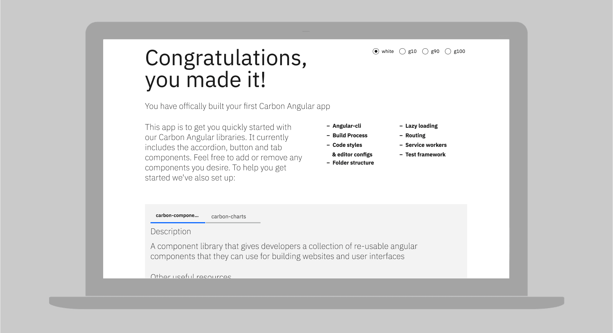

<PageDescription>

The library provides front-end developers & engineers a collection of reusable
Angular components to build websites and user interfaces. Adopting the library
enables developers to use consistent markup, styles, and behavior in prototype
and production work.

</PageDescription>

<InlineNotification>

The Angular library is maintained by members of the Carbon community. For
support, contact the
[Carbon Angular team](https://github.com/IBM/carbon-components-angular/issues/new).

v11 upgrade for Carbon Angular is coming soon.

</InlineNotification>

## Resources

<Row className="resource-card-group">
<Column colLg={4} colMd={4} noGutterSm>
  <ResourceCard
    subTitle="Carbon Components Angular Storybook"
    href="https://angular.carbondesignsystem.com/?path=/story/components-welcome--to-carbon-angular"
    >


  </ResourceCard>
</Column>
  <Column colMd={4} colLg={4} noGutterSm>
    <ResourceCard
      subTitle="Try Angular components with CodeSandbox"
      href="https://codesandbox.io/s/0129r494ql"
    >
      <MdxIcon name="codesandbox" />
    </ResourceCard>
  </Column>

<Column colMd={4} colLg={4} noGutterSm>
    <ResourceCard
        subTitle="Carbon Angular tutorial"
        href="/developing/angular-tutorial/overview/">
        <MdxIcon name="angular" />
    </ResourceCard>
</Column>
</Row>

## Install

Assuming we're starting with a new @angular/cli project:

```bash
npx @angular/cli new my-project --style=scss
cd my-project
npm i --save carbon-components-angular carbon-components
```

Then we need to include carbon-components in `src/styles.scss`:

```scss
@import '~carbon-components/scss/globals/scss/styles.scss';
```

That's it! Now start the server and start building.

```bash
npm start
```

_Note: This isn't the only way to bootstrap a_ `carbon-components-angular`
_application, but the combination of_ `@angular/cli` _and the_
`carbon-components` _scss is our recommended setup._

### Using our starter app



We recommend using the
[carbon-angular-starter](https://github.com/carbon-design-system/carbon-angular-starter)
for bootstrapping applications with Carbon components. Within five minutes your
app will be running with the following already configured:

- Angular-cli
- Build process
- Code styles and editor configs
- Folder structure
- Lazy loading
- Routing
- Service workers
- Test framework

Check out the
[readme](https://github.com/carbon-design-system/carbon-angular-starter) for
installation instructions.

## Development

Please refer to the
[contributing guidelines](https://github.com/IBM/carbon-components-angular/blob/master/README.md#contributing)
before starting any work.
