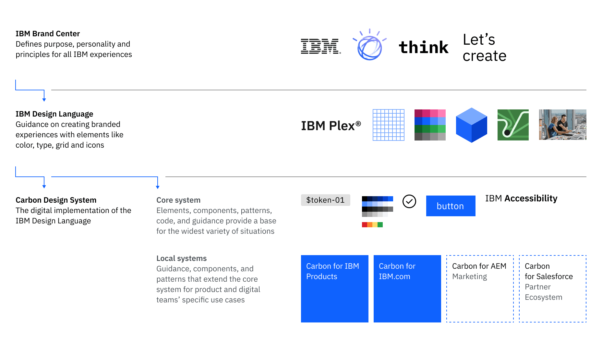

{/* this page is a work in progress */}

<PageDescription>

Welcome to Carbon! If you're just starting out developing with Carbon, here's a
checklist of everything you need to get up and running.

</PageDescription>

<AnchorLinks>
<AnchorLink>Overview</AnchorLink>
<AnchorLink>Installation and setup</AnchorLink>
<AnchorLink>Additional guidance</AnchorLink>
<AnchorLink>Connect with us</AnchorLink>

</AnchorLinks>

## Overview

Carbon accelerates your developer workflow by providing consistent, pre-built
components. Instead of building and re-building basic elements, you'll be able
spend that time customizing products to address specific client use cases.

### Understanding the ecosystem

When you hear people talking about Carbon, it's important to know that Carbon is
more than just one website or library.

The following diagram shows the relationships among assets and guidance across
IBM—from the foundations of Brand and the IBM Design Language, to the digital
implementation in the Carbon Design System, which in turn provides the
foundation for our products and web pages.

### Explore the IBM Design Language

Carbon is built on [IBM Design Language](https://www.ibm.com/design/language/),
which defines the core foundations of our design system—like the grid, color
tokens, and type tokens. Taking the time to explore the IBM Design Language site
will give you a deeper understanding of the principles behind IBM's design
philosophy, helping you make more informed decisions in your product work.

For developers, learning these foundational elements is a smart investment. When
you learn to use foundational elements like the
[grid](/elements/2x-grid/overview/), [colors tokens](/elements/color/overview/),
and [type tokens](/elements/typography/overview/) you will reduce the need for
custom CSS, speed up implementation, and help maintain a consistent IBM brand
experience across products—all while making future upgrades easier.

## Installation and setup

### Install your framework of choice

The Carbon Design System is built with official support for React and Web
Components. Community support exists for other frameworks like Angular, vanilla
JS, Vue, Svelte, and Lightning Web Components. Head over to
[Frameworks](/developing/frameworks/react) for all the information you need to
get started.

### Check out our developer resources

In [Developer resources](/developing/dev-resources/resources/), you’ll find
Carbon tools, as well as our GitHub repos and Storybooks for your framework of
choice.

## Additional guidance

### Take a tutorial

We offer tutorials in React using Next.js, with community contributed tutorials
for Angular and Vue, to guide you in creating an app with the Carbon Design
System. We’ll teach you the ins and outs of using Carbon components, and
introduce web development best practices along the way.

<Row className="resource-card-group">
<Column colLg={4} colMd={4} noGutterSm>
  <ResourceCard
    subTitle="React tutorial using Next.js"
    href="/developing/react-tutorial/overview"
    >

<MdxIcon name="react" />

  </ResourceCard>
</Column>
<Column colLg={4} colMd={4} noGutterSm>
  <ResourceCard
    subTitle="Web components tutorial using Vanilla.js/HTML"
    href="/developing/web-components-tutorial/overview"
    >

<MdxIcon name="webcomponents" />

  </ResourceCard>
</Column>
<Column colLg={4} colMd={4} noGutterSm>
  <ResourceCard
      subTitle="Angular tutorial"
      subTitle="Angular tutorial (community)"
      href="/developing/angular-tutorial/overview"
      >

<MdxIcon name="angular" />

  </ResourceCard>
</Column>
<Column colLg={4} colMd={4} noGutterSm>
  <ResourceCard
      subTitle="Vue tutorial (community)"
      href="/developing/vue-tutorial/overview"
      >

<MdxIcon name="vue" />

  </ResourceCard>
</Column>
</Row>

## Connect with us

### Join us and the Carbon community

_For internal IBM only_: If you have a question about any aspect of the
frameworks or tools, you can reach out to us on Slack and use that as a way to
connect with your fellow developers. Chances are someone has had a similar
question to you and will jump in to help you out.

- [#carbon-design-system](https://ibm-studios.slack.com/messages/C0M053VPT/)
- [#carbon-react](https://ibm-studios.slack.com/archives/C2K6RFJ1G)
- [#carbon-web-components](https://ibm-studios.slack.com/archives/CL83LMKSA)
- [#carbon-charts](https://peretz.slack.com/archives/CCA7L4MS9)
- [#carbon-tutorial](https://ibm-studios.slack.com/archives/CJUGA7P6H)
- [#carbon-ng (community)](https://ibm-studios.slack.com/archives/CBZC0LM2N)
- [#carbon-vue (community)](https://ibm-studios.slack.com/archives/CAM5P6NR1)

And be sure to sign up for the latest Carbon news at
[#carbon-announcements](https://ibm-studios.slack.com/archives/CJ35H36MP).

### Learn about what we're doing

You can find out about Carbon's latest changes and future plans on the
[Releases](/all-about-carbon/releases) page.

If you have questions, here are all the ways to [contact us](/help/contact-us).

### Learn about the benefits

Learn more about the
[benefits of using Carbon](/all-about-carbon/who-uses-carbon/) as a developer,
and how Carbon benefits all members of a product team.
