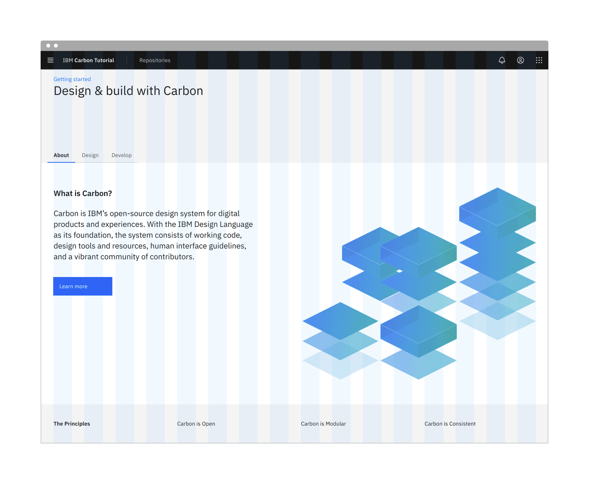

import Preview from 'components/Preview';

<PageDescription>

Now that we have our app using the UI Shell, it's time to build a few static
pages. In this step, we'll become comfortable with the Carbon grid and various
Carbon components.

</PageDescription>

<AnchorLinks>

<AnchorLink>Fork, clone and branch</AnchorLink>
<AnchorLink>Add landing page grid</AnchorLink>
<AnchorLink>Build landing page</AnchorLink>
<AnchorLink>Style landing page</AnchorLink>
<AnchorLink>Add repo page grid</AnchorLink>
<AnchorLink>Build repo page</AnchorLink>
<AnchorLink>Style repo page</AnchorLink>
<AnchorLink>Submit pull request</AnchorLink>

</AnchorLinks>

## Preview

A
[preview](https://carbon-tutorial-nextjs-git-v11-next-step-3-carbon-design-system.vercel.app/)
of what you'll build:

<Preview
  height="400"
  title="Carbon Next Tutorial Step 2"
  src="https://carbon-tutorial-nextjs-git-v11-next-step-3-carbon-design-system.vercel.app/"
  frameborder="no"
  allowtransparency="true"
  allowfullscreen="true"
  className="cds--iframe cds--iframe--border"
/>

## Fork, clone and branch

This tutorial has an accompanying GitHub repository called
[carbon-tutorial](https://github.com/carbon-design-system/carbon-tutorial) that
we'll use as a starting point for each step. If you haven't forked and cloned
that repository yet, and haven't added the upstream remote, go ahead and do so
by following the
[step 1 instructions](/developing/react-tutorial/step-1#fork-clone-and-branch).

### Branch

With your repository all set up, let's check out the branch for this tutorial
step's starting point.

```bash
git fetch upstream
git checkout -b v11-next-step-2 upstream/v11-next-step-2
```

<InlineNotification>

**Note:** This builds on top of step 1, but be sure to check out the upstream
step 2 branch because it includes the static assets required to get through this
step.

</InlineNotification>

### Build and start app

Install the app's dependencies (in case you're starting fresh in your current
directory and not continuing from the previous step):

```bash
yarn
```

Then, start the app:

```bash
yarn dev
```

You should see something similar to where the
[previous step](/developing/react-tutorial/step-1) left off.

## Add landing page grid

Let's add our grid elements to our `LandingPage` page component.

In order to use the grid, we need to wrap everything in a `<Grid>`. Because
we're building with the new CSS Grid, we won't be using typical rows. We'll use
a combination of `<Column>` and nested subgrids to create our layout.

The CSS Grid is a 16 column grid. We will specify the span of a `<Column>` using
the `sm`, `md`, and `lg` props. For example, `<Column sm={2} md={8} lg={8}/>`
means the column will span 2/4 columns at the small breakpoint, 8/8 columns at
the medium breakpoint, 8/16 columns at the large breakpoint.

We've included the designs for this tutorial app in the `design.figma` file
found as a top-level file in the `carbon-tutorial` repository. But, if you don't
have Sketch installed and available to inspect the design, we'll provide
screenshots.



<Caption>Landing page grid</Caption>

<InlineNotification>

**Pro tip:** `CTRL-L` toggles the layout in Sketch.

</InlineNotification>

First, we need to import our grid components at the top of `LandingPage`:

```javascript path=src/app/home/page.js
'use client';
import { Grid, Column } from '@carbon/react';
```

We'll break this down into three rows. The first row with the gray background
doesn't appear to need any columns. The second row with the white background
looks like it has two columns of different widths. The third row with the gray
background looks like it has four columns of equal width.

We'll make rows like so:

```jsx path=src/app/home/page.js
return (
  <Grid className="landing-page" fullWidth>
    <Column lg={16} md={8} sm={4} className="landing-page__banner">
      1
    </Column>
    <Column lg={16} md={8} sm={4} className="landing-page__r2">
      <Grid className="tabs-group-content">
        <Column md={4} lg={7} sm={4} className="landing-page__tab-content">
          7/16
        </Column>
        <Column md={4} lg={{ span: 8, offset: 8 }} sm={4}>
          8/16
        </Column>
      </Grid>
    </Column>
    <Column lg={16} md={8} sm={4} className="landing-page__r3">
      <Grid>
        <Column md={4} lg={4} sm={4}>
          1/4
        </Column>
        <Column md={4} lg={4} sm={4}>
          1/4
        </Column>
        <Column md={4} lg={4} sm={4}>
          1/4
        </Column>
        <Column md={4} lg={4} sm={4}>
          1/4
        </Column>
      </Grid>
    </Column>
  </Grid>
);
```

We added a prop of `fullWidth` to the main grid container since our rows need to
expand the whole page without any margins. We also added some custom classes
like `landing-page`, `landing-page__banner`, `landing-page__r2`, etc., which we
will use later.

## Build landing page

We'll start adding HTML elements and components by row.

### First row

In our first row we'll need a `Breadcrumb` component. First, let's import the
components we need. Because we'll be importing several components for this page,
we'll import them directly from the `@carbon/react` package instead of the
direct path for each one.

```javascript path=src/app/home/page.js
import { Breadcrumb, BreadcrumbItem, Grid, Column } from '@carbon/react';
```

We can now add our component to the first row, along with a header, like so:

```jsx path=src/app/home/page.js
<Column lg={16} md={8} sm={4} className="landing-page__banner">
  <Breadcrumb noTrailingSlash>
    <BreadcrumbItem>
      <a href="/">Getting started</a>
    </BreadcrumbItem>
  </Breadcrumb>
  <h1 className="landing-page__heading">Design &amp; build with Carbon</h1>
</Column>
```

You may notice that the styles look off. Don't worry, we'll fix these later.

### Second row

In our second row we'll need `Tabs` and `Button` components. We'll update the
`@carbon/react` import to:

```javascript path=src/app/home/page.js
import {
  Breadcrumb,
  BreadcrumbItem,
  Button,
  Tabs,
  Tab,
  TabList,
  TabPanels,
  TabPanel,
  Grid,
  Column,
} from '@carbon/react';
```

Modify the second row to use the `Tabs` components.

<InlineNotification>

**Note:** We're using the grid for the page layout, but we also need to apply
the grid within the tab content. When doing so, make sure the nested grid has
the expected `Grid` > `Column` DOM structure. Nested grids are officially
supported with our CSS Grid. If you are using `FlexGrid`, subgrid is not
supported.

</InlineNotification>

```jsx path=src/app/home/page.js
<Column lg={16} md={8} sm={4} className="landing-page__r2">
  <Tabs defaultSelectedIndex={0}>
    <TabList className="tabs-group">
      <Tab>About</Tab>
      <Tab>Design</Tab>
      <Tab>Develop</Tab>
    </TabList>
    <TabPanels>
      <TabPanel>
        <Grid className="tabs-group-content">
          <Column md={4} lg={7} sm={4} className="landing-page__tab-content">
            <h3 className="landing-page__subheading">What is Carbon?</h3>
            <p className="landing-page__p">
              Carbon is IBM’s open-source design system for digital products and
              experiences. With the IBM Design Language as its foundation, the
              system consists of working code, design tools and resources, human
              interface guidelines, and a vibrant community of contributors.
            </p>
            <Button>Learn more</Button>
          </Column>
          <Column md={4} lg={{ span: 8, offset: 7 }} sm={4}>
            IMAGE WILL GO HERE
          </Column>
        </Grid>
      </TabPanel>
      <TabPanel>
        <Grid className="tabs-group-content">
          <Column lg={16} md={8} sm={4} className="landing-page__tab-content">
            <p className="landing-page__p">
              Rapidly build beautiful and accessible experiences. The Carbon kit
              contains all resources you need to get started.
            </p>
          </Column>
        </Grid>
      </TabPanel>
      <TabPanel>
        <Grid className="tabs-group-content">
          <Column lg={16} md={8} sm={4} className="landing-page__tab-content">
            <p className="landing-page__p">
              Carbon provides styles and components in Vanilla, React, Angular,
              and Vue for anyone building on the web.
            </p>
          </Column>
        </Grid>
      </TabPanel>
    </TabPanels>
  </Tabs>
</Column>
```

The `<TabList>` is the tab navigation, and the `<TabPanels>` contains each tab
content. You'll notice that within each `<TabPanel>`, we nested another `<Grid>`
and `<Column>`. This is because the parent column
`<Column lg={16} md={8} sm={4} className="landing-page__r2">` is acting as a
faux row, and each tab within that row contains the actual column content. When
nesting columns, you must always wrap the nested group within another `<Grid>`.

Hold up! If you were to run the
[Equal Access Toolkit](https://www.ibm.com/able/toolkit) to check for
accessibility violations, you'd see
`Multiple navigation landmarks must have unique labels specified with aria-label or aria-labelledby`
because both the `Breadcrumb` and `Tabs` components use `<nav>` elements. To
fix, add `aria-label` to the `Breadcrumb` opening tag:

```jsx
<Breadcrumb noTrailingSlash aria-label="Page navigation">
```

Same goes for the `TabList` opening tag:

```jsx
<TabList className="tabs-group" aria-label="Tab navigation">
```

Next, we'll need to add some styling overrides to move the tabs to the right on
large viewports. Create a file `_overrides.scss` in `src/app/home` with this
declaration block.

```scss path=src/app/home/_overrides.scss
.landing-page__r2 .cds--tabs--scrollable {
  transform: translateZ(0);
  justify-content: flex-end;
}

.landing-page__r2 .cds--tab-content {
  padding: 0;
}

.cds--tab--list {
  justify-content: flex-end;
  padding-right: 1rem;
}

.cds--subgrid--wide {
  //fix needed to keep the subgrid from scrolling horizontally
  margin-right: 1rem;
}
```

Then in `_landing-page.scss` add this import at the top of the file.

```scss path=src/app/home/_landing-page.scss
@use './overrides.scss';
```

<InlineNotification>

**Note:** We don't have to include this in a separate file, but it's nice to
keep overrides separate from your application's styling so when migrating to
future Carbon versions and if there are breaking changes via different class
names, you have a consolidated list of styling declaration blocks to review.

</InlineNotification>

We can now add our images and text for each column in the first `Tab` in
`LandingPage`.

Let's import `Image` from Next.js by adding the following import under our
Carbon React component imports.

```jsx path=src/app/home/page.js
import Image from 'next/image';

<Column md={4} lg={{ span: 8, offset: 7 }} sm={4}>
  <Image
    className="landing-page__illo"
    src="/tab-illo.png"
    alt="Carbon illustration"
    width={604}
    height={498}
  />
</Column>;
```

Now let's set the image size in `_landing-page.scss` and also set the background
color of our page:

```scss path=src/app/home/_landing-page.scss
html {
  background-color: $layer-01;
}

.landing-page__illo {
  max-width: 100%;
  float: inline-end;
  height: auto;
}
```

Assuming that the second and third tab would have a similar design, we would set
them up in the same way. However, since our design specs don't show those tabs,
we'll leave the code as is.

### Third row

The third row will be created in a later tutorial, so we'll just add the headers
for now.

```jsx path=src/app/home/page.js
<Column lg={16} md={8} sm={4} className="landing-page__r3">
  <Grid>
    <Column lg={4} md={2} sm={4}>
      <h3 className="landing-page__label">The Principles</h3>
    </Column>
    <Column
      lg={{ start: 5, span: 3 }}
      md={{ start: 3, span: 6 }}
      sm={4}
      className="landing-page__title">
      Carbon is Open
    </Column>
    <Column
      lg={{ start: 9, span: 3 }}
      md={{ start: 3, span: 6 }}
      sm={4}
      className="landing-page__title">
      Carbon is Modular
    </Column>
    <Column
      lg={{ start: 13, span: 3 }}
      md={{ start: 3, span: 6 }}
      sm={4}
      className="landing-page__title">
      Carbon is Consistent
    </Column>
  </Grid>
</Column>
```

## Style landing page

We've added basic layout styles in `_landing-page.scss`, so now let's add type,
color, and spacing styles to match the design. We'll be using our
[spacing tokens](https://www.carbondesignsystem.com/elements/spacing/overview).
In `_landing-page.scss`, add these imports at the **top** of the file (above our
overrides import) so we can use Carbon breakpoints, tokens, and typography Sass
mixins and functions:

```scss path=src/app/home/_landing-page.scss
@use '@carbon/react/scss/spacing' as *;
@use '@carbon/react/scss/type' as *;
@use '@carbon/react/scss/breakpoint' as *;
@use '@carbon/react/scss/theme' as *;
```

### Banner

<Row>
<Column colLg={8}>


<Caption>Banner vertical spacing</Caption>

</Column>
</Row>

<InlineNotification>

**Pro tip:** `CTRL-G` toggles the grid in Sketch.

</InlineNotification>

Back to `_landing-page.scss`, we need to add space above the breadcrumb and
below the heading. For that, add:

```scss path=src/app/home/_landing-page.scss
.landing-page__banner {
  padding-top: $spacing-05;
  padding-bottom: $spacing-07 * 4;
  padding-left: $spacing-06;
}
```

Referencing the
[spacing token table](https://www.carbondesignsystem.com/elements/spacing/overview#spacing-scale),
`16px` can be set with the `$spacing-05` token. The design calls for `128px` of
space below the heading and that's not in the spacing scale. We can achieve this
in Sass by multiplying 32px (`$spacing-07`) by 4. We could use `128px` or `8rem`
directly in our styling, but using our tokens preserves consistency should the
token values get updated in the future.

Looking at the design, we need a wall-to-wall light gray background behind the
banner and also behind the third row. This is a great opportunity to use a Sass
mixin. We could put this at the top of `_landing-page.scss`, but it's best
practice to place mixins in a dedicated file, so create a `_mixins.scss` file in
`src/app/home`.

Add the following in `_mixins.scss`. Per the design we need to use Gray 10 for
our banner background color, which can be set with the `$layer-01`
[color token](https://www.carbondesignsystem.com/elements/color/usage). Also, we
want the background to extend into the grid's outermost gutters to go the full
width of the viewport, so given the DOM structure, we can achieve that by
setting the background in an absolutely positioned pseudo element.

```scss path=src/app/home/_mixins.scss
@use '@carbon/react/scss/spacing' as *;
@use '@carbon/react/scss/theme' as *;

@mixin landing-page-background() {
  background-color: $layer-01;
  position: relative;
}
```

After you have created `_mixins.scss`, import it at the **top** of
`_landing-page.scss`. By now you should have six imports:

```scss path=src/app/home/_landing-page.scss
@use '@carbon/react/scss/spacing' as *;
@use '@carbon/react/scss/type' as *;
@use '@carbon/react/scss/breakpoint' as *;
@use '@carbon/react/scss/theme' as *;
@use './mixins.scss' as *;
@use './overrides.scss';
```

Now to use the new mixin, update the `.landing-page__banner` declaration block
to:

```scss path=src/app/home/_landing-page.scss
.landing-page__banner {
  padding-top: $spacing-05;
  padding-bottom: $spacing-07 * 4;
  padding-left: $spacing-06;
  @include landing-page-background;
}
```

Next, we can see that the `h1` is using the `heading-05` type token.

<Row>
<Column colLg={8}>


<Caption>Banner heading type</Caption>

</Column>
</Row>

The Sketch symbol naming is consistent with the development Sass tokens to help
translate design to development. So, looking up the
[type token](https://www.carbondesignsystem.com/elements/typography/productive),
we know to use `productive-heading-05`:

```scss path=src/app/home/_landing-page.scss
.landing-page__heading {
  @include type-style('productive-heading-05');
}
```

### Row two

For our second row, we need to fix the tabs vertical positioning to match the
design. By inspecting the tabs component, you can see that the tab height
computes to `40px`. We can use that to create our negative top margin in rem
units.

```scss path=src/app/home/_landing-page.scss
.landing-page__r2 {
  margin-top: rem(-40px);
}
```

We also need to adjust our vertical spacing and type treatment. Like before,
it's a matter of using spacing and type tokens like so:

<Row>
<Column colLg={8}>


<Caption>Row 2 vertical spacing</Caption>

</Column>
</Row>

<InlineNotification>

**Note:** You may be wondering why there are vertical gaps between the type and
spacers. Each type token has a line height that's suited for its font size. The
vertical spacers adjacently touch the line height boundaries and not the
baseline, for consistency as well as development ease so `margins` and
`paddings` don't need to offset line heights.

</InlineNotification>

```scss path=src/app/home/_landing-page.scss
.tabs-group-content {
  padding: $spacing-10 0 $spacing-10 $spacing-06;
}

.landing-page__subheading {
  @include type-style('productive-heading-03');

  font-weight: 600;
}

.landing-page__p {
  @include type-style('productive-heading-03');
  margin-top: $spacing-06;
  margin-bottom: $spacing-08;

  @include breakpoint-between((320px + 1), md) {
    max-width: 75%;
  }
}

.tabs-group {
  background-color: $layer-01;
  padding: 0 $spacing-03;
}
```

### Row three

<Row>
<Column colLg={8}>


<Caption>Row 3 vertical spacing</Caption>

</Column>
</Row>

Let's also add some styles for the last row, even though that will get used
later in the tutorial. You'll notice that we get to re-use the
`landing-page-background` mixin that we just created.

```scss path=src/app/home/_landing-page.scss
.landing-page__r3 {
  padding-top: $spacing-08;
  padding-bottom: $spacing-08;
  padding-left: $spacing-06;
  @include landing-page-background;
}

.landing-page__label {
  @include type-style('heading-01');

  @include breakpoint-down(md) {
    padding-bottom: 1.5rem;
  }
}

.landing-page__title {
  padding-bottom: 0.5rem;
}
```

Lastly, we'll fix some grid alignment issues along with the image size for
smaller screens and the HeaderGobalAction component. We'll use one of our
breakpoint mixins for the media queries, like so:

```scss path=src/app/home/_landing-page.scss
.landing-page__banner,
.landing-page__r2,
.landing-page__r3 {
  margin-left: -20px;
  margin-right: -20px;

  @include breakpoint-down(md) {
    margin-left: 0;
    margin-right: 0;
  }
}

@media (max-width: 672px) {
  .landing-page__illo {
    width: 528px;
    widht: 100%;
    height: auto;
    float: inline-start;
  }
}

@media (max-width: 320px) {
  .landing-page__illo {
    display: none;
  }

  .landing-page__banner {
    padding-bottom: $spacing-05 * 4;
  }
}
```

```scss path=src/components/TutorialHeader/_tutorial-header.scss
@media (max-width: 320px) {
  .action-icons {
    display: none;
  }
}
```

We are almost done with the landing page. You may notice a few styles are off.
To fix this, we'll update some of the overriding styles in `globals.scss`. We
already have some overriding styles for `.cds--content`. We need to add
`padding: 0;` to this selector and add one more selector for the grid below
that:

```scss path=src/app/globals.scss
.cds--content {
  margin-top: 3rem;
  padding: 0;
  background: var(--cds-background);
}

.cds--content .cds--css-grid {
  max-width: 100%;
  @include breakpoint(md) {
    padding-left: 20px;
    padding-right: 20px;
  }
}
```

Since we are using our `breakpoint` mixin, we need to import the styles for that
below our Carbon styles import:

```scss path=src/app/globals.scss
@use '@carbon/react';
@use '@carbon/react/scss/breakpoint' as *;
```

Ta-da! You should see a finished landing page! Now we can move on to the repo
page.

## Add repo page grid

Now in our `RepoPage`component in the `src/app/repos/page.js` file we'll import
our `Grid` components at the top:

```javascript path=src/app/repos/page.js
'use client';
import { Grid, Column } from '@carbon/react';
```

Then add our grid containers in the `return` section.

```javascript path=src/app/repos/page.js
return (
  <Grid className="repo-page">
    <Column lg={16} md={8} sm={4} className="repo-page__r1">
      Data table will go here
    </Column>
  </Grid>
);
```

## Build repo page

We currently have `RepoPage` that just contains a grid and placeholder content
for the time being. In the next tutorial step we're going to be querying an API
to populate the `DataTable` component in this page. As a best practice to
separate data fetching from the presentation components, go ahead and create a
`RepoTable.js` as a sibling to `page.js` in `src/app/repos`.

### Build data table

First, we'll add our data table by importing a few components in `RepoTable.js`:

```javascript path=src/app/repos/RepoTable.js
import React from 'react';
import {
  DataTable,
  TableContainer,
  Table,
  TableHead,
  TableRow,
  TableExpandHeader,
  TableHeader,
  TableBody,
  TableExpandRow,
  TableCell,
  TableExpandedRow,
} from '@carbon/react';
```

Then, let's create the `RepoTable` component and export it at the very bottom of
`RepoTable.js`.

```javascript path=src/app/repos/RepoTable.js
const RepoTable = ({ rows, headers }) => {
  return (
    <DataTable
      rows={rows}
      headers={headers}
      render={({
        rows,
        headers,
        getHeaderProps,
        getRowProps,
        getTableProps,
      }) => (
        <TableContainer
          title="Carbon Repositories"
          description="A collection of public Carbon repositories.">
          <Table {...getTableProps()}>
            <TableHead>
              <TableRow>
                <TableExpandHeader />
                {headers.map((header) => (
                  <TableHeader key={header.key} {...getHeaderProps({ header })}>
                    {header.header}
                  </TableHeader>
                ))}
              </TableRow>
            </TableHead>
            <TableBody>
              {rows.map((row) => (
                <React.Fragment key={row.id}>
                  <TableExpandRow {...getRowProps({ row })}>
                    {row.cells.map((cell) => (
                      <TableCell key={cell.id}>{cell.value}</TableCell>
                    ))}
                  </TableExpandRow>
                  <TableExpandedRow colSpan={headers.length + 1}>
                    <p>Row description</p>
                  </TableExpandedRow>
                </React.Fragment>
              ))}
            </TableBody>
          </Table>
        </TableContainer>
      )}
    />
  );
};

export default RepoTable;
```

This component uses two props, `rows` and `headers`, and returns a Carbon
`DataTable`. As for where the various `Table*` components came from? The
[DataTable story](https://react.carbondesignsystem.com/?path=/story/components-datatable-expansion--default)
in Storybook was used to put together the data table structure.

<InlineNotification>

**Note:** The `getTableProps`, `getHeaderProps`, and `getRowProps` functions
each tell the `DataTable` component to process and return the necessary props
that are needed by the `Table`, `TableHeader` and `TableRow` components
respectively. We take the return of that function (an object containing the
props) and
[spread it out](https://reactjs.org/docs/jsx-in-depth.html#spread-attributes)
into the component.

</InlineNotification>

At this point, return to `RepoPage` because now we need to render a static
`RepoTable`.

### Render data table

Import `RepoTable` into `RepoPage`.

```javascript path=src/app/repos/page.js
'use client';
import RepoTable from './RepoTable';
import { Grid, Column } from '@carbon/react';
```

Then below the imports, include the following arrays to pass into the
`RepoTable` component. We'll be setting the `rows` array from an API in the next
tutorial step, but for now, static example rows will suffice.

```javascript path=src/app/repos/page.js
const headers = [
  {
    key: 'name',
    header: 'Name',
  },
  {
    key: 'createdAt',
    header: 'Created',
  },
  {
    key: 'updatedAt',
    header: 'Updated',
  },
  {
    key: 'issueCount',
    header: 'Open Issues',
  },
  {
    key: 'stars',
    header: 'Stars',
  },
  {
    key: 'links',
    header: 'Links',
  },
];

const rows = [
  {
    id: '1',
    name: 'Repo 1',
    createdAt: 'Date',
    updatedAt: 'Date',
    issueCount: '123',
    stars: '456',
    links: 'Links',
  },
  {
    id: '2',
    name: 'Repo 2',
    createdAt: 'Date',
    updatedAt: 'Date',
    issueCount: '123',
    stars: '456',
    links: 'Links',
  },
  {
    id: '3',
    name: 'Repo 3',
    createdAt: 'Date',
    updatedAt: 'Date',
    issueCount: '123',
    stars: '456',
    links: 'Links',
  },
];
```

Lastly in `RepoPage`, we need to simply replace `Data table will go here` with:

```jsx path=src/app/repos/page.js
<RepoTable headers={headers} rows={rows} />
```

## Style repo page

Our styles for the repo page are mostly fine. We just need to update a few
vertical spacing issues.

In `_repo-page.scss`, add the following styles:

```scss path=src/app/repos/_repo-page.scss
@use '@carbon/react/scss/spacing' as *;

.repo-page__r1 {
  padding-top: $spacing-05;
  padding-bottom: $spacing-05;
}
```

Congratulations! We've now created our static repo page!

## Submit pull request

We're going to submit a pull request to verify completion of this tutorial step.

### Continuous integration (CI) check

Run the CI check to make sure we're all set to submit a pull request.

```bash
yarn ci-check
```

<InlineNotification>

**Note:** If the `ci-check` is giving an error, it's likely that some of your
source files are not properly formatted. This could happen if your text editor
isn't formatting with Prettier on save. To get `ci-check` to pass, run
`yarn format` then re-run `yarn ci-check`.

</InlineNotification>

### Git commit and push

Before we can create a pull request, format your code, then stage and commit all
of your changes:

```bash
yarn format
git add --all && git commit -m "feat(tutorial): complete step 2"
```

Then, push to your repository:

```bash
git push origin v11-next-step-2
```

<InlineNotification>

**Note:** Having issues pushing your changes?
[Step 1](/developing/react-tutorial/step-1#git-commit-and-push) has
troubleshooting notes that may help.

</InlineNotification>

### Pull request (PR)

Finally, visit
[carbon-react-tutorial](https://github.com/carbon-design-system/carbon-tutorial)
to "Compare & pull request". In doing so, make sure that you are comparing to
`v11-next-step-2` into `base: v11-next-step-2`.

<InlineNotification>

**Note:** Expect your tutorial step PRs to be reviewed by the Carbon team but
not merged. We'll close your PR so we can keep the repository's remote branches
pristine and ready for the next person!

</InlineNotification>

<InlineNotification>

**Note:** If your PR fails the CircleCI test with the error
`Can't make a request in offline mode`, try running the following command:
`rm -rf .yarn-offline-mirror node_modules && yarn cache clean && yarn install`.
Add and commit the changes once this completes, and try pushing again.

</InlineNotification>
