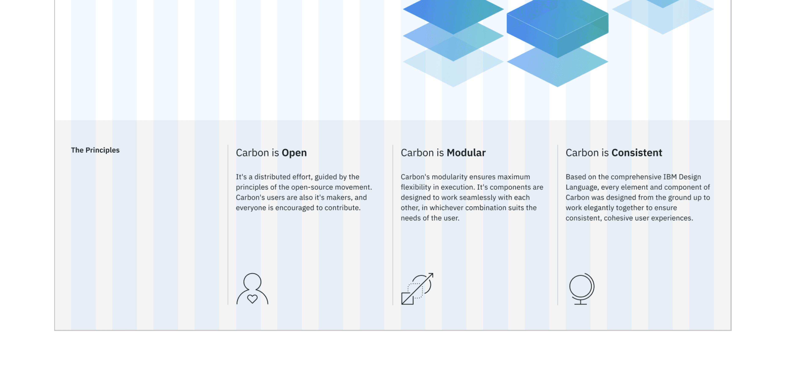

import Preview from 'components/Preview';

<PageDescription>

With two pages comprised entirely of Carbon components, let's revisit the
landing page and build a couple components of our own by using Carbon icons and
tokens.

</PageDescription>

<AnchorLinks>

<AnchorLink>Fork, clone and branch</AnchorLink>
<AnchorLink>Review design</AnchorLink>
<AnchorLink>Create components</AnchorLink>
<AnchorLink>Use components</AnchorLink>
<AnchorLink>Add styling</AnchorLink>
<AnchorLink>Check accessibility</AnchorLink>
<AnchorLink>Submit pull request</AnchorLink>

</AnchorLinks>

## Preview

Carbon provides a solid foundation for building web applications through its
color palette, layout, spacing, type, as well as common building blocks in the
form of components. So far, we've only used Carbon components to build out two
pages.

Next, we're going to use Carbon assets to build application-specific components.
We'll do so by including accessibility and responsive considerations all
throughout.

A [preview](https://react-step-5--carbon-tutorial.netlify.com) of what you'll
build (see bottom of page):

<Preview
  height="400"
  title="Carbon Tutorial Step 4"
  src="https://react-step-5--carbon-tutorial.netlify.com"
  frameborder="no"
  allowtransparency="true"
  allowfullscreen="true"
/>

## Fork, clone and branch

This tutorial has an accompanying GitHub repository called
[carbon-tutorial](https://github.com/carbon-design-system/carbon-tutorial) that
we'll use as a starting point for each step. If you haven't forked and cloned
that repository yet, and haven't added the upstream remote, go ahead and do so
by following the
[step 1 instructions](/developing/react-tutorial/step-1#fork-clone-and-branch).

### Branch

With your repository all set up, let's check out the branch for this tutorial
step's starting point.

```bash
git fetch upstream
git checkout -b react-step-4 upstream/react-step-4
```

<InlineNotification>

**Note:** This builds on top of step 3, but be sure to check out the upstream
step 4 branch because it includes the static assets required to get through this
step.

</InlineNotification>

### Build and start app

Install the app's dependencies (in case you're starting fresh in your current
directory and not continuing from the previous step):

```bash
yarn
```

Then, start the app:

```bash
yarn start
```

You should see something similar to where the
[previous step](/developing/react-tutorial/step-3) left off.

## Review design

Here's what we're building – an informational section that has a heading and
three subheadings. Each subheading has accompanying copy and a pictogram. We'll
assume that this informational section is used elsewhere on the site, meaning
it's a great opportunity to build it as a resusable component. As for naming,
we'll call it an `InfoSection` with three `InfoCard`s as children.



<Caption>Info section layout</Caption>

## Create components

First we need files for the components, so create an `Info` folder in
`src/components`. Even though we're building multiple components, their names
all start with `Info`, so it makes sense to have them share one folder in
components. Create these files:

### Add files

```bash
src/components/Info
├──_info.scss
├──index.js
└──Info.js
```

Import `_info.scss` in `app.scss` after all of the `carbon-component` imports.

```scss path=src/app.scss
@import './components/Info/info.scss';
```

Like our other components, `index.js` will serve as an entrypoint. Since
`Info.js` will export mutliple components, we'll use the `*` wildcard in the
entrypoint export.

```javascript path=src/components/Info/index.js
export * from './Info';
```

### InfoSection component

Let's create the parent component that includes the "The Principles" heading.
That markup currently looks like this in `LandingPage.js`:

```html path=src/content/LandingPage/LandingPage.js
<div className="bx--row landing-page__r3">
  <div className="bx--col-md-4 bx--col-lg-4">
    <h3 className="landing-page__label">The Principles</h3>
  </div>
  <div className="bx--col-md-4 bx--col-lg-4">Carbon is Open</div>
  <div className="bx--col-md-4 bx--col-lg-4">Carbon is Modular</div>
  <div className="bx--col-md-4 bx--col-lg-4">Carbon is Consistent</div>
</div>
```

We want to do a few things when abstracting it to a component. First, we only
want Carbon (`bx--`) and this component's class names; we don't want to include
`landing-page__r3` as that's specific to the landing page. For that we'll use
React `props` so we can pass in and use `props.className`.

We'll also:

- Add component class names like `info-section` and `info-section__heading`
- Semantically use `<section>` instead of `<div>`
- Update the grid columns to match the design
- Replace `The Principles` with `{props.heading}`
- Replace columns 2 - 4 with `{props.children}`

Using `props` we can render any heading and any number of children components
(`InfoCard` that we'll build soon.)

```javascript path=src/components/Info/Info.js
import React from 'react';

const InfoSection = (props) => (
  <section className={`bx--row ${props.className} info-section`}>
    <div className="bx--col-md-8 bx--col-lg-4 bx--col-xlg-3">
      <h3 className="info-section__heading">{props.heading}</h3>
    </div>
    {props.children}
  </section>
);
```

At this point let's add styling for the new class names that we just added.

```scss path=src/components/Info/_info.scss
.info-section__heading {
  @include carbon--type-style('heading-01');
}
```

### InfoCard component

Next up we're going to build a component for columns 2 - 4, which currently
looks like `<div className="bx--col-md-4 bx--col-lg-4">Carbon is Open</div>`. At
the bottom of `Info.js`, add:

```javascript path=src/components/Info/Info.js
const InfoCard = (props) => {
  return (
    <article className="info-card bx--col-md-4 bx--col-lg-4 bx--col-xlg-3 bx--offset-xlg-1">
      <h4 className="info-card__heading">{props.heading}</h4>
      <p className="info-card__body">{props.body}</p>
      {props.icon}
    </article>
  );
};

export { InfoSection, InfoCard };
```

<InlineNotification>

**Note:** Make sure to export the two components!

</InlineNotification>

In doing so, we:

- Used the semantic `<article>` instead of `<div>`
- Added `info-card` classes
- Used `props` to render the heading, body copy, and icon
- Set columns to match the grid

<InlineNotification>

**Note:** At extra large viewports, we are using
`bx--col-xlg-3 bx--offset-xlg-1` so each column takes up 3 of the 16 grid
columns, with a 1 column offset.

</InlineNotification>

## Use components

Nothing is styled yet, but with our components built let's put them to use. In
`LandingPage.js`, import the components towards the top of the file.

```javascript path=src/content/LandingPage/LandingPage.js
import { InfoSection, InfoCard } from '../../components/Info';
```

While we're at the top of `LandingPage.js`, import the icons that we'll need as
well.

```javascript path=src/content/LandingPage/LandingPage.js
import { Application32, Globe32, PersonFavorite32 } from '@carbon/icons-react';
```

<InlineNotification>

**Note:** You'll notice that these 32px icons aren't the pictograms as designed.
The Carbon team is currently working on adding pictograms to the icons packages.
Until then, we'll use the biggest SVGs.

</InlineNotification>

With everything imported, replace the current:

```html path=src/content/LandingPage/LandingPage.js
<div className="bx--row landing-page__r3">
  <div className="bx--col-md-4 bx--col-lg-4">
    <h3 className="landing-page__label">The Principles</h3>
  </div>
  <div className="bx--col-md-4 bx--col-lg-4">Carbon is Open</div>
  <div className="bx--col-md-4 bx--col-lg-4">Carbon is Modular</div>
  <div className="bx--col-md-4 bx--col-lg-4">Carbon is Consistent</div>
</div>
```

With the new components:

<!-- prettier-ignore-start -->
```javascript path=src/content/LandingPage/LandingPage.js
<InfoSection heading="The Principles" className="landing-page__r3">
  <InfoCard
    heading="Carbon is Open"
    body="It's a distributed effort, guided by the principles of the open-source movement. Carbon's users are also it's makers, and everyone is encouraged to contribute."
    icon={<PersonFavorite32/>}
  />
  <InfoCard
    heading="Carbon is Modular"
    body="Carbon's modularity ensures maximum flexibility in execution. It's components are designed to work seamlessly with each other, in whichever combination suits the needs of the user."
    icon={<Application32/>}
  />
  <InfoCard
    heading="Carbon is Consistent"
    body="Based on the comprehensive IBM Design Language, every element and component of Carbon was designed from the ground up to work elegantly together to ensure consistent, cohesive user experiences."
    icon={<Globe32/>}
  />
</InfoSection>
```
<!-- prettier-ignore-end -->

<InlineNotification>

**Note:** Now is a good time to resize your browser from phone to extra large
viewport widths to see how the responsive grid is working before we add further
styling.

</InlineNotification>

## Add styling

Here's our design showing the spacing tokens that we need to add. We also need
to set type style and borders.


### Layout

Starting with layout, add the following to `src/components/Info/_info.scss`.

```scss path=src/components/Info/_info.scss
.info-card {
  margin-top: $spacing-09;
  display: flex;
  flex-direction: column;

  svg {
    margin-top: $spacing-09;
  }

  // top border in only small breakpoints to prevent overrides
  @include carbon--breakpoint-down(md) {
    &:not(:nth-child(2)) {
      border-top: 1px solid $ui-03;
      padding-top: $spacing-09;
    }
  }

  // left border in just the 2nd column items
  @include carbon--breakpoint(md) {
    &:nth-child(odd) {
      border-left: 1px solid $ui-03;
    }
  }

  // left border in all items
  @include carbon--breakpoint(lg) {
    margin-top: 0;
    border-left: 1px solid $ui-03;

    svg {
      margin-top: $layout-06;
    }
  }
}
```

Once you save, go ahead and resize your browser to see the responsive layout at
the different breakpoints. Make sure to review these color and spacing tokens.
There are also a few breakpoint mixins that may be new to you. The
`@carbon/layout`
[SassDoc](https://github.com/carbon-design-system/carbon/blob/master/packages/layout/docs/sass.md)
is a great reference to see what all is available.

### Type

Our `InfoCard` headings look to be too small. We need to increase their font
sizes according to the design spec with:

```scss path=src/components/Info/_info.scss
.info-card__heading {
  @include carbon--type-style('productive-heading-03');
}
```

Also, the design has the last word in each subheading as bold. To accomplish
that, add this helper function after the import in `Info.js`.

```javascript path=src/components/Info/Info.js
// Take in a phrase and separate the third word in an array
function createArrayFromPhrase(phrase) {
  const splitPhrase = phrase.split(' ');
  const thirdWord = splitPhrase.pop();
  return [splitPhrase.join(' '), thirdWord];
}
```

Then, update `InfoCard` to use `createArrayFromPhrase`.

```javascript path=src/components/Info/Info.js
const InfoCard = (props) => {
  const splitHeading = createArrayFromPhrase(props.heading);

  return (
    <article className="info-card bx--col-md-4 bx--col-lg-4 bx--col-xlg-3 bx--offset-xlg-1">
      <h4 className="info-card__heading">
        {`${splitHeading[0]} `}
        <strong>{splitHeading[1]}</strong>
      </h4>
      <p className="info-card__body">{props.body}</p>
      {props.icon}
    </article>
  );
};
```

Finally, add the declaration block in `_info.scss` to set `InfoCard` body copy
styles and to bottom-align the icons.

```scss path=src/components/Info/_info.scss
.info-card__body {
  margin-top: $spacing-06;
  flex-grow: 1; // fill space so icons are bottom aligned
  @include type-style('body-long-01');

  // prevent large line lengths between small and medium viewports
  @include carbon--breakpoint-between(321px, md) {
    max-width: 75%;
  }
}
```

## Check accessibility

We've added new markup and styles, so it's a good practice to check
[DAP](https://www.ibm.com/able/dynamic-assessment-plug-in.html) and make sure
our rendered markup is on the right track for accessibility.

With the browser extension installed, Chrome in this example, open Dev Tools and
run DAP.


<Caption>DAP violations</Caption>

That first violation is for the off-screen "skip to content" link. This link
isn't shown and is used to assist screen reading, so the color contrast
violation can be ignored.

But, those three other violations came from the `<article>` element used in new
`InfoCard`. Since the `<article>` element requires a label, it seems like we may
be using the wrong semantic element. A humble `<div>` will suffice.

In `Info.js`, replace the `<article>` opening and closing tags with `<div>`
tags.

## Submit pull request

We're going to submit a pull request to verify completion of this tutorial step.

### Continuous integration (CI) check

Run the CI check to make sure we're all set to submit a pull request.

```bash
yarn ci-check
```

<InlineNotification>

**Note:** Having issues running the CI check?
[Step 1](</developing/react-tutorial/step-1#continuous-integration-(ci)-check>)
has troubleshooting notes that may help.

</InlineNotification>

### Git commit and push

Before we can create a pull request, stage and commit all of your changes:

```bash
git add --all && git commit -m "feat(tutorial): complete step 4"
```

Then, push to your repository:

```bash
git push origin react-step-4
```

<InlineNotification>

**Note:** Having issues pushing your changes?
[Step 1](/developing/react-tutorial/step-1#git-commit-and-push) has
troubleshooting notes that may help.

</InlineNotification>

### Pull request (PR)

Finally, visit
[carbon-tutorial](https://github.com/carbon-design-system/carbon-tutorial) to
"Compare & pull request". In doing so, make sure that you are comparing to
`react-step-4` into `base: react-step-4`.

<InlineNotification>

**Note:** Expect your tutorial step PRs to be reviewed by the Carbon team but
not merged. We'll close your PR so we can keep the repository's remote branches
pristine and ready for the next person!

</InlineNotification>
