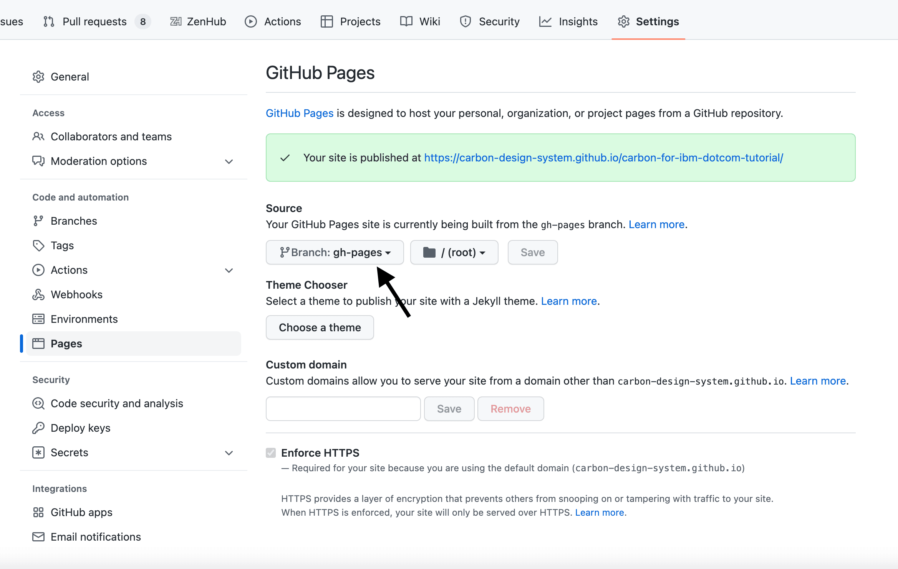

import Preview from 'components/Preview';

<PageDescription>

This step takes what we've built so far and optimizes the app for a production
environment. We'll be deploying the production build to IBM Cloud.

</PageDescription>

<InlineNotification>

**Note:** The following tutorial instructions are based on our v10 packages and
have not been updated to reflect changes for our next major version.

</InlineNotification>

<AnchorLinks>

<AnchorLink>Fork, clone and branch</AnchorLink>
<AnchorLink>Build for production</AnchorLink>
<AnchorLink>Deploying to Github Pages</AnchorLink>
<AnchorLink>Submit pull request</AnchorLink>

</AnchorLinks>

## Preview

A [preview](https://react-step-6--carbon-tutorial.netlify.com) of what you'll
build (visually no different, but built for production):

<Preview
  height="400"
  title="Carbon Tutorial Step 5"
  src="https://react-step-6--carbon-tutorial.netlify.com"
  frameborder="no"
  allowtransparency="true"
  allowfullscreen="true"
/>

## Fork, clone and branch

This tutorial has an accompanying GitHub repository called
[carbon-tutorial](https://github.com/carbon-design-system/carbon-tutorial) that
we'll use as a starting point for each step. If you haven't forked and cloned
that repository yet, and haven't added the upstream remote, go ahead and do so
by following the
[step 1 instructions](/developing/react-tutorial/step-1#fork-clone-and-branch).

### Branch

With your repository all set up, let's check out the branch for this tutorial
step's starting point.

```bash
git fetch upstream
git checkout -b react-step-5 upstream/react-step-5
```

<InlineNotification>

**Note:** This builds on top of step 4, but be sure to check out the upstream
step 5 branch because it includes the static assets required to get through this
step.

</InlineNotification>

### Build and start app

Install the app's dependencies (in case you're starting fresh in your current
directory and not continuing from the previous step):

```bash
yarn
```

Then, start the app:

```bash
yarn start
```

You should see something similar to where the
[previous step](/developing/react-tutorial/step-4) left off.

## Build for production

Before we deploy our app, we need to create an optimized production build with
this command. You may need to `CTRL-C` to stop the development environment
first.

```bash
yarn build
```

Looking at `package.json`, you'll find `yarn build` to run
`react-scripts build`. This builds the app for production to the `build` folder.
It bundles React in production mode and optimizes the build for the best
performance. It even goes so far to minify files and include hashes in filenames
for caching.

As a lot of this may seem like magic since the build configuration came from
Create React App, go ahead and check out their
[production build guidelines](https://facebook.github.io/create-react-app/docs/production-build)
for a full description of what's happening.

## Deploying to Github Pages

Next we'll be deploying to
[GitHub Pages](https://docs.github.com/en/pages/getting-started-with-github-pages/about-github-pages)
which allows you to host your files directly from your repository in GitHub.

If you forked the tutorial earlier by copying only the `main` branch, you will
have to create a `gh-pages` branch with the following steps. Otherwise, if you
already have an existing `gh-pages` branch (you can easily check by going to
your repository on `github.com` and checking the existing branches), skip the
following `git` commands.

To do this, we'll first commit our `build` folder so that git knows we have a
subtree (subfolder with our site).

```bash
git add build && git commit -m "chore(deploy): publish build files"
```

Then we'll use `subtree push` to push to the `gh-pages` branch on Github.

```bash
git subtree push --prefix build origin gh-pages
```

To have GitHub Pages point to the `gh-pages` branch, go to your forked Carbon
tutorial repository on `github.com`. Go to your "Settings" and under the "Pages"
tab, specify the branch, `gh-pages`, as your source.



Once you click save, you should be able to see your site published at the
`*.github.io/carbon-tutorial` link shown on the page.

Congratulations! Your work is now hosted on GitHub Pages!

## Submit pull request

That does it! We're going to submit a pull request to verify completion of this
tutorial step.

### Continuous integration (CI) check

Run the CI check to make sure we're all set to submit a pull request.

```bash
yarn ci-check
```

<InlineNotification>

**Note:** Having issues running the CI check?
[Step 1](</developing/react-tutorial/step-1#continuous-integration-(ci)-check>)
has troubleshooting notes that may help.

</InlineNotification>

### Git commit and push

Before we can create a pull request, stage and commit all of your changes:

```bash
git add --all && git commit -m "feat(tutorial): complete step 5"
```

Then, push to your repository:

```bash
git push origin react-step-5
```

<InlineNotification>

**Note:** Having issues pushing your changes?
[Step 1](/developing/react-tutorial/step-1#git-commit-and-push) has
troubleshooting notes that may help.

</InlineNotification>

### Pull request (PR)

Finally, visit
[carbon-tutorial](https://github.com/carbon-design-system/carbon-tutorial) to
"Compare & pull request". In doing so, make sure that you are comparing to
`react-step-5` into `base: react-step-5`.

<InlineNotification>

**Note:** Expect your tutorial step PRs to be reviewed by the Carbon team but
not merged. We'll close your PR so we can keep the repository's remote branches
pristine and ready for the next person!

</InlineNotification>

<InlineNotification>

**Note:** If your PR fails the CircleCI test with the error
`Can't make a request in offline mode`, try running the following command:
`rm -rf .yarn-offline-mirror node_modules && yarn cache clean && yarn install`.
Add and commit the changes once this completes, and try pushing again.

</InlineNotification>
