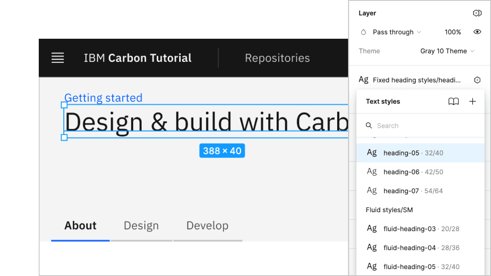
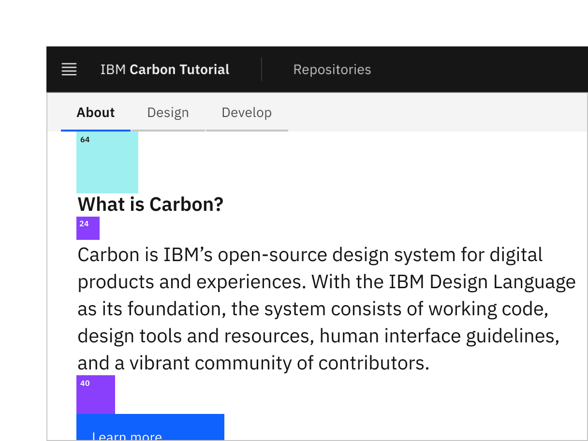

import Preview from 'components/Preview';

<PageDescription>

Now that we have a Svelte app using the UI Shell, it's time to build a few
static pages. In this step, we'll become comfortable with the Carbon grid and
various Carbon components.

</PageDescription>

<AnchorLinks>

<AnchorLink>Fork, clone and branch</AnchorLink>
<AnchorLink>Install grid</AnchorLink>
<AnchorLink>Add landing page grid</AnchorLink>
<AnchorLink>Build landing page</AnchorLink>
<AnchorLink>Add repo page grid</AnchorLink>
<AnchorLink>Build repo page</AnchorLink>
<AnchorLink>Style repo page</AnchorLink>
<AnchorLink>Submit pull request</AnchorLink>

</AnchorLinks>

## Preview

A [preview](https://deploy-preview-3--carbon-tutorial-svelte.netlify.app/) of
what you'll build:

<Preview
  height="400"
  title="Carbon Tutorial Step 2"
  src="https://deploy-preview-3--carbon-tutorial-svelte.netlify.app/"
  frameborder="no"
  allowtransparency="true"
  allowfullscreen="true"
  className="bx--iframe bx--iframe--border"
/>

## Fork, clone and branch

This tutorial has an accompanying GitHub repository called
[carbon-tutorial](https://github.com/carbon-design-system/carbon-tutorial-svelte)
that we'll use as a starting point for each step. If you haven't forked and
cloned that repository yet, and haven't added the upstream remote, go ahead and
do so by following the
[step 1 instructions](/developing/svelte-tutorial/step-1#fork-clone-and-branch).

### Branch

With your repository all set up, let's check out the branch for this tutorial
step's starting point.

```bash
git fetch upstream
git checkout -b svelte-step-2 upstream/svelte-step-2
```

<InlineNotification>

**Note:** This builds on top of step 1, but be sure to check out the upstream
step 2 branch because it includes the static assets required to get through this
step.

</InlineNotification>

### Build and start app

Install the app's dependencies (in case you're starting fresh in your current
directory and not continuing from the previous step):

```bash
yarn
```

Then, start the app:

```bash
yarn dev
```

You should see something similar to where the
[previous step](/developing/svelte-tutorial/step-1) left off.

## Add landing page grid

Let's add our grid components to `src/routes/index.svelte`.

We've included the designs for this tutorial app in the `design.sketch` file
found as a top-level file in the `carbon-tutorial-svelte` repository. But, if
you don't have Sketch installed and available to inspect the design, we'll
provide screenshots.


<Caption>Landing page grid</Caption>

<InlineNotification>

**Pro tip:** `CTRL-L` toggles the layout in Sketch.

</InlineNotification>

First, import the grid components in `src/routes/index.svelte`:

```html path=src/routes/index.svelte
<script>
  import { Grid, Row, Column } from 'carbon-components-svelte';
</script>
```

We'll break this down into three rows. The first row with the gray background
doesn't appear to need any columns. The second row with the white background
looks like it has two columns of different widths. The third row with the gray
background looks like it has four columns of equal width.

We'll make rows like so:

```html path=src/routes/index.svelte
<Row class="landing-page-background landing-page__banner">
  <Column lg={16}>1</Column>
</Row>

<Row class="landing-page__r2">
  <Column md={4} lg={7}>7/16</Column>
  <Column md={4} lg={{ span: 8, offset: 1 }}>8/16</Column>
</Row>

<Row class="landing-page-background landing-page__r3">
  <Column md={4} lg={4}>1/4</Column>
  <Column md={4} lg={4}>1/4</Column>
  <Column md={4} lg={4}>1/4</Column>
  <Column md={4} lg={4}>1/4</Column>
</Row>
```

We added added some custom classes like `landing-page`, `landing-page__banner`,
`landing-page__r2`, etc., which we will use later.

Also, take notice of the second row. The tab content only covers 7 columns at
this large viewport to prevent overly-large line lengths, so we needed to add a
1 column offset (`{ span: 8, offset: 1 }`) to second column to fill the full 16
columns in the grid. Then, both of those columns have `bx--col-md-4` classes so
they are of equal width at medium-sized viewports.

## Build landing page

We'll start adding HTML elements and components by row.

### First row

In our first row we'll need a `Breadcrumb` component. First, let's import the
components we need. Because we'll be importing several components for this page,
we'll import them directly from the `carbon-components-svelte` package instead
of the direct path for each one.

```javascript path=src/routes/index.svelte
import {
  Grid,
  Row,
  Column,
  Breadcrumb,
  BreadcrumbItem,
} from 'carbon-components-svelte';
```

We can now add our component to the first row, along with a header, like so:

```html path=src/routes/index.svelte
<Row class="landing-page-background landing-page__banner">
  <Column lg="{16}">
    <Breadcrumb noTrailingSlash>
      <BreadcrumbItem href="/">Getting started</BreadcrumbItem>
    </Breadcrumb>
    <h1>Design &amp; build with Carbon</h1>
  </Column>
</Row>
```

You may notice that the styles look off. Don't worry, we'll fix these later.

### Second row

In our second row we'll need `Tabs` and `Button` components. We'll update the
`carbon-components-svelte` import to:

```javascript path=src/routes/index.svelte
import {
  Grid,
  Row,
  Column,
  Breadcrumb,
  BreadcrumbItem,
  Button,
  Tabs,
  TabContent,
  Tab,
} from 'carbon-components-svelte';
```

Modify the second row to use the `Tab` component.

```html path=src/routes/index.svelte

<Row class="landing-page__r2">
  <Column noGutter>
    <Tabs>
      <Tab label="About" />
      <Tab label="Design" />
      <Tab label="Develop" />
      <div slot="content">
        <Grid as fullWidth let:props>
          <TabContent {...props}>
            <Row class="landing-page__tab-content">
              <Column md={4} lg={7}>7/16</Column>
              <Column md={4} lg={{ span: 8, offset: 1 }}>8/16</Column>
            </Row>
          </TabContent>
          <TabContent {...props}>
            <Row class="landing-page__tab-content">
              <Column lg={16}>
                Rapidly build beautiful and accessible experiences. The Carbon
                kit contains all resources you need to get started.
              </Column>
            </Row>
          </TabContent>
          <TabContent {...props}>
            <Row class="landing-page__tab-content">
              <Column lg={16}>
                Carbon provides styles and components in Vanilla, React,
                Angular, Vue and Svelte for anyone building on the web.
              </Column>
            </Row>
          </TabContent>
        </Grid>
      </div>
    </Tabs>
  </Column>
</Row>


```

<InlineNotification>

**Note:** We're using the grid for the page layout, but we also need to apply
the grid within the tab content. When doing so, make sure the nested grid has
the expected `grid` > `row` > `col` DOM structure.

</InlineNotification>

Hold up! If you were to run
[DAP](https://www.ibm.com/able/dynamic-assessment-plug-in.html) to check for
accessibility violations, you'd see
`Multiple navigation landmarks must have unique labels specified with aria-label or aria-labelledby`
because both the `Breadcrumb` and `Tabs` components use `<nav>` elements. To
fix, add `aria-label` to the `Breadcrumb` opening tag:

<!-- prettier-ignore-start -->
```html
<Breadcrumb noTrailingSlash aria-label="Page navigation">
```
<!-- prettier-ignore-end -->

Same goes for the `Tabs` opening tag:

<!-- prettier-ignore-start -->
```html
<Tabs aria-label="Tab navigation">
```
<!-- prettier-ignore-end -->

We can now add our images and text for each column in the first `Tab` in
`index.svelte`.

<!-- prettier-ignore-start -->
```html path=src/routes/index.svelte
<TabContent {...props}>
  <Row class="landing-page__tab-content">
    <Column md={4} lg={7}>
      <h2>What is Carbon?</h2>
      <p>
        Carbon is IBM’s open-source design system for digital products
        and experiences. With the IBM Design Language as its
        foundation, the system consists of working code, design tools
        and resources, human interface guidelines, and a vibrant
        community of contributors.
      </p>
      <Button>Learn more</Button>
    </Column>
    <Column md={4} lg={{ span: 8, offset: 1 }}>
      
    </Column>
  </Row>
</TabContent>
```
<!-- prettier-ignore-end -->

Now let's set the image size in the `style` block of the file:

```html path=src/routes/index.svelte
<style>
  img {
    max-width: 100%;
  }
</style>
```

Assuming that the second and third tab would have a similar design, we would set
them up in the same way. However, since our design specs don't show those tabs,
we'll leave the code as is.

### Third row

The third row will be created in a later tutorial, so we'll just add the headers
for now.

```html path=src/routes/index.svelte
<Row class="landing-page-background landing-page__r3">
  <Column md="{4}" lg="{4}">
    <h3>The Principles</h3>
  </Column>
  <Column md="{4}" lg="{4}">Carbon is Open</Column>
  <Column md="{4}" lg="{4}">Carbon is Modular</Column>
  <Column md="{4}" lg="{4}">Carbon is Consistent</Column>
</Row>
```

### Banner

<Row>
<Column colLg={8}>


<Caption>Banner vertical spacing</Caption>

</Column>
</Row>

<InlineNotification>

**Pro tip:** `CTRL-G` toggles the grid in Sketch.

</InlineNotification>

Back to the `style` block, we need to add space above the breadcrumb and below
the heading. For that, add:

```css path=src/routes/index.svelte
:global(.landing-page__banner) {
  padding-top: 'spacing-05';
  padding-bottom: 'spacing-07' * 4;
}
```

We need to use the `:global(...)` modifier because the `landing-page__banner`
class passed to the `Row` component is out of scope from the current file. Thus,
we must target it globally.

Referencing the
[spacing token table](https://www.carbondesignsystem.com/guidelines/spacing/overview#spacing-scale),
`16px` can be set with the `$spacing-05` token. The design calls for `128px` of
space below the heading and that's not in the spacing scale. We can achieve this
in Sass by multiplying 32px (`$spacing-07`) by 4. We could use `128px` or `8rem`
directly in our styling, but using our tokens preserves consistency should the
token values get updated in the future.

Looking at the design, we need a wall-to-wall light gray background behind the
banner and also behind the third row.

Per the design we need to use Gray 10 for our banner background color, which can
be set with the `$ui-01`
[color token](https://www.carbondesignsystem.com/guidelines/color/usage). Also,
we want the background to extend into the grid's outermost gutters to go the
full width of the viewport, so given the DOM structure, we can achieve that by
setting the background in an absolutely positioned pseudo element.

```css path=src/routes/index.svelte
:global(.landing-page-background) {
  position: relative;
  background-color: 'ui-01';
}

:global(.landing-page-background::before) {
  content: '';
  position: absolute;
  z-index: -1;
  top: 0;
  bottom: 0;
  right: -'spacing-05';
  left: -'spacing-05';
  background: 'ui-01';
}
```

Next, we can see that the `h1` is using the `heading-05` type token.

<Row>
<Column colLg={8}>



<Caption>Banner heading type</Caption>

</Column>
</Row>

The Sketch symbol naming is consistent with the development Sass tokens to help
translate design to development. So, looking up the
[type token](https://www.carbondesignsystem.com/guidelines/typography/productive),
we know to use `productive-heading-05`:

```css path=src/routes/index.svelte
h1 {
  font: 'productive-heading-05';
}
```

### Row two

For our second row, we need to fix the tabs vertical positioning to match the
design. By inspecting the tabs component, you can see that the tab height
computes to `40px`. We can use that to create our negative top margin in rem
units.

```css path=src/routes/index.svelte
:global(.landing-page__r2) {
  margin-top: rem(-40px);
}
```

We also need to adjust our vertical spacing and type treatment. Like before,
it's a matter of using spacing and type tokens like so:

<Row>
<Column colLg={8}>



<Caption>Row 2 vertical spacing</Caption>

</Column>
</Row>

<InlineNotification>

**Note:** You may be wondering why there are vertical gaps between the type and
spacers. Each type token has a line height that's suited for its font size. The
vertical spacers adjacently touch the line height boundaries and not the
baseline, for consistency as well as development ease so `margins` and
`paddings` don't need to offset line heights.

</InlineNotification>

```css path=src/routes/index.svelte
h2,
p {
  font: 'productive-heading-03';
}

h2 {
  font-weight: 'semibold';
}

:global(.landing-page__tab-content) {
  font: 'body-long-02';
  padding-top: 'spacing-10';
  padding-bottom: 'spacing-10';
}

p {
  margin-top: 'spacing-06';
  margin-bottom: 'spacing-08';
}

@media (between: 321px) and (md) {
  p {
    max-width: 75%;
  }
}
```

### Row three

<Row>
<Column colLg={8}>


<Caption>Row 3 vertical spacing</Caption>

</Column>
</Row>

Let's also add some styles for the last row, even though that will get used
later in the tutorial.

```css path=src/routes/index.svelte
h3 {
  font: 'heading-01';
}

:global(.landing-page__r3) {
  padding-top: 'spacing-09';
  padding-bottom: 'spacing-09';
}
```

Ta-da! You should see a finished landing page! Now we can move on to the repo
page.

## Add repo page grid

Now in our `repos.svelte` we'll add our grid components. Import the `Row` and
`Column` components in the script block.

```html path=src/routes/repos.svelte
<script>
  import { Row, Column } from 'carbon-components-svelte';
</script>

<Row class="repo-page__r1">
  <Column>Data table will go here</Column>
</Row>
```

## Build repo page

We currently have `repos.svelte` that just contains a grid and placeholder
content for the time being. In the next tutorial step we're going to be querying
an API to populate the `DataTable` component in this page.

### Build data table

First, we'll add our data table by importing a few components in `RepoTable.js`:

```html path=src/routes/repos.svelte
<script>
  import { Row, Column, DataTable } from 'carbon-components-svelte';
</script>
```

```html path=src/routes/repos.svelte
<script>
  import { Row, Column } from 'carbon-components-svelte';

  const headers = [];
  const rows = [];
</script>

<Row class="repo-page__r1">
  <Column>
    <DataTable
      expandable
      title="Carbon Repositories"
      description="A collection of public Carbon repositories."
      {headers}
      {rows}
    >
      <p slot="expanded-row" let:row>Row description</p>
    </DataTable>
  </Column>
</Row>
```

This component uses two props, `rows` and `headers`, and returns a Carbon
`DataTable`.

At this point, we need to render a static data table in `repos.svelte`.

### Render data table

We'll be setting the `rows` array from an API in the next tutorial step, but for
now, static example rows will suffice.

Add the following data to the `headers` and `rows` variables:

```html path=src/routes/repos.svelte
<script>
  import { Row, Column } from 'carbon-components-svelte';

  const headers = [
    { key: 'name', value: 'Name' },
    { key: 'createdAt', value: 'Created' },
    { key: 'updatedAt', value: 'Updated' },
    { key: 'issueCount', value: 'Open Issues' },
    { key: 'stars', value: 'Stars' },
    { key: 'links', value: 'Links' },
  ];

  const rows = [
    {
      id: '1',
      name: 'Repo 1',
      createdAt: 'Date',
      updatedAt: 'Date',
      issueCount: '123',
      stars: '456',
      links: 'Links',
    },
    {
      id: '2',
      name: 'Repo 2',
      createdAt: 'Date',
      updatedAt: 'Date',
      issueCount: '123',
      stars: '456',
      links: 'Links',
    },
    {
      id: '3',
      name: 'Repo 3',
      createdAt: 'Date',
      updatedAt: 'Date',
      issueCount: '123',
      stars: '456',
      links: 'Links',
    },
  ];
</script>
```

## Style repo page

Our styles for the repo page are mostly fine. We just need to update a few
vertical spacing issues.

Add a `style` block to the file, add the following styles:

```html path=src/routes/repos.svelte
<style>
  :global(.repo-page__r1) {
    padding-top: 'spacing-05';
    padding-bottom: 'spacing-05';
  }
</style>
```

Congratulations! We've now created our static repo page!

## Submit pull request

We're going to submit a pull request to verify completion of this tutorial step.

### Continuous integration (CI) check

Run the CI check to make sure we're all set to submit a pull request.

```bash
yarn ci-check
```

<InlineNotification>

**Note:** Having issues running the CI check?
[Step 1](</developing/svelte-tutorial/step-1#continuous-integration-(ci)-check>)
has troubleshooting notes that may help.

</InlineNotification>

### Git commit and push

Before we can create a pull request, stage and commit all of your changes:

```bash
git add --all && git commit -m "feat(tutorial): complete step 2"
```

Then, push to your repository:

```bash
git push origin svelte-step-2
```

<InlineNotification>

**Note:** Having issues pushing your changes?
[Step 1](/developing/svelte-tutorial/step-1#git-commit-and-push) has
troubleshooting notes that may help.

</InlineNotification>

### Pull request (PR)

Finally, visit
[carbon-tutorial-svelte](https://github.com/carbon-design-system/carbon-tutorial-svelte)
to "Compare & pull request". In doing so, make sure that you are comparing to
`svelte-step-2` into `base: svelte-step-2`.

<InlineNotification>

**Note:** Expect your tutorial step PRs to be reviewed by the Carbon team but
not merged. We'll close your PR so we can keep the repository's remote branches
pristine and ready for the next person!

</InlineNotification>
