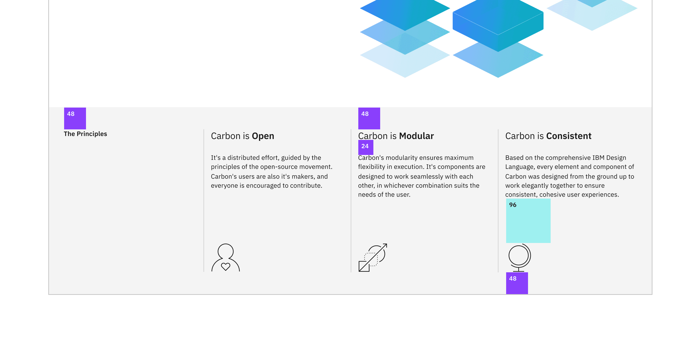

import Preview from 'components/Preview';

<PageDescription>

With two pages comprised entirely of Carbon components, let's revisit the
landing page and build a couple components of our own by using Carbon icons and
tokens.

</PageDescription>

<AnchorLinks>

<AnchorLink>Fork, clone and branch</AnchorLink>
<AnchorLink>Review design</AnchorLink>
<AnchorLink>Create components</AnchorLink>
<AnchorLink>Use components</AnchorLink>
<AnchorLink>Add styling</AnchorLink>
<AnchorLink>Check accessibility</AnchorLink>
<AnchorLink>Submit pull request</AnchorLink>

</AnchorLinks>

## Preview

Carbon provides a solid foundation for building web applications through its
color palette, layout, spacing, type, as well as common building blocks in the
form of components. So far, we've only used Carbon components to build out two
pages.

Next, we're going to use Carbon assets to build application-specific components.
We'll do so by including accessibility and responsive considerations all
throughout.

A [preview](https://vue-step-5--carbon-tutorial-vue.netlify.com) of what you'll
build (see bottom of page):

<Preview
  height="400"
  title="Carbon Tutorial Step 4"
  src="https://vue-step-5--carbon-tutorial-vue.netlify.com"
  frameborder="no"
  allowtransparency="true"
  allowfullscreen="true"
/>

## Fork, clone and branch

This tutorial has an accompanying GitHub repository called
[carbon-tutorial](https://github.com/carbon-design-system/carbon-tutorial-vue)
that we'll use as a starting point for each step. If you haven't forked and
cloned that repository yet, and haven't added the upstream remote, go ahead and
do so by following the
[step 1 instructions](/developing/vue-tutorial/step-1#fork-clone-and-branch).

### Branch

With your repository all set up, let's check out the branch for this tutorial
step's starting point.

```bash
git fetch upstream
git checkout -b vue-step-4 upstream/vue-step-4
```

<InlineNotification>

**Note:** This builds on top of step 3, but be sure to check out the upstream
step 4 branch because it includes the static assets required to get through this
step.

</InlineNotification>

### Build and start app

Install the app's dependencies (in case you're starting fresh in your current
directory and not continuing from the previous step):

```bash
yarn
```

Then, start the app:

```bash
yarn serve
```

You should see something similar to where the
[previous step](/developing/vue-tutorial/step-3) left off.

## Review design

Here's what we're building – an informational section that has a heading and
three subheadings. Each subheading has accompanying copy and a pictogram. We'll
assume that this informational section is used elsewhere on the site, meaning
it's a great opportunity to build it as a reusable component. As for naming,
we'll call it an `InfoSection` with three `InfoCard`s as children.


<Caption>Info section layout</Caption>

## Create components

First we need files for the components, so create an `InfoSection` folder in
`src/components`. Even though we're building multiple components, their names
all start with `Info`, so it makes sense to have them share one folder in
components. Create these files:

### Add files

```bash
src/components/InfoSection
├──index.js
└──InfoCard.vue
└──InfoSection.vue
```

Like our other components, `index.js` will serve as an entrypoint.

<InlineNotification>

**Note:** To adhere to the [Vue style guide](https://vuejs.org/v2/style-guide/)
we have used multi word component names. This style guide stipulation is why all
`@carbon/vue` components have a `cv` prefix.

</InlineNotification>

```javascript path=src/components/InfoSection/index.js
import InfoSection from './InfoSection';
import InfoCard from './InfoCard';

export { InfoSection, InfoCard };
```

### InfoSection component

Let's create the parent component that includes the "The Principles" heading.
That markup currently looks like this in `LandingPage.vue`:

```html path=src/views/LandingPage/LandingPage.vue
<div class="bx--row landing-page__r3">
  <div class="bx--col-md-4 bx--col-lg-4">
    <h3 class="landing-page__label">The Principles</h3>
  </div>
  <div class="bx--col-md-4 bx--col-lg-4">Carbon is Open</div>
  <div class="bx--col-md-4 bx--col-lg-4">Carbon is Modular</div>
  <div class="bx--col-md-4 bx--col-lg-4">Carbon is Consistent</div>
</div>
```

We want to do a few things when abstracting it to a component. First, we only
want Carbon (`bx--`) and this component's class names; we don't want to include
`landing-page__r3` as that's specific to the landing page. That will be passed
in as a property to the component.

We'll also:

- Add component class names like `info-section` and `info-section__heading`
- Semantically use `<section>` instead of `<div>`
- Update the grid columns to match the design
- Replace `The Principles` with `{{heading}}`
- Replace columns 2 - 4 with a slot.

Using `props` we can render any heading and any number of children components
(`InfoCard` that we'll build soon.)

```html path=src/components/InfoSection/InfoSection.vue
<template>
  <section class="bx--row info-section">
    <div class="bx--col-md-8 bx--col-lg-4 bx--col-xlg-3">
      <h3 class="info-section__heading">{{ heading }}</h3>
    </div>
    <slot />
  </section>
</template>
```

Then name our component and add a property to the script section.

```javascript path=src/components/InfoSection/InfoSection.vue
<script>
export default {
  name: "InfoSection",
  props: {
    heading: String
  }
};
</script>
```

At this point let's add styling for the new class names that we just added.

```scss path=src/components/InfoSection/InfoSection.vue
<style lang="scss">
@import "../../styles/_carbon-utils";

.info-section__heading {
  @include type-style('heading-01');
}
</style>
```

### InfoCard component

Next up we're going to build a component for columns 2 - 4, which currently
looks like `<div class="bx--col-md-4 bx--col-lg-4">Carbon is Open</div>`. Create
a new file InfoCard.vue, add:

```html path=src/components/InfoSection/InfoCard.vue
<template>
  <article
    class="info-card bx--col-md-4 bx--col-lg-4 bx--col-xlg-3 bx--offset-xlg-1"
  >
    <h4 class="info-card__heading">{{ heading }}</h4>
    <p class="info-card__body">{{ body }}</p>
    <component :is="icon" />
  </article>
</template>
```

Give it a name and add props

```javascript
<script>
export default {
  name: "InfoCard",
  props: {
    heading: String,
    body: String,
    icon: Object
  }
};
</script>
```

<InlineNotification>

**Note:** Make sure to export the two components from index.js!

</InlineNotification>

In doing so, we:

- Used the semantic `<article>` instead of `<div>`
- Added `info-card` classes
- Used `props` to render the heading, body copy, and icon
- Set columns to match the grid

<InlineNotification>

**Note:** At extra large viewports, we are using
`bx--col-xlg-3 bx--offset-xlg-1` so each column takes up 3 of the 16 grid
columns, with a 1 column offset.

</InlineNotification>

## Use components

Our styling is not complete yet, but with our components built let's put them to
use. In `LandingPage.vue`, import the components towards the top of the script
section. If you haven't added a script section, do so now.

```javascript path=src/views/LandingPage/LandingPage.vue
<script>
import { InfoSection, InfoCard } from '../../components/InfoSection';

export default {
  name: 'LandingPage',
  components: { InfoSection, InfoCard }
};
</script>
```

While we're here next to the component imports, let's import the icons that
we'll need as well.

```javascript path=src/views/LandingPage/LandingPage.vue
import { Globe32, PersonFavorite32, Application32 } from '@carbon/icons-vue';
```

<InlineNotification>

**Note:** You'll notice that these 32px icons aren't the pictograms as designed.
The Carbon team is currently working on adding pictograms to the icons packages.
Until then, we'll use the biggest SVGs.

</InlineNotification>

Don't forget to add the icons to the list of components used in our template.
Wait a minute, are they being used by our template? Well, yes and no. The
components are going to be passed as an attribute rather than being used as a
DOM element. Vue treats this use case differently and instead of adding to the
components property, we need to assign the icons directly to the `this` object.
We can achieve this in a number of different ways, for example as data or
computed properties. The following is our preferred method when reactivity is
not needed.

In the script section of the component add the lifecycle method `created()` to
add the icons to the component.

```javascript path=src/views/LandingPage/LandingPage.vue
  created() {
    // Add icons to this
    Object.assign(this, {
      Globe32,
      PersonFavorite32,
      Application32
    });
  }
```

With everything imported, replace the current template content:

```html path=src/views/LandingPage/LandingPage.vue
<div class="bx--row landing-page__r3">
  <div class="bx--col-md-4 bx--col-lg-4">
    <h3 class="landing-page__label">The Principles</h3>
  </div>
  <div class="bx--col-md-4 bx--col-lg-4">Carbon is Open</div>
  <div class="bx--col-md-4 bx--col-lg-4">Carbon is Modular</div>
  <div class="bx--col-md-4 bx--col-lg-4">Carbon is Consistent</div>
</div>
```

With the new components:

<!-- prettier-ignore-start -->
```html path=src/views/LandingPage/LandingPage.vue
<info-section heading="The Principles" class="landing-page__r3">
</info-section>
```
<!-- prettier-ignore-end -->

Then slot the `InfoCard` content inside the `InfoSection` tag to give.

<!-- prettier-ignore-start -->
```html path=src/views/LandingPage/LandingPage.vue
<info-section heading="The Principles" class="landing-page__r3">
  <info-card
    heading="Carbon is Open"
    body="It's a distributed effort, guided by the principles of the open-source movement. Carbon's users are also it's makers, and everyone is encouraged to contribute."
    :icon="PersonFavorite32"
  />
  <info-card
    heading="Carbon is Modular"
    body="Carbon's modularity ensures maximum flexibility in execution. It's components are designed to work seamlessly with each other, in whichever combination suits the needs of the user."
    :icon="Application32"
  />
  <info-card
    heading="Carbon is Consistent"
    body="Based on the comprehensive IBM Design Language, every element and component of Carbon was designed from the ground up to work elegantly together to ensure consistent, cohesive user experiences."
    :icon="Globe32"
  />
</info-section>
```
<!-- prettier-ignore-end -->

<InlineNotification>

**Note:** Now is a good time to resize your browser from phone to extra large
viewport widths to see how the responsive grid is working before we add further
styling.

</InlineNotification>

## Add styling

Here's our design showing the spacing tokens that we need to add. We also need
to set the type style and borders.



<Caption>Info section spacing</Caption>

### Layout

Starting with layout, add the style section to
`src/components/InfoSection/InfoCard.vue`.

```scss path=src/components/InfoSection/InfoCard.vue
<style lang="scss">
@import "../../styles/carbon-utils";

.info-card {
  margin-top: $spacing-09;
  display: flex;
  flex-direction: column;

  svg {
    margin-top: $spacing-09;
  }

  // top border in only small breakpoints to prevent overrides
  @include breakpoint-down(md) {
    &:not(:nth-child(2)) {
      border-top: 1px solid $ui-03;
      padding-top: $spacing-09;
    }
  }

  // left border in just the 2nd column items
  @include breakpoint(md) {
    &:nth-child(odd) {
      border-left: 1px solid $ui-03;
    }
  }

  // left border in all items
  @include breakpoint(lg) {
    margin-top: 0;
    border-left: 1px solid $ui-03;

    svg {
      margin-top: $layout-06;
    }
  }
}
</style>
```

Once you save, go ahead and resize your browser to see the responsive layout at
the different breakpoints. Make sure to review these color and spacing tokens.
There are also a few breakpoint mixins that may be new to you.

### Type

Our `InfoCard` headings look to be too small. We need to increase their font
sizes according to the design spec with:

```scss path=src/components/InfoSection/InfoCard.vue
.info-card__heading {
  @include type-style('productive-heading-03');
}
```

Also, the design has the last word in each subheading as bold. To accomplish
that, add this computed property to `InfoCard.vue`.

```javascript path=src/components/InfoSection/InfoCard.vue
computed: {
  // Take in a phrase and separate the third word in an array
  splitHeading() {
    const splitHeading = this.heading.split(" ");
    const finalWord = splitHeading.pop();
    return [splitHeading.join(" "), finalWord];
  }
}
```

Then, update `InfoCard.vue` to use `splitHeading`.

Replacing

```html path=src/components/InfoSection/InfoCard.vue
<h4 class="info-card__heading">{{heading}}</h4>
```

with

```html path=src/components/InfoSection/InfoCard.vue
<h4 class="info-card__heading">
  {{ splitHeading[0] }}
  <strong>{{ splitHeading[1] }}</strong>
</h4>
```

Finally, add the following declaration block in the style section of
`InfoCard.vue` to set body copy styles and to bottom-align the icons.

```scss path=src/components/InfoSection/InfoCard.vue
.info-card__body {
  margin-top: $spacing-06;
  flex-grow: 1; // fill space so icons are bottom aligned
  @include type-style('body-long-01');

  // prevent large line lengths between small and medium viewports
  @include breakpoint-between(321px, md) {
    max-width: 75%;
  }
}
```

## Check accessibility

We've added new markup and styles, so it's a good practice to check
[DAP](https://www.ibm.com/able/dynamic-assessment-plug-in.html) and make sure
our rendered markup is on the right track for accessibility.

With the browser extension installed, Chrome in this example, open Dev Tools and
run DAP.


<Caption>DAP violations</Caption>

That first violation is for the off-screen "skip to content" link. This link
isn't shown and is used to assist screen reading, so the color contrast
violation can be ignored.

But, those three other violations came from the `<article>` element used in new
`InfoCard`. Since the `<article>` element requires a label, it seems like we may
be using the wrong semantic element. A humble `<div>` will suffice.

In `InfoCard.vue`, replace the `<article>` opening and closing tags with `<div>`
tags.

Also it's time to fix it if you didn't but I'm sure you can manage that by
yourself.

## Submit pull request

We're going to submit a pull request to verify completion of this tutorial step.

### Continuous integration (CI) check

Run the CI check to make sure we're all set to submit a pull request.

```bash
yarn ci-check
```

<InlineNotification>

**Note:** Having issues running the CI check?
[Step 1](/developing/vue-tutorial/step-1#continuous-integration-ci-check) has
troubleshooting notes that may help.

</InlineNotification>

### Git commit and push

Before we can create a pull request, stage and commit all of your changes:

```bash
git add --all && git commit -m "feat(tutorial): complete step 4"
```

Then, push to your repository:

```bash
git push origin vue-step-4
```

<InlineNotification>

**Note:** Having issues pushing your changes?
[Step 1](/developing/vue-tutorial/step-1#git-commit-and-push) has
troubleshooting notes that may help.

</InlineNotification>

### Pull request (PR)

Finally, visit
[carbon-tutorial](https://github.com/carbon-design-system/carbon-tutorial) to
"Compare & pull request". In doing so, make sure that you are comparing to
`vue-step-4` into `base: vue-step-4`.

<InlineNotification>

**Note:** Expect your tutorial step PRs to be reviewed by the Carbon team but
not merged. We'll close your PR so we can keep the repository's remote branches
pristine and ready for the next person!

</InlineNotification>
