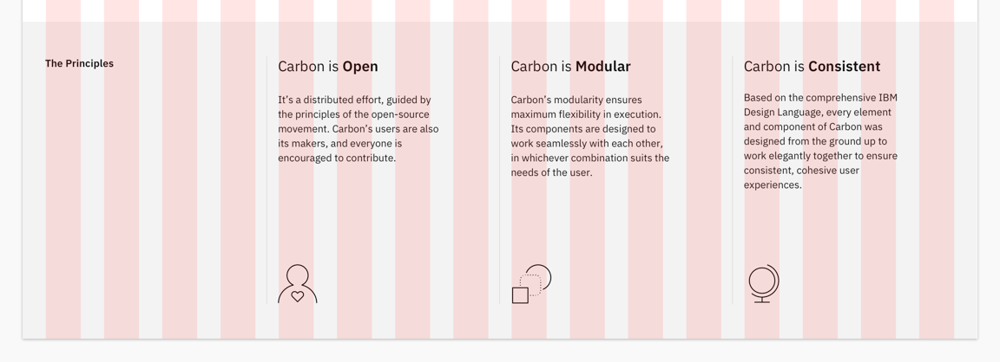
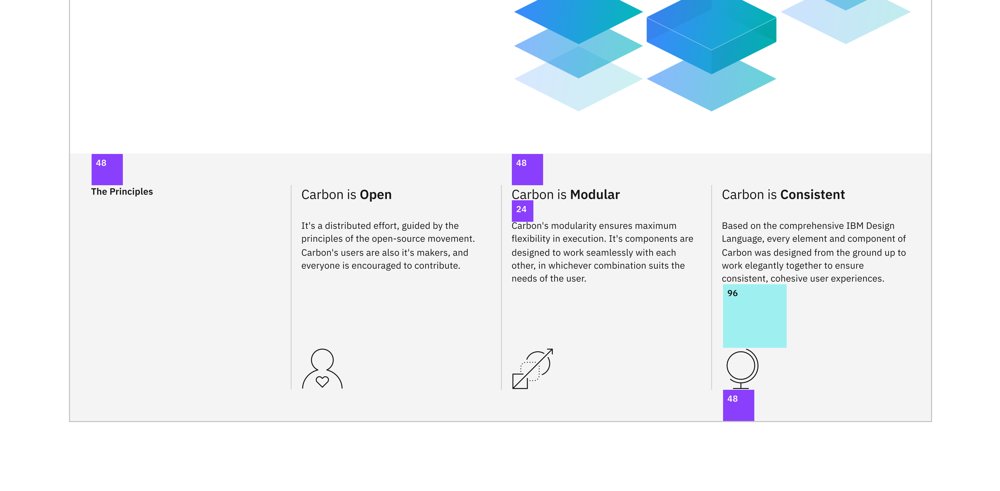

import Preview from 'components/Preview';

<PageDescription>

With two pages comprised mostly of Carbon components, let's revisit the landing
page and complete the principles section using Carbon pictograms and tokens.

</PageDescription>

<AnchorLinks>

<AnchorLink>Fork, clone and branch</AnchorLink>
<AnchorLink>Review design</AnchorLink>
<AnchorLink>The info section</AnchorLink>
<AnchorLink>The info card</AnchorLink>
<AnchorLink>Add styling</AnchorLink>
<AnchorLink>Check accessibility</AnchorLink>
<AnchorLink>Push to GitHub</AnchorLink>

</AnchorLinks>

## Preview

Carbon provides a solid foundation for building web applications through its
color palette, layout, spacing, type, as well as common building blocks in the
form of components. So far, we've only used Carbon components to build out two
pages.

Other tutorials at this point build a component using Carbon, as we are staying
valilla here, and we don't want to turn this into a Web Component tutorial, we
will use a HTML template and BEM class names to prevent our CSS affecting
others.

A
[preview](https://carbon-tutorial-nextjs-git-step-5-carbon-design-system.vercel.app/)
of what you'll build (see bottom of page):

<Preview
  height="400"
  title="Carbon Next Tutorial Step 4"
  src="https://carbon-tutorial-nextjs-git-v11-next-step-5-carbon-design-system.vercel.app/"
  frameborder="no"
  allowtransparency="true"
  allowfullscreen="true"
/>

## Fork, clone and branch

This tutorial has an accompanying GitHub repository called
[carbon-tutorial-web-components](https://github.com/carbon-design-system/carbon-tutorial-web-components)
that we'll use as a starting point for each step. If you haven't forked and
cloned that repository yet, and haven't added the upstream remote, go ahead and
do so by following the [step 1
instructions]([previous step](/developing/web-components-tutorial/step-1#fork-clone-and-branch).

### Branch

With your repository all set up, let's check out the branch for this tutorial
step's starting point.

```bash
git fetch upstream
git checkout -b step-4 upstream/step-4
```

<InlineNotification>

**Note:** This builds on top of step 3, but be sure to check out the upstream
step 4 branch because it includes the static assets required to get through this
step.

</InlineNotification>

### Build and start app

Install the app's dependencies (in case you're starting fresh in your current
directory and not continuing from the previous step):

```bash
pnpm i
```

Then, start the app:

```bash
pnpm dev
```

You should see something similar to where the
[previous step](/developing/web-components-tutorial/step-1#fork-clone-and-branch/step-3)
left off.

## Review design

Here's what we're building – an informational section that has a heading and
three subheadings. Each subheading has accompanying copy and a pictogram. We'll
assume that this informational section is used elsewhere on the site, meaning
it's a great opportunity to build it as a reusable component. As for naming,
we'll call it an `InfoSection` with three `InfoCard`s as children.



<Caption>Info section layout</Caption>

## The info section

Inside `page-landing__r3` in `index.html` we will make a couple of small
changes. Add the class `info-section` to the `cds--subgrid`

```html path=index.html
<div class="info-section cds--subgrid cds--subgrid--full-wide"></div>
```

and replace `The principles` and surrounding column with which changes the
column settings and provides a class for us to style the section heading.

```html path=index.html
<div
  class="info-section__column cds--sm:col-span-4 cds--md:col-span-8 cds--lg:col-span-16 cds--xlg:col-span-4 cds--css-grid-column">
  <h3 class="info-section__heading">The Principles</h3>
</div>
```

Style the `info-section__heading` with:

```scss path=style.scss
.info-section__heading {
  @include type-style('heading-01');

  padding-block-end: $spacing-08;
}
```

## The info card

At the bottom of `index.html` between the closing body and html tags add the
info card template.

### The template

```html path=index.html
<template id="template--info-card">
  <div
    class="info-card cds--sm:col-span-4 cds--md:col-span-8 cds--lg:col-span-5 cds--xlg:col-span-4 cds--css-grid-column">
    <div class="info-card__uppder">
      <h4 class="info-card__heading">
        Carbon is
        <strong class="info-card__heading--strong">thing goes here</strong>
      </h4>
      <p class="info-card__body">Body goes here</p>
    </div>
    <div class="info-card__pictogram"></div>
  </div>
</template>
```

Before we make use of the template we need to remove the column settings from
the remaining three elements `page-landing__title` and replace with `info-card
to leave:

```html index.html
<div class="info-card">Carbon is open</div>
<div class="info-card">Carbon is modular</div>
<div class="info-card">Carbon is consistent</div>
```

### The script

As the script in this file only affects our landing page, first lets create
`landing.js`. Kicking things off by moving the breadcrumb and tabs import from
`main.js`.

```javascript path=landing.js
import '@carbon/web-components/es/components/breadcrumb/index';
import '@carbon/web-components/es/components/tabs/index';
```

Then add a script tag to `index.html` to import `landing.js`

```html path=index.html
<script type="module" src="/landing.js"></script>
```

After making sure everything add, to `landing.js`, the script to create the info
card elements. First adding the data we will use to construct the info cards
from.

```javascript path=landing.js
const infoCardDetails = [
  {
    strongMsg: 'Open',
    bodyMsg: `It's a distributed effort, guided by the principles of the open-source movement. Carbon's users are also it's makers, and everyone is encouraged to contribute.`,
    pictogramName: 'advocate',
  },
  {
    strongMsg: 'Modular',
    bodyMsg: `Carbon's modularity ensures maximum flexibility in execution. It's components are designed to work seamlessly with each other, in whichever combination suits the needs of the user.`,
    pictogramName: 'accelerating-transformation',
  },
  {
    strongMsg: 'Consistent',
    bodyMsg: `Based on the comprehensive IBM Design Language, every element and component of Carbon was designed from the ground up to work elegantly together to ensure consistent, cohesive user experiences.`,
    pictogramName: 'globe',
  },
];
```

Then create the utility function `updateInfoCard`

```javascript path=landing.js
const updateInfoCard = (here, { strongMsg, bodyMsg, pictogramName }) => {
  const infoCardTemplate = document.querySelector(
    'template#template--info-card'
  );

  if (here && infoCardTemplate) {
    const newInfoCard = infoCardTemplate.content.cloneNode(true);

    const strongEl = newInfoCard.querySelector('.info-card__heading--strong');
    strongEl.innerHTML = strongMsg;

    const infoBodyEl = newInfoCard.querySelector('.info-card__body');
    infoBodyEl.innerHTML = bodyMsg;

    const pictogramEl = newInfoCard.querySelector('.info-card__pictogram');
    pictogramEl.classList.add(`info-card__pictogram--${pictogramName}`);

    here.innerHTML = '';
    here.replaceWith(newInfoCard);
  }
};
```

Followed by a query to find the info card elements and a loop to add our data.

```javascript path=landing.js
const infoCards = document.querySelectorAll('.info-card');
[...infoCards].forEach((infoCard, index) => {
  updateInfoCard(infoCard, infoCardDetails[index]);
});
```

### The styles



Looking at the landing page you should see the updated information where
previously only the title was rendred. In order to complete our info card we
need to add some styling.

First up let's make the picograms visible with the following.

```scss path=style.scss
.info-card__pictogram {
  width: $spacing-10;
  height: $spacing-10;
  background-color: $text-primary;
}

.info-card__pictogram--accelerating-transformation {
  mask: url('/accelerating-transformation.svg') no-repeat center;
}

.info-card__pictogram--advocate {
  mask: url('/advocate.svg') no-repeat center;
}

.info-card__pictogram--globe {
  mask: url('/globe.svg') no-repeat center;
}
```

The remaining styling is to make the info cards pleasing on the eye. Use of
Carbon breakpoints, which also control the number of grid columns, keeps our
page looking great even on the narrowest of devices.

```scss path=style.scss
.info-card {
  display: flex;
  height: 300px;
  flex-direction: column;
  justify-content: space-between;
  padding-inline: $spacing-05;
  border-left: 1px solid $border-subtle;

  @include breakpoint-down(xlg) {
    &:nth-of-type(2) {
      border-left: none;
      padding-left: 0;
    }
  }

  @include breakpoint-down(lg) {
    flex-direction: row-reverse;
    border-left: none;
    padding-inline: 0;
    gap: $spacing-07;
    padding-top: $spacing-10;
    height: initial;

    &:nth-of-type(2) {
      padding-top: 0;
    }
  }
}

.info-card__heading {
  @include type-style('heading-03');

  margin-top: 0;
}

.info-card__body {
  @include type-style('body-long-01');

  margin-top: $spacing-06;
}
```

## Check accessibility

We've added new markup and styles, so it's a good practice to check
[Equal Access Checker](https://www.ibm.com/able/toolkit/tools/) and make sure
our rendered markup is on the right track for accessibility.

With the browser extension installed, Chrome in this example, open Dev Tools and
run Accessibility Assessment.

## Push to GitHub

That is it you are done. Just one more push to save your completion of step 4.

### Git commit and push

First, stage and commit all of your changes:

```bash
git add --all && git commit -m "feat(tutorial): complete step 4"
```

Then, push to your repository:

```bash
git push -u origin step-4
```

<InlineNotification>

**Note:** If your Git remote protocol is HTTPS instead of SSH, you may be
prompted to authenticate with GitHub when you push changes. If your GitHub
account has two-factor authentication enabled, we recommend that you follow
these instructions to
[create a personal access token for the command line](https://help.github.com/en/articles/creating-a-personal-access-token-for-the-command-line).
That lets you use your token instead of password when performing Git operations
over HTTPS.

</InlineNotification>
