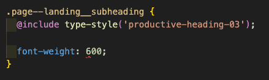
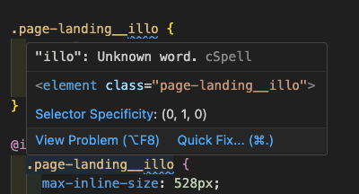

import Preview from 'components/Preview';

<PageDescription>

This is an optional step that takes what we've built so far and optimizes the
app for a production environment.

</PageDescription>

<AnchorLinks>

<AnchorLink>Fork, clone and branch</AnchorLink>
<AnchorLink>Linting</AnchorLink>
<AnchorLink>Deplying to gh-pages</AnchorLink>
<AnchorLink>Using the CDN</AnchorLink>
<AnchorLink>Push to GitHub</AnchorLink>
<AnchorLink>Step 5 complete branch</AnchorLink>

</AnchorLinks>

## Preview

A [preview](https://carbon-tutorial-nextjs.vercel.app/) of what you'll build
(visually no different, but built for production):

<Preview
  height="400"
  title="Carbon Next Tutorial Step 5"
  src="https://carbon-tutorial-nextjs.vercel.app/"
  frameborder="no"
  allowtransparency="true"
  allowfullscreen="true"
/>

## Fork, clone and branch

This tutorial has an accompanying GitHub repository called
[carbon-tutorial-web-components](https://github.com/carbon-design-system/carbon-tutorial-web-components)
that we'll use as a starting point for each step. If you haven't forked and
cloned that repository yet, and haven't added the upstream remote, go ahead and
do so by following the
[step 1 instructions](/developing/web-components-tutorial/step-1#fork-clone-and-branch).

### Branch

With your repository all set up, let's check out the branch for this tutorial
step's starting point.

```bash
git fetch upstream
git checkout -b step-5 upstream/step-5
```

<InlineNotification>

**Note:** This builds on top of step 4, but be sure to check out the upstream
step 5 branch because it includes the static assets required to get through this
step.

</InlineNotification>

### Build and start app

Install the app's dependencies (in case you're starting fresh in your current
directory and not continuing from the previous step):

```bash
pnpm i
```

Then, start the app:

```bash
pnpm dev
```

You should see something similar to where the
[previous step](/developing/web-components-tutorial/step-1#fork-clone-and-branch/step-4)
left off.

## Linting

<InlineNotification>

**Note:** Linters are great Linters, spell checkers, code formatters are all
really useful tools to ensure code consistency and guard against potential
errors. They often integrate and run within your IDE and should form an
essential part of your development process. Early really is the best and
cheapest time to avoid issues.

</InlineNotification>

### Stylelint

While the Carbon component styles are encapsulated in the components there we
have written some SCSS ourselves it would great if we could check we are
applying Carbon as expected.

For more information on Stylelint [visit stylelint.io](https://stylelint.io/).

Add Stylelint, a Carbon plugin as development dependencies.

```bash
pnpm add -D stylelint stylelint-plugin-carbon-tokens
```

In `package.json` add the following script:

```json path=package.json
  "lint:style": "pnpm stylelint '**/*.scss'",
```

In the root folder create a file called `.stylelintrc.json` and add the
following settings. The
[recommended config](https://github.com/carbon-design-system/stylelint-plugin-carbon-tokens/blob/main/config/recommended.js)
for the plugin checks layout, motion, theme and type usage against expectations.
For more details take a look at the packages
[README.md](https://github.com/carbon-design-system/stylelint-plugin-carbon-tokens/blob/main/README.md)

```json path=.stylelintrc.json
{
  "extends": ["stylelint-plugin-carbon-tokens/config/recommended"],
  "plugins": ["stylelint-plugin-carbon-tokens"],
  "reportNeedlessDisables": true,
  "reportInvalidScopeDisables": true,
  "reportDescriptionlessDisables": true
}
```

At the command line you can now run the script `lint:style`. This should
highlight just the one issue with the setting of `font-weight` to 600.

```bash
$pnpm run lint:style

> carbon-tutorial-web-components@0.0.0 lint:style /Users/leechase/Source/carbon/carbon-tutorial-web-components
> pnpm stylelint '**/*.scss'

style.scss
  158:16  ✖  Expected carbon type token, mixin or function for          carbon/type-use
            "font-weight" found "600".

✖ 1 problem (1 error, 0 warnings)
  1 error potentially fixable with the "--fix" option.
```

If you open the file you will see that `600` is marked with a wiggly underline.



Hovering over it you will see a popup explanation.


Change `600` to `font-weight('semibold')`

It is recommended that you use a more extensive rule set for stylelint. This can
help keep code consistent and auto fix many potential issues.

If for instance you were to adopt the following configuration it would check for
a number of important issues such as accessiblity, right to left, and even
consistency patterns like nesting depty and CSS class selector pattern.

Even better the small number of issues that it raises, regarding use of logical
properties, can be auto fixed bringing your CSS up to date.

```json path=.stylelintrc.json
{
  "extends": [
    "stylelint-config-standard-scss",
    "stylelint-plugin-carbon-tokens/config/recommended"
  ],
  "plugins": [
    "@double-great/stylelint-a11y",
    "stylelint-use-logical-spec",
    "stylelint-plugin-carbon-tokens"
  ],
  "reportNeedlessDisables": true,
  "reportInvalidScopeDisables": true,
  "reportDescriptionlessDisables": true,
  "rules": {
    "a11y/media-prefers-reduced-motion": true,
    "a11y/no-outline-none": true,
    "a11y/selector-pseudo-class-focus": true,
    "max-nesting-depth": [
      3,
      {
        "ignoreAtRules": ["if", "else", "each", "include", "mixin"]
      }
    ],
    "liberty/use-logical-spec": true,
    "selector-class-pattern": [
      "^[a-z]([-]?[a-z0-9]+)*(__[a-z0-9]([-]?[a-z0-9]+)*)?(--[a-z0-9]([-]?[a-z0-9]+)*)?$",
      {
        "message": "should match Harry Roberts'' style BEM block[__element][--modifier]"
      }
    ]
  }
}
```

Don't forget to add these packages if you want to try out this config.

```bash
pnpm add -D @double-great/stylelint-a11y stylelint-config-standard-scss stylelint-use-logical stylelint-use-logical-spec
```

Running `pnpm run lint:style --fix` will fix the issues identified.

### ESLint & Prettier

In addition to linting styles, it is recommended that you also check your script
for dev time errors and consitency.

For more information on ESLint [visit eslint.org](https://eslint.org/).

For more information on Prettier [visit prettier.io](https://prettier.io/).

NOTE: If you are using a reactive library then there may well be configurations
better suited to your purposes.

ESLint checks your code for potential bugs, Prettier ensures your whole teams
code uses the same formatting rules. Config for these two is often added at the
same time, the package `eslint-config-prettier` specifically made to help the
two work together.

Create a file called `.prettierrc` in the root of your project and add the
following.

```json path=.prettierrc
{
  "bracketSameLine": true,
  "bracketSpacing": true,
  "printWidth": 120,
  "semi": true,
  "singleQuote": true,
  "tabWidth": 2,
  "trailingComma": "es5",
  "proseWrap": "always"
}
```

Then add a file called `eslint.config.js` in the root of the project and include
the following config.

```javascript path=eslint.config.js
import js from '@eslint/js';
import eslintConfigPrettier from 'eslint-config-prettier';
import globals from 'globals';

export default [
  {
    languageOptions: {
      ecmaVersion: 2024,
      globals: {
        ...globals.es2024,
        ...globals.browser,
      },
    },
  },
  { ignores: ['node_modules', 'dist'] },
  js.configs.recommended,
  eslintConfigPrettier,
];
```

Add the following dev dependencies

```bash
pnpm add -D eslint eslint-config-prettier prettier globals
```

Two more scripts for `package.json` to run eslint and prettier.

```json path=package.json
"lint:es": "eslint . main.js --report-unused-disable-directives --max-warnings 0",
"lint:format": "prettier ./**/*.{js,jsx,ts,tsx,md,mdx,scss} --write --ignore-unknown --no-error-on-unmatched-pattern --log-level warn",
```

Running these scripts will, not at the time of writing highlight any ESLint
issues. If it does in future it may be possible to auto fix them.

It will almost certainly refomat the code compared to your chosen editors
preferences.

### Spell checkers

If we all had perfect spelling and typing then maybe a spell checker is not
needed. However, given that the word `typo` exists let us assume that somebody
on your team is not the perfect vessel to sit between their keyboard and chair.

A spell checker ensures that `typo` do not, or at least should not go unnoticed.

For more information on cspell [visit cspell.org](https://cspell.org/).

Add `cspell` as a dependency with:

```bash
pnpm add -D cspell
```

There are many config options, including the ability to create and share custom
dictionaries so your brand, pet name or other desirable creations do not get
flagged up as spelling errors.

Here we will add the following config file `cspell.json`.

```json path=cspell.json
{
  "version": "0.1",
  "language": "en",
  "dictionaries": [],
  "dictionaryDefinitions": [],
  "enabledLanguageIds": [
    "css",
    "git-commit",
    "html",
    "javascript",
    "json",
    "markdown",
    "plaintext",
    "scss",
    "text"
  ],
  "ignorePaths": [
    "node_modules",
    "dist",
    "package.json",
    "*.log",
    "CHANGELOG.md"
  ],
  "words": [""]
}
```

Add this spelling script to `package.json`

```json path=package.json
"lint:spell": "cspell lint --quiet \"**/*.{js,css,scss,md}\"",
```

Running this script will find a number of spellings `cspell` is not happy with.

In our style file for instance it will highlight our image name `illo` as not
being a word, which is great because it is not.

We can also see in our IDE that this is highlighted with a blue wiggly
underline.



There are a number of ways to fix this. As this is not a spelling mistake we
will choose `Add: "illo" to config:...` from the list of options.


If you view the `cspell.json` file you will find it has been added.

## Deplying to gh-pages

GitHub packages can use a branch called `gh-pages` to deploy to. In order to do
this a couple of important changes are needed first. Without completing these
steps correctly you will either end up attempting to deploy somewhere you do not
have permission to do so, or deploy a page that cannot find any of its
dependencies.

Update and/or add `name` and `homepage` to `pacakge.json`.

```json path=package.json
"name": "carbon-tutorial-web-components",
"homepage": "https://github.com/[YOUR-ORG-OR-NAME]/[REPO-NAME]",
```

Back to `package.json` we need one last dependency to automate the deployment
process.

```bash
pnpm add -D gh-pages
```

Next to run the deployment we will add two scripts to `package.json`

```json path=package.json
"predeploy": "npm run build",
"deploy": "gh-pages -d dist",
```

Way back in step 1 you creted a fork of the tutorial repo. It is this URL you
use for the projects homepage.

Next you will need a `vite.config.js` file to ensure both `index.html` and
`repositories.html` are included in the build. The config may also need to set a
value for `base` that depends on various factors.

If a personal GitHub it is likely your vite config will look like this:

```javascript path=vite.config.js
export default {
  base: '/[REPO-NAME]/',
  build: {
    rollupOptions: {
      input: {
        landing: fileURLToPath(new URL('./index.html', import.meta.url)),
        repositories: fileURLToPath(
          new URL('./repositories.html', import.meta.url)
        ),
      },
    },
  },
};
```

If part of an organisation use `base: '/'` instead.

After running the deploy script you will have a publicly visible page. You can
locate the page by browsing to the settings page of your GitHub repository. At
the time of writing the URL shown in the `Pages` section where you can choose to
unpublish if needed.

For ease of access:

- Select the `Code` tab/page
- Click on the cog (right side of page) to the right of `About` to view the
  repository details.
- Check the `Use your GitHub Pages website` and save changes. The GitHub pages
  URL should now appear on the landing page of your repository.

### Debugging your deploy

#### Build

Run a build and makes sure your assets are all included in the `dist` folder.

```bash
pnpm build
```

This should include the contents of public, the two html files, CSS and
Javascript. If something is missing check your Vite config and `package.json`
against the guidance above and the latest Vite documentation.

#### Deploy

Deploy your application with a base value of `/`. If the page does not look
correctc, e.g. not styled or missing icons, then you need to determine what the
difference is between the asset location and your base.

Open the deveveloper tools and view the console. Any missing assets should cause
messages such as the following to be displayed.


In this case

- GitHub pages location `https://[ACCOUNT].github.io/[REPO-NAME]`
- Asset location `https://[ACCOUNT].github.io/[ASSET]`

The fix would be to change your base setting to `/[REPO-NAME]/`.

## Using the CDN

Lastly we've been using `main.js` to load components from `node_modules` but Web
Components do not require is to do this. All of Carbon Web Components is
published via a CDN see
[the documentation for further details](https://web-components.carbondesignsystem.com/?path=/docs/introduction-carbon-cdn-style-helpers--overview).

<InlineNotification>

**Note:** The
[deployed version](https://solid-carnival-1pg38np.pages.github.io/) of this
tutorial is using the CDN.

</InlineNotification>

Remove the component imports from `main.js`.

```javascript path=main.js
import '@carbon/web-components/es/components/button/button.js';
import '@carbon/web-components/es/components/ui-shell/index';
import '@carbon/web-components/es/components/checkbox/index';
import '@carbon/web-components/es/components/content-switcher/index';
import '@carbon/web-components/es/components/skip-to-content/index.js';
```

Remove the component imports from `landing.js`.

```javascript path=landing.js
import '@carbon/web-components/es/components/breadcrumb/index';
import '@carbon/web-components/es/components/tabs/index';
```

Remove the component imports from `repos.js`.

```javascript path=repos.js
import '@carbon/web-components/es/components/data-table/index.js';
import '@carbon/web-components/es/components/link/index';
import '@carbon/web-components/es/components/pagination/index';
```

In the `head` of `index.html` add the following script tags.

```html path=index.html
<script
  type="module"
  src="https://1.www.s81c.com/common/carbon/web-components/version/v2.17.0/button.min.js"></script>
<script
  type="module"
  src="https://1.www.s81c.com/common/carbon/web-components/version/v2.17.0/ui-shell.min.js"></script>
<script
  type="module"
  src="https://1.www.s81c.com/common/carbon/web-components/version/v2.17.0/checkbox.min.js"></script>
<script
  type="module"
  src="https://1.www.s81c.com/common/carbon/web-components/version/v2.17.0/content-switcher.min.js"></script>
<script
  type="module"
  src="https://1.www.s81c.com/common/carbon/web-components/version/v2.17.0/skip-to-content.min.js"></script>
<script
  type="module"
  src="https://1.www.s81c.com/common/carbon/web-components/version/v2.17.0/tabs.min.js"></script>
<script
  type="module"
  src="https://1.www.s81c.com/common/carbon/web-components/version/v2.17.0/breadcrumb.min.js"></script>
```

We also need to update `repositories.html` with:

```html path=repositories.html
<script
  type="module"
  src="https://1.www.s81c.com/common/carbon/web-components/version/v2.17.0/ui-shell.min.js"></script>
<script
  type="module"
  src="https://1.www.s81c.com/common/carbon/web-components/version/v2.17.0/checkbox.min.js"></script>
<script
  type="module"
  src="https://1.www.s81c.com/common/carbon/web-components/version/v2.17.0/content-switcher.min.js"></script>
<script
  type="module"
  src="https://1.www.s81c.com/common/carbon/web-components/version/v2.17.0/skip-to-content.min.js"></script>
<script
  type="module"
  src="https://1.www.s81c.com/common/carbon/web-components/version/v2.17.0/data-table.min.js"></script>
<script
  type="module"
  src="https://1.www.s81c.com/common/carbon/web-components/version/v2.17.0/link.min.js"></script>
<script
  type="module"
  src="https://1.www.s81c.com/common/carbon/web-components/version/v2.17.0/pagination.min.js"></script>
```

If you run the application again you are running with no dependency on
`node_modules/@carbon/web-components`.

## Push to GitHub

Just one more push to save your completion of step 5.

### Git commit and push

First, stage and commit all of your changes:

```bash
git add --all && git commit -m "feat(tutorial): complete step 5"
```

Then, push to your repository:

```bash
git push -u origin step-5
```

<InlineNotification>

**Note:** If your Git remote protocol is HTTPS instead of SSH, you may be
prompted to authenticate with GitHub when you push changes. If your GitHub
account has two-factor authentication enabled, we recommend that you follow
these instructions to
[create a personal access token for the command line](https://help.github.com/en/articles/creating-a-personal-access-token-for-the-command-line).
That lets you use your token instead of password when performing Git operations
over HTTPS.

</InlineNotification>

## Step 5 complete branch

That is it you are done. If you want to review the completed step 5 you can do
so by checking out

```bash
git fetch upstream
git checkout -b step-5 upstream/step-5-complete
```
