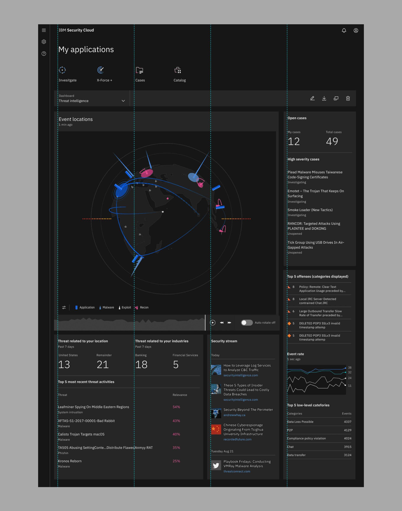
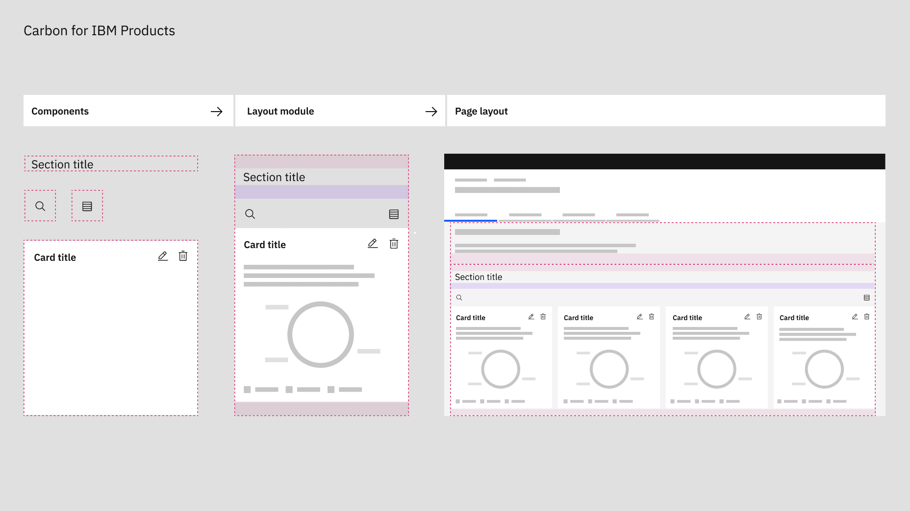
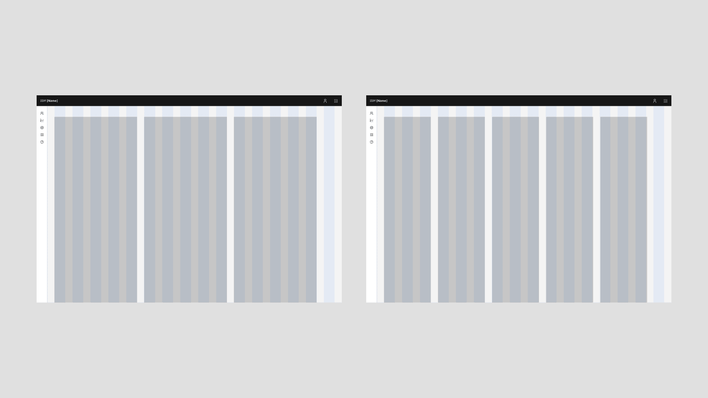
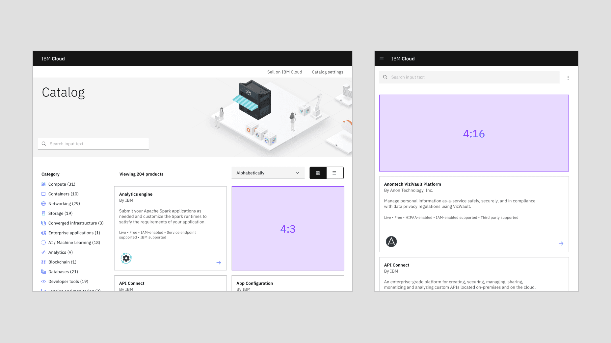
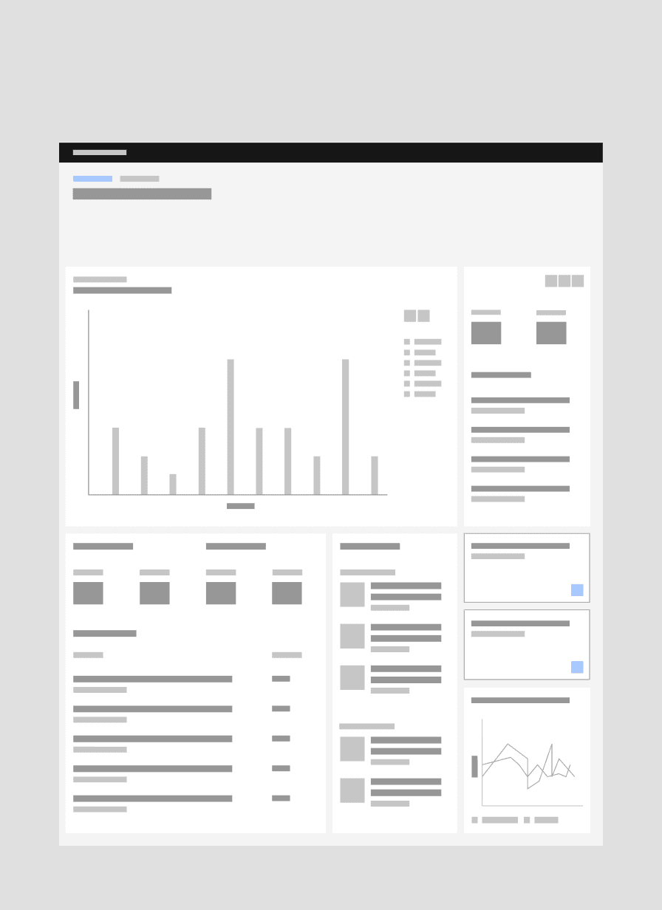
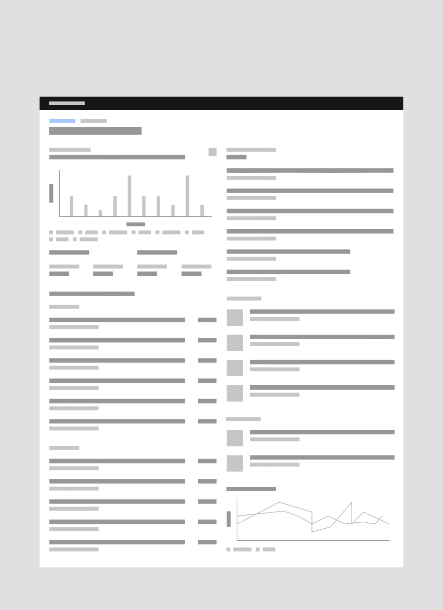
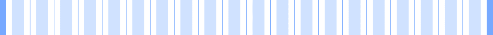
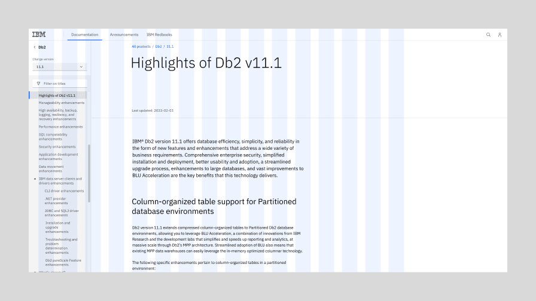
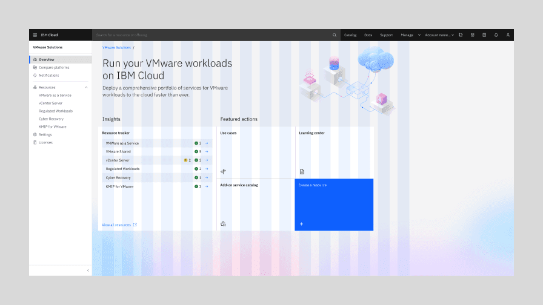
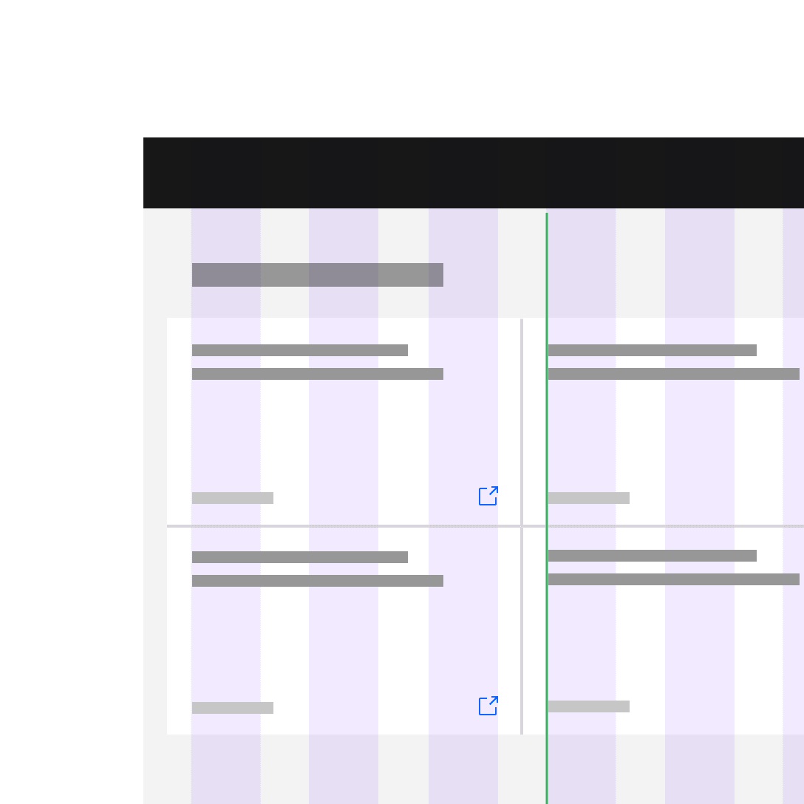

import { IbmSecurity } from '@carbon/icons-react';
import { gridTable } from './Grid.module.scss';
import KalturaVideo from 'components/KalturaVideo';

<PageDescription>

You’ve learned the grid fundamentals, now let’s put them together. A good layout
requires careful planning and use of composition, which relies on principles
such as hierarchy, scale, proportion, contrast, harmony, rhythm, repetition, and
many more.

</PageDescription>

<InlineNotification>

Note: Although Carbon is open source, much of our Pattern Asset Library (PAL)
content is gated—so many of the links below can only be accessed by IBM
employees.

</InlineNotification>

<AnchorLinks>
  <AnchorLink>UI galleries</AnchorLink>
  <AnchorLink>Fit for purpose</AnchorLink>
  <AnchorLink>Content hierarchy</AnchorLink>
  <AnchorLink>Continuity and contrast</AnchorLink>
  <AnchorLink>Grid influencers</AnchorLink>
  <AnchorLink>Style models</AnchorLink>
  <AnchorLink>Gutter modes</AnchorLink>
  <AnchorLink>Mixing gutter modes</AnchorLink>
  <AnchorLink>Using grids in Figma</AnchorLink>
</AnchorLinks>

## UI galleries

For years, Carbon users have been asking for a gallery of product UI screens for
reference and inspiration. There are several ongoing initiatives to catalog
screens and we’ll continue to add to this list as more come online.

<Row className="resource-card-group">
  <Column colLg={4} colMd={4} noGutterSm>
  <ResourceCard
    subTitle="UI screens (IBMers only)"
    title="Security"
    href="https://pages.github.ibm.com/security/security-design/department/tools-and-resources/visual-libraries/libraries/"
    >

<IbmSecurity size={32} />

  </ResourceCard>
</Column>
</Row>

## Fit for purpose

On every page there is a story that ends with a desired action–one that enables
a user to achieve a goal or reach an outcome. Proper layouts pull everything
together to help users form a mental model of the story, identify relevant
content, and pursue their objective.

Always start with the content and user goals. Consider the purpose of the
content and the best type of experience to help the user reach their objective.
For instance, are you building a long-form reading experience or a multi-step,
task-based experience? Each type of experience and purpose will require a
different layout.

## Content hierarchy

Hierarchy helps users (viewer, reader, audience) navigate complex concepts
without getting confused or lost, and ultimately find what they are looking for.
Thoughtful application of type styles, components, and patterns will allow
content to be communicated and prioritized in different ways. Pay attention also
to the size and proximity of content pieces within a component and between
components.

### Basic scaffolding

In the Overview section, we talked a bit about common screen regions—like the UI
Shell, the content area and dialogs. Now we also need to address several common
layout patterns within the content area in IBM products.

These repeatable structures lower the cognitive burden for users, by reinforcing
key alignments throughout the UI. Below are some examples of structural layout
modules that are used widely across products. For more detailed documentation
about structural layout modules, check out
[IBM Product Layouts](https://pages.github.ibm.com/cdai-design/pal/layouts/library/)
on the Carbon for IBM Products PAL.

<Caption>
  Although gutter width depends on the product, here are some common examples of
  how product designers use a consistent leadspace size with the 2x Grid to
  create four-column layout patterns that repeat throughout their products.
</Caption>

### Four columns

The four column layout is the backbone of most IBM experiences—not just the
IBM.com pages. Software users also like more breathing room as they enter a
product, along with consistent typographic alignments, as they navigate deeper.
As a result, IBM product UIs rely heavily on the four column structure to ease
users into denser content.

Even though there are examples of two- and three-column arrangements in the
diagrams above, the type within them often still sits on four columns.

### Denser layouts

You can see the four column arrangement in denser layouts too. The leadspace
pattern also remains the same, giving users a familiar anchor. However the
content has become a lot denser as other column configurations begin to emerge
on the fluid 2x grid. The fixed grid also comes into play here in the data
visualizations, where content is so dense that fixed spacers (i.e. the
[mini unit grid](/elements/2x-grid/overview/#mini-unit)) need to be used rather
than fluid columns.

### Layout modules and micro layouts

Although Carbon React does not have coded layout modules in its library, the
[Carbon for IBM Products library](https://v1-ibm-products.carbondesignsystem.com/?path=/story/overview-getting-started--page)
_(IBMers only)_ does. These modules are helpful for reference, however they are
still in the process of being migrated to Carbon v11.

Layout modules are coded combinations of components, spacing tokens, icons, and
type styles packaged as a single grid-aware, unit. The layout-module framework
enables designers to build page layouts with greater rigor, quality, and
consistency. They are designed to work in tandem with other modules and Carbon
components so that they can be quickly arranged into layouts with the confidence
that they are consistent with all of our other pages.

These modules along with the overarching page scaffolding above, provide a great
example of how product designers should mix and match repeatable layout patterns
at both the large and small scales throughout an experience.

### Using odd column configurations

The 2x grid starts with 16 columns and encourages designers to divide by two as
their content becomes more dense. However, many legacy products used a twelve
column grid and in turn, display content in groups of three instead of groups of
four.

Although we highly recommend refactoring these UIs to take full advantage of the
the 2x grid, we realize that certain products will choose to keep their three
column scaffolding. So it’s important to note that this configuration can still
be achieved with the 2x grid package.

## Continuity and contrast

No component exists on its own. Pay attention to how individual layout
components fit into the larger context of both the page type and the broader
user journey across the product. Pattern repetition where appropriate is
essential to reduce cognitive load, however too much repetition, especially
coupled with lack of white space, can lead to monotony.

### Continuity

#### Thinking across an experience

Unlike editorial experiences, products focus more on task completion and
continuity across screens, rather than leading a user through stacked modules on
a single page. So common geometries and key alignments are especially important
across pages, not just down the scroll.

The Cloud team recently did an audit on type alignment in their product
[leadspaces](<https://www.figma.com/proto/XHddusMshnOcHMWjxtoGrx/Cloud-PAL-Experimental-(Light)?page-id=80%3A124640&node-id=80-131354&viewport=4475%2C1436%2C0.29&scaling=min-zoom&starting-point-node-id=80%3A130876>)
_(IBMers only)_ in order to streamline their experiences.

<Caption>
  Although the leadspace heights are changing, the typographic alignment from
  the World overview page into the product keeps the user oriented.
</Caption>

#### Using Aspect ratios

Aspect ratios also ensure that there is a consistent visual flow as users move
through a product. Although images are used much less frequently in products
than in digital experiences, aspect ratios come into play often in product with
the tile component, which is used frequently in catalogs and dashboards.

Refer back to the [aspect ratios](/elements/2x-grid/overview/#aspect-ratio)
section on the 2x Grid Overview tab to see a list of the most commonly used
aspect ratios across the Carbon ecosystem. We understand that it’s not always
possible for every image or container to be one of these sizes. However it’s
important to use them to set the foundation of your layouts, especially in the
case of same size tiles.

<Caption>
  An example of using aspect ratios to drive the layout of your dashboards or
  catalogs
</Caption>

#### Adaptive aspect ratios

Bear in mind that tile aspect ratios can change adaptively when the breakpoint
changes.

<Caption>
  When a commonly used aspect ratio is not appropriate for the layout, it’s also
  fine to choose a less common aspect ratio or a{' '}
  <a href="/elements/2x-grid/overview/#scaling-multiple">scaling multiple</a>.
</Caption>

### Contrast

Contrast is an effective way to distinguish content pieces, engage users,
highlight important information, and express IBM’s brand elements. Juxtaposing
text with images, pairing UI components and elements of different sizes,
strategic use of the grid, negative space and asymmetry are some of the ways in
which you can introduce contrast to a layout.

<Caption>
  Despite the technically “correct” use of the 2x grid below, the content on the
  right becomes overwhelming for the user. By presenting all of the information
  at the same scale, the user has no sense of hierarchy to orient them.
</Caption>

<DoDontRow>
  <DoDont type="do" caption="Combine related information and content types, then space appropriately to highlight dependencies or similarities.
">

  </DoDont>
  <DoDont type="dont" caption="Without proper organization of content and use of space to separate elements, it is difficult to perceive how one content piece relates to another.">

  </DoDont>
</DoDontRow>

## Grid influencers

As we mentioned on the Overview page, a grid influencer is a component that
condenses a page’s underlying grid when it is incorporated into a UI. It can
either appear on the page as the result of a user action, or be part of the
product’s page.

Whereas the basic page grid would simply react to the product’s breakpoints—grid
influencers affect the grid and its columns, which scale and resize the page
content, anytime they are present or engaged.

This
[grid influencer content](https://pages.github.ibm.com/cdai-design/pal/patterns/grid-influencers/usage/)
originated on the Carbon for IBM Products PAL, but we wanted to bring the
relevant portions of it here to reach the maximum audience.

### Usage

There are two main use cases where the grid may be influenced by content: left
navigation and slide-in side panels.

#### Left-hand navigation

The vast majority of IBM products use the grid influencer variant of the
[Carbon UI Shell](/components/UI-shell-left-panel/usage/), making the left-hand
navigation panel the most common example of a grid influencer in our ecosystem.
When opening and closing the left-hand navigation, the number of columns remains
the same but responds fluidly to the allotted space.

<KalturaVideo videoid="1_u8h2z1oh"></KalturaVideo>

#### Slide-in side panels

Slide-in side panels are another example of a grid influencer. Slide-in side
panels come into play when a user needs to reference the page along with the
panel information to complete a task.

Since these slide-in side panels were developed and maintained by Carbon for IBM
Products, please visit their site for more in-depth details on
[side-panel sizes and best practices](https://pages.github.ibm.com/cdai-design/pal/components/side-panel/usage/)
_(IBMers only)_.

<Caption>
  Introducing a slide-in side panel re-sizes the page content, and reduces the
  number of columns in the grid.
</Caption>

## Style models

Style models help designers by simplifying decisions around how foundational
design elements should be used. For example, all pages on IBM.com and all
screens within IBM product use the [2x Grid](/elements/2x-grid/overview/), but
the 2x Grid supports a wide range of behaviors and usage. The 2x Grid can be
left aligned, centered or it can span the maximum width of the browser.

These design decisions should be made consistently based on content needs. Style
models connect specific usage combinations to the kind of content they best
serve.

In our models, the design elements included are:

- Grid
- [Screen regions](/elements/2x-grid/overview#screen-regions)
- Key components (Masthead, Footer, and Product UI Shell)

The biggest differentiator between the style models is the grid. Specifically in
how the grid behaves above max breakpoint. Below is the 2x Grid at max
breakpoint (1584px or 99rem).

Here is a list of recurring style models we have identified across our
ecosystem:

| Style models                 | Usage and examples                                                                                                                                                                                                                                                                                                                     |
| ---------------------------- | -------------------------------------------------------------------------------------------------------------------------------------------------------------------------------------------------------------------------------------------------------------------------------------------------------------------------------------- |
| Editorial model              | This default style model is the bread and butter of marketing pages, which represent the majority of IBM.com. The grid in this model centers content for comfortable browsing, and allows for a variety of expressive layouts. Some low-information density product screens, such as the Checkout application, can use this model too. |
| Product and docs model       | For long-form content with deep organizational hierarchy, use the Product and docs model. It anticipates a left-hand navigational panel, and keeps content within a maximum width. Examples of this model include most of IBM product UI, IBM Docs, Cloud Docs, and this site documenting the design system guidance.                  |
| High-density interface model | Sometimes every inch of the screen needs be used to display information and controls. Complex product interfaces, catalogs and data visualization dashboards typically fall into this category. This model uses the full width of the browser, so the bigger the screen, the more information the user will see.                       |

<Row>
  <Column colLg={2} colMd={2} colSm={4}>

**2x Grid at Max breakpoint**

</Column>
  <Column colLg={10} colMd={6} colSm={4}>

<Caption>
  Once the screen is wider than the max breakpoint, the margins (highlighted in
  dark blue below) can expand, or columns can be added as needed in increments
  of two.
</Caption>

  </Column>
</Row>
<Row>
  <Column colLg={2} colMd={2} colSm={4}>

**Editorial model**

</Column>
  <Column colLg={10} colMd={6} colSm={4}>

<Caption>Max width maintained, grid is centered in the browser</Caption>

  </Column>
</Row>
<Row>
  <Column colLg={2} colMd={2} colSm={4}>

**Product and docs model**

</Column>
  <Column colLg={10} colMd={6} colSm={4}>

<Caption>Max width maintained, grid is left-aligned in the browser</Caption>

  </Column>
</Row>
<Row>
  <Column colLg={2} colMd={2} colSm={4}>

**High-density interface model**

</Column>
  <Column colLg={10} colMd={6} colSm={4}>

<Caption>Full width, add columns as needed in increments of 2</Caption>

  </Column>
</Row>

### Style models in IBM.com (editorial)

This difference in grid ripples through everything on page. Below is a visual
overview of how the IBM.com masthead and footer will behave above max
breakpoints in the appropriate style models. Notice that marketing content on
IBM.com uses the Editorial style model and that support documentation on IBM.com
uses the Product and docs style model.

<Row>
  <Column colLg={6} colMd={4}>

<Caption>The Editorial model in a marketing page on IBM.com.</Caption>

  </Column>
  <Column colLg={6} colMd={4}>

<Caption>
  The Product and docs model in the Documentation section of IBM.com.
</Caption>

  </Column>
</Row>
<Row>
  <Column colLg={6} colMd={4}>

<Caption>The footer for the Editorial model on IBM.com.</Caption>

  </Column>
  <Column colLg={6} colMd={4}>

<Caption>The footer for the Product and docs model on IBM.com.</Caption>

  </Column>
</Row>

### Style models in IBM Software (product)

Editorial and product experiences overlap slightly in that they both can use the
product & docs style model. However, only software UI uses the
[grid influencer](#grid-influencers) variant of the Carbon UI Shell.

IBM Products can also occasionally use the High-density interface model in order
to maximize the use of screen space. By far the most prominent example of this
to date in product is the Cloud Catalog.

<Row>
  <Column colLg={6} colMd={4}>

<Caption>
  The Product and docs model in context in an IBM product screen.
</Caption>

  </Column>
  <Column colLg={6} colMd={4}>

<Caption>
  The High-density interface model in context in the IBM Cloud catalog.
</Caption>

  </Column>
</Row>

## Gutter modes

Carbon’s Figma templates have a 32px gutter by default, regardless of
breakpoint. The default gutter width is 32px because type blocks (within or
without containers) never has less than a 32px gutter. For containers and
components, however, there are three different gutter structures: wide
(default), narrow and condensed. These three gutter scenarios enable typographic
alignment by allowing containers and certain components to “hang” into the
gutter.

<Row>
  <Column colLg={4} colMd={2}>

<Caption>
  Wide mode
    32px gutter

</Caption>

  </Column>
  <Column colLg={4} colMd={2}>

<Caption>
  Narrow mode
    16px gutter

</Caption>

  </Column>
  <Column colLg={4} colMd={2}>

<Caption>
  Condensed mode
    1px gutter

</Caption>

  </Column>
</Row>

### Wide gutter mode

This is Carbon’s default gutter mode, with 16 columns and 32px gutters. In the
wide gutter mode, the container edge does not extend into the gutter, so the
type within the container does not sit on the columns.

#### When to use:

Use the wide gutter mode when you are dealing with separate pieces of
information with separate destinations. This gutter mode is also good for
text-heavy situations, where maximum breathing room helps provide clarity and
legibility.

Fixed components with labels such as input fields and dropdowns MUST use the
wide gutter mode. So if you’re laying out form fields, this is the gutter mode
to use. One overarching rule, (applicable to each gutter mode) is that type
never hangs into the gutter. So we don’t want to push label type into the gutter
in order to get field type to align to the columns.

<Caption>
  Note: this page also includes a left-hand navigation panel in implementation,
  but we’ve removed it for the simplicity of the example.
</Caption>

<DoDontRow>
  <DoDont type="do" caption="Do align type (outside of a container), components, and tiles to the columns.">

  </DoDont>
  <DoDont type="dont" caption="Do not take type off the column structure to achieve alignment.">

  </DoDont>
</DoDontRow>

### Narrow gutter mode

The narrow gutter mode is by far the most common choice in product
implementation. The intent here is simply to enable more typographic
alignment—so the container, not the type, hangs 16px into the gutter. This
allows headings and copy outside of containers to align with the copy within
containers and components. This arrangement can easily be mirrored to
accommodate languages that read right to left, like Arabic or Hebrew.

#### When to use:

Use the narrow gutter mode when you're dealing with separate pieces of
information with separate destinations, but would like to save more real estate.
This gutter mode will give your compositions a sleeker look and maximize type
alignment, within and without containers.

As mentioned above, fixed components with labels, such as input fields and
dropdowns, should not hang into the gutter.

<DoDontRow>
  <DoDont type="do" caption="Do align components within containers flush to the columns.
">

  </DoDont>
  <DoDont type="dont" caption="Do not hang type into the gutter under any circumstances (note the tabs)">

  </DoDont>
</DoDontRow>

### Condensed gutter mode

In order to emphasize the gutters, 1px borders that are darker than the
background color (or lighter than the background color in the dark theme), must
be added to any tiles or cards. The borders add just enough clarity to the
gutters to stand out, while still registering to the user as the background
color. The token for these borders is the $border-subtle layer token.

#### When to use:

When you have separate pieces of information that form a larger picture, like a
dashboard or an overview page, that’s a good time to use the condensed gutters.
You’ll also see this gutter mode in portals, resource tiles and other
introductory UI. See it in action on the
[IBM Design Language homepage](https://www.ibm.com/design/language/).

As mentioned above, fixed components with labels, such as input fields and
dropdowns, should never hang into the gutter.

<DoDontRow>
  <DoDont type="do" caption="Do keep all type (inside and outside containers) aligned with the column grid.">

  </DoDont>
  <DoDont type="dont" caption="Do not hang type into the gutter under any circumstances.">

  </DoDont>
</DoDontRow>

## Mixing gutter modes

[Carbon’s Grid components](https://react.carbondesignsystem.com/?path=/story/elements-grid--default)
now use CSS Grid with the release of v11.

### Nested grids (subgrid)

Grid components can be nested within one another to achieve advanced layout
configurations. When a grid is a child of another grid, the child will always be
automatically defined as a subgrid. Subgrids should always be contained within a
column to ensure that the column amount/definition is properly configured for
the subgrid to inherit. Additionally, wrapping subgrids in a column enables you
to define responsive parameters for the column (sm, md, etc) that the subgrid
will also inherit and be bound to.

<Caption>
  Nesting grids allows items within a subgrid to be also aligned to the grid.
</Caption>

### Mix and match

Mixing gutter modes is going to be the rule rather than the exception on most
platforms—especially since our labeled components (input fields, dropdowns etc.)
require a 32px gutter. For instance, in the text input component, the label text
doesn’t align to the input text. So basically, both the Narrow gutter mode and
the Condensed gutter mode need to be used in conjunction with the Wide gutter
mode to accommodate some of our most commonly used components.

We’ve provided a couple of examples below and will keep adding helpful uses
cases as we find them.

## Using grids in Figma

There are several different ways to use grids to make layouts in Figma ranging
from basic to more complex. We recommend that you use the Screen components
available in the Assets panel on the left side of your Figma workspace. These
are especially handy because they also offer the grid influencer templates.

Once you choose either the Screen or Screen + Grid influencers component, just
drag it into your workspace and press control + G to toggle on the grid. Under
the Breakpoint property in the Screens section of the Feature panel (to the
right) you can choose between the responsive breakpoint variants that Carbon
offers.

There are of course, ways to get a lot fancier using Constraints and Auto Layout
in conjunction with the Screen component, but we won’t get into that level of
detail here.

<Caption>Screen and Screen + Grid influencers components in Figma</Caption>
