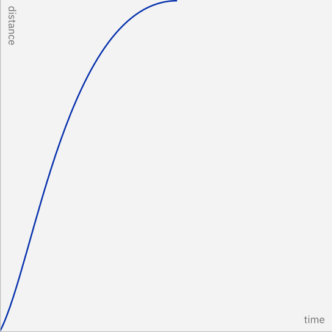
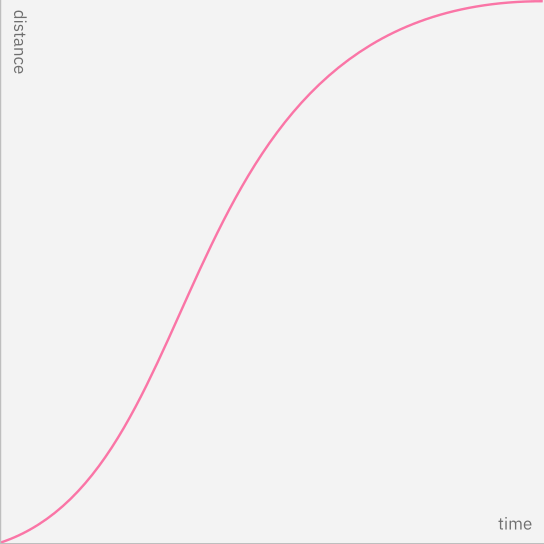

import KalturaVideo from 'components/KalturaVideo';

<PageDescription>

Motion can bring the screen to life, guide users through complex experiences,
and help move them forward—from here to there, now to next, start to finish—and
make progress.

</PageDescription>

<AnchorLinks>

<AnchorLink>Carbon in motion</AnchorLink>
<AnchorLink>Style</AnchorLink>
<AnchorLink>Easing</AnchorLink>
<AnchorLink>Duration</AnchorLink>
<AnchorLink>Implementation</AnchorLink>
<AnchorLink>Resources</AnchorLink>

</AnchorLinks>

<KalturaVideo videoid="1_8k5q64c3"></KalturaVideo>

## Carbon in motion

[Carbon components](../../components/overview/) have motion built in for
microinteractions. However, the motion design of the overarching UI — that is,
how the components interact with each other and enter and exit the page itself —
is up to each product team to implement. Use this guidance to customize,
combine, coordinate, and choreograph this aspect of motion in the UI.

## Style

Carbon recognizes different types of moments in users' experience and offers two
styles of motion—_productive_ motion, and _expressive_ motion. The motion curves
are designed to reflect the duality of man and machine.

Productivity and expression are both essential to an interface. Reserve
expressive motion for occasional, important moments, to better capture the
user’s attention and offer a rhythmic break to the productive experience.

<Row>
<Column colLg={12}>

<Tabs>
<Tab label="Curves">

<Row>

<Column colSm={6} colMd={4} colLg={6}>

 Productive 

</Column>
<Column colSm={6} colMd={4} colLg={6}>

Expressive

</Column>

</Row>

</Tab>

<Tab label="Abstract">

<KalturaVideo videoid="1_dxffexqh" hideCaption></KalturaVideo>

</Tab>

<Tab label="In-situ">

<KalturaVideo videoid="1_3o97rxc1" hideCaption></KalturaVideo>

</Tab>

</Tabs>

</Column>
</Row>

### Productive motion

Productive motion creates a sense of efficiency and responsiveness, while
remaining subtle and out of the way. Productive motion is appropriate for
moments when the user needs to focus on completing tasks. Microinteractions in
Carbon such as button states, dropdowns, revealing additional information, or
rendering data tables and visualizations were all designed with productive
motion.

### Expressive motion

Expressive motion delivers enthusiastic, vibrant, and highly visible movement.
Use expressive motion for significant moments such as opening a new page,
clicking the primary action button, or when the movement itself conveys a
meaning. System alerts and the appearance of notification boxes are great cases
for expressive motion.

<DoDontRow>
<DoDont type="do" colLg={12} colMd={8} fullWidth caption="Productive moments are labeled in blue, and expressive moments are labeled in magenta.">

<KalturaVideo videoid="1_rwyr3h76" hideCaption></KalturaVideo>

</DoDont>
</DoDontRow>

## Easing

Strictly linear movement appears unnatural to the human eye. Elements on the
screen should speed up quickly and slow down smoothly, obeying the physics of a
light-weight material. "Easing curves" describe the precise amount of
accelerations in motion. We commonly use one of these three types of easing.

<DoDontRow>
<DoDont type="do" colLg={12} colMd={8} fullWidth caption="Elements on the screen speed up quickly and slow down smoothly, obeying the physics of a light-weight material.">

<KalturaVideo videoid="1_m9uqrae1" hideCaption></KalturaVideo>

</DoDont>
</DoDontRow>

 

Avoid easing curves that are unnatural, distracting, or purely decorative. IBM
motion is essential and efficient, guiding users to value as quickly as
possible.

<DoDontRow>
<DoDont colLg={12} colMd={8} type="dont" fullWidth caption="Do not use easing curves that suggest bounce, stretch, or sudden stops.">

<KalturaVideo videoid="1_futf7n64" hideCaption></KalturaVideo>

</DoDont>
</DoDontRow>

### Standard easing

Use `standard-easing` when an element is visible from the beginning to the end
of a motion. Expanding tiles and the sorting of table rows are good examples.

<Tabs>
<Tab label="Curves">

<KalturaVideo videoid="1_5xp6hw4z" hideCaption></KalturaVideo>

</Tab>
<Tab label="Examples">

<KalturaVideo videoid="1_7avpv9lf" hideCaption></KalturaVideo>

</Tab>
</Tabs>

| Style      | IBM Motion package             | CSS                             | After Effects              |
| ---------- | ------------------------------ | ------------------------------- | -------------------------- |
| Productive | `motion(standard, productive)` | cubic-bezier(0.2, 0, 0.38, 0.9) | outgoing 20%, incoming 62% |
| Expressive | `motion(standard, expressive)` | cubic-bezier(0.4, 0.14, 0.3, 1) | outgoing 40%, incoming 70% |

### Entrance easing

With this style, an element quickly appears and slows down to a stop. Use
`entrance-ease` when adding elements to the view, such as a modal or toaster
appearing. Elements moving in response to the user's input, such as a dropdown
opening or toggle switching should also use this style.

<Tabs>
<Tab label="Curves">

<KalturaVideo videoid="1_cky58bmx" hideCaption></KalturaVideo>

</Tab>
<Tab label="Examples">

<KalturaVideo videoid="1_rc683pj2" hideCaption></KalturaVideo>

</Tab>
</Tabs>

| Style      | IBM Motion package             | CSS                           | After Effects             |
| ---------- | ------------------------------ | ----------------------------- | ------------------------- |
| Productive | `motion(entrance, productive)` | cubic-bezier(0, 0, 0.38, 0.9) | outgoing 0%, incoming 62% |
| Expressive | `motion(entrance, expressive)` | cubic-bezier(0, 0, 0.3, 1)    | outgoing 0%, incoming 70% |

### Exit easing

Use `exit-easing` when removing elements from view, such as closing a modal or
toaster. The element speeds up as it exits from view, implying that its
departure from the screen is permanent.

An exception to exits: if an element leaves the view but stays nearby, ready to
reappear upon user action, use standard easing instead. A good example of this
is a side panel. The panel leaves the view, but slows down as it exits, implying
that it would come to rest just outside the view, and ready to be recalled.

<Tabs>
<Tab label="Curves">

<KalturaVideo videoid="1_nncohnz0" hideCaption></KalturaVideo>

</Tab>
<Tab label="Examples">

<KalturaVideo videoid="1_4a4zfbi2" hideCaption></KalturaVideo>

</Tab>
</Tabs>

| Style      | IBM motion package         | CSS                           | After Effects             |
| ---------- | -------------------------- | ----------------------------- | ------------------------- |
| Productive | `motion(exit, productive)` | cubic-bezier(0.2, 0, 1, 0.9)  | outgoing 20%, incoming 0% |
| Expressive | `motion(exit, expressive)` | cubic-bezier(0.4, 0.14, 1, 1) | outgoing 40%, incoming 0% |

### Summary on easing

The
[IBM motion package](https://github.com/carbon-design-system/carbon/tree/main/packages/motion)
has the easing curves stored for fast access. This is the recommended method to
call an easing curve and stay connected to receive any future updates.

| Easing curve    | Productive                     | Expressive                     |
| --------------- | ------------------------------ | ------------------------------ |
| Standard easing | `motion(standard, productive)` | `motion(standard, expressive)` |
| Entrance easing | `motion(entrance, productive)` | `motion(entrance, expressive)` |
| Exit easing     | `motion(exit, productive)`     | `motion(exit, expressive)`     |

If you are unable to use the above method, cubic-bezier curve notation is the
standard way to express easing curves.

| Easing curve    | Productive                      | Expressive                      |
| --------------- | ------------------------------- | ------------------------------- |
| Standard easing | cubic-bezier(0.2, 0, 0.38, 0.9) | cubic-bezier(0.4, 0.14, 0.3, 1) |
| Entrance easing | cubic-bezier(0, 0, 0.38, 0.9)   | cubic-bezier(0, 0, 0.3, 1)      |
| Exit easing     | cubic-bezier(0.2, 0, 1, 0.9)    | cubic-bezier(0.4, 0.14, 1, 1)   |

## Duration

Duration is calculated based on the style and size of the motion. Among the two
motion styles, productive motion is significantly faster than expressive motion.
Motion’s duration should be dynamic based on the size of the animation; the
larger the change in distance (traveled) or size (scaling) of the element, the
longer the animation takes.

<DoDontRow>
<DoDont type="do" colLg={8} colMd={8} caption="Duration contrast between a taller and a shorter component.">

<KalturaVideo videoid="1_nmfn625x" hideCaption></KalturaVideo>

</DoDont>
</DoDontRow>

 

When custom duration is possible, please use the
[Motion Generator](https://ibm.github.io/motion/) to get the customized duration
calculated for your element. Carbon uses a non-linear duration scale to achieve
better perceived consistency across all distances.

<Row className="resource-card-group">
  <Column colMd={4} colLg={4} noGutterSm>
    <ResourceCard
      subTitle="Motion Generator"
      href="https://ibm.github.io/motion/"
    />
  </Column>
</Row>

 

### Duration tokens

Dynamic duration is an upcoming built-in feature for Carbon components and a
part of the motion package. Currently, there are six static value tokens for
easier implementation.

| Token                  | Usage                                                         | Value |     |
| ---------------------- | ------------------------------------------------------------- | ----- | --- |
| `duration-fast-01`     | Micro-interactions such as button and toggle                  | 70ms  |     |
| `duration-fast-02`     | Micro-interactions such as fade                               | 110ms |     |
| `duration-moderate-01` | Micro-interactions, small expansion, short distance movements | 150ms |     |
| `duration-moderate-02` | Expansion, system communication, toast                        | 240ms |     |
| `duration-slow-01`     | Large expansion, important system notifications               | 400ms |     |
| `duration-slow-02`     | Background dimming                                            | 700ms |     |

## Implementation

### Motion design strategy

Follow these steps to assess your interface for purposeful motion:

1. Define the goals and values of the product.
2. Establish information hierarchy within the view.
3. Identify the journey you will guide users through.
4. Identify key moments and opportunities for UI motion in the journey.
   Examples:
   - Give feedback, such as hover states and active state component behaviors
     like opening a dropdown menu
   - Solutions to a UX need, such as reducing cognitive load with progressive
     disclosure
   - Providing guidance, such as revealing a call to action to draw users’
     attention
5. Assign or determine either productive or expressive motion
6. Prototype and test

### Evaluation checklist

1. Is your motion purposeful?
   - What problem is motion solving?
   - Does it enhance the user's understanding of an action?
2. Is your motion responsive?
   - Do user actions receive immediate feedback that's seen and felt?
   - Do micro-interactions use `ease-out` on user input?
   - Do micro-interactions fall within a static duration ranging from 90–120 ms?
   - If there are large, or full screen, transitions in your product, are there
     continuous elements in your transition to guide the user?
3. Is your motion meticulous?
   - Did you use the appropriate easing curves?
   - Is each motion individually considered?
   - Do related movements have a unified relationship with each other?
   - Is the motion effective across all screen sizes? Keep in mind that on
     mobile screens, subtle motions may be easily missed.
4. Is your motion unobtrusive?
   - The best interface motion may go unnoticed, because it often keeps users
     engaged with their tasks. Is your motion frequently noticed by average
     users? If so, consider removing or minimizing it.

### Adaptive interface motion design

A large population of users exist with impaired vision or impaired ability to
perceive and handle motion in UI. In addition, not all devices are powerful
enough to smoothly perform all the motion you would like, no matter how
essential the motion design is. Always provide alternatives for interface state
transitions. Consider simplified or reduced motion designs for mobile and
tablet. Make sure there is always a way to communicate similar messages
statically.

## Resources

<Row className="resource-card-group">
  <Column colMd={4} colLg={4} noGutterSm>
    <ResourceCard
      subTitle="IBM Motion Generator"
      href="https://ibm.github.io/motion/"
    >

<MdxIcon name="bee" />

  </ResourceCard>
  </Column>
  <Column colMd={4} colLg={4} noGutterSm>
    <ResourceCard
      subTitle="Elements package: Motion"
      href="https://github.com/carbon-design-system/carbon/tree/main/packages/motion"
    >

<MdxIcon name="github" />

  </ResourceCard>
  </Column>
</Row>
