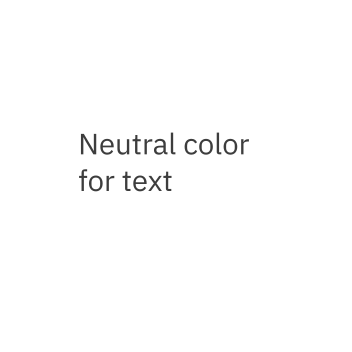
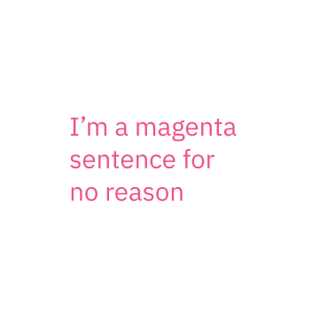
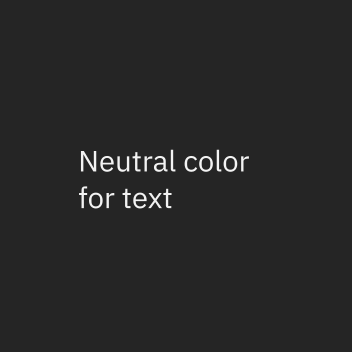
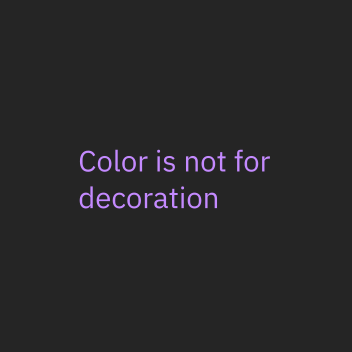
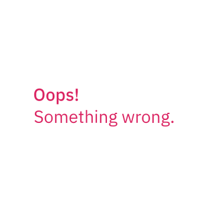
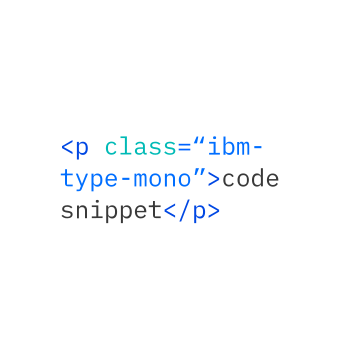

---
label:
  Our approach to the typographic system uses IBM Plex as its typeface. It has
  been carefully engineered with suitable scales, styles, and weights to help
  create clear hierarchies and organize information that guides users through
  IBM products or experiences.
title: Typography
description:
  Typography can help create clear hierarchies, organize information, and guide
  users through a product or experience.
tabs: ['Overview', 'Style strategies', 'Type sets', 'Code']
---

import TypeScaleTable from '../../../../src/components/TypeScaleTable';
import TypeWeight from '../../../../src/components/TypeWeight';

<PageDescription>

Our approach to the typographic system uses IBM Plex as its typeface. It has
been carefully engineered with suitable scales, styles, and weights to help
create clear hierarchies and organize information that guides users through IBM
products or experiences.

</PageDescription>

<AnchorLinks>

<AnchorLink>Type tokens and sets</AnchorLink>
<AnchorLink>Typeface: IBM Plex</AnchorLink>
<AnchorLink>Scale</AnchorLink>
<AnchorLink>Style</AnchorLink>
<AnchorLink>Type color</AnchorLink>
<AnchorLink>Resources</AnchorLink>

</AnchorLinks>

## Type tokens and sets

Carbon uses type tokens across two type sets to manage typography. Type tokens
are pre-set configurations of typographic elements such as font size, weight, or
leading (line height) that are specifically calibrated for use alongside
[IBM Plex](http://ibm.com/plex) in product. Selecting the appropriate type style
is determined by layout or template structure. Layouts may have several levels
of architecture or areas that require varying typographic hierarchies.

### Productive and expressive type sets

The productive type set is primarily used within product spaces, where users
benefit from a more condensed treatment of content to maintain focus on tasks.
The productive styles work together to support the hierarchy of information and
set user expectations. On the other hand, the larger expressive type styles
allow for a more dramatic, graphic use of type in editorial and marketing
design. These type styles are excellent for long form reading and scanning, but
would be distracting if used in product.

Within **Body styles** and **Utility styles**, the same set of styles are
offered. Productive styles are named with a suffix of `-01` and expressive style
names have a suffix of `-02`.

There are two heading sets and the major difference between them is in how they
are implemented in code. The productive type set uses fixed headings. Expressive
headings are responsive and the type styles change size at different
breakpoints.

For more detail, see [Style strategies](/elements/typography/style-strategies/)
and [Type sets](/elements/typography/type-sets/).

## Typeface: IBM Plex

Carbon uses the open-source typeface **IBM Plex**. It has been carefully
designed to meet IBM's needs as a global technology company and reflect IBM's
spirit, beliefs, and design principles. IBM Plex can be accessed and downloaded
from the [Plex GitHub Repo](https://github.com/ibm/plex).

<TypeWeight type="types" />

### Sans-serif font stack

```scss
font-family: 'IBM Plex Sans', 'Helvetica Neue', Arial, sans-serif;
```

### Serif font stack

```scss
font-family: 'IBM Plex Serif', 'Georgia', Times, serif;
```

### Mono font stack

```scss
font-family: 'IBM Plex Mono', 'Menlo', 'DejaVu Sans Mono',
  'Bitstream Vera Sans Mono', Courier, monospace;
```

## Scale

The IBM type scale is built on a single equation. The formula for our scale was
created to provide hierarchy for all types of experiences. The formula assumes
that y₀=12 px.

<br />

<TypeScaleTable />

```
Xn = Xn-1 + {INT[(n-2)/4] + 1} * 2
Xn: step n type size Xn-1: step n-1 type size
```

## Style

Typography creates purposeful texture, guiding users to read and understand the
hierarchy of information. The right typographic treatment and the controlled
usage of type styles helps manage the display of content, keeping it useful,
simple, and effective.

### Weights

Font weight is an important typographic variable that can add emphasis and
differentiate content hierarchy. Font weight and size pairings must be carefully
balanced. A bold weight will always have more emphasis than a lighter weight
font of the same size. However, a lighter weight font can rank hierarchically
higher than a bold font if the lighter weight type size is significantly larger
than the bold one.

We suggest using IBM Plex Light, Regular, and SemiBold for digital experiences.
The semibold weight is ideal for section headers, but should not be used for
long text.

<TypeWeight />

### Italic

Each weight has an italic style, which should only be used when you need to
emphasize certain words in a sentence (i.e., titles of works, technical terms,
names of devices, and captions).

<TypeWeight type="italic" />

## Type color

Type color should be carefully considered, with legibility and accessibility as
paramount concerns. Keep type color neutral in running text. Use primary blue
for primary actions.

<DoDontRow>
<DoDont type="do">



</DoDont>
<DoDont type="dont">



</DoDont>
</DoDontRow>

<DoDontRow>
<DoDont type="do" color="dark">



</DoDont>
<DoDont type="dont" color="dark">



</DoDont>
</DoDontRow>

<DoDontRow>
<DoDont type="do" caption="Core blue colors are used for text links and primary actions">


</DoDont>
<DoDont type="do" caption="Secondary actions use Gray 100 and icons">


</DoDont>
</DoDontRow>

<DoDontRow>
<DoDont type="do" caption="Other use cases for colored type are code snippets, warnings, alerts, etc.">



</DoDont>
<DoDont type="do">



</DoDont>
</DoDontRow>

## Resources

<Row className="resource-card-group">
<Column colMd={4} colLg={4} noGutterSm>
  <ResourceCard
    subTitle="Get the latest IBM Plex™ download on GitHub"
    href="https://github.com/ibm/plex/releases/latest"
    >

<MdxIcon name="github" />

  </ResourceCard>
</Column>
<Column colMd={4} colLg={4}  noGutterSm>
  <ResourceCard
    subTitle="Visit the IBM Plex™ website to learn more"
    href="https://www.ibm.com/plex/"
    >

  </ResourceCard>
</Column>
<Column colMd={4} colLg={4} noGutterSm>
  <ResourceCard
    subTitle="Elements package: Type"
    href="https://github.com/carbon-design-system/carbon/tree/main/packages/type"
    >

<MdxIcon name="github" />

  </ResourceCard>
</Column>
<Column colMd={4} colLg={4}  noGutterSm>
  <ResourceCard
    subTitle="Type package preview"
    href="https://github.com/carbon-design-system/carbon/tree/main/packages/type"
    >

<MdxIcon name="codesandbox" />

 </ResourceCard>
</Column>
</Row>
