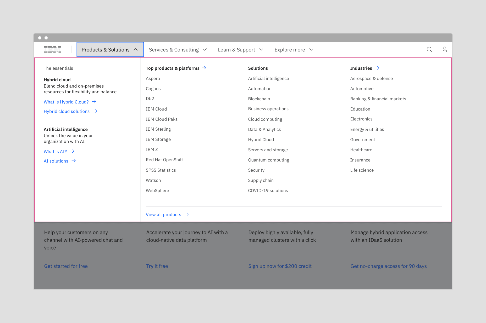
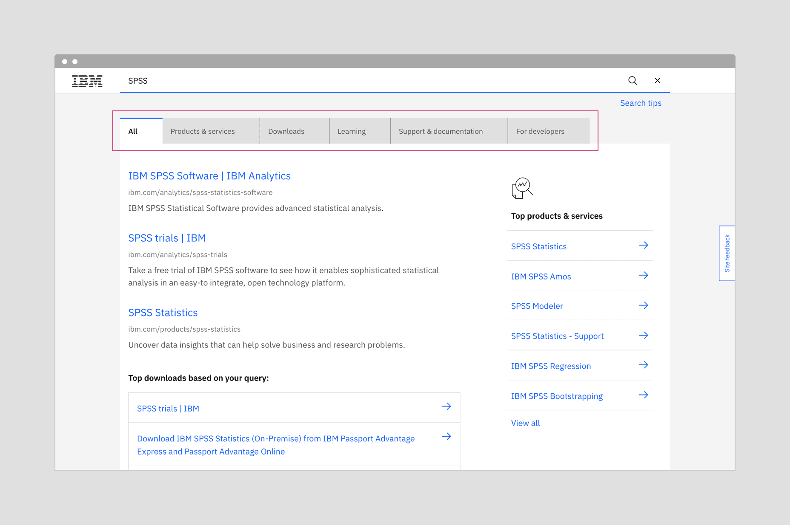
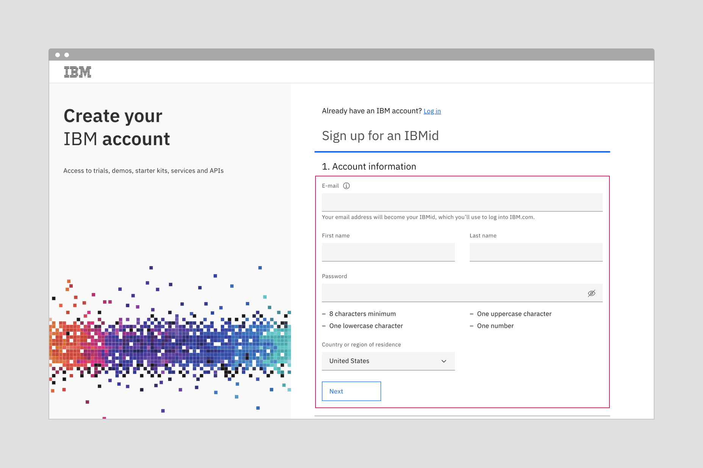
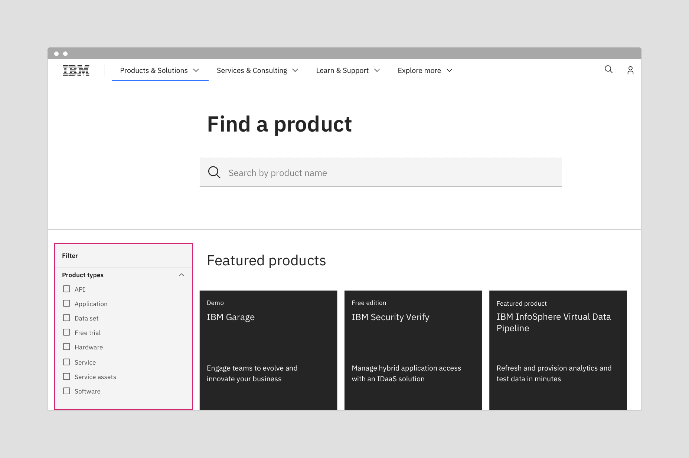
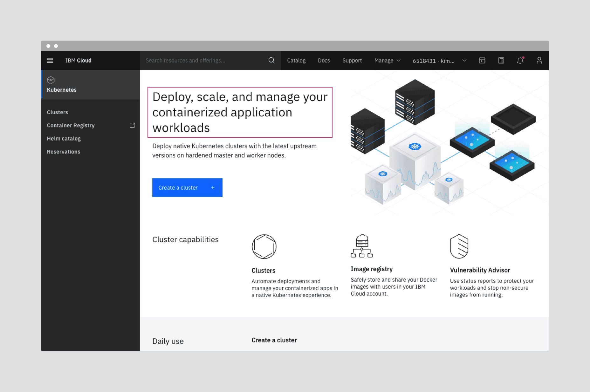

---
label:
  Carbon provides designers with two type sets that support productive and
  expressive experiences.
title: Typography
description:
  Carbon provides designers with two type sets that support productive and
  expressive experiences.
tabs: ['Overview', 'Style strategies', 'Type sets', 'Code']
---

<PageDescription>

Carbon provides two type sets that support both productive and expressive
moments. Primarily, productive was designed for product and expressive was
designed for web pages, but there are opportunities to blend contrasting moments
to provide clarity through hierarchy, and elevate the overall experience.

</PageDescription>

<AnchorLinks>

<AnchorLink>Overview</AnchorLink>
<AnchorLink>Productive use cases</AnchorLink>
<AnchorLink>Expressive use cases</AnchorLink>
<AnchorLink>Blending type sets</AnchorLink>
<AnchorLink>Guidelines</AnchorLink>
<AnchorLink>Getting help</AnchorLink>

</AnchorLinks>

## Overview

Within Carbon, there are two type sets available for use with productive and
expressive moments. The productive type styles were developed for product
design, and the expressive, more editorial type styles were developed for
IBM.com website pages.

The overarching rule has been to use the productive type styles for product
design and the expressive for editorial pages. For the most part, this is still
a good guideline to follow. However, there are situations where we can create
contrasting moments that better support the user's intention or task.

Let's look at the respective design rationales for each experience, and then see
where it makes sense to provide a blend.

## Productive use cases

Carbon Design System started as the design system for Cloud console and provides
typography that supports productive use cases.

#### When to use productive type styles

The key drivers for the use of productive type styles are:

- Users are focused on getting a specific job done.
- Interactions are more active, through inputs, forms, and controls.
- Users are embedded within the experience, often on one page, for awhile.
- Key performance indicators consider success in terms of time needed to
  complete a task and also the abandonment rate.

Given these considerations, space efficiency is key. Keeping content condensed
is helpful to support focus on complex tasks.

#### Styles for productive moments

To create productive moments, use the body styles and supporting styles with the
`01` suffix, as well as the fixed headings.

To ensure consistent line heights, use the following pairings:

- pair `body-compact-01` with the `heading-compact-01`
- pair `body-01` with the `heading-01`

Productive headings are fixed.

## Expressive use cases

Carbon for IBM.com is for the creators of IBM.com and it provides typography
that supports expressive use cases.

#### When to use expressive type styles

The key drivers for the use of expressive type styles are:

- Users are trying to learn and explore, and are primarily scanning and reading.
- Interactions are more passive through impactful imagery, layout, and long form
  reading.
- Users typically traverse a series of pages during one session.
- Key performance indicators consider success in terms of click-through rates
  and final purchases.

Given these considerations, larger type sizes and a more editorial approach
allows users to scan, read, and navigate multiple pages with comfort and ease.

#### Styles for expressive moments

To create expressive moments, use the body styles and supporting styles with the
`02` suffix. There are also two fixed headings, as well as fluid headings that
will adjust with different breakpoints.

For the fixed headings, ensure consistent line heights by using the following
pairings:

- pair `body-compact-02` with the `heading-compact-02`
- pair `body-02` with the `heading-02`

As well as these two fixed headings, there is a set of fluid headings that add a
series of scales and fluid behavior.

## Blending type sets

The spaces we are designing for are no longer neatly divided between productive
and expressive. Both product and web pages can be blended with what we call
"moments" if the alternative type set better supports the function.

Users working in product pages benefit from an expressive moment for easy
reading or a pause. In these cases, however the "moment" would span a full page
or banner where there are no containers.

If your users are working in a product but pausing to read or scan for options,
an expressive moment can facilitate easy reading and/or create a desired impact
or pause. In these cases, however the "moment" would span a full page or banner
where there are no containers.

If your users are on the website and reading, but then switch to a focused task
within the web experience, using productive styles within that component would
facilitate focus.

### Using productive moments within IBM.com pages

Here are some of the places the Dotcom team uses productive moments:

- The global masthead mega menu
- IBM.com search
- Commerce
- Product configuration
- Account creation
- Filter panel in catalogs

<Row>
<Column colLg={12}>

</Column>
</Row>

<Caption>
  The mega menu with the more compact productive type styles allows users to see
  the full range of offerings.
</Caption>

<Row>
<Column colLg={12}>

</Column>
</Row>
<Caption>Using productive type styles on tabs provides a distinction in scale. It creates a hierarchy that keeps focus on the results.</Caption>

<Row>
<Column colLg={12}>

</Column>
</Row>

<Caption>
  Account creation form with expressive type on the left, and productive type
  for the form interactions on the right. It shows how both type styles can work
  side by side.
</Caption>

<Row>
<Column colLg={12}>

</Column>
</Row>

<Caption>
  Juxtaposing productive type within an expressive page is a useful tactic for
  creating a setback or a hierarchy.
</Caption>

### Using expressive moments within product designs

The productive experience is all about keeping the user focused and able to
complete complex tasks, therefore the areas where expressive moments can be used
are less common. However, when the user is first entering the product, or moving
to another area of the product you may find opportunities.

For expressive moments, you are looking for areas where the page opens up and
the content is not restricted to a container, card, or data table. Home pages
and page headers or banners are two possibilities.

For more details about home pages, IBMers can reference the
[World overview page pattern](https://pages.github.ibm.com/ibmcloud/pal/patterns/world-overview-pages/usage/)
in the IBM Cloud library.

<Row>
<Column colLg={12}>

</Column>
</Row>

<Caption>
  A product home page provides an opportunity to create both visual interest,
  distinction, and hierarchy with a blend of expressive and productive type
  styles.
</Caption>

## Tips and techniques

#### Use a blend of the two sets to establish distinctions and create hierarchies

You can use the two type sets to provide contrast and hierarchy within two
areas. For example, the filter panel using productive type becomes less
prominent next to a list of results using expressive type styles. You can push
the functional elements into the background, while keeping the items of user
interest in the foreground.

#### Match and support user tasks

Within each type set, there are appropriately sized type styles for each user
task. Follow the use case definitions for expressive and productive moments to
determine when it's appropriate to use each type set.

_When users need to focus on a task_ and are interacting through inputs, forms,
and controls, use the productive type set.

_When users are learning and exploring,_ and interacting through impactful
imagery, layout, and long form reading, pull from the expressive type set.

#### Keep type styles consistent within a discrete task, component, or region

People unconsciously use type size as a signal of hierarchy, and each type set
has been designed with expectations about hierarchy in mind. Mixing type styles
within a component could jumble the hierarchy and create confusion.

## Questions?

_For IBMers only:_ If you have any questions about using either of these
experiences, reach out to the teams on Slack or sign up to share your work in a
review.

#### Carbon Design System

- Slack channel:
  [#carbon-design-system](https://ibm-studios.slack.com/messages/C0M053VPT/)
- [Meetups](https://www.carbondesignsystem.com/whats-happening/meetups/) with
  Carbon Design System

#### Carbon for IBM Dotcom

- Slack channel:
  [#carbon-for-ibm-dotcom](https://cognitive-app.slack.com/archives/C2PLX8GQ6)
- Office hours with Carbon for IBM.com. See our
  [Slack channel](https://cognitive-app.slack.com/archives/C2PLX8GQ6) for
  details.
