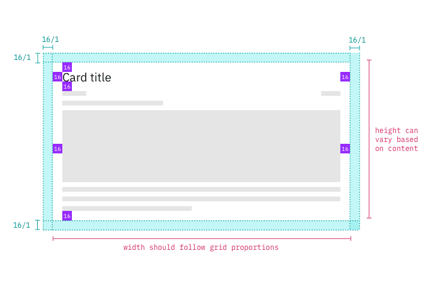
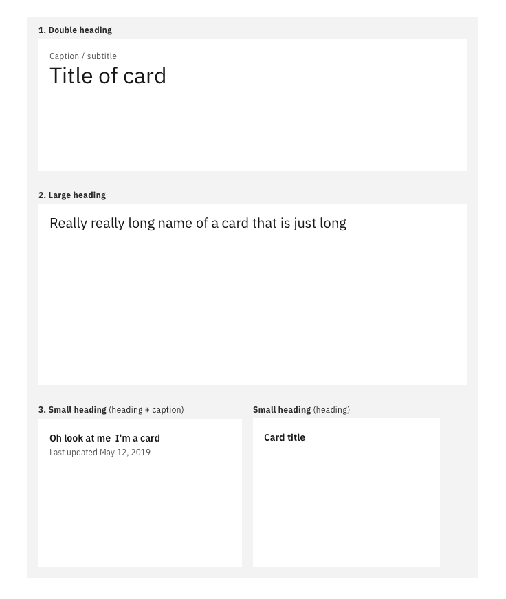
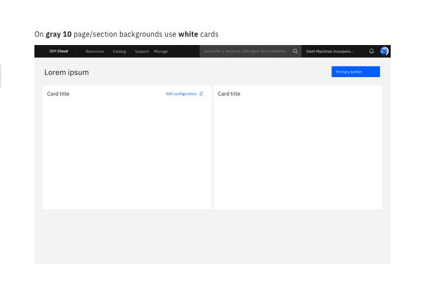

## Specs

Cards have `16px | 1 rem` margins all around, including dashboard widgets.

<Row>
  <Column colMd={8}>

  <Caption>Structure and spacing measurements for small side panels | px | rem.</Caption>
  </Column>
</Row>

## Typography

All card titles, captions and labels are set in sentence case. Set body text appropriately based on content.

<Row>
  <Column colMd={8}>

  <Caption>Structure and spacing measurements for small side panels | px | rem.</Caption>
  </Column>
</Row>

### Double heading

| Type               | Carbon token            | rem | px  |
| ------------------ | ----------------------- | --- | --- |
| Title              | `productive-heading-05` | 2   | 32  |
| Caption / subtitle | `label-01`              | 1   | 16  |

### Large heading

| Type  | Carbon token | rem  | px  |
| ----- | ------------ | ---- | --- |
| Title | `heading-03` | 1.25 | 20  |

### Small heading (heading and caption)

| Type               | Carbon token            | rem   | px  |
| ------------------ | ----------------------- | ----- | --- |
| Title              | `productive-heading-01` | 0.875 | 14  |
| Caption / subtitle | `label-01`              | 1     | 16  |

### Body

| Body text / Descriptions | Carbon token    | rem   | px  |
| ------------------------ | --------------- | ----- | --- |
| Cards with < 4 lines)    | `body-short-01` | 0.875 | 14  |
| Cards with > 4 lines)    | `body-long-01`  | 0.875 | 14  |

## Color

For general card usage, use a white card when the page background color is **gray 10**.

If you need to draw attention to a card with unique content such as a special offering on the catalog page, use a **gray 90** or gradient color background for the card. Please refrain from using marketing messages that may cause the user to percieve the card as an advertisement.

<Row>
  <Column colMd={8}>

  <Caption>On gray 10 page/section backgrounds use white cards.  
  On white page/section backgrounds or places where you want to draw attention use gray 90 cards.</Caption>
  </Column>
</Row>

## Buttons and links

Cards use floating default buttons (primary, secondary, ghost, etc.) Arrow icons can also be used in cards on overview pages.
