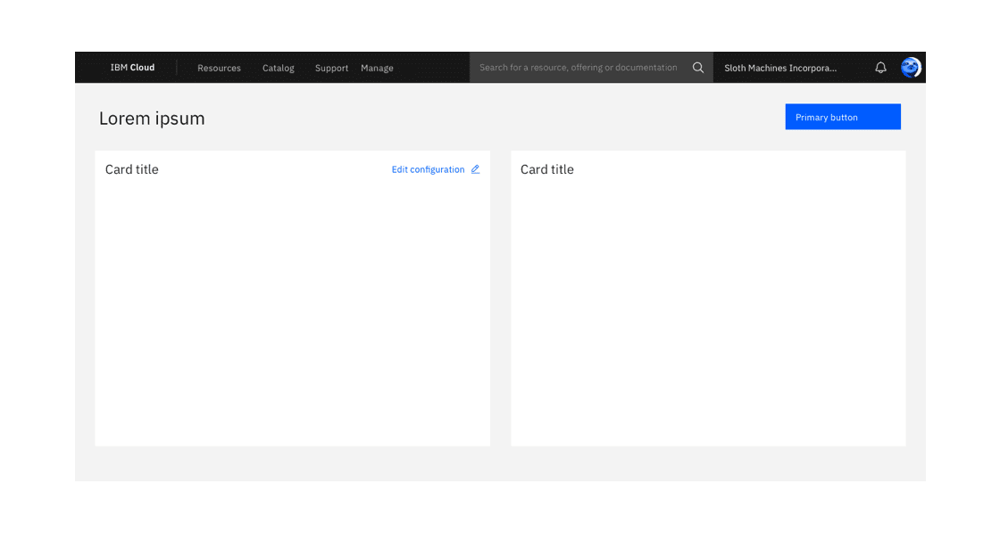
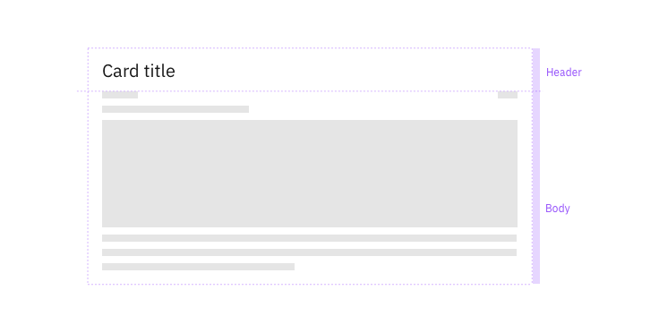
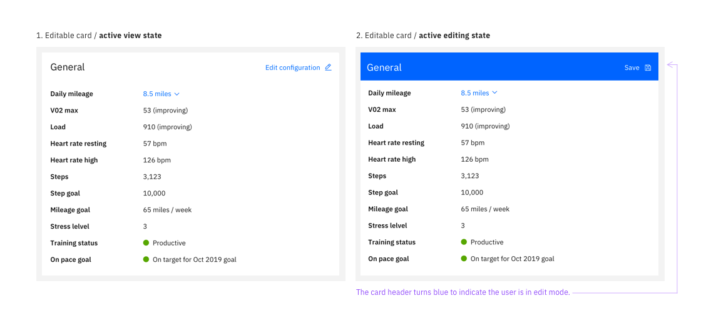
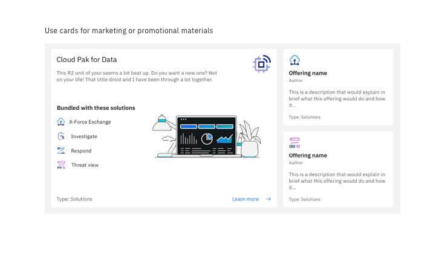
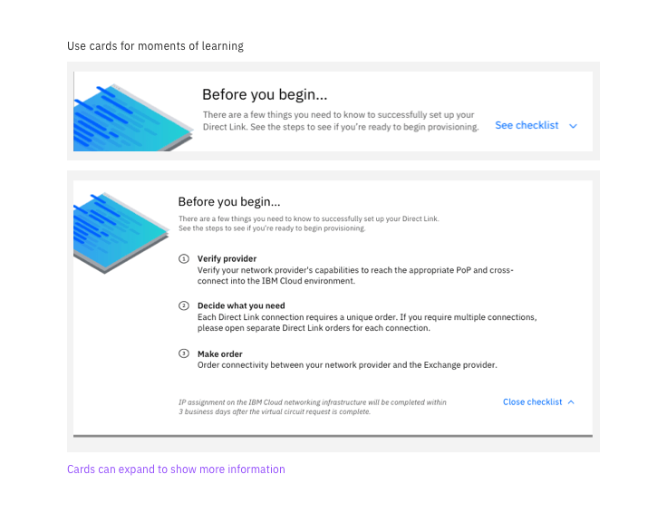
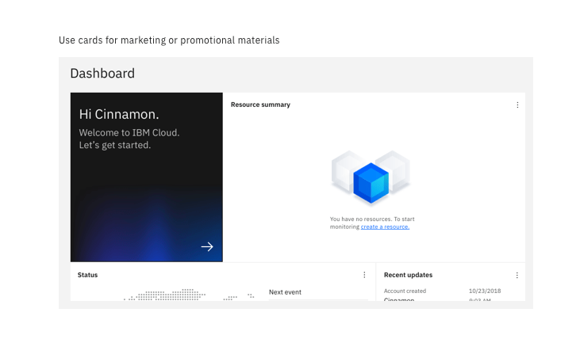

<PageDescription>

A card is a flexible container that groups related blocks of content and information into a single unit.

</PageDescription>

<AnchorLinks>
  <AnchorLink>General guidance</AnchorLink>
  <AnchorLink>Anatomy</AnchorLink>
  <AnchorLink>Variations</AnchorLink>
  <AnchorLink>Best practices</AnchorLink>
</AnchorLinks>

<Caption>Example of an empty card</Caption>

## General guidance

Cards display a snapshot of information intended to encourage users to interact with or click to view more details or actions. According to the [Nielsen Norman group](https://www.nngroup.com/articles/cards-component/), cards have four key properties:

1. Cards are used for grouping information and content.
1. Cards present a summary and link to additional details.
1. Cards resemble physical cards.
1. Cards allow for a flexible layout.

Editable cards group information that represents an object, object groupings, or a specific aspect of an object that the user can manage. Their primary purpose is for viewing and modifying content that is contained entirely in the card.

Content cards are intended for grouping and organizing related static content. Their primary purpose is for displaying a summary of information and do not contain an editable state.

## Anatomy

A card is composed of two distinct zones: the title and the body.

#### Title

The title of your card should mirror the content or summary in your card. You can also include an optional label, pictogram, or image above your header text. **Use sentence case for titles**.

#### Body

Depending on the type and size of card you use, aim to use minimal body content in your card. Remember, cards present a summary or snapshot of information. You can place other components inside the body of card such as structured lists, data visualizations, images, links, videos, buttons, etc. These components will occupy the full width of the card.

<Column colMd={8} noGutterSm>

</Column>

<Row>

  <Column colLg="4" colMd="4">

  <DoDontExample
  type="do"
  aspectRatio="2:2"
  color="light"
  text="Card titles can wrap up to 2 lines"
/>
</Column>

<Column colLg="4" colMd="4">

<DoDontExample
  type="dont"
  aspectRatio="2:2"
  color="light"
  text="Scrolling is not allowed in the body of a card."
/>

  </Column>

</Row>

## Variations

### Editable cards

Editable cards allow a user to view, modify, and save the content contained within the card. Use editable cards when a user needs to make changes to resources like configuration details or an account plan.

 
<Row>
  <Column colMd={8} noGutterSm>

| Types of editable cards |                                                                                                                                                         |
| ------------------------ | ------------------------------------------------------------------------------------------------------------------------------------------------------- |
| List views               | A structured list is used to show the details, attributes, or metadata of an object. A user can individually edit one line in the list or multiple. |
| Summary                  | Summary cards provide a brief overview of the state of an object (e.g. health status, speed, creation date, etc.) and can use multiple components.       |

 </Column>
</Row>

<Row>
<Column colMd={8}>

<Caption>Cards in a page layout</Caption>

</Column>
</Row>

Alert the user of any unsaved changes if they try to navigate to a different page while in the edit state.

### Content cards

Content cards group related information in a single location on the page. Content cards often include paragraphs and images or videos and accompanying text. These cards can be used in a variety of ways.

**1. Marketing, promotions, or introductions.** These are small cards used to show a product summary or functionality for the user to learn about and try. It can be used to promote other supplementary such as docs and FAQs.

<Row>
<Column colMd={8}>

<Caption>Example of cards used for marketing or promotional material for catalog offerings</Caption>
</Column>
</Row>

**2. Expandable on-boarding, learning material, or additional information.** Use cards to give a user a glimpse into a feature, or use them to preview a learning resource like best practices or other types of educational content.

<Row>
<Column colMd={8}>

<Caption>
  Example of a card used to educate a user on the next steps for provisioning
</Caption>

</Column>
</Row>

**3. Guide a user's first steps**

Content cards can invite the user to start a specific process such as getting started with a new offering, launching a starter kit, or deploying a resource.

<Row>
<Column colMd={8}>

<Caption>Use cards to help guide a user's first steps</Caption>

</Column>
</Row>

**4. Group blocks of related content**

Cards can be used to block groups of related content even if it doesn't fit into the above models.

## Best practices

#### Do

- Intentionally organize cards within the page layout by grouping related cards in sections
- Consider adding page filters if you have a large collection of cards (e.g. Catalog page)
- Use [structured lists](https://www.carbondesignsystem.com/components/structured-list/code) instead of tables
- Use editable cards to show areas of the page the user can edit

#### Don't

- Nest a card within another element such as a table
- Do not use editable cards for complex multi-step flows. Consider using a [side panel](https://pages.github.ibm.com/ibmcloud/cloud-ux-patterns/Views/SidePanel/usage/) instead.
- Do not use cards in modals
- Avoid using tables. Use a [structured list](https://www.carbondesignsystem.com/components/structured-list/code) instead.
- Avoid scrolling

### Contributors

- Austin Edwards
- Kathryn Gallagher
- Alexander Meyer
- Ceci Moralles
- JP Pollard
