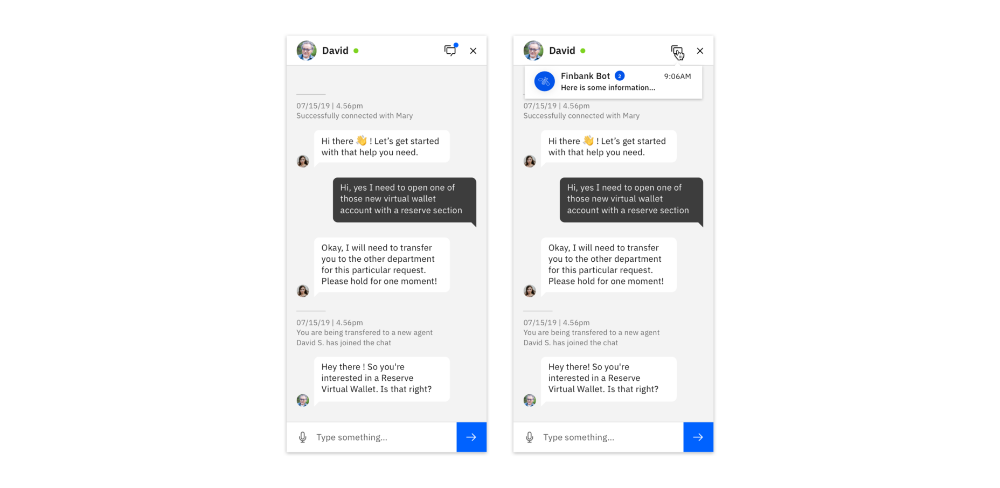

<AnchorLinks>

<AnchorLink>Launching a Bot</AnchorLink>
<AnchorLink>Multiple Threads</AnchorLink>
<AnchorLink>Expanding Cards</AnchorLink>
<AnchorLink>Error States</AnchorLink>

</AnchorLinks>

## Launching a Bot

Bots should be launched from a button positioned at the bottom right of the screen, or from a button embedded within the UI. See Carbon Chatbot Add-on Design Kit for the appropriate variants.

## Multiple Threads

This flow demonstrates connecting the user to a human agent when the bot cannot complete the request or the user would prefer interacting with a person.

### User Initiates Change

Sometimes, a user indicates that they would like to chat with a human. Other times, this process can be suggested if a bot is repeatedly unsuccessful in answering a user’s question.

### Notify the User

Use a toast notification bar to indicate when the user is in a new conversation context, or that a new user has joined the the chat. Call out any significant changes with in-conversation status messages.

### Multiple Users

Combining two or more human agents into the same thread is a common practice. Where necessary, call out significant changes in who the user is addressing (particularly if they have different purposes)

### Incoming Messages

For new messages appearing in another thread, be sure to use dots above the Threads icon to alert the user of new messages. Then, within the menu, indicate the amount of new messages on the specific thread. Visually distinguish threads with new messages.

## Expanding Cards

Where needed, use expanding cards to progressively disclose content. Use a full page view to show a very large amount of content to the user.

### Default State

Call out critical information in the default state. Provide a trigger to expand the card

### Expanded State

Provide more detailed information in the expanded state. Only if absolutely necessary, provide a way to access the full view of the content

### Full View

The full view is a generic container that can be used to display long-form content that would otherwise crowd a conversation thread.

## Error States (Experimental)

Be sure to indicate to a user when their message has not been sent due to a connectivity or server problem. When in a connected state, temporarily show the success notification, and then remove it along with any message error indicators.

