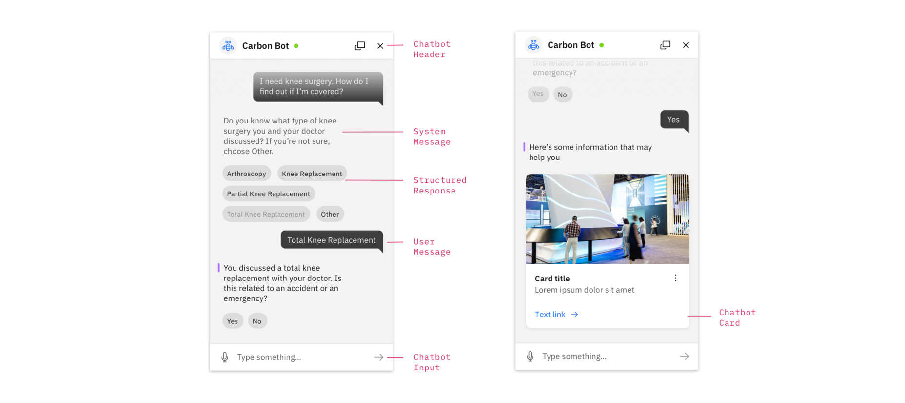

<AnchorLinks>

<AnchorLink>Anatomy</AnchorLink>
<AnchorLink>Launching a bot</AnchorLink>
<AnchorLink>Error notifications</AnchorLink>

</AnchorLinks>

## Anatomy

The following diagram outlines the primary components within the chatbot pattern.

### Chatbot elements

#### Chatbot header

The chatbot header contains the title of the chat and up to four action buttons that control the chatbot application. Typically, the “close” icon must always be included.

#### System message

System Messages represent what the bot has responded to the user with. Past messages will have a faded treatment, whereas active messages have an indicator applied (see below)

#### Structured response

Structured Responses present choices to the user that are easy for the bot to understand. When selected, a structured response will change its visual appearance and a user message will appear with the same content.

#### User message

A user message indicates what the user has input, via voice, text input, or structured response.

#### Chatbot input

The Chatbot Input is comprised of a text input field, a button for voice input (optional) and an submit button

## Launching a bot (Experimental)

Bots should be launched from a clear floating trigger at the bottom right of the screen, or from a button embedded within the UI. See Carbon Chatbot Add-on Design Kit for the appropriate variants.

## Error notifications (Experimental)

Be sure to indicate to a user when their message has not been sent due to a connectivity or server problem. When in a connected state, temporarily show the success notification, and then remove it along with any message error indicators.

