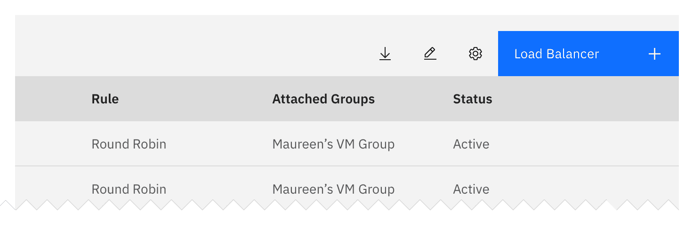

<PageDescription>

Common actions are user actions or system responses that appear in multiple place across different components and workflows on the platform. This includes the regressive actions (cancel, clear, delete, etc.) and progressive actions (create, add, edit, etc.).

</PageDescription>

<AnchorLinks>

<AnchorLink>Add</AnchorLink>
<AnchorLink>Remove</AnchorLink>
<AnchorLink>Error states</AnchorLink>
<AnchorLink>Delete</AnchorLink>
<AnchorLink>Create</AnchorLink>
<AnchorLink>Loading</AnchorLink>

</AnchorLinks>

## Add

Adding allows a user to include an existing object to a list, set, or system. Note that this action is different than create.

### Interaction Guidelines

#### Hierarchy and placement

Depending on the relevance of the add action on the page, the emphasis can be either, high, medium or low. For example, a high emphasis action should use a single prominent button that makes it clear that other buttons have less importance in the hierarchy.

#### Considerations

- What are the implications of the add action for the user (example: financial, access, legal).
- A user may not have the correct permissions for this action.
- This action can be confused with creating.
- Can this action be undone? (if not, inform the user prior).
- What timeframe will the action take (seconds, minutes, hours, days)?
- Errors: failure to add, etc.
- Is this a single or bulk action?

## Remove

This action removes an object from a list or item; however, the object is not destroyed as a result of the action. Multiple objects can be removed at once. Note this is different than the delete action.

#### Affected Components

Error, Loading

### Interaction Guidelines

#### Hierarchy and placement

The remove action will most likely not be the primary action on the page and should should not be overly emphasized.

#### Considerations

- What are the implications of the removing action for the user (example: financial, access, legal).
- This action can be confused with deleting.
- [Team question] Using an "X" icon can be confused with deleting, should it be used or not?
- A user may not have the correct permissions for this action.
- Can this action be undone? (if not, inform the user prior).
- What timeframe will the action take (seconds, minutes, hours, days)?
- Errors: failure to remove, etc.
- Is this a single or bulk action?

### Notifications

There are multiple types of notifications: inline, banners, status and toast. Toast notification can be used to display quick and/or short messages. Inline/Banner/Status notifications can be used to show up in task flows, or on top of a page to notify users of the status of an action. It’s also a good way to get the users attention when an action is needed.

<Row>
<Column colLg={8}>

</Column>
</Row>

#### Related Components

Forms, Platform Pages, Global Nav, Modals

### Content Guidelines

#### For Inline and Toast Notifications

State or status is most often used to indicate the current situation or condition, however in some case it may be appropriate to show a historical view.

It is recommended that indication should use a text label representative of the state / status and if applicable it should be accompanied with an associated icon.

#### Title

All notifications have subject titles, which should be short and descriptive. (Example: “Tester-app-02 has crashed.“)

#### Message:

We recommend the body of the notification be contained within two lines. Be descriptive and include any troubleshooting actions or next steps. When possible, communicate the main message using just the title. You can include links within the notification body that redirect the user to next steps.

#### Icons:

Icons may provide additional clarity. Icons should be placed to the left of a title. Stick to the glyphs (16x16) that can be found in our iconography library.

#### Dismissal:

We recommend that toast notifications automatically disappear after five seconds. Inline or banner notifications should persist until the user dismisses them. All notifications have at least one method of dismissal (typically, this is a small “x” in the upper right hand corner).

#### Navigation bar:

The navigation bar is used in situations where it is important for the user to be able to see the state / status at a high level - regardless of where they are in the product. This will likely be to give an overall indication. More detail would be available by selecting options within the navigation.

## Error States

Errors can be conveyed in full page error pages, form fields, notifications (toast, inline, etc.), and modals. Ultimately, all should provide context of 'what happened' and a clear path to continue - whether by redirecting to previous state, a support page, or by offering helpful recommendations. Our goal is to be honest and helpful.

#### Affected Components

#### Small Components

Some components are quite small and require more thoughtful approaches to the space and placement of error handling.

- Text input/form field errors
- Toast and in-line notifications

#### Large Components

Larger components give designers more liberty to explore what is needed to satisfy the size of the error handling.

- Full page errors
- Modal errors

### UX/Interaction Guidelines

Redirect links (modals & fullpage):

- 'go back'
- 'helpful places to start'
- 'refresh'
- 'support'
- 'home'
- etc.

### Copy Guidelines

Be brief, honest, supportive, and human.

Define: What happened and what can I (a user) do to resolve the error?

Length of copy:

- Fullpage and large modals: Maximum 3 paragraph lines
- Form error and notifications: Maximum 2 paragraph lines

### Visual Guidelines

To the tolerance of the component
(Dependent on copy)

Illustrations for fullpage or modals (Optional)

## Delete

(Need a definition here)

#### Affected Components

Buttons, Dropdowns, Overflow Lists, Tables, Cards/Tiles, Notifications

### Related Components

Create, Remove

### Existing Work

[Carbon](https://www.carbondesignsystem.com/patterns/common-actions/#delete)
[Cloud Integration](/experimental/delete)

### UX/Interaction Guidelines

See existing Carbon & Cloud Integration work around deletion dialogs. Here we have additional guidance on types on delete dialogs, and the overall deletion flow.

Deletions can be classified into three different groups based on the severity of the operation.

#### Deletion severity categories

##### Non-dangerous deletion (~5% of cases)

#### Use when

It's trivial to undo deletion or re-create the item.
You're only deleting one thing.

#### Guidance

Just delete the thing, without a dialog

#### Moderate danger deletion (~80% of cases)

#### Use when

An item cannot be undone or re-created easily.
You're only deleting one or more things.

#### Guidance

Ask for confirmation of the delete, with guidance on what will occur if they delete.

#### High danger deletion (~15% of cases)

**Use when**

- It could take a very large amount of effort to re-create an item.
- You're deleting one or more things.
- You're deleting something that contains other important items.
- You're deleting something that costs a considerable amount of money.

**Guidance**

In addition to presenting a dialog, have the user type the name of the resource they are deleting (manual confirmation).

**Example**

Deleting a Kubernetes cluster, because it contains many things, is expensive, and is often not reproducible (no file representation of a full running cluster.)

### Post dialog deletion flow

After the deletion command has been sent, the following process should occur.

First, if you are in a detail page, go back to the page that lists the item you are deleting.

**If the deletion will take less than 10 seconds on the backend to complete...**

1. If the item is visible, animate the row/item out of the list of items.
2. Post an inline notification at the top of the item list to acknowledge that the item was deleted.

[TBD - If an item occurs on a page other than the first page, do we switch the table widget to show that item, so we can show it being deleted?]

**If the deletion may take more than 10 seconds on the backend to complete... [TBD - align with loading state]**

1. If the item is visible, animate the row/item from its existing state to 'deletion pending' state (if it may be successfully aborted) or 'deletion in progress' state (if there's no going back.)
2. Post an inline notification at the top of the item list to acknowledge that the item is 'pending deletion'/'deletion in progress' (see loading state guidance for in progress).
3. When the deletion is actually complete, a toast notification appears (regardless of where you are in the platform).
4. If the item is visible, it animates away [exact animation TBD].

**If deletion fails**

1. Raise a notification to tell the user that deletion failed.
   - Ideally both an in-UI notification as well as a notification on another communication channel, like email.
2. Animate the item back on to the page, if it would be visible.

## Create

(Need a definition here)

#### Affected Components

Buttons, Tables, Cards/Tiles, Links, Headers

#### Related Components

Delete, Add

#### Existing Work

[Guidance from Cloud Integration](https://pages.github.ibm.com/ide-design-guidelines/ide-design-guidelines-v2/patterns/creating/usage)

### UX/Interaction Guidelines

#### Post-dialog creation flow

After the creation command has been sent, the following process should occur:

If you are in a detail page, go back to the page that lists the item you are creating.

**If the creation will take less than 10 seconds on the backend to complete...**

1. If the item is visible, animate the row/item out of the list of items.
2. Post an inline notification at the top of the item list to acknowledge that the item was created.

[TODO - Reference 'loading' guidance][tbd - if an item occurs on a page other than the first page, do we switch the table widget to show that item, so we can show it being deleted?]

**If the creation may take more than 10 seconds on the backend to complete... [TBD - align with loading state]**

1. If the item is visible, animate the row/item from its existing state to 'creation pending' state (if it may be successfully aborted) or 'creation in progress' state (if there's no going back.)
2. Post an inline notification at the top of the item list to acknowledge that the item is 'pending creation'/'creation in progress' (see loading state guidance for in progress).
   When the creation is actually complete, a toast notification appears (regardless of where you are in the platform).
3. If the item will be visible, it animates into place [exact animation TBD].

#### If creation fails

Raise a notification to tell the user that creation failed.
Ideally both an in-UI notification as well as a notification on another communication channel, like email.
Animate the 'in progress' item away from the page.

## Loading

Loading states inform users that data retrieval is underway. The waiting experience is a crucial design opportunity. Though what is occuring on the back-end may not be obvious, we can reassure the user that progress is happening.

#### Affected Components

Buttons, Data table, File uploader, Form, Modal, Dropdown, Tile

### Related Components

Notifications, Inline Loading, Progress indicator, Modal

### UX/Interaction Guidelines

Different reassurances are necessary for different wait times. A user will respond very differently to a wait time of 3 seconds versus a wait time of 45 seconds, and the loading state should reflect that. Select the loading state based on the max time a user might have to wait for the use case.

#### 0 to 1 second

For the user to stay oriented in the process, no feedback is necessary.

#### 1+ to 10 seconds

10 seconds is the average time a user stays focused on a task. For a full page load or list, use a skeleton loader. For a single item load or button, use loading spinners (big or small).

#### 10+ to 30 seconds

For wait times over 10 seconds, users need to know context, time expectations, and ideally complete other tasks within the platform while loading is in progress. Ideally, use a progress bar to indicate the status. Give text updates on the status of the load.

#### 30 sec to 1 min

For wait times over 30 seconds, users must have an option to cancel or “escape” the load. Use an optimistic loader - push users to the success state or the higher level overview and show a progress indicator or loading bar. Set expectations on how long it will take or how many steps are necessary to load. Open the load in a new tab if necessary to allow users to continue other tasks.

#### Over 1 min

Users cannot be expected to wait for longer than one minute. For wait times over a minute, a loading state should not be used. Push users to the higher level overview (depending on the use case) and use notifications to set expectations for wait times and send an external confirmation (for example, an email) when the load time is over.

### Content Guidelines

Keep any text brief. Set expectations. When possible, let users know where they are in the process. For example, in a progress indicator, show which step is currently being loaded if there are multiple steps. While setting wait time expectations, don’t make promises and don’t be too specific.

#### Special Use Cases: Bulk actions

See box uploader.
This common action can be used when there are multiple items being queued and processed.
Message Input
