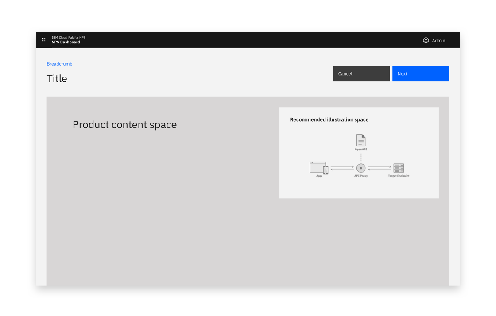
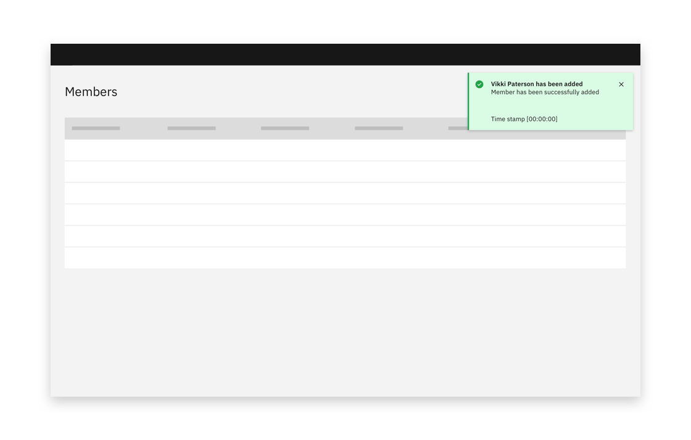

<PageDescription>

To create is to generate a new resource. Creating is distinct from adding, but the two are often confused. To add a resource is to include a resource that already exists.

</PageDescription>

#### Status:

[Experimental](/experimental/overview/)

#### Maintainer:

[Vikki Paterson](https://github.com/vikkipaterson)

#### Options:

<AnchorLinks>

  <AnchorLink>Standard creation</AnchorLink>
  <AnchorLink>Multistep creation</AnchorLink>
  <AnchorLink>Anatomy</AnchorLink>

</AnchorLinks>

<Caption>Example of a creation pattern.</Caption>

## Standard creation

Standard creation is used in simple creation tasks when no stepped guidance is needed and the input fields are directly related to each other.

### Modal

If there are only one or two options to be made during a creation, use a small, standard modal overlaying the content where the creation was initiated. Avoid scrolling inside a small modal.

<Row>
<Column colLg={8}>

<Caption>Example of a standard creation modal.</Caption>

</Column>
</Row>

### Side panel

Consider using a side panel to take advantage of the added screen real estate and keep the user in the context of where they are working. You may choose to use either the slide in or slide over panels.

<Row>
<Column colLg={8}>

<Caption>Example of a side panel creation flow</Caption>

</Column>
</Row>

### Full screen

If your creation flow consists of multiple fields and/or supporting imagery, consider the full screen option to take full advantage of the screen’s available real estate.

<Row>
<Column colLg={8}>

<Caption>Example of a full page creation flow.</Caption>

</Column>
</Row>

<Row>
<Column colLg={8}>

<Caption>Example of a full-page creation flow</Caption>

</Column>
</Row>

## Multistep creation

If the creation task is complex, consider whether breaking the process up into steps could help the user. Consider displaying related or dependant options together.

Multistep creation follows the same principles as [Standard creation](#standard-creation), with the addition of multisteps.

### Side panel

Consider using a side panel to take advantage of the added screen real estate and keep the user in the context of where they are working. You may choose to use either the slide in or slide over panels.

<Row>
<Column colLg={8}>

</Column>
</Row>

<Row>
<Column colLg={8}>

<Caption>Example of a side panel multi-step creation flow</Caption>

</Column>
</Row>

### Full-screen multistep

If your creation flow consists of multiple fields and/or supporting imagery, consider the full screen option to take full advantage of the screen’s available real estate.

<Row>
<Column colLg={8}>

<Caption>Start of multistep creation flow</Caption>

</Column>
</Row>

<Row>
<Column colLg={8}>

<Caption>Multistep creation flow with view all options toggle</Caption>

</Column>
</Row>

## Anatomy

### Button position

On a larger screen, buttons should always remain visible to the user.

Buttons should be located in the top right and should stick upon scrolling.

<Row>
<Column colLg={8}>

<Caption>Buttons should be located top right and stick upon scrolling.</Caption>

</Column>
</Row>

<Row>
<Column colLg={8}>

<Caption>Buttons should be located in the top right</Caption>

</Column>
</Row>

<Row>
<Column colLg={8}>

<Caption>Buttons should stick upon scrolling.</Caption>

</Column>
</Row>

When the full-screen dialog is viewed in mobile, the buttons are positioned at the bottom of the screen.

<Row>
<Column colLg={8}>

<Caption>Example of full-page option on mobile</Caption>

</Column>
</Row>

<Row>
<Column colMd={4} colLg={6}>
<DoDontExample type="do" caption="Buttons should stick upon scrolling so they are always visible.">

</DoDontExample>
</Column>
<Column colMd={4} colLg={6}>
<DoDontExample type="do" caption="If an illustration or image is displayed, buttons should be displayed above the image.">

</DoDontExample>
</Column>
</Row>

### Including an image or illustration

If including a supporting image or illustration, place the image on the right-hand side.

<Row>
<Column colLg={8}>

<Caption>Example of supporting image placement</Caption>

</Column>
</Row>

### Show all available options toggle

The toggle should be used to avoid overwhelming users, while still allowing users to access all options. It can be applied to the [side panel](#side-panel) and the [full screen](#full-screen) dialog.

Consider having a minimal set of options visible by default, offering the ability to chose if the user wants to expose more options.

If the user switches to this mode, remember this for when they next perform the same task.

<Row>
<Column colMd={4} colLg={6}>

<Caption>Show all options off</Caption>

</Column>

<Column colMd={4} colLg={6}>

<Caption>Show all options on.</Caption>

</Column>
</Row>

<Row>
<Column colLg={8}>

<Caption>Show all options off</Caption>

</Column>
</Row>

<Row>
<Column colLg={8}>

<Caption>Show all options on. </Caption>

</Column>
</Row>

<Row>
<Column colLg={8}>

<Caption>Show all options on and grouped. </Caption>

</Column>
</Row>

### Confirmation

A notification banner can be presented to visually confirm when any create action is a success.

<Row>
<Column colLg={8}>

<Caption>Example of a successful creation confirmation</Caption>

</Column>
</Row>
