<PageDescription>

To create is to generate a new resource. Creating is distinct from adding, but the two are often confused. To add a resource is to include a resource that already exists.

</PageDescription>

#### Status:

[Experimental](/experimental/overview/)

#### Maintainer:

[Vikki Paterson](https://github.com/vikkipaterson)

<AnchorLinks>

  <AnchorLink>Standard creation</AnchorLink>
  <AnchorLink>Multistep creation</AnchorLink>
  <AnchorLink>Confirmation</AnchorLink>

</AnchorLinks>

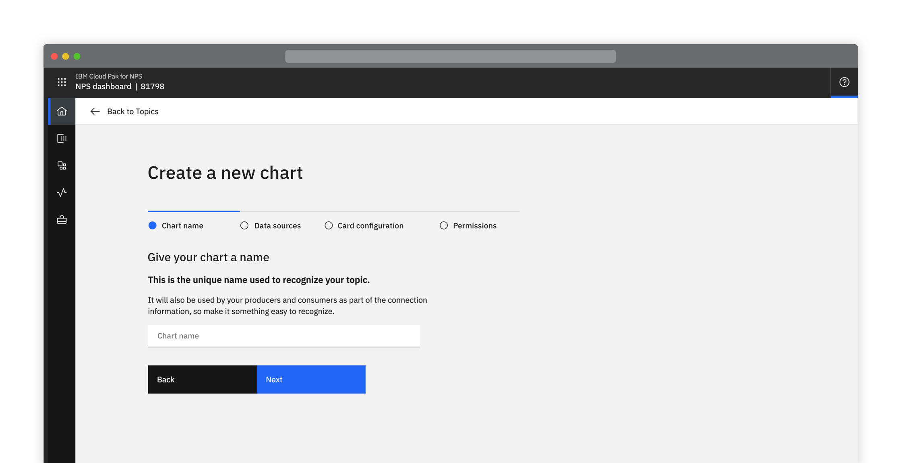

<Caption>Example of a creation pattern</Caption>

## Standard creation

Use the standard creation pattern when no stepped guidance is needed and the input fields are directly related to each other. This pattern applies to side panel, multistep, and full-page creation flows. You should also provide advanced options for the user.

### Modal

If there are only one or two decisions to be made during a creation, use a small, standard modal overlaying the content where the creation was initiated. Avoid scrolling inside a small modal.

<Row>
<Column colLg={8}>

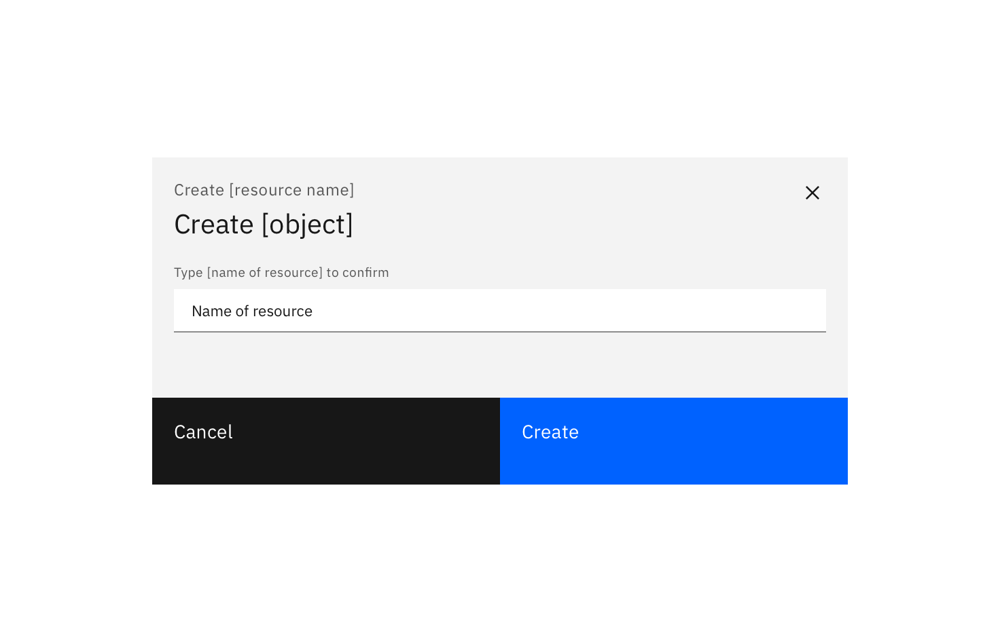

<Caption>Example of a standard creation modal</Caption>

</Column>
</Row>

### Side panel

If you have limited screen real estate, consider using a side panel. Side panels keep the user aware of the context in which they are working. You may choose to use either slide in or slide over panels.

<Row>
<Column colLg={8}>

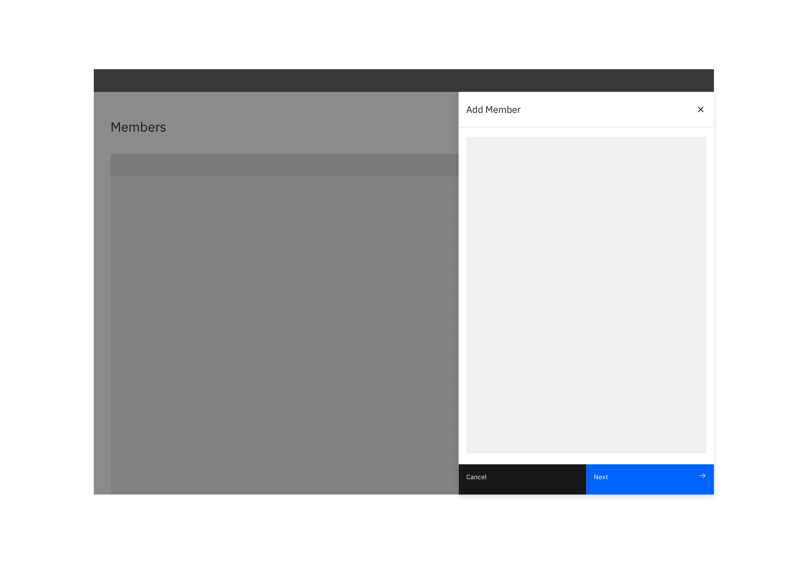

<Caption>Example of a side panel creation flow</Caption>

</Column>
</Row>

### Full page

If your creation flow consists of multiple fields and/or supporting imagery, consider the full-page option. Full-page creation flows allow you to take advantage of maximum screen real estate.

<Row>
<Column colLg={8}>

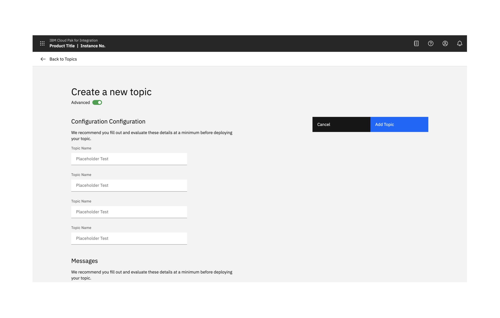

</Column>
</Row>

<Row>
<Column colLg={8}>

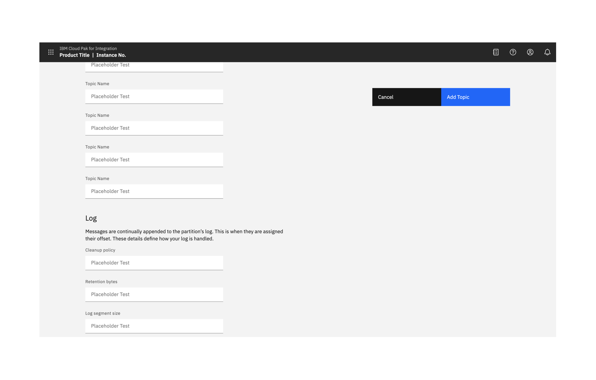

<Caption>Example of a full-page creation flow</Caption>

</Column>
</Row>

## Multistep creation

If the creation task is complex, consider breaking the process up into multiple steps. Display related or dependent options together.

Multistep creation follows the same principles as standard creation but the creation takes place through several steps. This flow can take place in a side panel or can use the full display.

### Side panel multistep

<Row>
<Column colLg={8}>

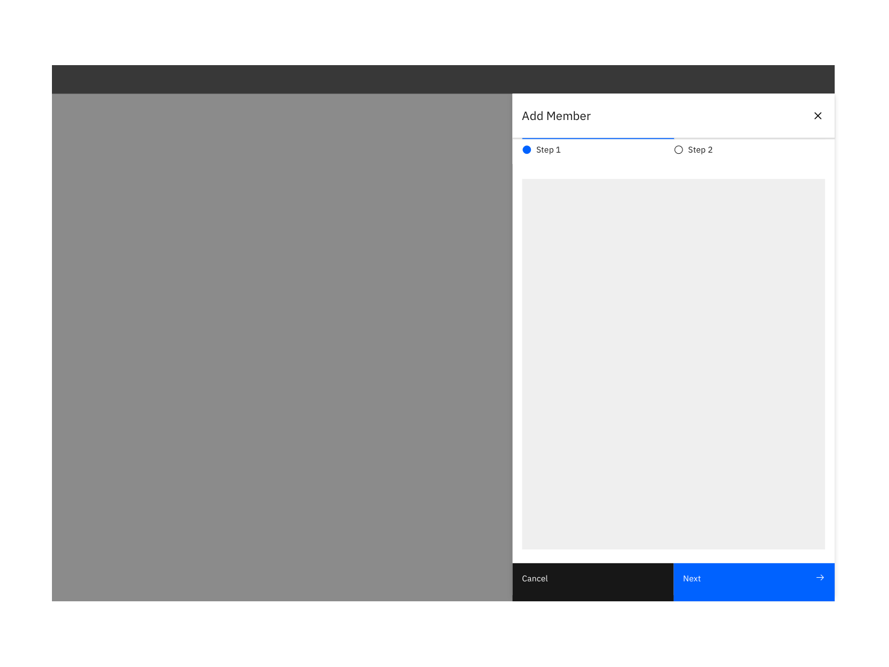

</Column>
</Row>

<Row>
<Column colLg={8}>

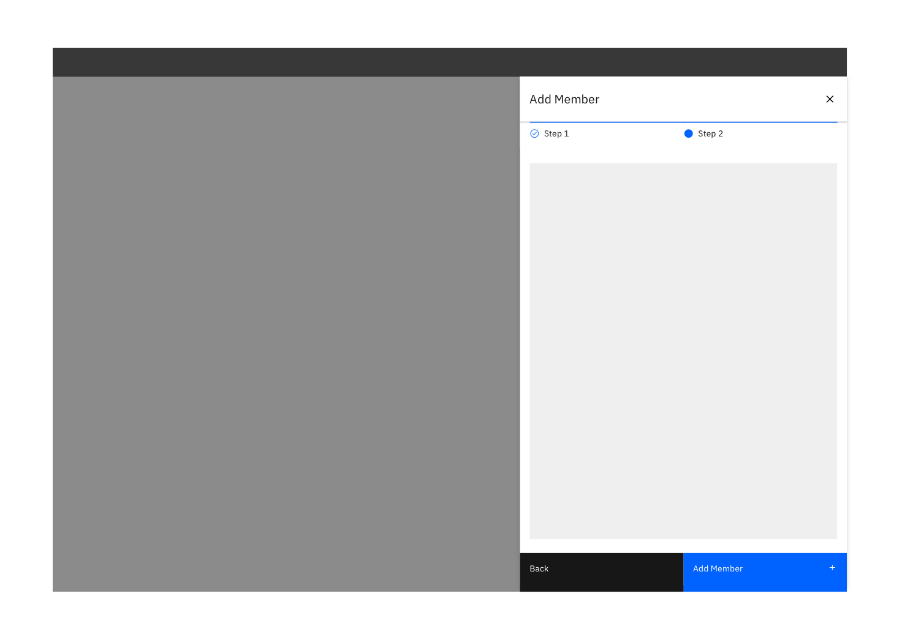

<Caption>Example of a side panel multi-step creation flow</Caption>

</Column>
</Row>

### Full page multistep

<Row>
<Column colLg={8}>

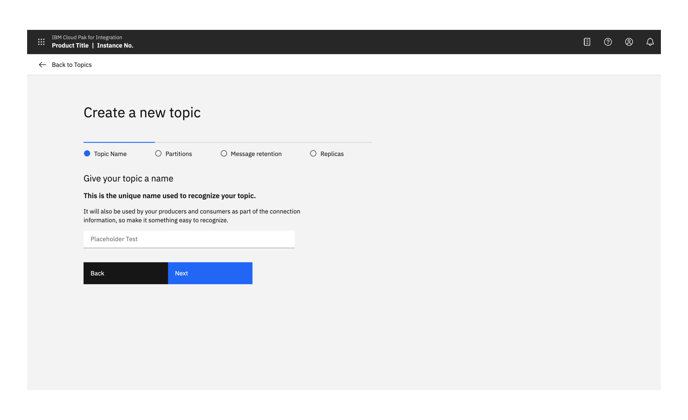

</Column>
</Row>

<Row>
<Column colLg={8}>

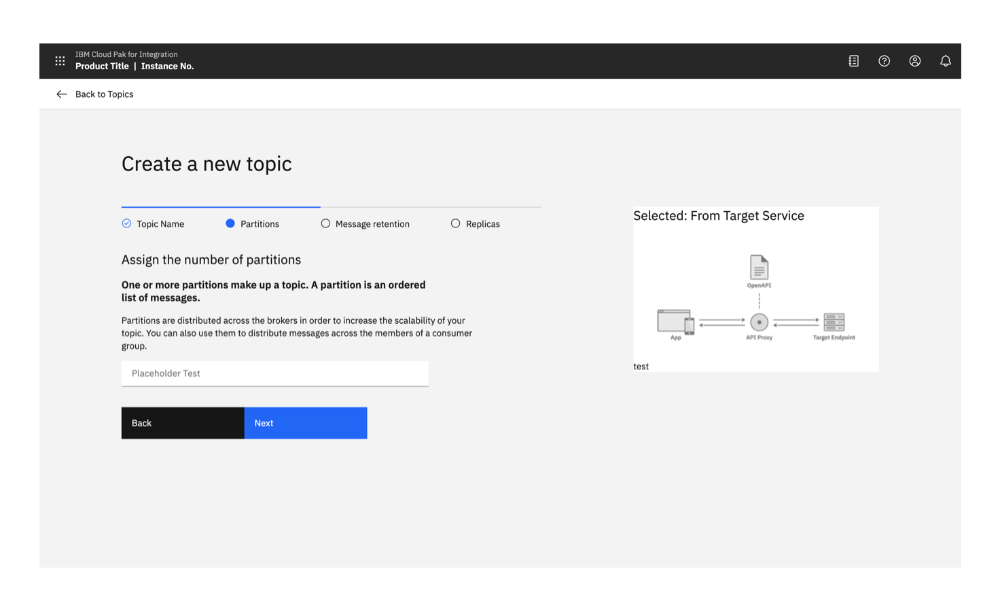

</Column>
</Row>

<Row>
<Column colLg={8}>

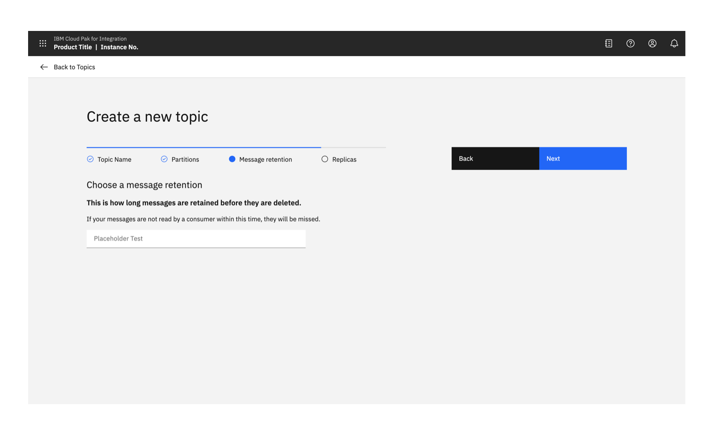

<Caption>Multistep creation flow with image</Caption>

</Column>
</Row>

### Full page

<Caption>Multistep creation flow with image</Caption>

<Caption>Multistep creation flow with image</Caption>

<Caption>Multistep creation flow with image.</Caption>

### Confirmation

When any create action is a success, a notification banner can be presented to visually confirm this.

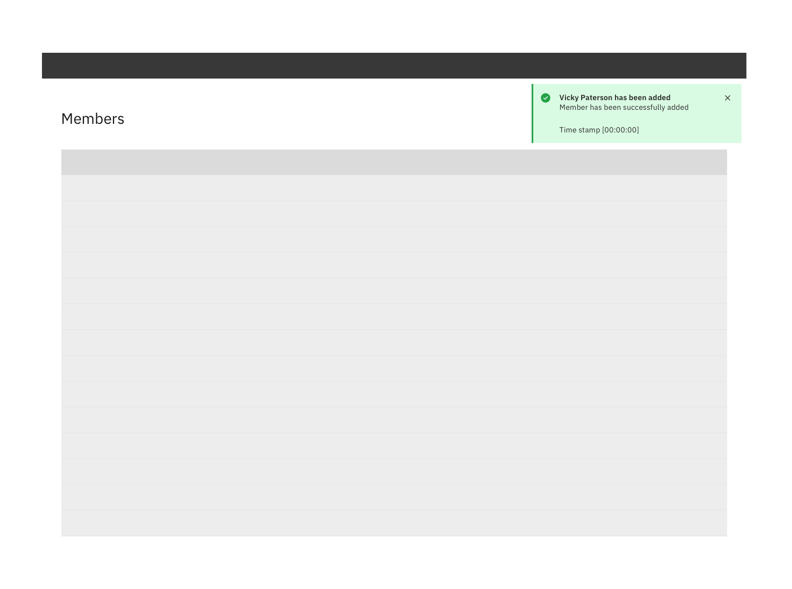

<Caption>Example of a successful creation confirmation.</Caption>

## Anatomy

### Button position

When the full-page dialog is viewed in mobile, the buttons are positioned at the bottom of the screen.

<Row>
<Column colLg={8}>

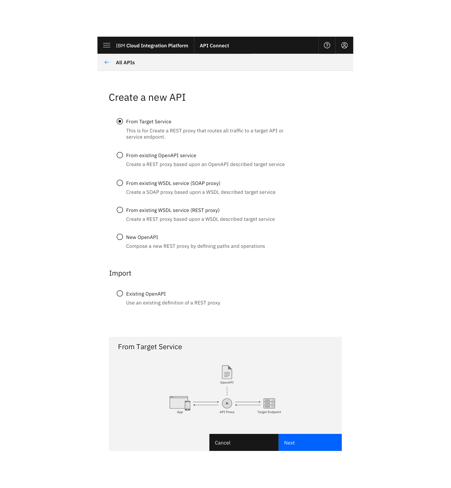

<Caption>Example of full-page option on mobile</Caption>

</Column>
</Row>

On a larger screen, buttons should always remain visible to the user.

If a display is likely to extend beyond the visible display, buttons should remain visible and should stick upon scrolling. If only a few buttons are present, they can be placed on the left below the last field.

<Row>
<Column colMd={4} colLg={6}>
<DoDontExample caption="Buttons should not be hidden off-screen.">

</DoDontExample>
</Column>
<Column colMd={4} colLg={6}>
<DoDontExample type="do" caption="Buttons are located on the left if they are likely to be visible when the page loads.">

</DoDontExample>
</Column>
</Row>

<Row>
<Column colMd={4} colLg={6}>
<DoDontExample type="do" caption="Buttons located on the right should stick upon scrolling so they are always visible.">

</DoDontExample>
</Column>
<Column colMd={4} colLg={6}>
<DoDontExample type="do" caption="If an illustration or image is displayed on the right then buttons should be displayed above the image.">

</DoDontExample>
</Column>
</Row>

#### Including an image

To include a supporting image, place it on the right-hand side of the window.

<Row>
<Column colLg={8}>

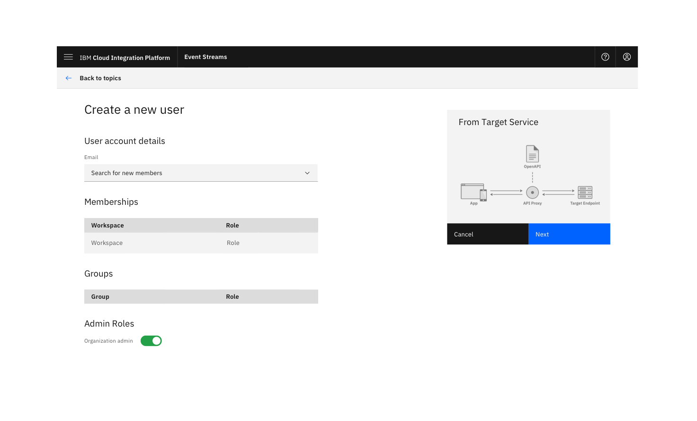

<Caption>Example of supporting image placement</Caption>

</Column>
</Row>

### Advanced option

Have a minimal set of options visible by default and give a user the option to expose more advanced options. If the user switches to advanced mode, remember this next time they perform the same task.

The advanced option allows advanced users to access all options without overwhelming typical users. It can be applied to the side panel and the full-page dialog.

<Row>
<Column colLg={8}>

<Caption>Example of advanced option</Caption>

</Column>
</Row>

### Confirmation

When any creation is successful, a notification banner should be presented to visually confirm the action.

<Row>
<Column colLg={8}>

<Caption>Example of a successful creation confirmation</Caption>

</Column>
</Row>
