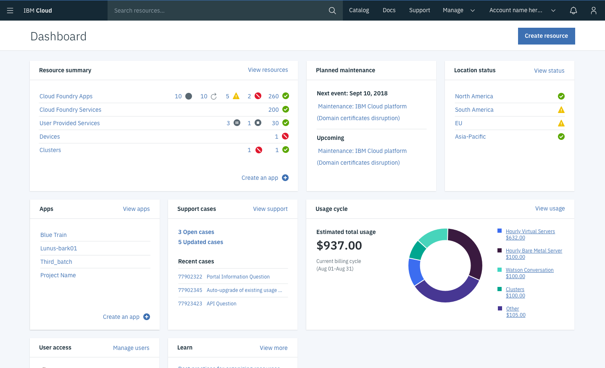
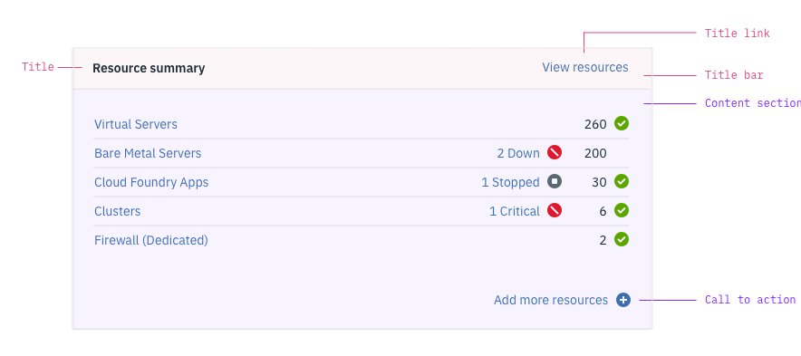
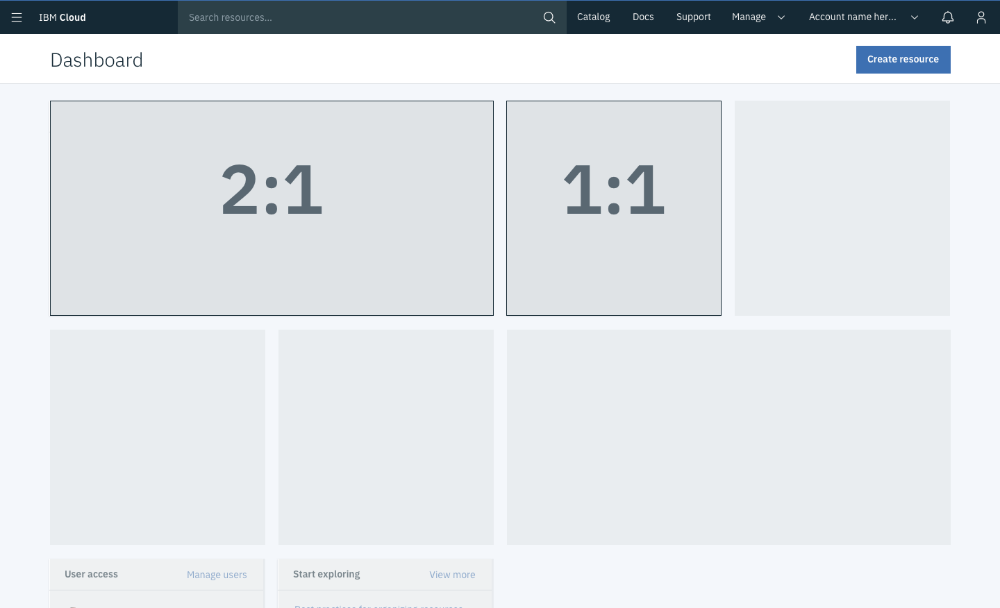

<PageDescription>

A dashboard widget offers a summary of a platform's functionality, status, or individual service. Widgets provide actionable information that helps the user quickly accomplish a task or track key metrics.

</PageDescription>

#### Status:

[Experimental](/experimental/overview)

#### Maintainer:

[Adriana Morales](https://www.github.com/adrianamorales)

<Caption>Example of a dashboard using widgets</Caption>

## Anatomy

Each widget has a title bar and a content section. The title bar is standard for all widgets, but the content section varies depending on the type of widget.

#### Title

The tile identifies the widget. Max characters: 23 (including spaces)

#### Title link

A title link directs users to a more complete view of the information summarized in the widget. The link's content should be as specific as possible (e.g., "View resources" instead of "View all"). Max characters: 15

#### Call-to-action

A call-to-action offers the user a quick action in the widget. The call-to action is optional and can incorporate a plus icon if appropriate. Max characters: 23

## Variations

Dashboard widgets have two possible sizes, small and large. The height for both sizes is fixed (310px) and neither widget is resizable.

| Variation type     | Purpose                                                                   |
| ------------------ | ------------------------------------------------------------------------- |
| Small widget (1:1) | Standard widget type                                                      |
| Large widget (2:1) | Typicall used to show data visualization                                  |
| Core widget        | Displayed on the dashboard by default and displays platform functionality |
| Service widget     | Must be actively added to the dashboard by the user                       |

<Caption>Comparison between small and large widgets</Caption>

### Core widget

Core widgets are displayed on the dashboard by default. They typically display platform functionality, such as maintenance events and support cases.

### Service widget

Service widgets must be added to the dashboard by a user. Users can add service widgets through a "Customize dashboard" menu.
