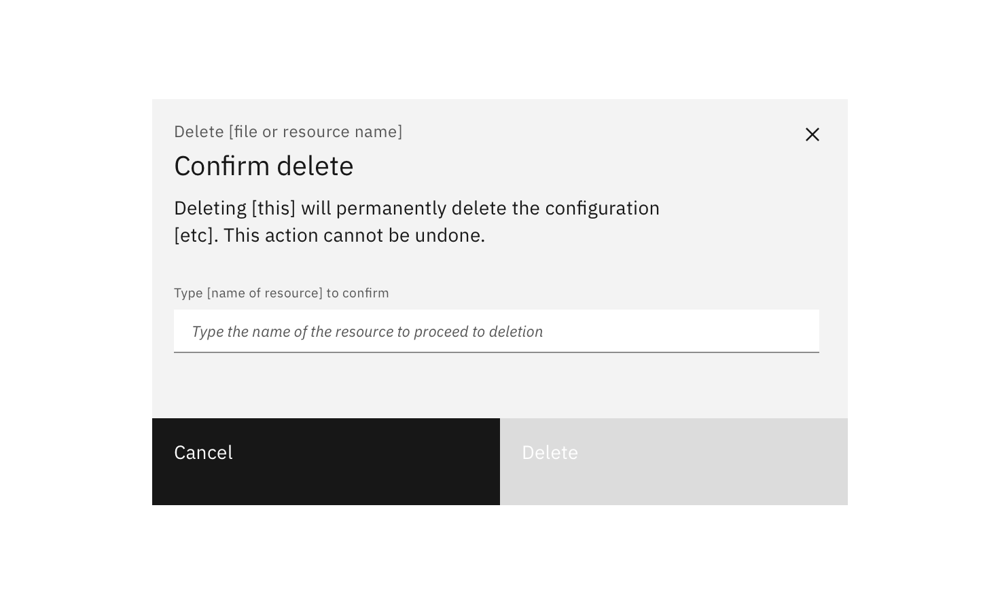
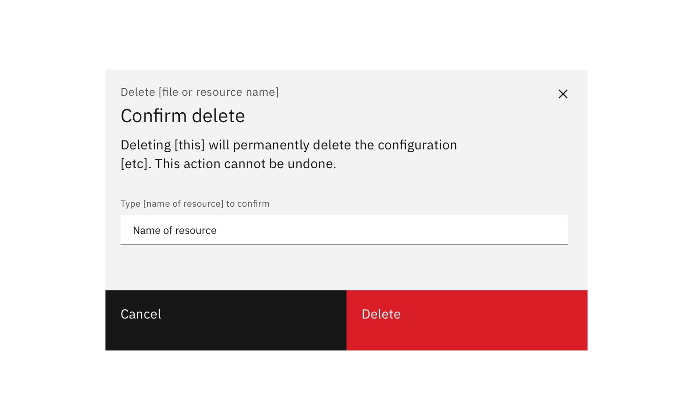
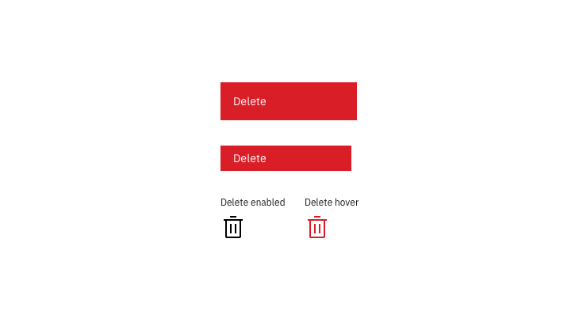
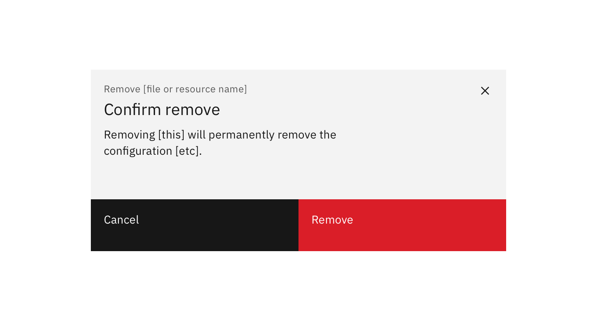
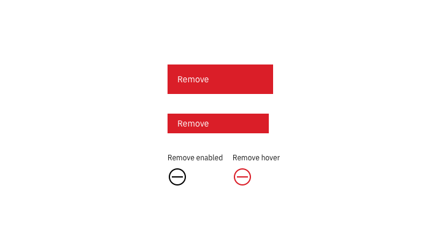
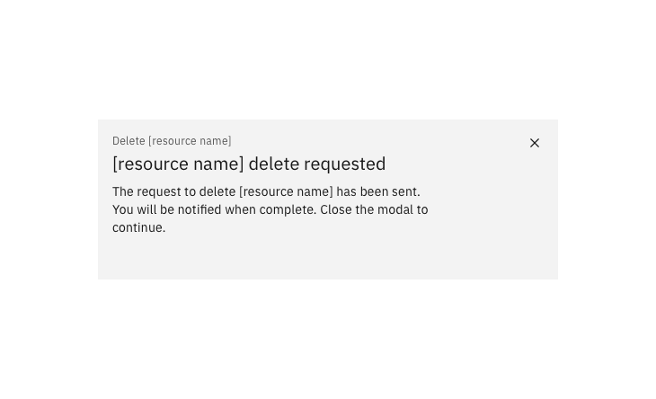
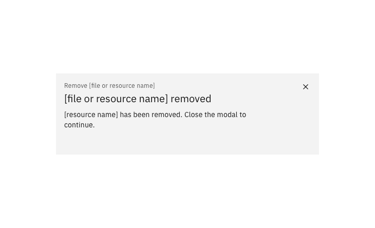
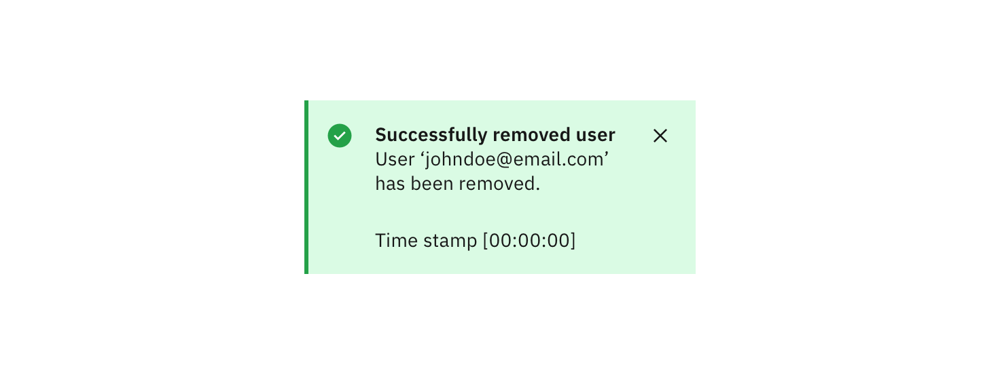
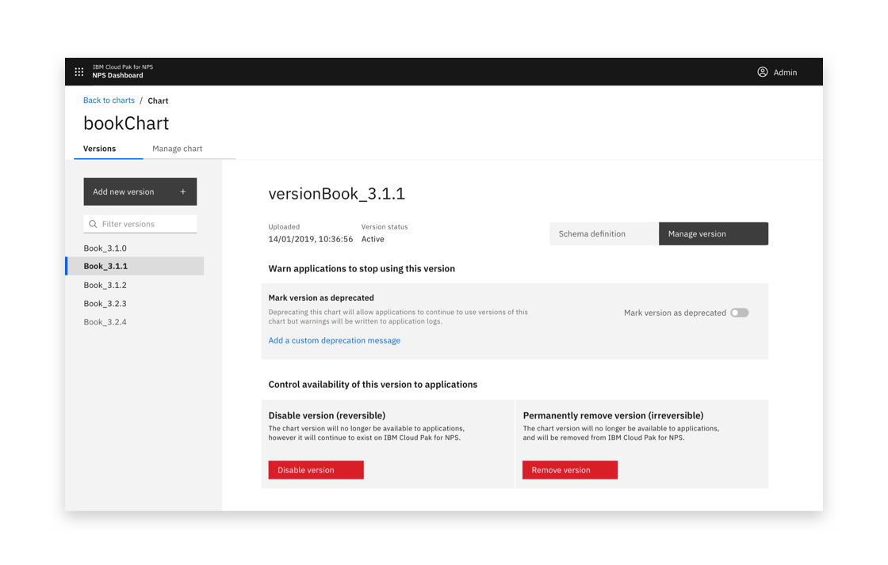
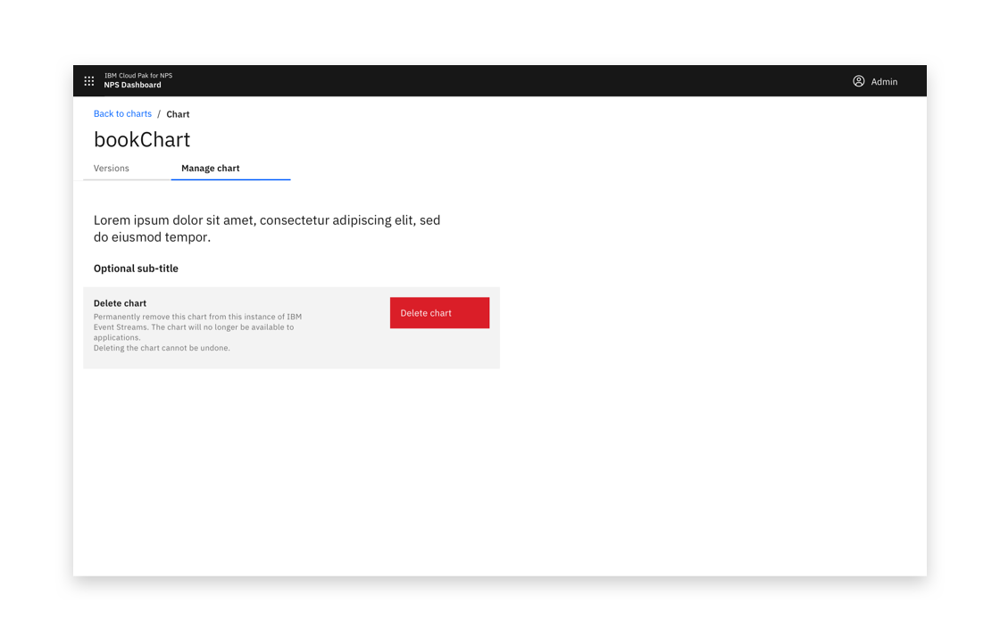

---

title: Delete / Remove pattern

---

### _Deleting_ is a destructive action. To protect user resources, your product should support ‘undo’ where possible. If ‘undo’ support is impossible, request user confirmation before deleting a resource or asset.

### _Removal_ is a non-destructive action. A user can remove an asset from a list or item without destroying it.

#### Status:

[Experimental](/experimental/overview)

#### Maintainers:

[Vikki Paterson](https://github.com/vikkipaterson)

<AnchorLinks>

<AnchorLink>Delete High impact</AnchorLink>
<AnchorLink>Delete Medium impact</AnchorLink>
<AnchorLink>Delete Low impact</AnchorLink>
<AnchorLink>Remove Medium impact</AnchorLink>
<AnchorLink>Remove Low impact</AnchorLink>
<AnchorLink>Anatomy</AnchorLink>

</AnchorLinks>

### Delete / Remove variations

| Action | Variation       | Description                                                                                                               |
| ------ | --------------- | ------------------------------------------------------------------------------------------------------------------------- |
| Delete | _High impact_   | Action can't be reversed and causes significant loss. The user types the resource name into the modal to confim deletion. |
|        | _Medium impact_ | Action can't be reversed and causes some loss. The user sees a modal and confirms the consequence of deletion.            |
|        | _Low impact_    | Action is reversible or very low impact. A confirmation modal may not be required.                                        |
| Remove | _Medium impact_ | Action can't be reversed and causes some loss. The user sees a modal and confirms the consequence of removal.             |
|        | _Low impact_    | Action is reversible or very low impact. A confirmation modal may not be required.                                        |

## Delete High impact

A high-impact deletion cannot be reversed. The action would result in a significant loss for a user if done accidentally.

When deleting is medium-impact, a confirmation dialog should be presented to the user which displays:

- The name of the resource
- Consequences of the deletion
- "This action cannot be undone."

For high-impact scenarios, a user should confirm the action by manually entering the name of the resource. The 'Delete' button is enabled when the text entered perfectly matches the resource name.

A [Done modal](#done-modal), [Requested modal](#requested-modal) or [Notification](#notification) can be used to confirm the action.

<Row>
<Column colLg={8}>

<Caption>
  {' '}
  The user needs to enter the resource name in order to confirm deletion.
</Caption>

<Caption>
  {' '}
  When the resource name is entered the Delete button is enabled.
</Caption>

</Column>
</Row>

## Delete Medium impact

A medium-impact deletion is one that cannot be reversed, but would not be catastrophic if done accidentally. When deleting is medium-impact, a confirmation dialog should be presented to the user which displays:

- The name of the resource
- Consequences of the deletion
- "The action cannot be undone."

A [Done modal](#done-modal), [Requested modal](#requested-modal) or [Notification](#notification) can be used to confirm the action.

<Row>
<Column colLg={8}>

<Caption>An example of a standard delete modal</Caption>

</Column>
</Row>

## Delete Low impact

Requiring the user to confirm deletion is generally recommended. However, in very low impact situations, such as when an ‘undo’ option is available, user confirmation may not be required.

<Row>
<Column colLg={8}>

<Caption> Low impact delete options</Caption>
</Column>
</Row>

## Remove Medium impact

Removing has a medium impact when the action can't be reversed, but would not be catastrophic if done accidentally.

Text should tell the user the consequences of the removal and that the action cannot be undone.

<Row>
<Column colLg={8}>

<Caption>
  {' '}
  Removal modals should include consequences of removal, and "This action cannot
  be undone" statement.
</Caption>

</Column>
</Row>

## Remove Low impact

As removing does not destroy an asset, typically user confirmation is not required.

<Row>
<Column colLg={8}>

<Caption> Example low impact remove options</Caption>

</Column>
</Row>

## Anatomy

### Success modal

In high or medium impact flows, an optional final dialog can be used to signify success at the end of a remove or delete action.

<Row>
<Column colLg={8}>

<Caption> Use a success modal to show that deleting is complete.</Caption>

<Caption> Use a success modal to show that removing is complete.</Caption>

</Column>
</Row>

### Notification

Use an optional notification to confirm a delete or remove action is completed. This is useful when the action takes more than a few moments.

<Row>
<Column colLg={8}>

<Caption>
  {' '}
  An optional notification can be used to confirm the delete or remove action
  with medium or high impact actions.
</Caption>

</Column>
</Row>

### Requested modal

Some deletion or removal actions don't happen immediately. When this is the case, you can use the optional requested modal.

<Row>
<Column colLg={8}>

<Caption>
  {' '}
  An optional extra Deletion requested or Removal requested modal can be added
  to medium or high impact workflows.
</Caption>

</Column>
</Row>

### Positioning

Delete actions for sensitive items can be placed in a Manage view.

<Row>
<Column colLg={8}>

<Caption>An example of the location of a remove action</Caption>

<Caption>An example of the location of a delete action</Caption>

</Column>
</Row>
