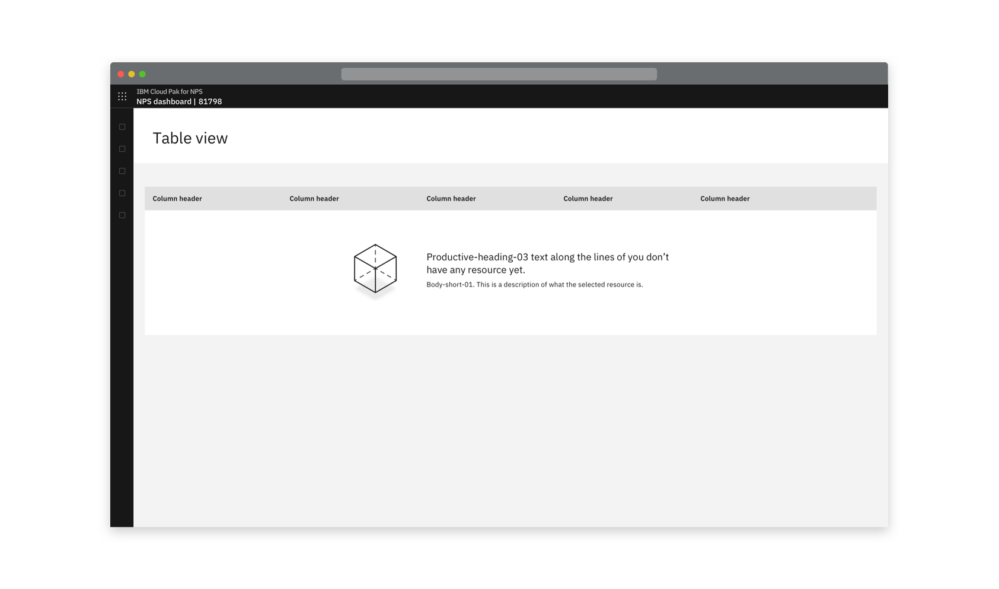
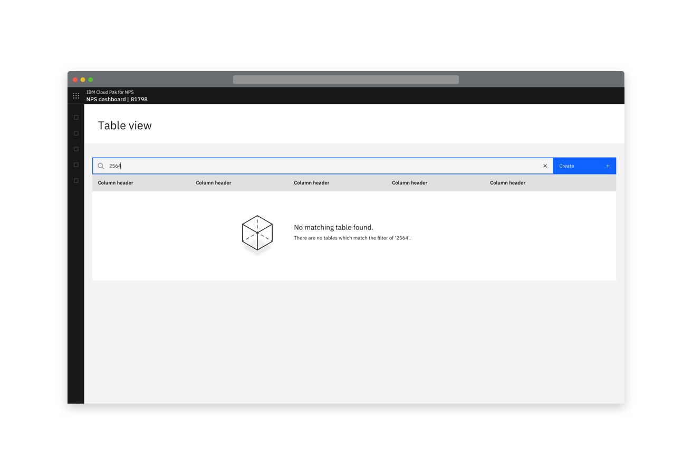
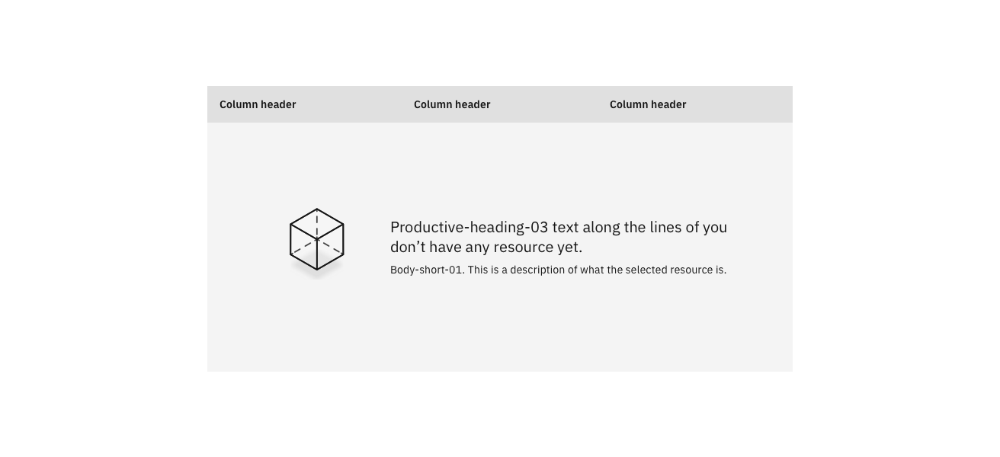
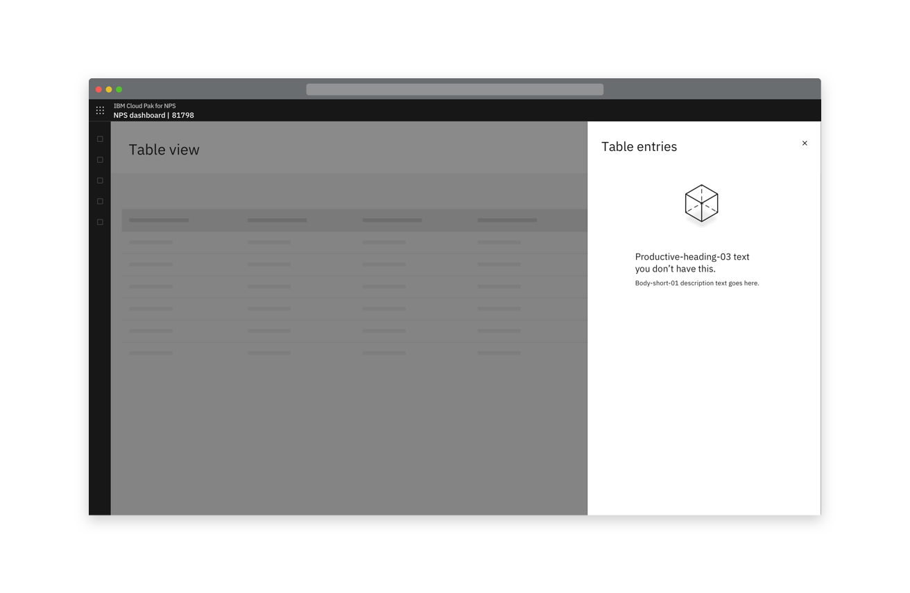

<PageDescription>

_Empty states_ have several uses. A common use is where something is yet to be populated e.g. a table. Another common use is when a search or filter yields no results.

</PageDescription>

#### Status:

[Experimental](/experimental/overview/)

#### Maintainer:

[Vikki Paterson](https://github.com/vikkipaterson), [Chloe Poulter](https://github.com/chloepoulterdesign)

## Empty state consists of

- An illustration that is relevant to the context, the product or generic
- Headline text that explains why the state is empty
- A description of the resource contained there

It is not recommended to include the primary CTA in the empty state, to prevent the CTA location changing as users learn the system. The CTA is in its usual position.

<Row>
 <Column colLg={8}>

<Caption>Example of empty state when a search yields no results.</Caption>

 </Column>
</Row>
<Row>
 <Column colLg={8}>

<Caption>
  Example of empty state when a table has not been populated yet
</Caption>

 </Column>
</Row>
<Row>
 <Column colLg={8}>

<Caption>
  Example of an empty state when a slide-over panel hasn't been populated yet
</Caption>

 </Column>
</Row>
