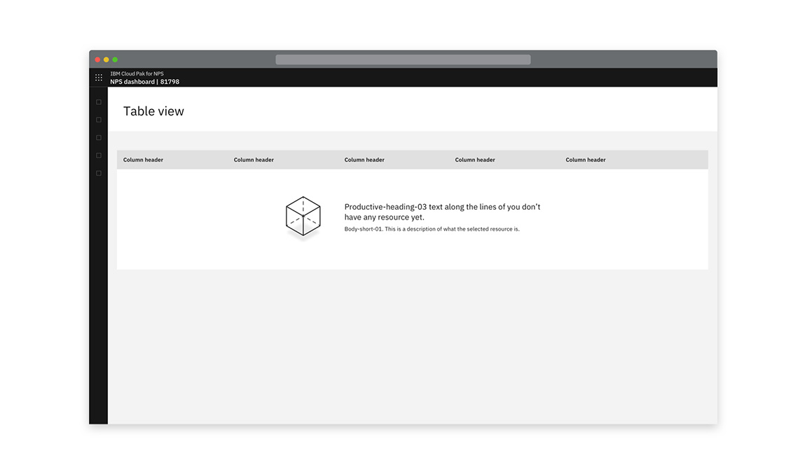
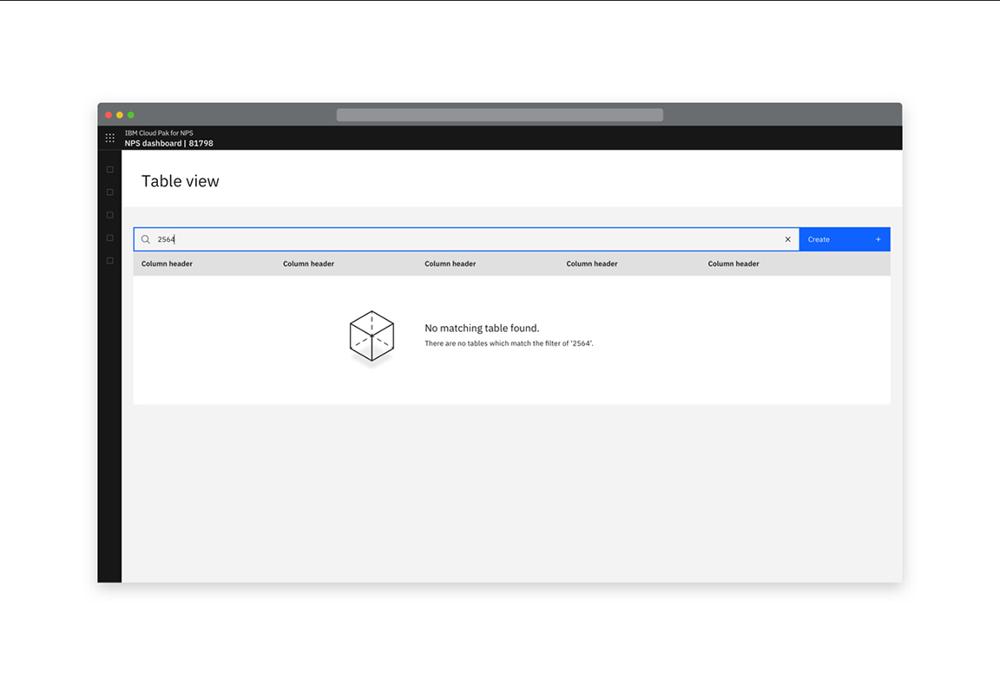
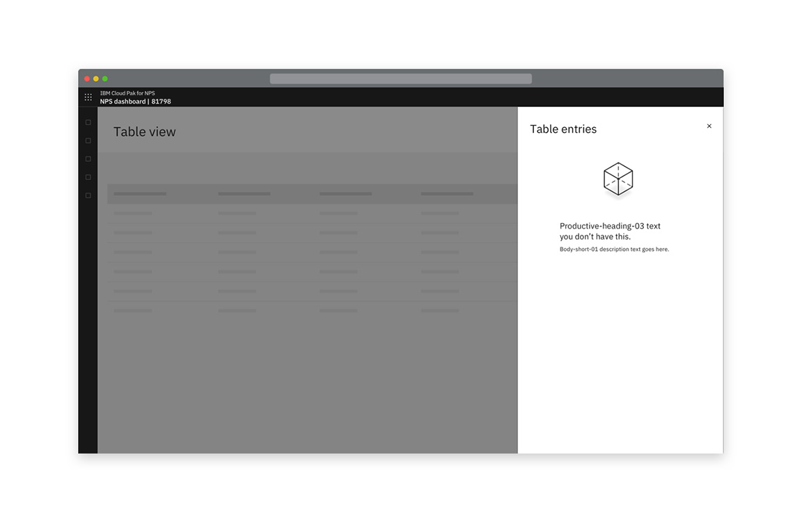

<PageDescription>

Empty states are useful when something is yet to be populated and is awaiting data or information. Another common use is when a search or filter yields no results.

</PageDescription>

#### Status:

[Experimental](/experimental/overview/)

#### Maintainer:

[Vikki Paterson](https://github.com/vikkipaterson), [Chloe Poulter](https://github.com/chloepoulterdesign)

## Overview

#### An empty state consists of:

- An illustration that is relevant to the context or the product
- A headline text explaining the reason for the empty state
- A description of the resource contained typically found in the empty location

Don't include the primary call to action in the empty space. The call to action should remain in the same location whether an area is populated or empty. This prevents confusing users as they become familiar with the system.

<Row>
 <Column colLg={8}>

<Caption>Example of an empty state when a search yields no results</Caption>

 </Column>
</Row>
<Row>
 <Column colLg={8}>

<Caption>
  Example of an empty state when a table has not yet been populated
</Caption>

 </Column>
</Row>
<Row>
 <Column colLg={8}>

<Caption>
  Example of an empty state when a slide-over panel hasn't been populated yet
</Caption>

 </Column>
</Row>
