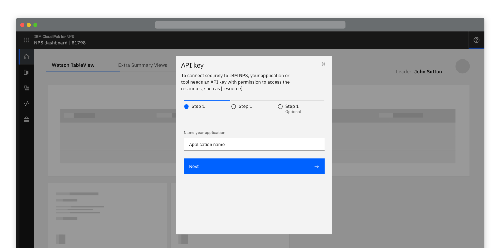
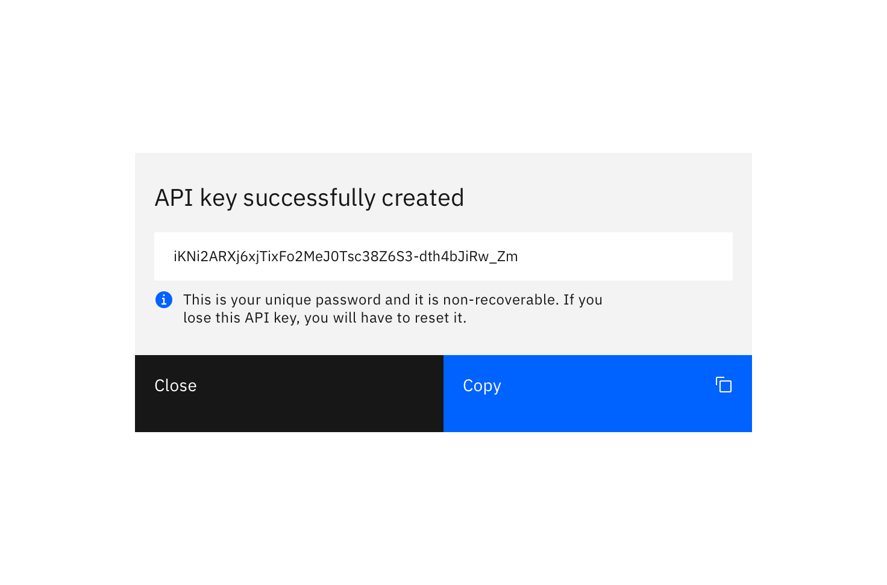
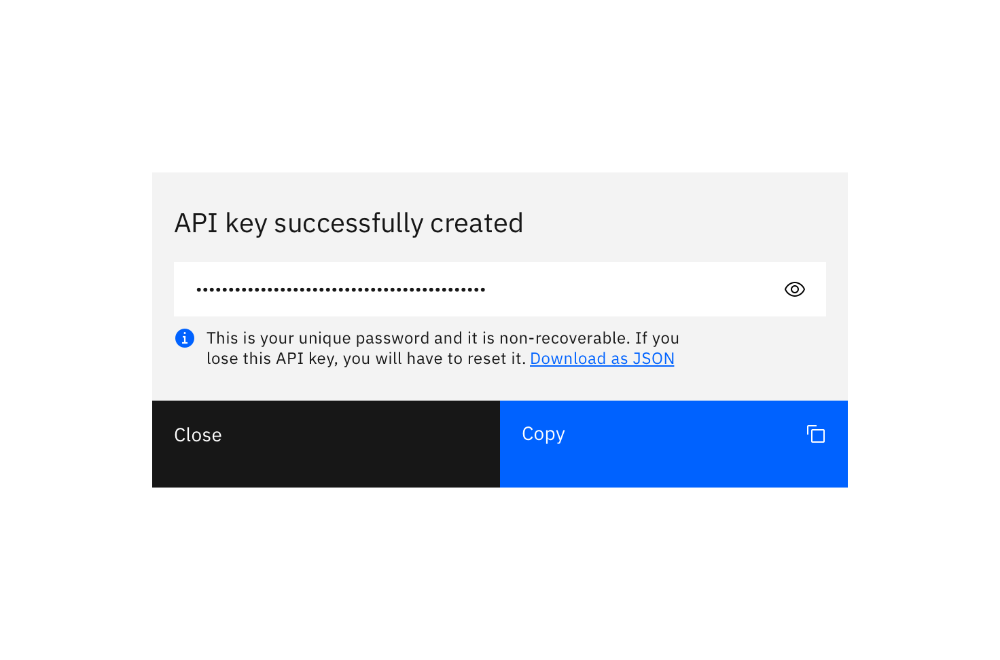
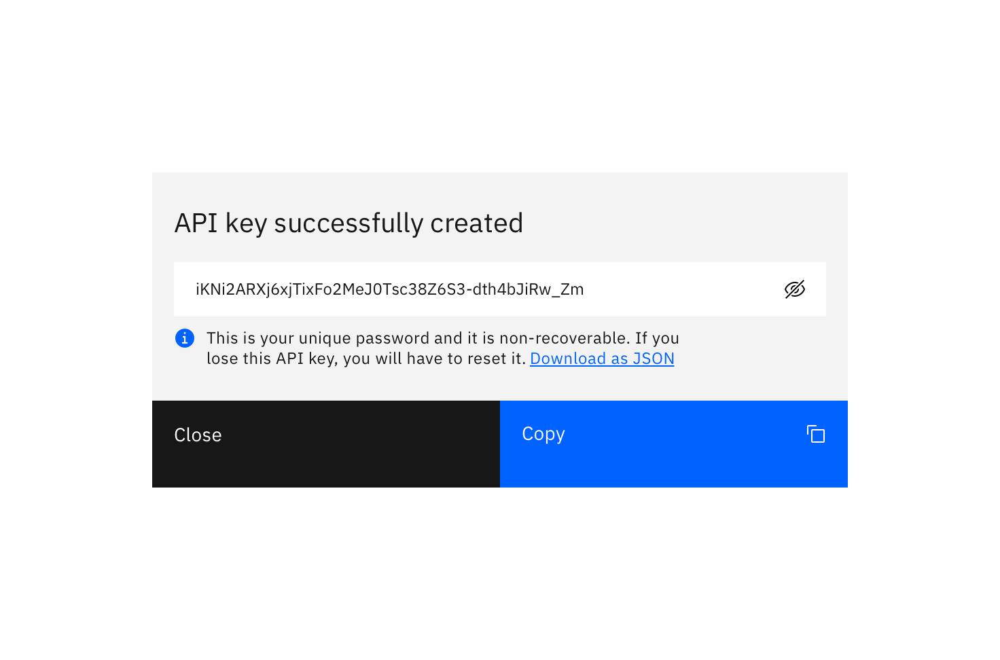
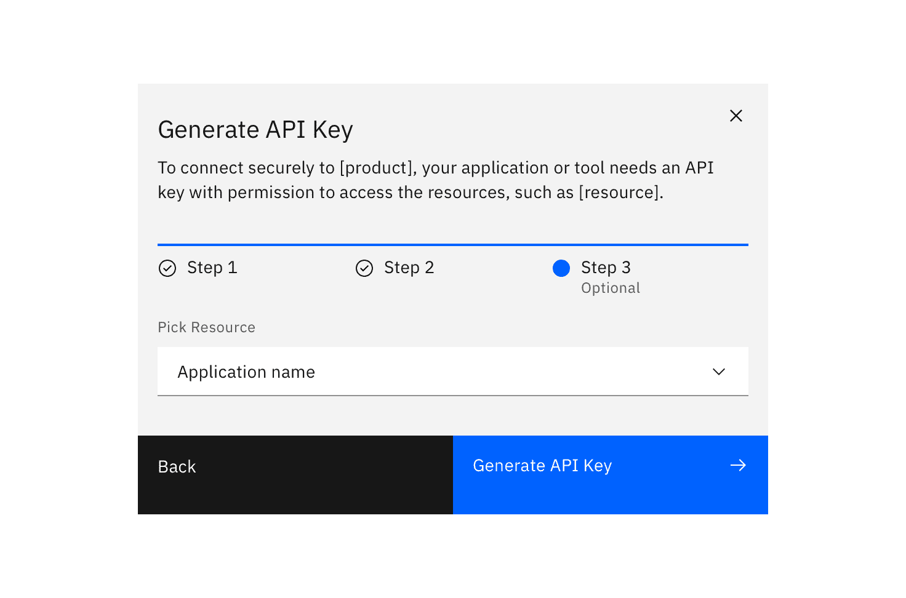
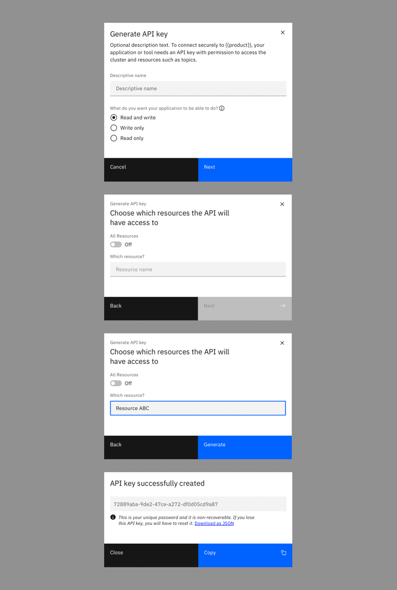

<PageDescription>

Ensure users know what the key is created for, the security implications, and the end destination of the key.

</PageDescription>

#### Status:

[Experimental](/experimental/overview)

#### Maintainer:

[Vikki Paterson](https://github.com/vikkipaterson)

## General access

### Instant generation

Users click a primary ‘Generate’ button. Consider displaying a ‘Generating’ state if the API key takes time to generate.

<Row>
<Column colLg={8}>

</Column>
</Row>

Once the API key is generated it displays in a modal. Include a 'copy' button.

<Row>
<Column colLg={8}>

</Column>
</Row>

#### Optionally:

- Display two parts to the API key where required
- Provide information text about the API key
- Allow users to toggle the visibility of the key
- Provide a secondary link to download the key

<Row>
<Column colLg={8}>

<Caption>Example of a hidden API key</Caption>

</Column>
</Row>

<Row>
<Column colLg={8}>

<Caption>Example of a revealed API key</Caption>

</Column>
</Row>

### Name the API key

You can ask a user to provide a descriptive name before the key is generated. This is particularly useful in instances where a user may have keys for several applications stored in the same location.

<Row>
<Column colLg={8}>

</Column>
</Row>

<Row>
<Column colLg={8}>

<Caption>Example of an API key destination selector</Caption>

</Column>
</Row>

## Restricted access

A user may want to limit the access an application or service is granted. Restricted access allows a user to assign specific access control and permissions before the API key is generated.

<Row>
<Column colLg={8}>

</Column>
</Row>
