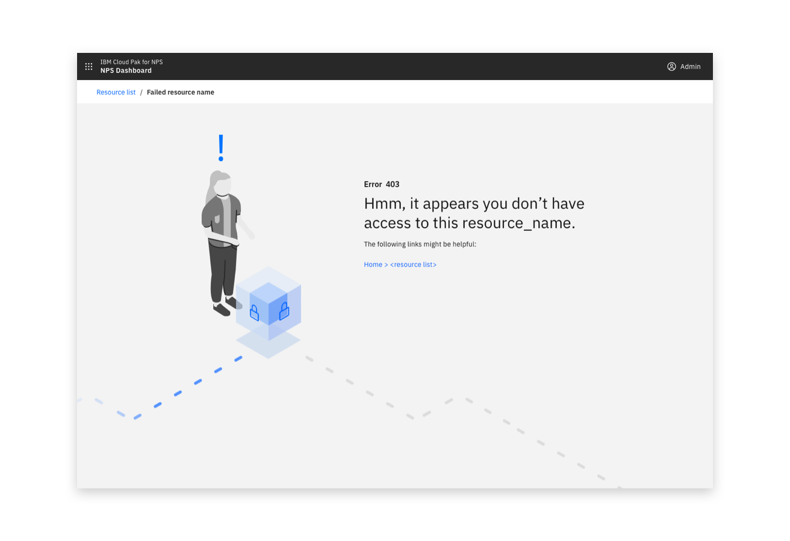
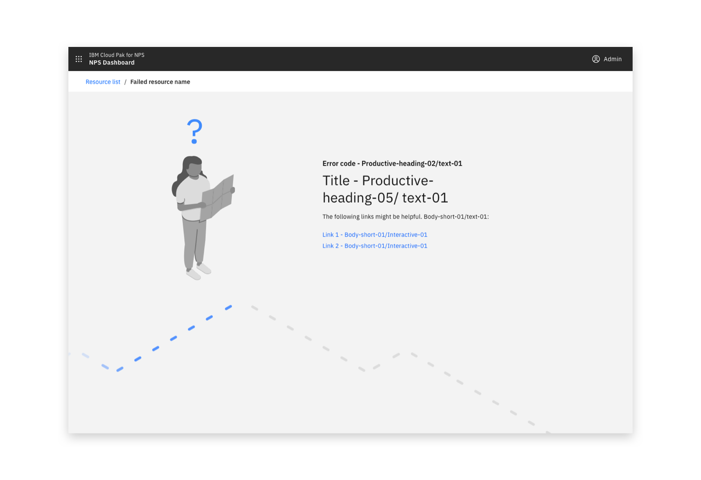

<PageDescription>

_HTTP errors_ are used in an attempt to access something that isn’t available or the user doesn't have permission for.

</PageDescription>

#### Status

Experimental

#### Maintainers:

[Vikki Paterson](https://github.com/vikkipaterson), [Chloe Poulter](https://github.com/chloepoulterdesign)

<Caption>Example of a 403 error in context</Caption>

<Caption>Example of a 404 error in context</Caption>

## Consists of

- An illustration (optionally including animation) that can be relevant to the context, the product or be generic
- The error number
- Headline text explaining the cause of the error maintaining an informal tone
- Optionally consider including description text introducing suggested alternative links to help the user
<AnchorLinks>
  <AnchorLink>403 Error</AnchorLink>
  <AnchorLink>404 Error</AnchorLink>
  <AnchorLink>Other errors</AnchorLink>
</AnchorLinks>

## 403 Error

Headline text - "Hmm, it appears you don't have access to this resource_name" where resource_name is replaced as needed.

Description text should introduce the suggested page link(s).

<Row>
 <Column colLg={8}>

 </Column>
</Row>

## 404 Error

Headline text - "Hmm, we can't seem to find that."

Description text should introduce the suggested page link(s).

<Row>
 <Column colLg={8}>

 </Column>
</Row>

## Other errors

Provide an error code for all other errors and aim to add a descriptive message.

<Row>
 <Column colLg={8}>

 </Column>
</Row>
