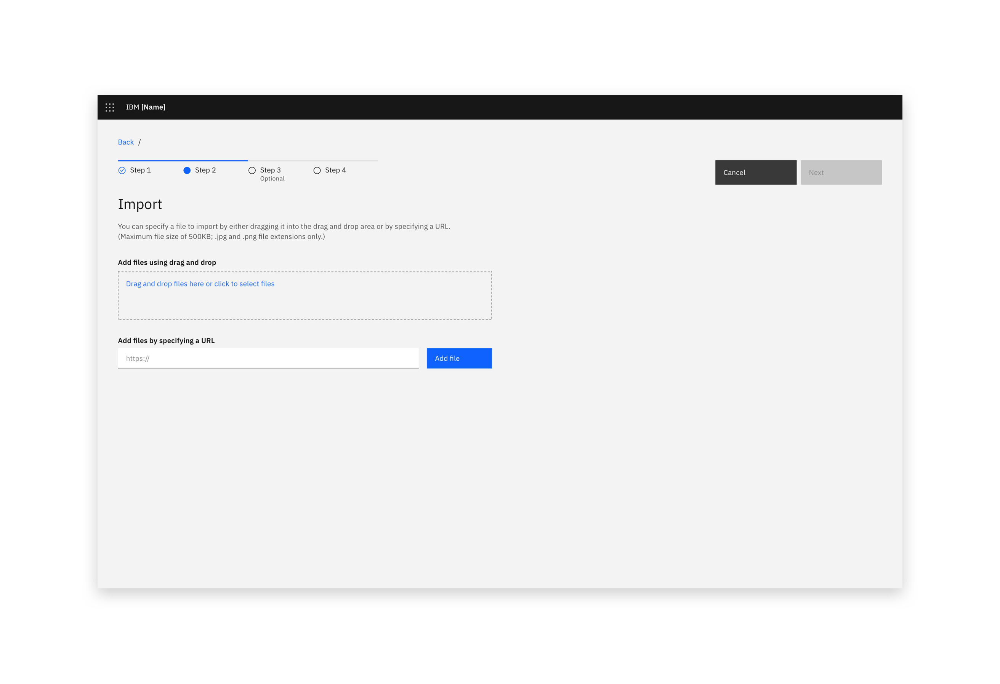

<PageDescription>

Importing a resource transfers data or objects into a system from an external source.

</PageDescription>

#### Status:

[Experimental](experimental/about)

#### Maintainers:

[Vikki Paterson](https://github.com/vikkipaterson)

</AnchorLinks>

<Caption>Example of an import modal in context</Caption>

## Choose a file

Wherever possible there should always be a drag and drop zone. Use a file drop component, and offer the option to browse locally and select a file. Note that file selection should be restricted to allowed file types.

<Row>
<Column colLg={8}>

<Caption>Example of an import dialog</Caption>

</Column>
</Row>

<Row>
<Column colLg={8}>

<Caption>Example of drag and drop file import</Caption>

</Column>
</Row>

<Row>
<Column colLg={8}>

<Caption>Example of loaded files in the import modal</Caption>

</Column>
</Row>

## Import from a URL

If your product supports importing from a URL, use this method.

<Row>
<Column colLg={8}>

<Caption>Example of importing with a URL</Caption>

</Column>
</Row>
