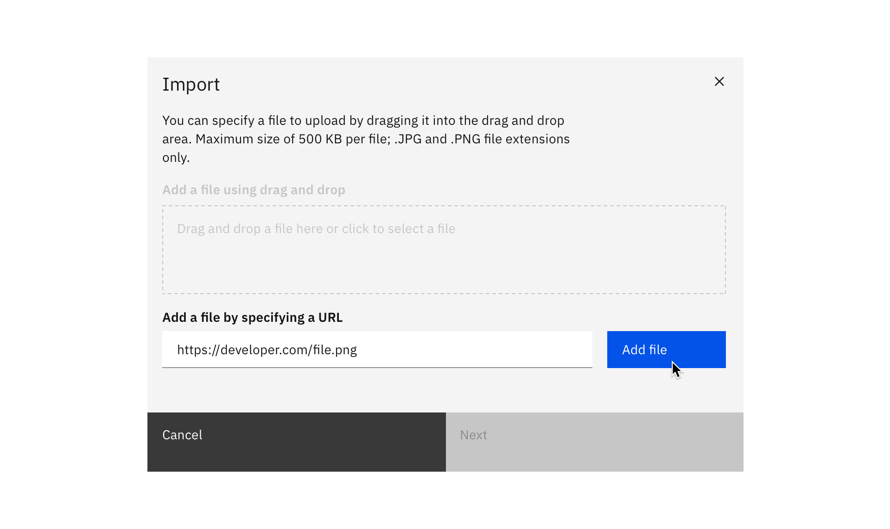
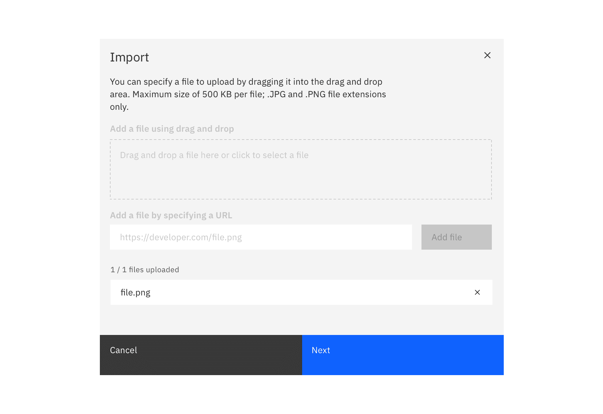
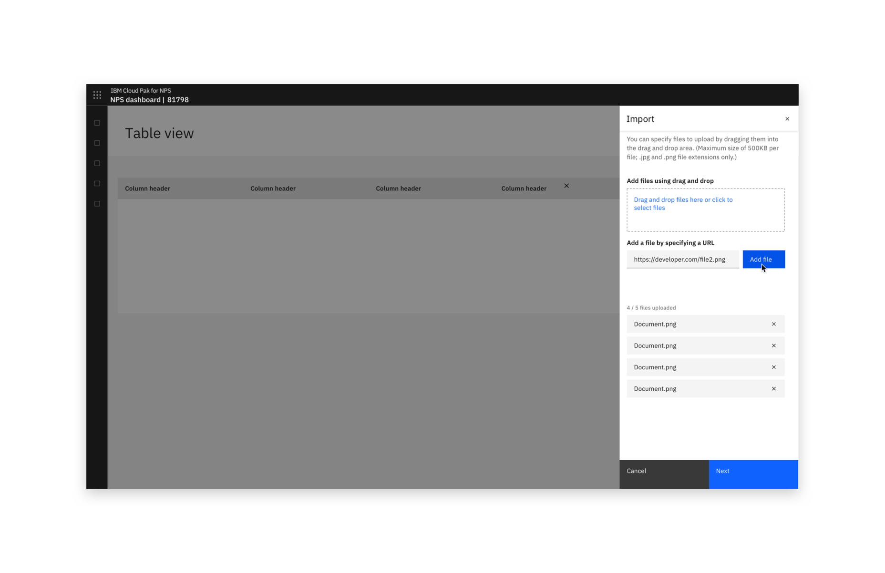

<PageDescription>

The import action transfers data or objects from an external source into a system.

</PageDescription>

#### Status:

[Experimental](experimental/about)

#### Maintainers:

[Vikki Paterson](https://github.com/vikkipaterson)

<Caption>Example of an import modal</Caption>

## Choose a file (modal)

Where a single file is imported, import can take place in a modal.

Use the drag and drop file upload component and offer the option to browse locally to select a file. Note that file selection should be restricted to allowed file types.

Any remaining actions in the import of the file happen in consequent steps of the modal.

<Row>
<Column colLg={8}>

<Caption>Example of an import modal</Caption>

</Column>
</Row>

<Row>
<Column colLg={8}>

<Caption>Example of drag and drop file import</Caption>

</Column>
</Row>

<Row>
<Column colLg={8}>

<Caption>Example of a loaded file in the import modal</Caption>

</Column>
</Row>

### Import from a URL (modal)

If your product supports importing from a URL, use this method.

<Row>
<Column colLg={8}>

<Caption>Example of importing with a URL</Caption>

</Column>
</Row>
<Row>
<Column colLg={8}>

<Caption>Example of a file imported by URL</Caption>

</Column>
</Row>

## Choose a file (full page or side-panel)

Use the drag and drop file upload component and offer the option to browse locally to select a file. Note that file selection should be restricted to allowed file types.

Any remaining actions required to import the file should happen after the user clicks "next", unless there is sufficient space to include the action in a full page single step.

<Row>
<Column colLg={8}>

<Caption>Example of an import dialog in a full page view</Caption>

</Column>
</Row>

<Row>
<Column colLg={8}>

<Caption>Example of drag and drop file import in a full page view</Caption>

</Column>
</Row>

<Row>
<Column colLg={8}>

<Caption>Example of files loading into the import dialog</Caption>

</Column>
</Row>
<Row>
<Column colLg={8}>

<Caption>Example of files loaded in the import dialog</Caption>

</Column>
</Row>

### Import from a URL (full page or side-panel)

If your product supports importing from a URL, use this method.

<Row>
<Column colLg={8}>

<Caption>Example of importing with a URL</Caption>

</Column>
</Row>

<Row>
<Column colLg={8}>

<Caption>Example of importing with a URL</Caption>

</Column>
</Row>
