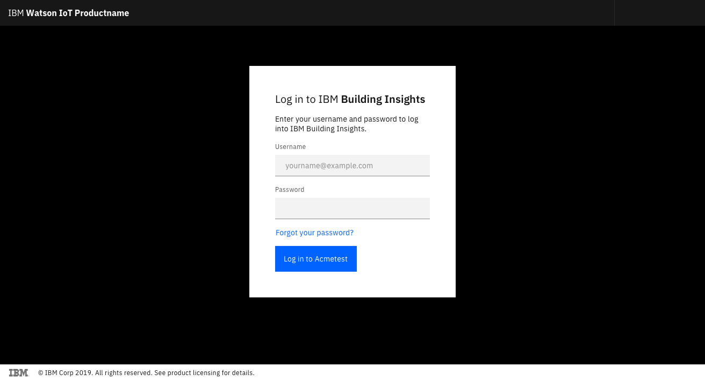
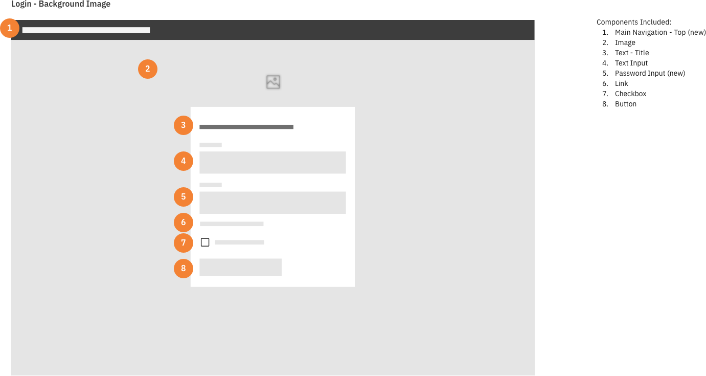
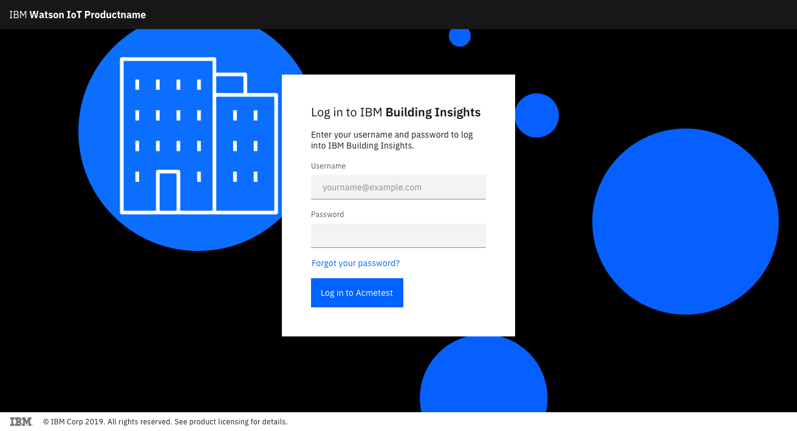
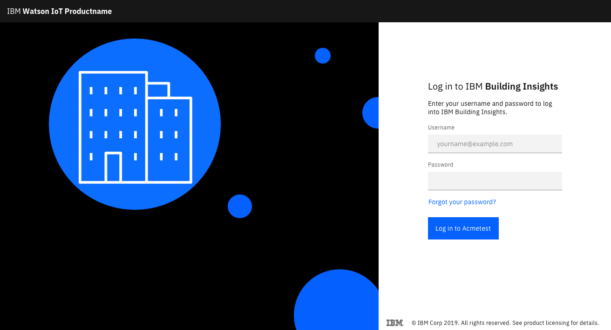
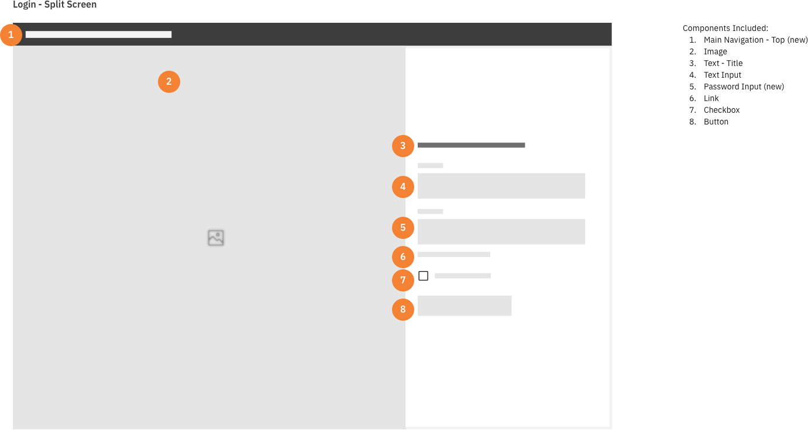
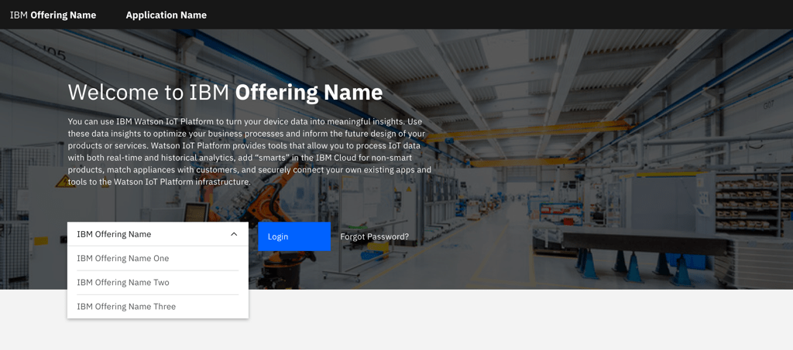
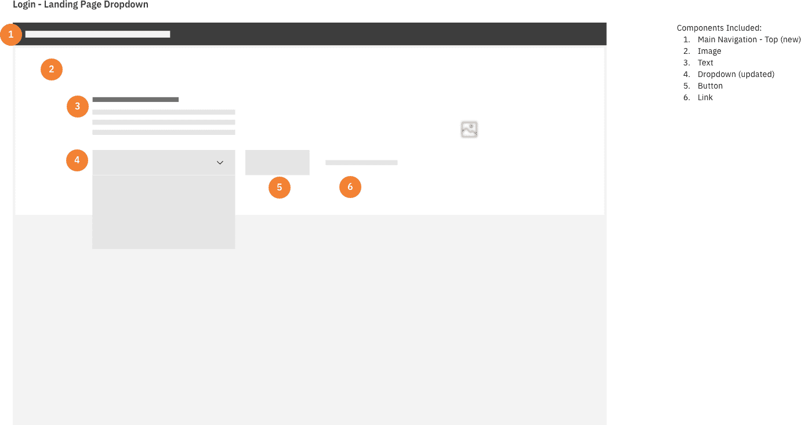

#### Status

[Experimental](/experimental/overview)

#### Maintainer:

[Chris Reckling](https://github.com/creckling)

<PageDescription>

The login pattern lets the user authenticate with the system so that they can have authorized access to product functionality.

</PageDescription>

## Overview

Login patterns ensure a user can authenticate into the system so they can access their data securely. Mobile login screens should follow the same pattern and illustration style as the desktop experience.

The "Forgot Password" pattern is separate from the authentication and login pattern. If there are several products being a login, a user should be able to choose which product log into.

## Login form variations

### Centered login form

The centered login includes copyright information in the footer. Refer to your product content team for these details.

<Row>
<Column colLg={8}>

</Column>
</Row>

<Row>
<Column colLg={8}>

</Column>
</Row>

If you choose to include an illustration, ensure the art reflects the product. Keep it simple and aligned with the product's aesthetic.

<Row>
<Column colLg={8}>

</Column>
</Row>

### Login form on the right

Right-side logins are ideal for editorial experiences, and instances where there is visual content featured on the left side of the window.

<Row>
<Column colLg={8}>

</Column>
</Row>

<Row>
<Column colLg={8}>

</Column>
</Row>

### Login page with product selector

In some cases, you may ask the user to select which product to log into. This allows the user to jump directly to the home landing page for the product after authenticating.

Use a dropdown component to display the options.

<Row>
<Column colLg={8}>

</Column>
</Row>

<Row>
<Column colLg={8}>

</Column>
</Row>
