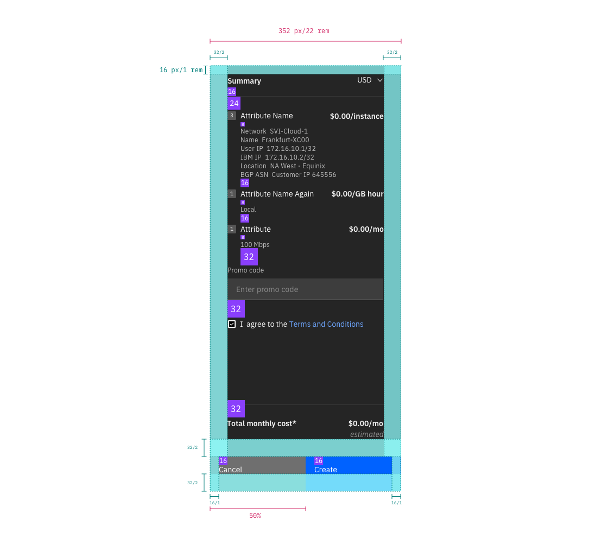

## Specs

<Row>
  <Column colMd={12} colLg={12} GutterSm>

<Caption>
  Structure and spacing measurements for small side panels | px | rem
</Caption>

</Column>
</Row>

## Typography

All order summary labels are set in sentence case. Set body text appropriately based on content.

<Row>
  <Column colMd={12} colLg={12} GutterSm>

|                    | carbon token         | rem   | px  |
| ------------------ | -------------------- | ----- | --- |
| Summary title      | productive-heading   | 0.875 | 14  |
| Attribute name     | body-short-01        | 0.875 | 14  |
| Cost               | body-short-01 _bold_ | 0.875 | 14  |
| Secondary text     | caption-01           | 0.75  | 12  |
| Total monthly cost | productive-heading   | 0.875 | 14  |
| Estimated          | productive-heading   | 0.875 | 14  |

</Column>
</Row>

## Padding

Padding should be `2rem (32px)` for the top, left, right, and bottom of the content area.

Buttons should have `1 rem (16px)` of padding on the left.

## Color

The order summary uses a Gray 100 theme.
The background color is `#171717`.

## Buttons

The primary and secondary button within the order summary footer can be active or disabled depending on the situation. Buttons should always lie above the fold.
