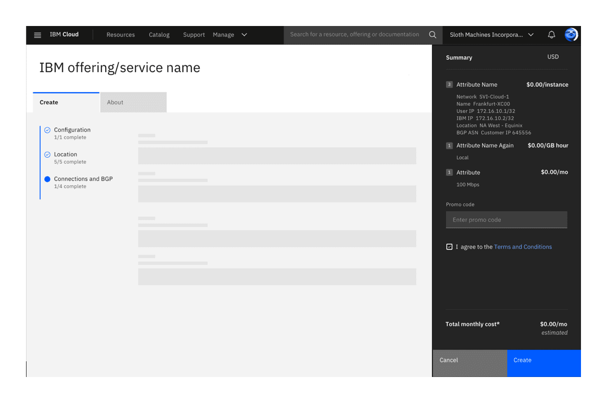

<PageDescription>

An order summary displays the estimated financial costs and configuration details of a service or offering.

</PageDescription>

#### Status:

[Experimental](/experimental/overview)

#### Maintainer:

[Adriana Morales](https://www.github.com/adrianamorales)

<AnchorLinks>

<AnchorLink>General guidelines</AnchorLink>
<AnchorLink>Anatomy</AnchorLink>
<AnchorLink>Examples</AnchorLink>

</AnchorLinks>

<Caption>Example of an order summary</Caption>

## General guidelines

On a catalog details page, an order summary appears when a user is ordering a new service and configuring its details. Depending on the service, the summary component can show different content such as the details of a promo code or itemized costs of a service.

The summary highlights the default choices when a user first lands on the page, and updates the choices made as they customize the service. The choices are shown with a title and a subtitle.

If a user navigates away from the page, the summary should remain populated with the user's latest changes if they choose to return at a later time.

## Anatomy

#### Placement

The summary component is a grid influencer and stays fixed on the right side of the page, just below the global navigation bar.

#### Title

The title should only contain the word “Summary”. Please do not introduce new terminology or labels in the title area.

#### Content area

Depending on the service, the summary component can include content such as an itemized list of costs for a service or a promo code field.

#### Pricing and currency

The itemized list of costs should all be presented in the same currency (Euros, U.S. dollars, etc.).

#### Terms and conditions

When a user is creating a new service, they need to read and agree to the **Terms and Conditions** agreement. The create button is disabled until they check the box.

#### Buttons

There are two buttons, one required primary button "Create" and one optional secondary button, which can say "Save", "Clear" or "Save as template" depending on the use case. The buttons always stick to the bottom of the page and lie above the fold.

If your service requires a reset or clear button in the summary component, be sure to include error checking and notify the user they will lose their changes.

**Note: These button labels are still being explored and tested.**
