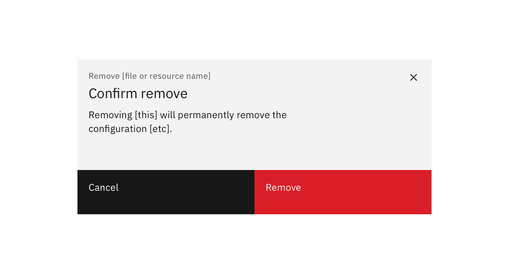
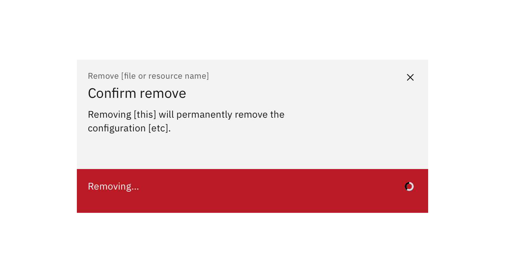

<PageDescription>

Removal is a non-destructive action. A user can remove an asset from a list or item without destroying it.

</PageDescription>

#### Status:

[Experimental](/experimental/overview)

#### Maintainers:

[Vikki Paterson](https://github.com/vikkipaterson)

<Caption>Example of a remove pattern using a modal</Caption>

## Low impact

User confirmation is not required for low-impact removals because the asset is not destroyed.

## High impact

Require user confirmation for high impact removals. Communicate the consequences of the removal, and let the user know if the removal is permanent.

Optionally, when the remove button is selected, change it to ‘Removing...’.

<Row>
<Column colLg={8}>

<Caption>Example of a high-impact remove modal</Caption>

</Column>
</Row>

<Row>
<Column colLg={8}>

<Caption>
  Example of a high-impact remove modal following user confirmation
</Caption>

</Column>
</Row>
