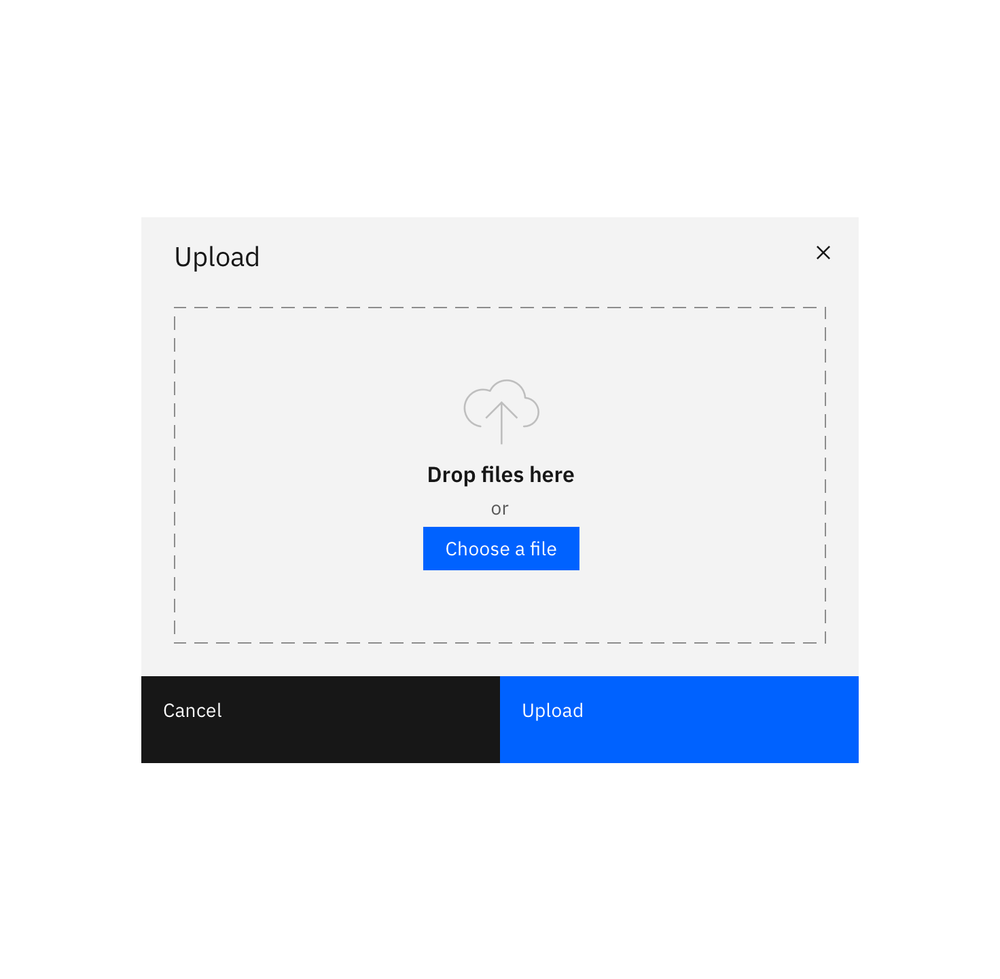
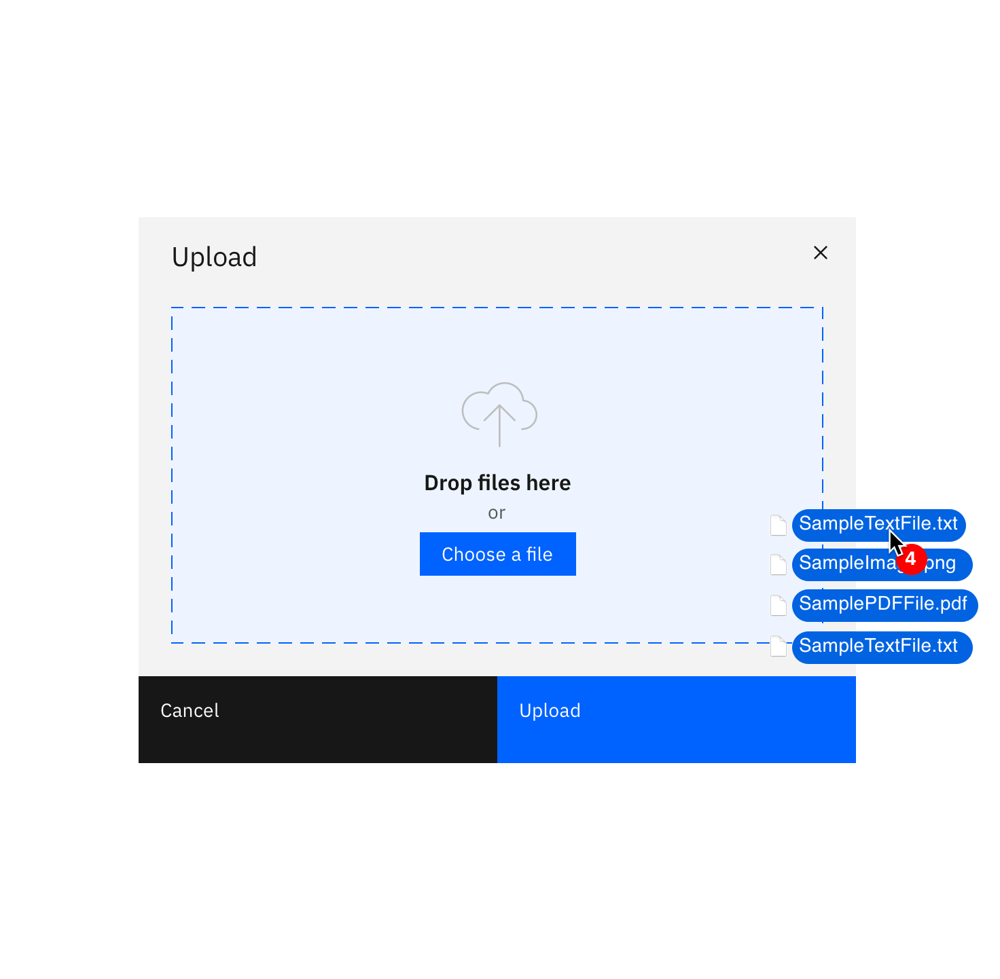
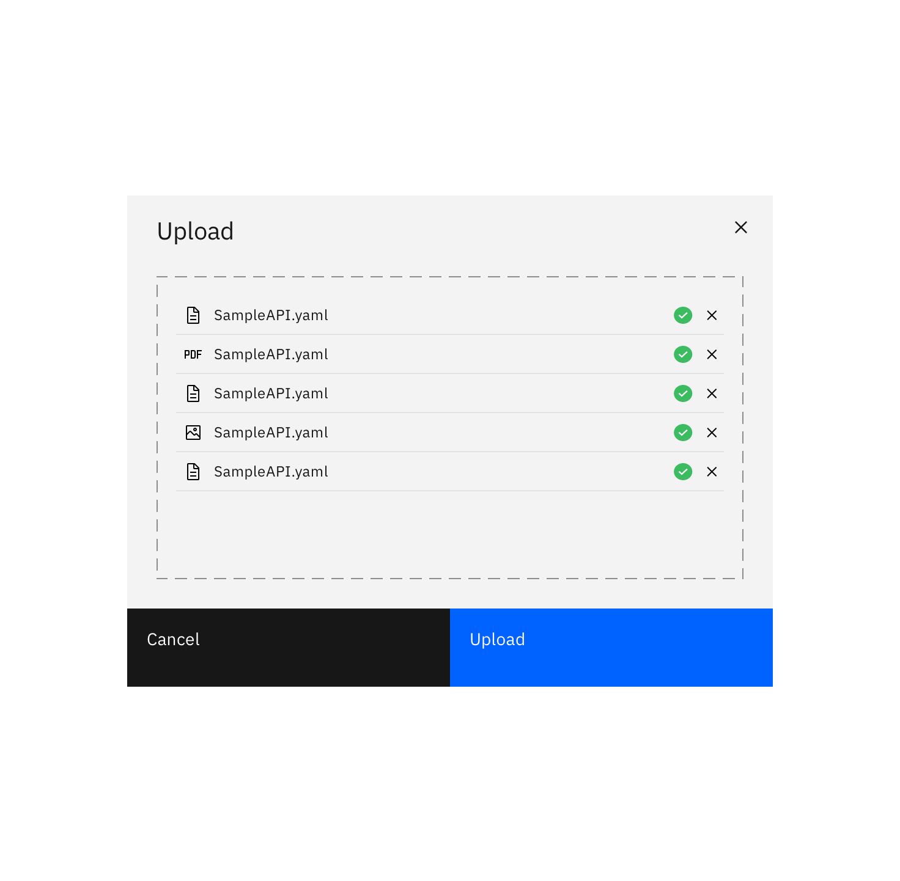

<PageDescription>

Uploading is the transfer of a resource from a local system to a remote system.

</PageDescription>

#### Status:

[Experimental](/experimental/about)

#### Maintainers:

[Vikki Paterson](https://github.ibm.com/VICTORIA)

<Row>
<Column colLg={8}>

<Caption>Example of an import modal in context.</Caption>

</Column>
</Row>

## Upload methods

Use the file drop component, which gives the user the option to drag and drop files as well as browse files locally.

This pattern can be used in a modal and in other contexts. Unlike the "Import pattern", uploading is restricted to using a file drop or file locator.

<Row>
<Column colLg={8}>

</Column>
</Row>

<Row>
<Column colLg={8}>

</Column>
</Row>

<Row>
<Column colLg={8}>

</Column>
</Row>

<Row>
<Column colLg={8}>

</Column>
</Row>
