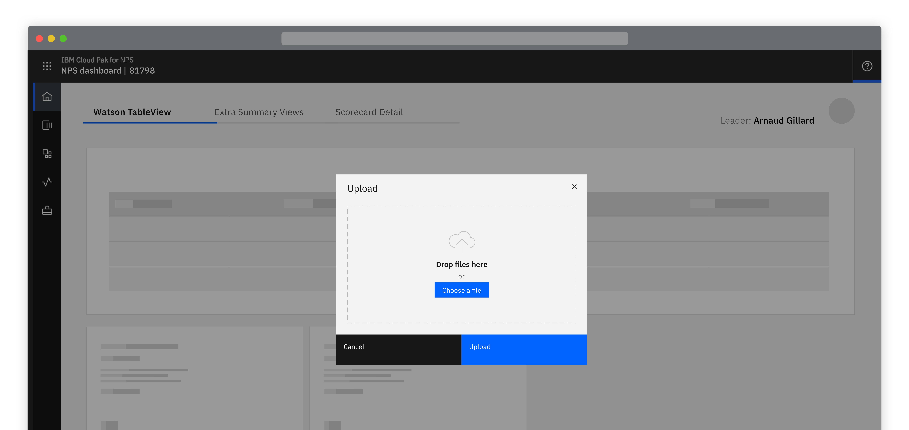
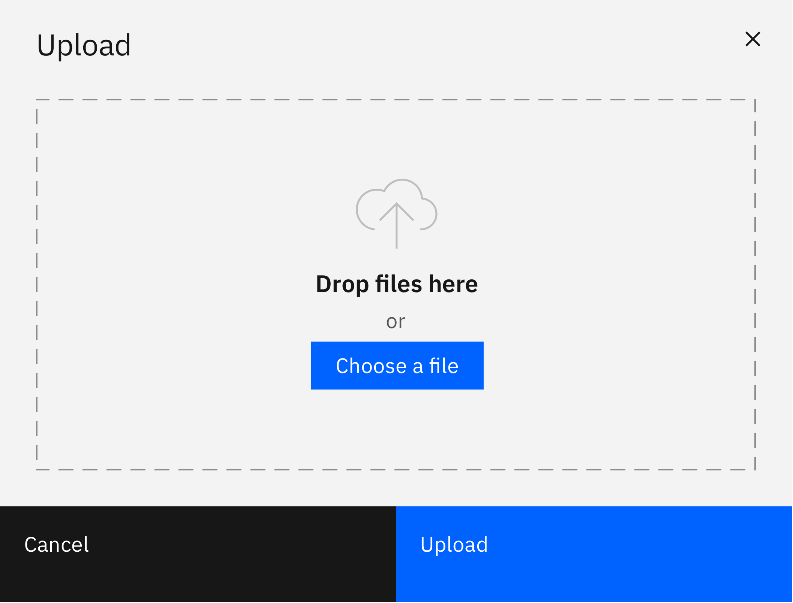
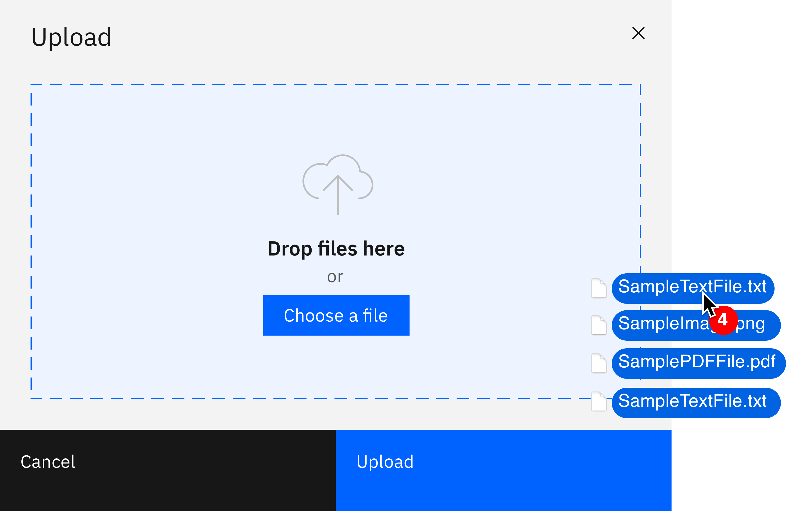
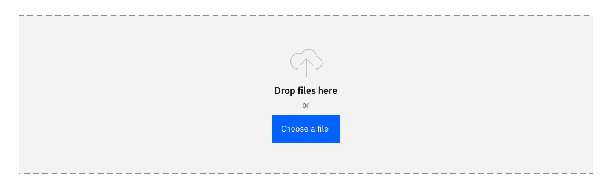
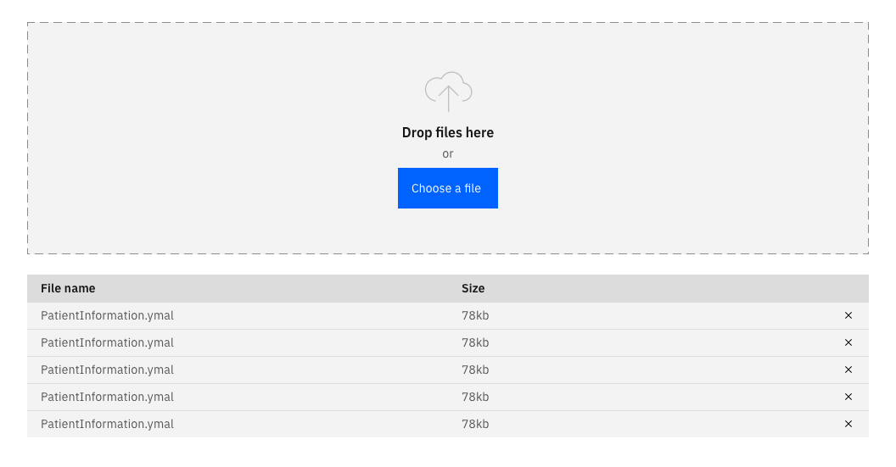
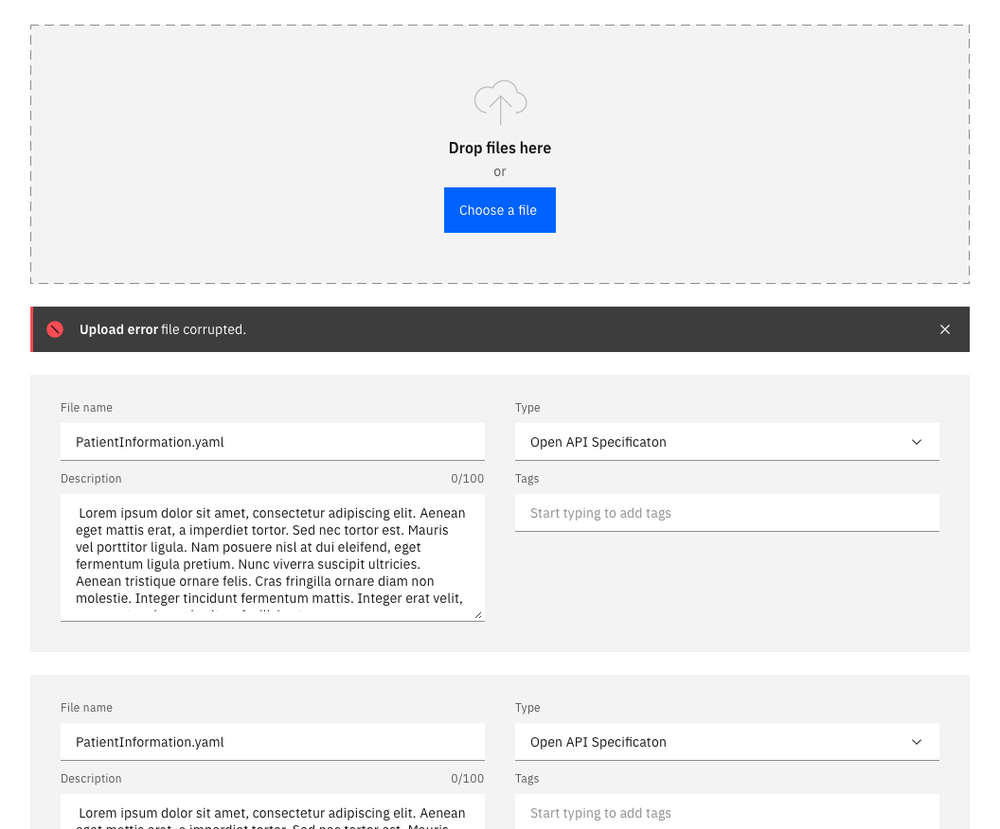

### Transferring a resource from a local system to a remote system.

<ImageComponent cols="8">

</ImageComponent>

## Things to consider

- Is the action uploading or is it importing?
- Where is the upload action performed?
- How many items will the user need to upload at any one time? The UI shell is designed to be configurable. A product or platform can choose which shell components and configurations to use, based on their user and information requirements.

#### Options

<AnchorLinks>

<AnchorLink>Overview</AnchorLink>
<AnchorLink>Upload methods</AnchorLink>
<AnchorLink>Bulk upload</AnchorLink>

</AnchorLinks>

## Overview

The action of uploading should always be the result of a user action.
The action of uploading a file could be done by selecting an action button
to open a modal or it may be done inline in a full page form or slide in or
over panel.

<ImageComponent className="uploading-img-1">

</ImageComponent>
 
 
<Row>
<Column colLg={8}>

</Column>
</Row>
 
 

## Upload methods

- Drag and Drop
- Choose a file

Wherever possible there should always be a drag and drop zone, using the file
drop component, as well as the ability to browse locally and select a file.
Note that file selection should be restricted to only allowed file types.

 
<Row>
<Column colLg={8}>

</Column>
</Row>
 
 

## Bulk upload

- Drag and Drop
- Choose files
- File information input fields

As with the individual file upload there should always be a drag and drop
zone, using the file drop component, as well as the ability to browse locally
and select a files.

 
<Row>
<Column colLg={8}>

</Column>
</Row>
 
 

After the files have been dropped into the field, they should be entered info
a table underneath the drop zone, given the user visibility of the items they
have uploaded and the status of that process.

 
<Row>
<Column colLg={8}>

</Column>
</Row>
 
 

If the user is required to input details about the files being uploaded then
the files should be displayed in cards underneath the drop zone, with the
fields to be completed on them.

Upload errors can be displayed inline in this view.

 
<Row>
<Column colLg={8}>

</Column>
</Row>
 
 
