<PageDescription>

The IBM 2x Grid system is a fully responsive, robust, 16 column layout system
with five default breakpoints and dozens of predefined classes.

</PageDescription>

<InlineNotification>

The documentation regarding our grid system on this page is partially outdated
and refers to the
[FlexGrid](https://react.carbondesignsystem.com/?path=/docs/elements-flexgrid--auto-columns#grid)
implementation. Our latest version, v11, includes a
[CSS Grid](https://react.carbondesignsystem.com/?path=/docs/elements-grid--default#grid)
implementation which will be documented soon.

</InlineNotification>

<AnchorLinks>

<AnchorLink>How it works</AnchorLink>
<AnchorLink>Grid modes</AnchorLink>
<AnchorLink>Incorporating the shell</AnchorLink>
<AnchorLink>Alignments</AnchorLink>
<AnchorLink>Techniques</AnchorLink>
<AnchorLink>Resources</AnchorLink>

</AnchorLinks>

## How it works

### Basic grid explainer

The below example creates four equal-width columns at small, medium, large, and
extra large breakpoints using our predefined grid classes. The columns are
centered in the page within the parent container.

<Row>
  <Column noGutterSm>
    <div className="grid-demo override override">
      <div class="cds--grid">
        <div class="cds--row">
          <div class="cds--col">1 of 4</div>
          <div class="cds--col">2 of 4</div>
          <div class="cds--col">3 of 4</div>
          <div class="cds--col">4 of 4</div>
        </div>
      </div>
    </div>

```html
<Grid>
  <Column lg="{4}">Span 4 of 16</Column>
  <Column lg="{4}">Span 4 of 16</Column>
  <Column lg="{4}">Span 4 of 16</Column>
  <Column lg="{4}">Span 4 of 16</Column>
</Grid>
```

  </Column>
</Row>

<br />

### Responsive options

| Breakpoints             | # of cols | Gutter width\* |
| ----------------------- | --------- | -------------- |
| Small (<672)            | 4         | 32px           |
| Medium (672 - 1056px)   | 8         | 32px           |
| Large (1056 - 1312px)   | 16        | 32px           |
| X-Large (1312 - 1584px) | 16        | 32px           |
| Max (>1584)             | 16        | 32px           |

<Caption>
  * Gutter width is 32px — with 16px on each side of a column — at every
  breakpoint.
</Caption>

<br />
<br />

<DoDontRow>
  <DoDont type="do" caption="Do feel free to mix and match column structure.">


  </DoDont>
  <DoDont type="dont" caption="As a general rule, don’t mix with 3 or 5 columns.">


  </DoDont>
</DoDontRow>

## Grid modes

Carbon’s Sketch templates always have a 32px gutter by default, regardless of
breakpoint. The default gutter width is 32px because type, within or without
containers, never has less than a 32px gutter. For containers and components,
however, there are three different gutter structures: Wide (default), Narrow and
Condensed. These three gutter scenarios enable typographic alignment by allowing
containers and certain components to “hang” into the gutter.

<br />

<Row class="grid-modes">
<Column colLg={2} colMd={2}>

**Wide (default)**<br/> 32px gutter

</Column>
<Column colLg={10} colMd={6}>

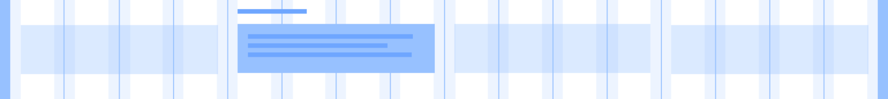

</Column>
</Row>
<Row>
<Column colLg={2} colMd={2}>

**Narrow**<br/> 16px gutter

</Column>
<Column colLg={10} colMd={6}>


</Column>
</Row>
<Row>
<Column colLg={2} colMd={2}>

**Condensed**<br/> 1px gutter

</Column>
<Column colLg={10} colMd={6}>

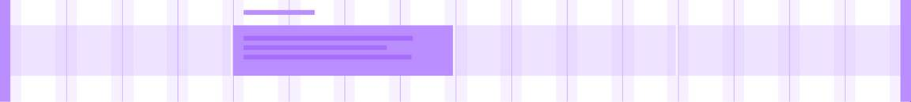

</Column>
</Row>

### The Wide grid

This is our default grid mode, with 16 columns and 32px gutters. Unless your
design specifies something different, this is the grid you should go with — it’s
also arguably the easiest to use. Here, the container edge does not extend into
the gutter, so the type within the container does not sit on the columns.

Rows that are adjacent will have 32px of margin between them to match gutter.
Use vertical helpers here.

<Row>
  <Column noGutterSm>
    <div className="grid-demo override override grid-demo--wide">
      <div class="cds--grid">
        <div class="cds--row">
          <div class="cds--col"><div class="grid-demo-content"></div></div>
          <div class="cds--col"><div class="grid-demo-content"></div></div>
          <div class="cds--col"><div class="grid-demo-content"></div></div>
          <div class="cds--col"><div class="grid-demo-content"></div></div>
        </div>
      </div>
    </div>

```html
<Grid>
  <Column sm="{4}" />
  <Column sm="{4}" />
  <Column sm="{4}" />
  <Column sm="{4}" />
</Grid>
```

  </Column>
</Row>

<br />

#### Usage

Use the Wide grid mode when you are dealing with separate pieces of information
with separate destinations. This grid mode is also good for text-heavy
situations, where maximum breathing room helps provide clarity and legibility.
Also, basic images (without text on them) always use this grid mode.

<InlineNotification>

**Note:** Fixed components with labels such as input fields and dropdowns must
use the Wide grid mode. One overarching rule — applicable to each grid mode — is
that type never hangs into the gutter. So we don't want to push label type into
the gutter in order to get field type to align.

</InlineNotification>


<DoDontRow>
  <DoDont type="do" caption="Do align type (outside of a container), components, and tiles to the columns.">

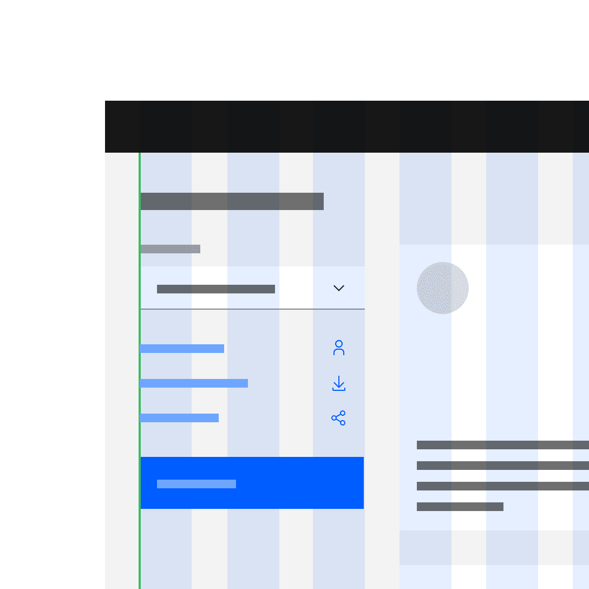

  </DoDont>
  <DoDont type="dont" caption="Do not take type off the column structure to achieve alignment.">

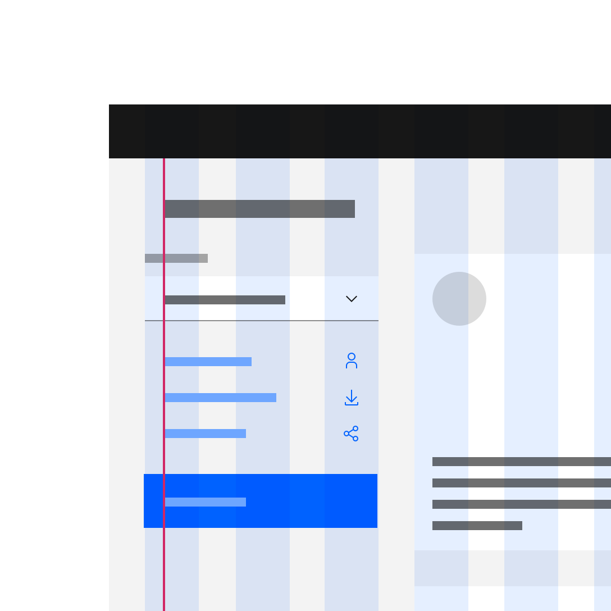

  </DoDont>
</DoDontRow>

### The Narrow grid

This is the gutter scenario that requires the most explanation. Although it's
caused a lot of confusion, the intent is simply to enable more typographic
alignment. With the Narrow grid, the container, not the type, hangs 16px into
the gutter; allowing headings and copy outside of containers to align with the
copy within containers and components. This arrangement can easily be mirrored
to accommodate languages that read right to left, like Arabic or Hebrew.

Rows that are adjacent will have 16px of margin between them to match gutter.
Use vertical helpers here.

<s>
<InlineNotification>

**Note:** Code for the narrow grid mode was added in
[v10.17.0](https://github.com/carbon-design-system/carbon/releases/tag/v10.17.0)

</InlineNotification>
</s>

<Row>
  <Column noGutterSm>
    <div className="grid-demo override override override override grid-demo--narrow">
      <div class="cds--grid cds--grid--narrow">
        <div class="cds--row">
          <div class="cds--col"><div class="grid-demo-content"></div></div>
          <div class="cds--col"><div class="grid-demo-content"></div></div>
          <div class="cds--col"><div class="grid-demo-content"></div></div>
          <div class="cds--col"><div class="grid-demo-content"></div></div>
        </div>
      </div>
    </div>

```html
<Grid narrow>
  <Column sm="{4}" />
  <Column sm="{4}" />
  <Column sm="{4}" />
  <Column sm="{4}" />
</Grid>
```

  </Column>
</Row>

<br />

#### Usage

Use the Narrow grid mode when you are dealing with separate pieces of
information with separate destinations, but would like to save more real estate.
This grid mode will give your compositions a sleeker look and maximize type
alignment, within and without containers.

As mentioned above, fixed components with labels, such as input fields and
dropdowns, should not hang into the gutter. See an example of how to combine a
Wide and a Narrow grid scenario in the [Mix and match](#mix-and-match) section.


<DoDontRow>
  <DoDont type="do" caption="Do align components within containers flush to the columns.">

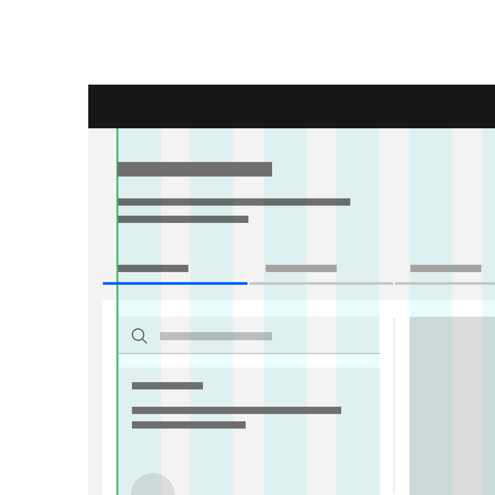

  </DoDont>
  <DoDont type="dont" caption="Do not hang type into the gutter under any circumstances.">

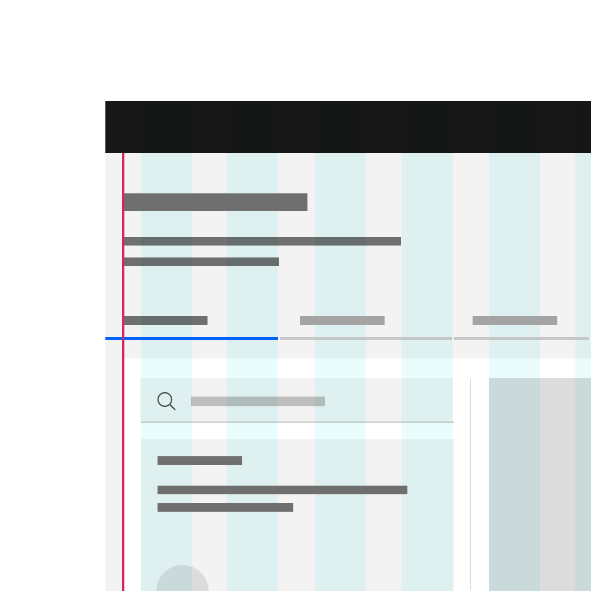

  </DoDont>
</DoDontRow>

### The Condensed grid

The Condensed grid collapses the gutter to 1px. To achieve this, containers and
components bleed 16px into the gutter on either side of the column. This grid
mode is most often used in conjunction with another grid mode and arguably
requires the most design skill to incorporate into layouts.

In order to emphasize the gutters, 1px borders that are darker than the
background color (in both light and dark themes), must be added to any tiles or
cards. The borders add just enough clarity to the gutters to stand out, while
still registering to the user as the background color. The token for these
borders is `$ui-03`.

Rows that are adjacent will have a 1px of margin between them to match gutter.
Use vertical helpers here.

<Row>
  <Column noGutterSm>
    <div className="grid-demo override override grid-demo--condensed">
      <div class="cds--grid cds--grid--condensed">
        <div class="cds--row">
          <div class="cds--col"><div class="grid-demo-content"></div></div>
          <div class="cds--col"><div class="grid-demo-content"></div></div>
          <div class="cds--col"><div class="grid-demo-content"></div></div>
          <div class="cds--col "><div class="grid-demo-content"></div></div>
        </div>
      </div>
    </div>

```html
<Grid condensed>
  <Column sm="{4}" />
  <Column sm="{4}" />
  <Column sm="{4}" />
  <Column sm="{4}" />
</Grid>
```

  </Column>
</Row>

<br />

#### Usage

When you have separate pieces of information that form a larger picture, like a
dashboard or an overview page, that’s a good time to use the Condensed grid.
You'll also see this grid mode in portals, resource tiles and other introductory
UI. See it in action on the
[IBM Design Language homepage](https://www.ibm.com/design/language/).

As mentioned above, fixed components with labels, such as input fields and
dropdowns, should not hang into the gutter.


<DoDontRow>
  <DoDont type="do" caption="Do keep all type (inside and outside containers) aligned with the column grid.">

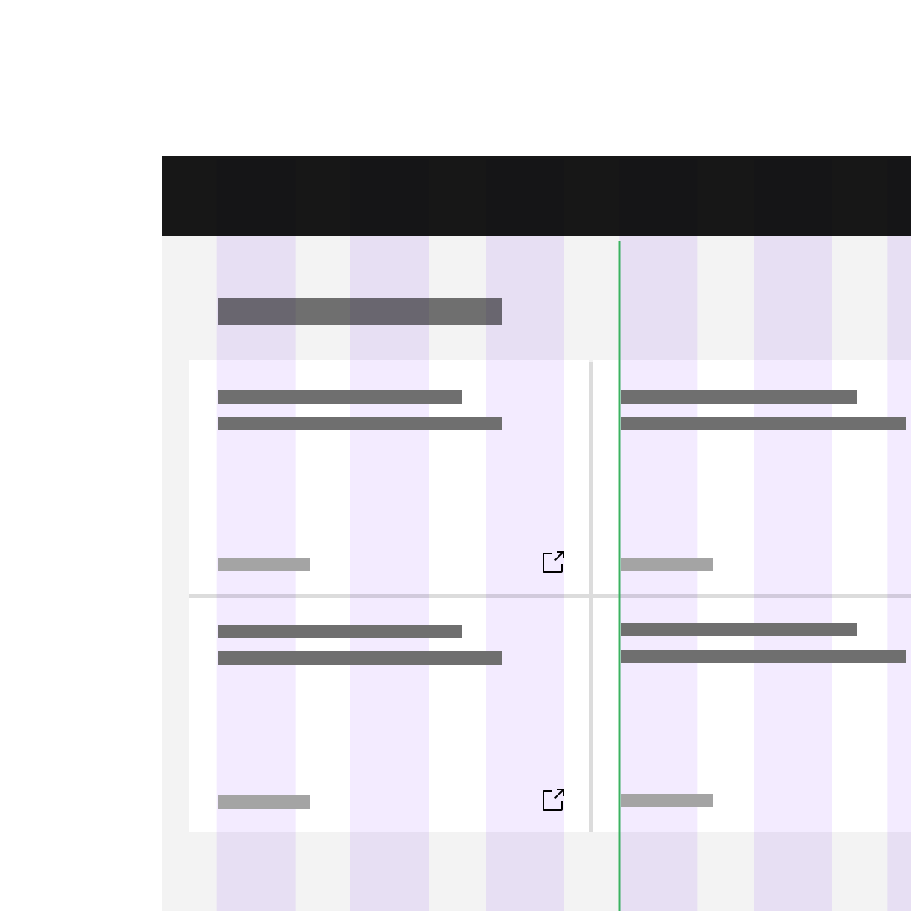

  </DoDont>
  <DoDont type="dont" caption="Do not hang type into the gutter under any circumstances.">

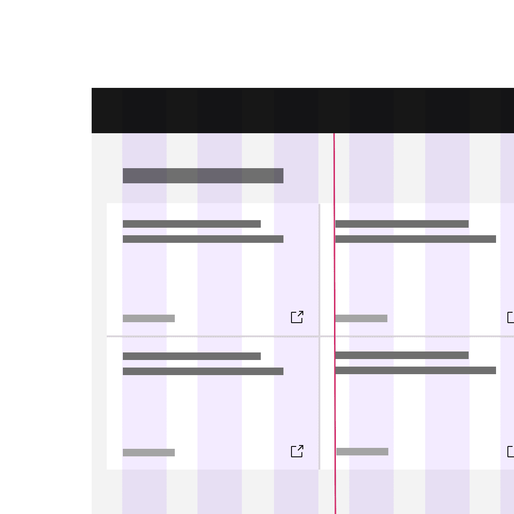

  </DoDont>
</DoDontRow>

### Mix and match

You can use rows to mix and match grid modes. In this situation, margin bottom
between the rows can vary. Because of scenarios like input fields where the
label text doesn't align to the input text — both the Narrow grid mode and the
Condensed grid are most often used in conjunction with the Wide grid mode.

#### Usage

Unless you're using the Wide grid mode exclusively, mixing and matching is going
to be the rule rather than the exception on most platforms — especially since
our labeled components (input fields, dropdowns etc.) require a 32px gutter.
We've provided a couple of examples below and will keep adding helpful uses
cases as we find them.

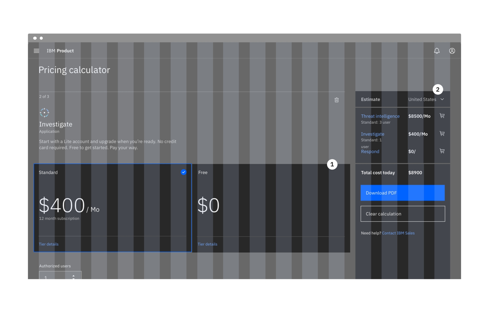

<Caption>
  1. Condensed grid mode <br /> 2. Wide grid mode{' '}
</Caption>

<br />
<br />

<DoDontRow>
  <DoDont type="do" caption="Do apply different grid modes to different components (like input fields with labels and tiles).">

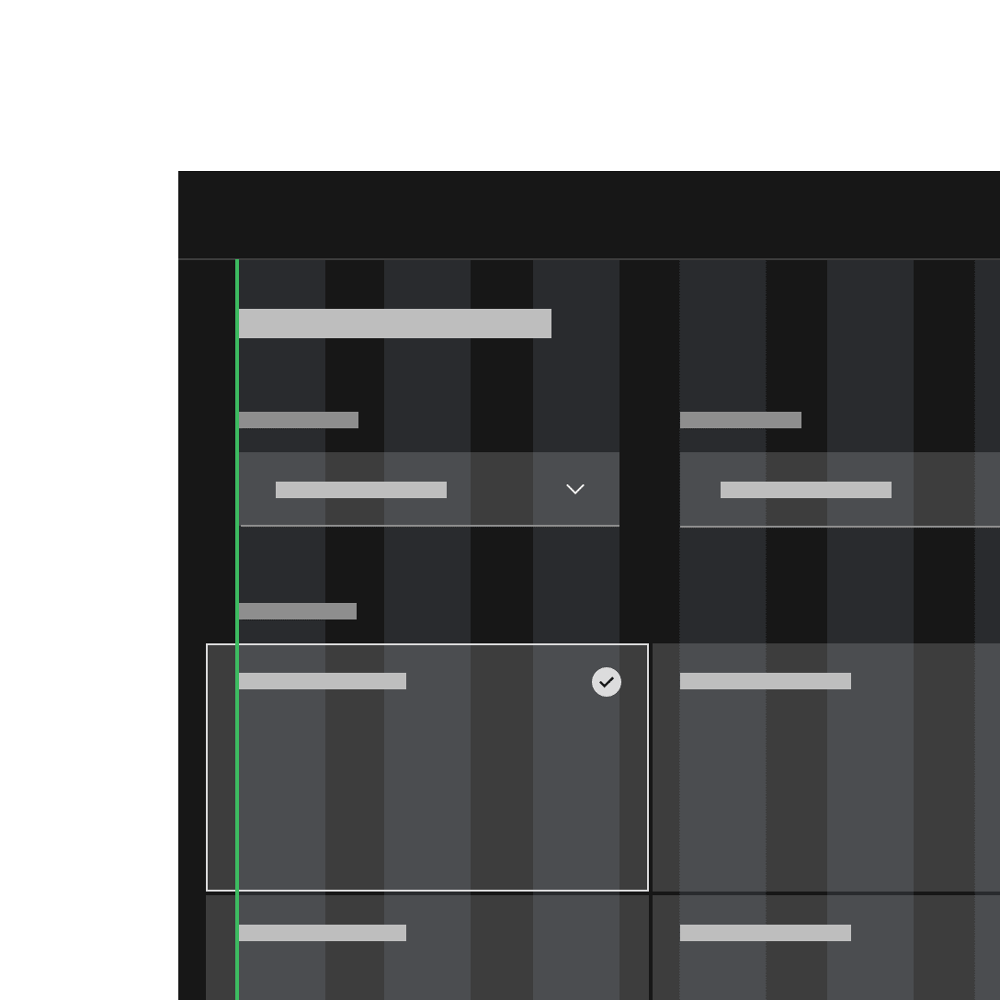

  </DoDont>
  <DoDont type="dont" caption="Do not apply different grid modes to the same component on the same page.">

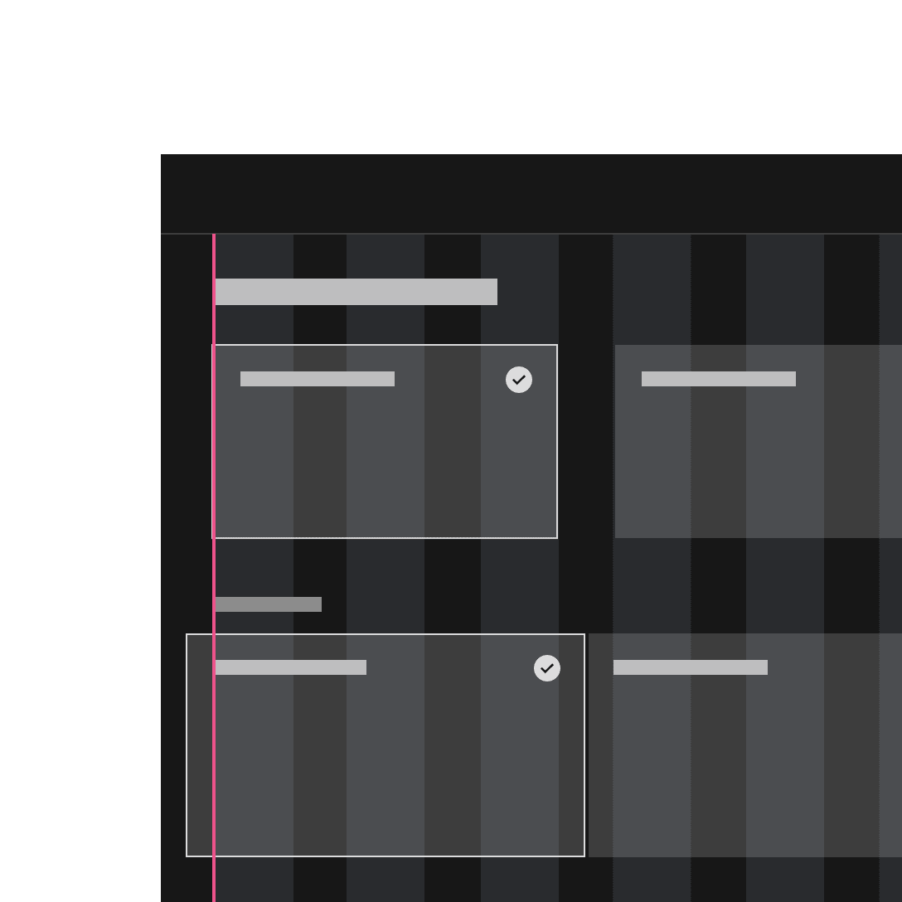

  </DoDont>
</DoDontRow>


<Caption>
  1. Condensed grid mode <br /> 2. Wide grid mode{' '}
</Caption>

<br />
<br />

<DoDontRow>
  <DoDont type="do" caption="Do apply different grid modes to different components (like input fields with labels and tiles).">

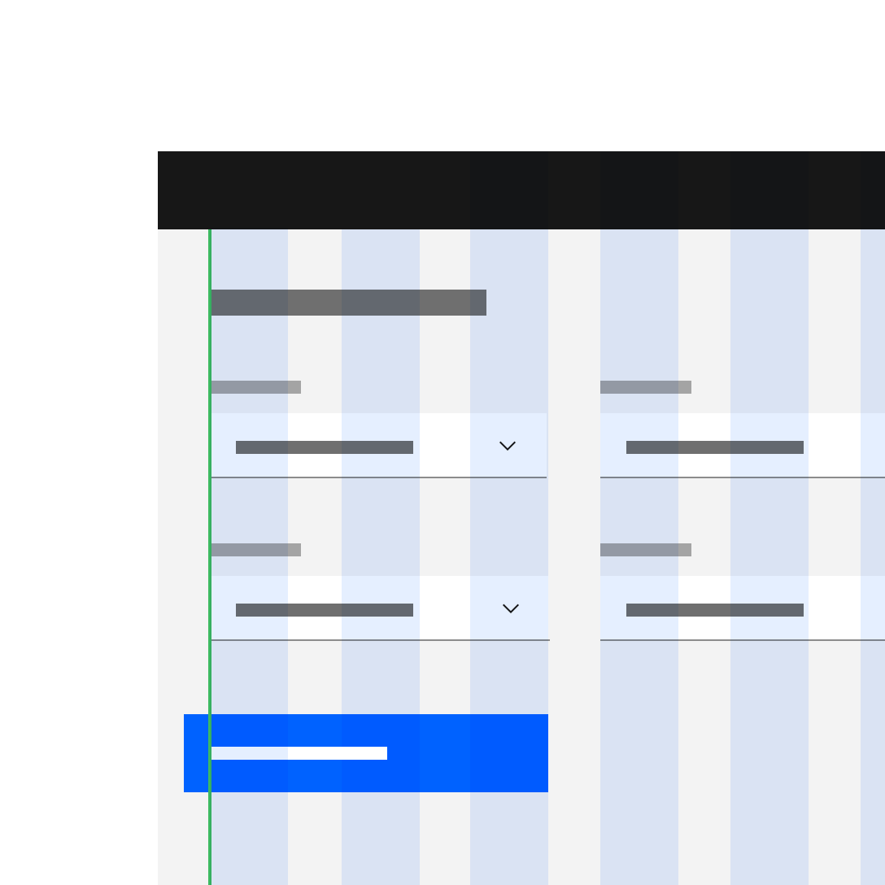

  </DoDont>
  <DoDont type="dont" caption="Do not apply different grid modes to the same component on the same page.">

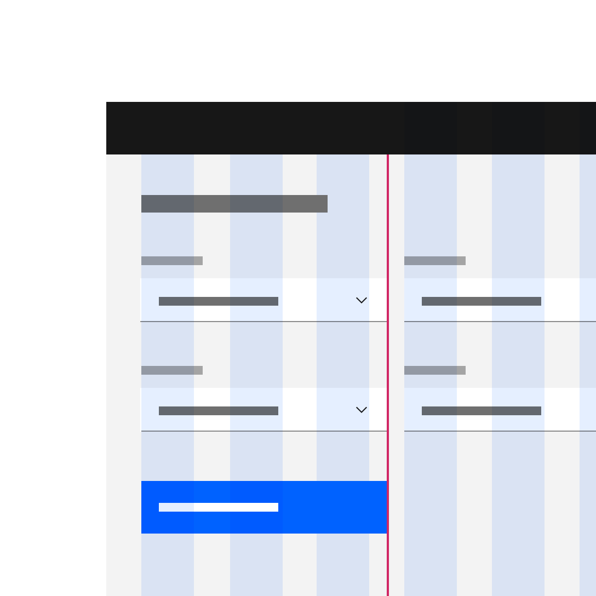

  </DoDont>
</DoDontRow>

## Incorporating the Shell

We cover more about shell behavior on the 2x Grid Basics tab in the
[Grid influencers](/guidelines/2x-grid/overview/#grid-influencers) section.
However, we've had a lot of questions about how the shell works in conjunction
with our grid. That's why we recently incorporated the shell into our grid
tooling as a Sketch template. We'd also like to show it in action here in a
product.

<Title> Collapsed state </Title>

<Row>
  <Column noGutterSm>
    <div className="grid-demo override override">
      <aside class="side-nav"></aside>
      <div class="cds--grid">
        <div class="cds--row hide-sm">
          <div class="cds--col hide-sm">1 of 8</div>
          <div class="cds--col hide-sm">1 of 8</div>
          <div class="cds--col hide-sm">1 of 8</div>
          <div class="cds--col hide-sm">1 of 8</div>
          <div class="cds--col hide-sm">1 of 8</div>
          <div class="cds--col hide-sm">1 of 8</div>
          <div class="cds--col hide-sm">1 of 8</div>
          <div class="cds--col hide-sm">1 of 8</div>
        </div>
        <div class="cds--row">
          <div class="cds--col">1 of 4</div>
          <div class="cds--col">1 of 4</div>
          <div class="cds--col">1 of 4</div>
          <div class="cds--col">1 of 4</div>
        </div>
        <div class="cds--row">
          <div class="cds--col">1 of 2</div>
          <div class="cds--col">1 of 2</div>
        </div>
        <div class="cds--row">
          <div class="cds--col">1 of 1</div>
        </div>
      </div>
    </div>

```html
<SideNav expanded="{false}">
  <!-- Toggle side-nav -->
</SideNav>
<Grid>
  <!-- ... -->
</Grid>
```

  </Column>
</Row>

<Title> Expanded state</Title>

<Row>
  <Column noGutterSm>
    <div className="grid-demo override override">
      <aside class="side-nav side-nav--expanded"></aside>
      <div class="cds--grid">
        <div class="cds--row">
          <div class="cds--col hide-sm">1 of 8</div>
          <div class="cds--col hide-sm">1 of 8</div>
          <div class="cds--col hide-sm">1 of 8</div>
          <div class="cds--col hide-sm">1 of 8</div>
          <div class="cds--col hide-sm">1 of 8</div>
          <div class="cds--col hide-sm">1 of 8</div>
          <div class="cds--col hide-sm">1 of 8</div>
          <div class="cds--col hide-sm">1 of 8</div>
        </div>
        <div class="cds--row">
          <div class="cds--col">1 of 4</div>
          <div class="cds--col">1 of 4</div>
          <div class="cds--col">1 of 4</div>
          <div class="cds--col">1 of 4</div>
        </div>
        <div class="cds--row">
          <div class="cds--col">1 of 2</div>
          <div class="cds--col">1 of 2</div>
        </div>
        <div class="cds--row">
          <div class="cds--col">1 of 1</div>
        </div>
      </div>
    </div>

```html
<SideNav expanded="{true}">
  <!-- Toggle side-nav -->
</SideNav>
<Grid>
  <!-- ... -->
</Grid>
```

  </Column>
</Row>

<br />

#### Usage

The most commonly used product shell is the flexible panel. The collapsed
flexible panel expands when the user hovers over any portion of it. When
flexible panels expand, they either condense both the content and the grid or
they push content beyond the edge of the browser.

<Video title="Usage" vimeoId="363369752" />

## Alignments

### Vertical spacing

Add info about `Stack` component and design guidance?

<Row className="resource-card-group">
  <Column colLg={4} colMd={4} noGutterSm>
  <ResourceCard
    subTitle="React"
    href="https://react.carbondesignsystem.com/?path=/story/layout-stack--default"
    >

<MdxIcon name="react" />

  </ResourceCard>
</Column>
</Row>

## Techniques

### Full bleed content

By default, the grid maintains a max width of 1584px, but allows content to span
infinitely. When you want background colors or an image to go edge-to-edge, you
will need to create a wrapping node around your grid with the color that you are
looking to apply.

#### Usage

<br />

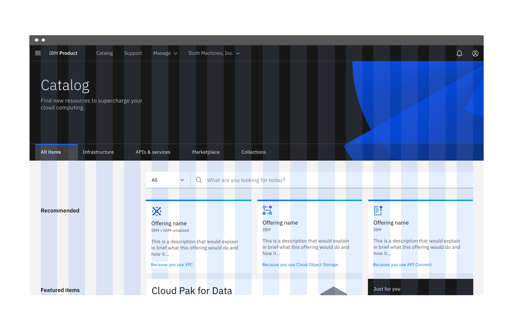

### Aspect ratios

When designing fluid layouts, it’s helpful for an asset or card to be a specific
aspect ratio. We offer a
[React](https://react.carbondesignsystem.com/?path=/story/components-aspectratio--default)
component to automatically render your content to a specific ratio.

We discuss aspect ratios and various grid behaviors more in depth on the 2x Grid
Basics tab, both in the
[Aspect ratios](/guidelines/2x-grid/overview/#aspect-ratio) section and in the
[Grid behaviors](/guidelines/2x-grid/overview/#grid-behaviors) section.

<Row className="resource-card-group">
  <Column colLg={4} colMd={4} noGutterSm>
  <ResourceCard
    subTitle="React"
    href="https://react.carbondesignsystem.com/?path=/story/components-aspectratio--default"
    >

<MdxIcon name="react" />

  </ResourceCard>
</Column>
</Row>

#### Basic usage

We understand that when using responsive grid classes, it's not always possible
for every image or container to be one of these sizes. However it's important to
use them to set the foundation of your layouts, especially in the case of same
size tiles.

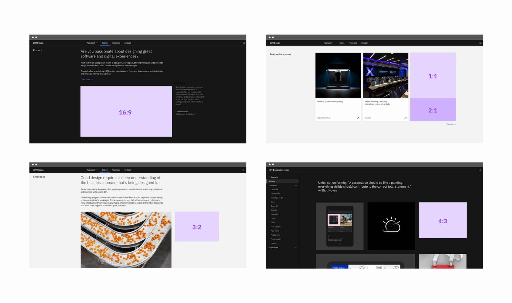

<br />

#### Adaptability

Image size can change ratios when the breakpoint changes.

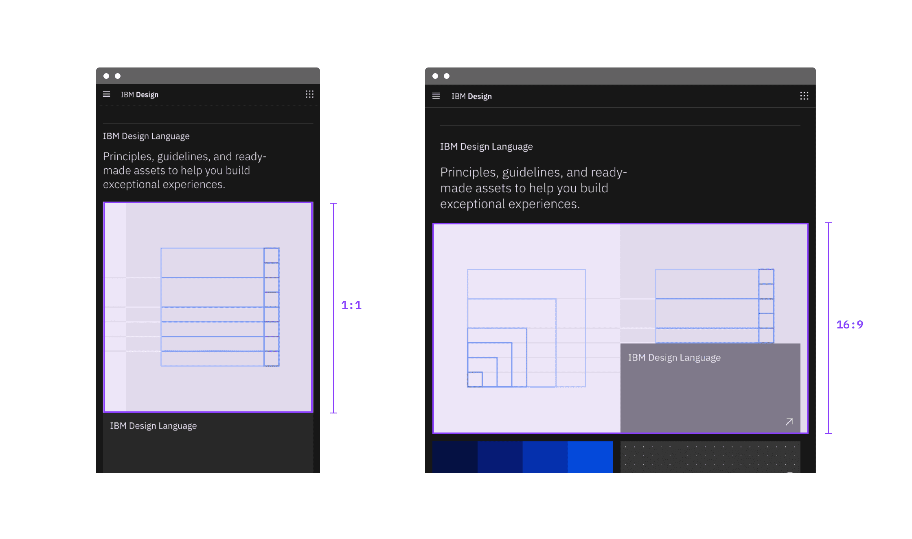

<DoDontRow>
  <DoDont type="do" caption="When combining tiles, or tiles and images, do give each a designated aspect ratio.">

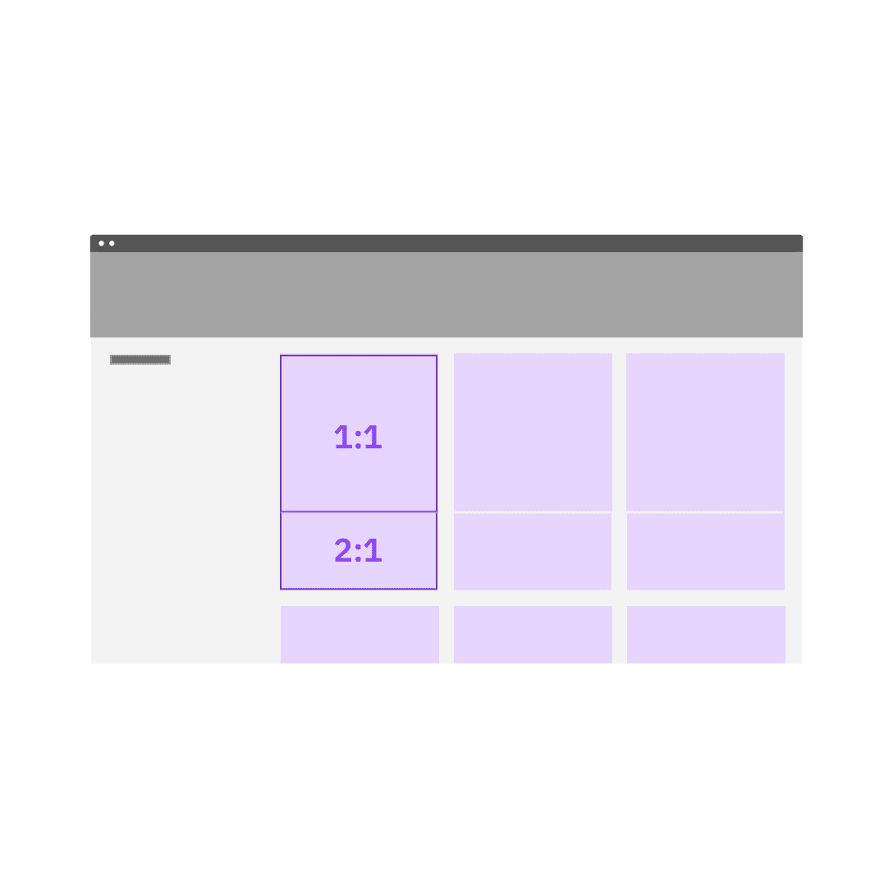

  </DoDont>
  <DoDont type="dont" caption="Do not shoe-horn each tile / tile and image into a combined aspect ratio.">

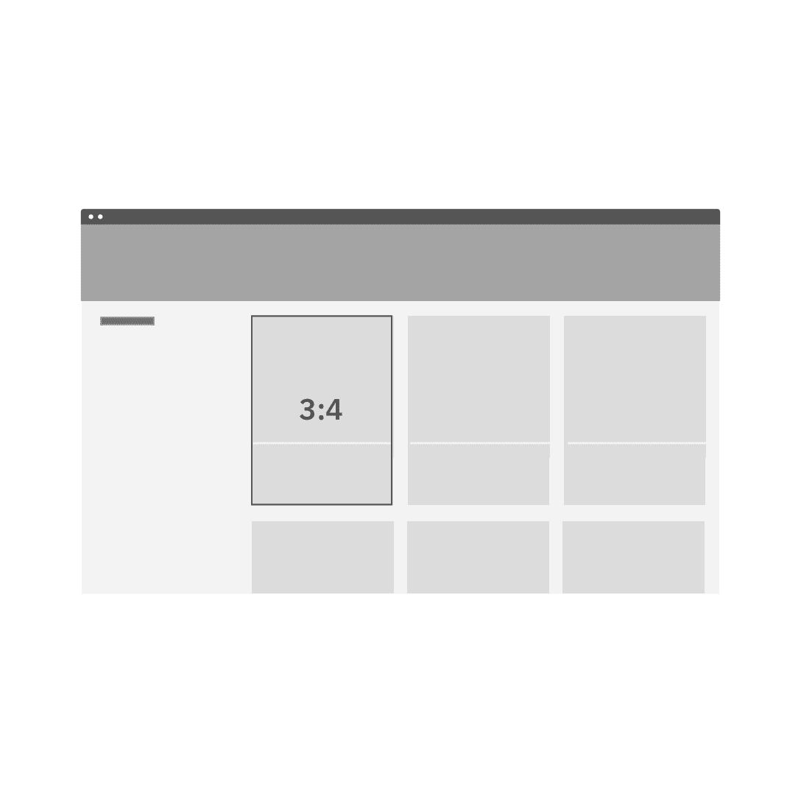

  </DoDont>
</DoDontRow>

<DoDontRow>
  <DoDont type="do" caption="Do use a designated aspect ratio for a grid of same-size fixed ratio tiles.">

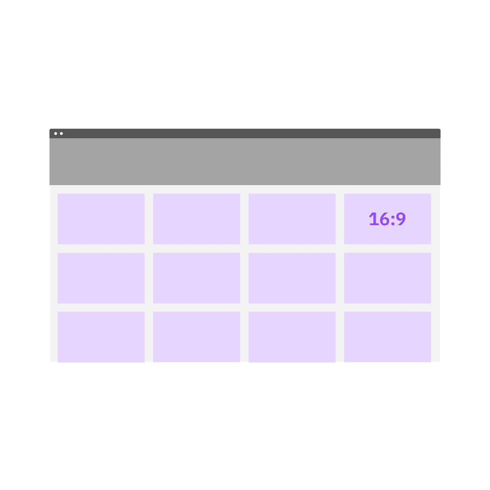

  </DoDont>
  <DoDont type="dont" caption="Do not start with a random aspect ratio for a grid of same-size fixed ratio tiles.">

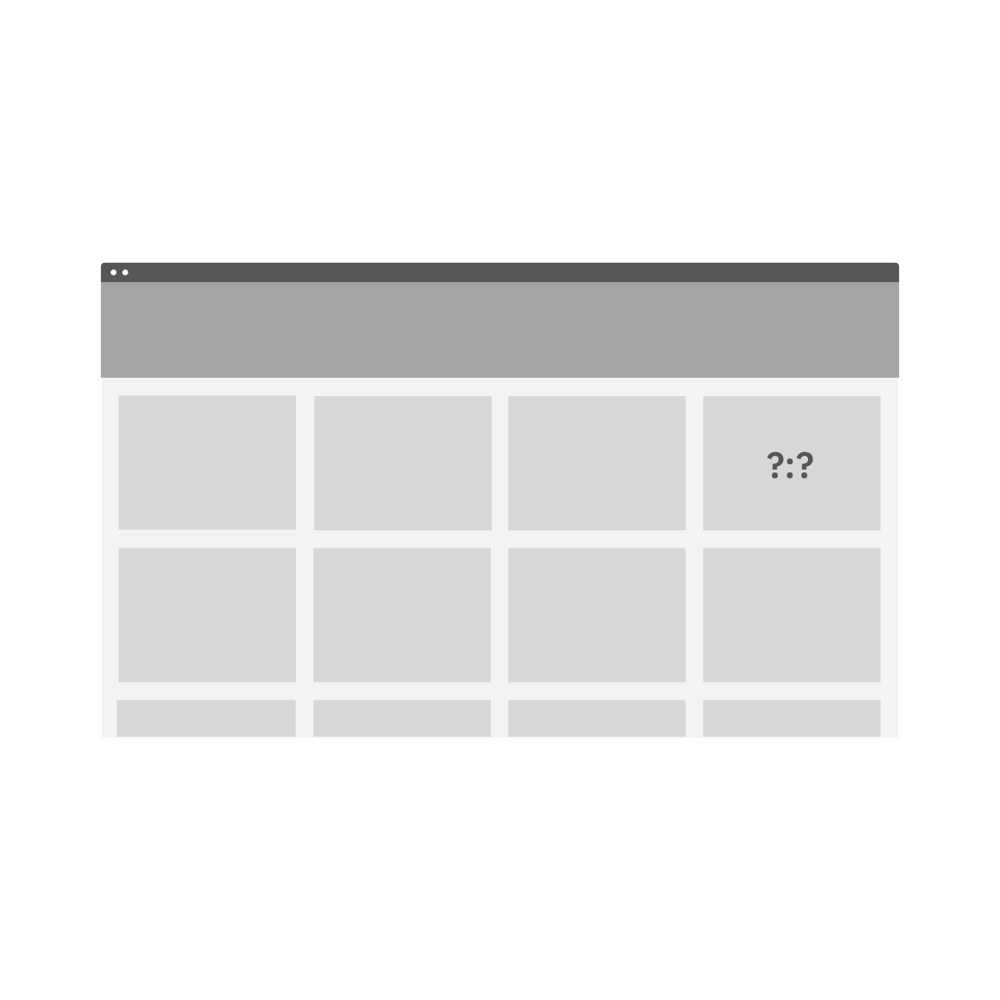

  </DoDont>
</DoDontRow>

## Resources

<Row className="resource-card-group">
  <Column colMd={4} colLg={4} noGutterSm>
    <ResourceCard
      subTitle="Carbon grid package"
      href="https://github.com/carbon-design-system/carbon/tree/main/packages/grid"
    >

<MdxIcon name="github" />

  </ResourceCard>
  </Column>
  <Column colMd={4} colLg={4} noGutterSm>
    <ResourceCard
      subTitle="Carbon CSS Grid demo"
      href="https://carbon-elements.netlify.app/grid/examples/css-grid/"
    >

<MdxIcon name="bee" />

  </ResourceCard>
  </Column>
    <Column colMd={4} colLg={4} noGutterSm>
    <ResourceCard
      subTitle="Carbon Flex Grid demo"
      href="https://carbon-elements.netlify.app/grid/examples/preview/"
    >

<MdxIcon name="bee" />

  </ResourceCard>
  </Column>
  <Column colMd={4} colLg={4} noGutterSm>
    <ResourceCard
      subTitle="Carbon grid docs API"
      href="https://github.com/carbon-design-system/carbon/blob/main/packages/grid/docs/sass.md#api"
    >

<MdxIcon name="github" />

  </ResourceCard>
  </Column>
  <Column colMd={4} colLg={4} noGutterSm>
    <ResourceCard
      subTitle="React Storybook"
      href="https://react.carbondesignsystem.com/?path=/story/grid--auto-columns"
    >

<MdxIcon name="storybook" />

  </ResourceCard>
  </Column>
  <Column colMd={4} colLg={4} noGutterSm>
    <ResourceCard
      subTitle="Hide at Breakpoint Helpers on Storybook"
      href="https://react.carbondesignsystem.com/?path=/story/helpers-hideatbreakpoint--hide-at-breakpoint"
    >

<MdxIcon name="storybook" />

  </ResourceCard>
  </Column>
</Row>
