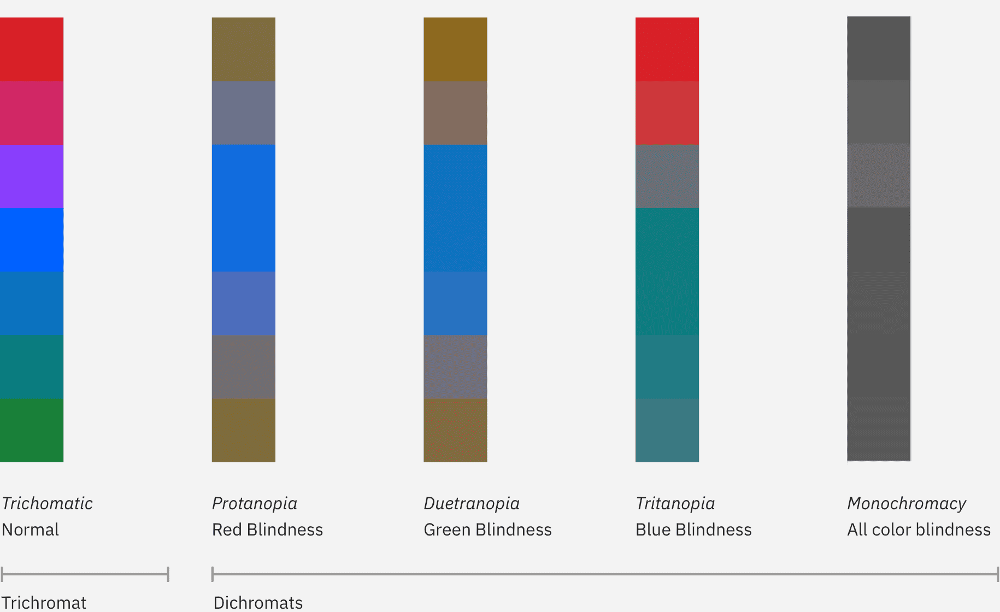

---
label:
  IBM firmly believes that web and software experiences should be accessible for
  everyone, regardless of abilities or impairments.
title: Accessibility
description:
  IBM firmly believes that web and software experiences should be accessible for
  everyone. Carbon is committed to following best practices when it comes to
  accessibility.
tabs: ['Overview', 'Color', 'Developers', 'Keyboard']
---

<PageDescription>

Visual impairments can include low vision, color blindness, and complete
blindness. Carbon components are designed to accommodate the entire spectrum of
visual impairment, though designers still need to exercise diligence to ensure
that the components are used correctly.

</PageDescription>

<AnchorLinks>

<AnchorLink>Color contrast</AnchorLink>
<AnchorLink>Low vision</AnchorLink>
<AnchorLink>Tools</AnchorLink>
<AnchorLink>Resources</AnchorLink>

</AnchorLinks>

## Color contrast

Carbon strives to meet
[WCAG AA standards](https://www.w3.org/TR/UNDERSTANDING-WCAG20/visual-audio-contrast-contrast.html)
across all standard themes in the system, including color contrast ratios.

| Element type  | Contrast ratio |
| ------------- | -------------- |
| Standard text | 4.5:1          |
| Large text    | 3:1            |
| UI components | 3:1            |

#### Standard text

Standard text and images of text must have a contrast ratio of at least
**4.5:1**.

#### Large text

Large text (at least 24 px regular and light / 19 px semi-bold) must have a
contrast ratio of **3:1.**

#### Text against non-static backgrounds

When text is rendered on a gradient background or image, make sure the text
color meets contrast standards in all places it appears. This is especially
important for parallax applications or animations where text and backgrounds are
moving independently of each other.

Visual information used to indicate states and boundaries of UI components must
have a contrast ratio of 3:1 against adjacent colors. See
[IBM checkpoint 1.4.11 Non-text Contrast](https://www.ibm.com/able/requirements/requirements/#1_4_11).

<!-- To view best practices for using color in data visualization, view the [Data Vis color](/data-visualization/overview/colors) page. -->

### Use of color and color blindness

Don't rely on color alone to convey meaning. This includes conveying
information, indicating an action, prompting the user for a response, or
distinguishing one visual element from another. When designing with color, it
might help to use a color-blind simulator to review visibility of content. If
you're working in Figma, we recommend the
[Stark](https://www.figma.com/community/plugin/732603254453395948/Stark) plugin.

<Row>
<Column colLg={8}>

</Column>
</Row>

## Tools

<Row className="resource-card-group">
<Column colMd={4} colLg={4} noGutterSm>
<ResourceCard
    subTitle="High contrast Chrome plugin"
    href="https://chrome.google.com/webstore/detail/high-contrast/djcfdncoelnlbldjfhinnjlhdjlikmph/related?hl=en"
     >

</ResourceCard>
</Column>
<Column colMd={4} colLg={4} noGutterSm>
<ResourceCard
    subTitle="Stark Figma plugin"
    href="https://www.figma.com/community/plugin/732603254453395948/Stark"
     >

</ResourceCard>
</Column>
<Column colMd={4} colLg={4} noGutterSm>
<ResourceCard
    subTitle="Color contrast tool"
    href="https://marijohannessen.github.io/color-contrast-checker/"
     >

</ResourceCard>
</Column>
</Row>

## Resources

<Row className="resource-card-group">
<Column colMd={4} colLg={4} noGutterSm>
<ResourceCard
    subTitle="IBM Equal Access Toolkit"
    href="https://www.ibm.com/able/toolkit"
     >

</ResourceCard>
</Column>
<Column colMd={4} colLg={4} noGutterSm>
<ResourceCard
    subTitle="IBM Web Accessibility Checklist"
    href="https://www.ibm.com/able/requirements/requirements/"
     >

</ResourceCard>
</Column>
<Column colMd={4} colLg={4} noGutterSm>
<ResourceCard
    subTitle="WCAG 2.1 guidelines"
    href="https://www.w3.org/TR/WCAG21/"
     >

</ResourceCard>
</Column>
<Column colMd={4} colLg={4} noGutterSm>
<ResourceCard
    subTitle="W3C low vision requirements"
    href="https://www.w3.org/TR/low-vision-needs/"
     >

</ResourceCard>
</Column>
</Row>
