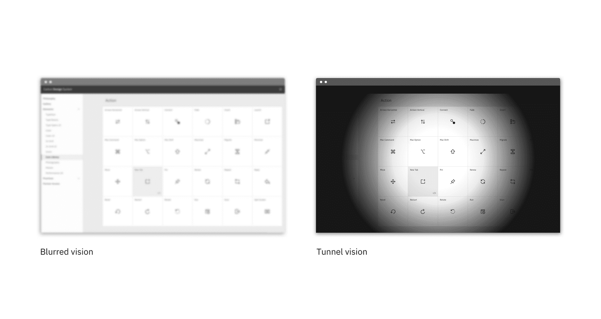

---
label:
  IBM firmly believes that web and software experiences should be accessible for
  everyone, regardless of abilities or impairments.
title: Accessibility
description:
  IBM firmly believes that web and software experiences should be accessible for
  everyone. Carbon is committed to following and complying with accessibility
  best practices.
tabs: ['Overview', 'Color', 'Developers', 'Keyboard']
---

<PageDescription>

IBM firmly believes that web and software experiences should be accessible for
everyone. Carbon is committed to following and complying with accessibility best
practices.

</PageDescription>

<AnchorLinks>

<AnchorLink>Carbon and accessibility</AnchorLink>
<AnchorLink>Global accessibility standards</AnchorLink>
<AnchorLink>Tools</AnchorLink>
<AnchorLink>Resources</AnchorLink>

</AnchorLinks>

## Carbon and accessibility

Accessible design not only helps users with disabilities; it provides better
user experiences for everyone.

An accessible product should:

- Give all users the same quality of experience
- Adapt to users and situations

Carbon components follow the
[IBM Accessibility Checklist](https://www.ibm.com/able/requirements/requirements/)
which is based on WCAG AA, Section 508, and European standards. The Carbon team
strives to write perceivable, operable, and understandable patterns for all
users—including those employing a screen reader or other assistive technology.

Individually accessible elements and components are part of building accessible
products. Use this guide to design and build products that anyone can use.

### Blind users

#### How they experience an interface

- May use a screen reader to experience interfaces
- May rely on Braille output
- Cannot be expected to use a pointer or mouse for input

#### What designers should think about

- Is visual information translated effectively into text? Can the image be
  understood through its metadata alone?
- When possible, test all designs through a screen reader.

#### How this applies to everyone

- As audio-only interfaces gain popularity through devices like AI assistants,
  users are expecting more and more from the audio representations of
  experiences.

### Low-vision users

Low vision can include partial sight in one or both eyes and can range from mild
to severe. It affects approximately 4% of the world’s population.

#### How they experience an interface

- May use screen readers, screen magnifiers, high-contrast modes, and/or
  monochrome displays
- May have their browser font size adjusted to a larger setting
- May not use adaptive technology at all

#### What designers should think about

- Maximize the readability and visual clarity of content.
- Consider how the relative proximity of information changes when a page is
  magnified.
- Follow
  [keyboard guidelines](https://www.nngroup.com/articles/keyboard-accessibility/)
  and test with a screen reader to ensure the page is read to the user in a
  logical order.

#### How this applies to everyone

- Users without disabilities sometimes need to view screens in poor lighting
  conditions. For example, it's difficult to see a screen outside on a bright
  day. A higher-contrast design will make the screen more usable for everyone.
- Vision worsens gradually starting around age 40, and good contrast helps this
  very large demographic use your interface.

### Color-blind users

Color-blindness affects 8% of all men and 0.4% of women.

#### How they experience an interface

- Will not be able to differentiate between some colors on an interface
- Rely on non-color information to use an interface

#### What designers should think about

- Carbon color themes strive to comply with the
  [WCAG 2.1 AA guidelines for contrast](https://www.w3.org/WAI/cognitive/). The
  color palette should ensure you avoid contrast issues when used correctly. If
  you're working in Figma, we recommend the
  [Stark](https://www.figma.com/community/plugin/732603254453395948/Stark)
  plugin.
  <!-- - To view best practices for using color in Data Visualization, view the [Data Vis](/data-visualization/overview/colors) color page. -->

### Low vision

Low vision can include partial sight in one or both eyes and can range from mild
to severe. It affects about 4% of the world's population.

| Type                       | Visual deficiency                                                                        |
| -------------------------- | ---------------------------------------------------------------------------------------- |
| _Low acuity_               | Also known as "blurred vision". Can make text difficult to read, since it appears fuzzy. |
| _Low contrast sensitivity_ | Decreased ability to determine fine detail and distinguish one object from another       |
| _Obstructed visual field_  | The user's view is partially obstructed. Can include central vision and spotty vision.   |
| _Retinitis Pigmentosa_     | Also known as "tunnel vision". The user is only able to see central elements.            |

<Title>Low vision disabilities</Title>

#### Designing for low vision

Low vision users may be using a screen reader to preview your website or
experience, so be sure to follow
[keyboard guidelines](/guidelines/accessibility/keyboard) to ensure the page is
read to the user in a logical order.

### Deaf and hard-of-hearing users

#### How they experience an interface

- May rely on closed captioning and other alternative representations of audio

#### What designers should think about

- Find an alternative way to convey information exclusively with sound.
- Transcribe and caption all videos and animations that have meaningful audio.

#### How this applies to everyone

- All users can benefit from closed captioning. Imagine using your device in a
  loud environment or, alternatively, in a quiet environment when it wouldn't be
  appropriate to turn your sound on.

### Physical disabilities

#### How users with physical disabilities experience an interface

- May rely on keyboards, track balls, voice recognition, and other assistive
  technologies to interact with an interface
- May not be able to use a keyboard, mouse, or other pointer

#### What designers should think about

- Design for keyboard interaction
- Learn how to navigate using a
  [keyboard](https://help.gnome.org/users/gnome-help/stable/keyboard-nav.html.en)
  and spend some time navigating the web and digital products like email using
  only the keyboard.

#### How this applies to everyone

- Many users prefer to navigate interfaces with a keyboard and no mouse for
  efficiency. Good keyboard navigation can help everyone be more productive.

### Users with cognitive disabilities

Functional cognitive disabilities can result in difficulties with:

- Memory
- Problem solving
- Attention
- Reading, linguistic, and verbal comprehension
- Mathematics
- Visual comprehension

#### How they experience an interface

- May have limited working memory and need information to remain visible
  throughout the completion of a task
- May experience seizures when exposed to flashing content due to epilepsy

#### What designers should think about

- Designers should avoid complex language, autoplaying animations and videos,
  and flashing animations. Designs should pass usability heuristics, such as
  cognitive walkthroughs, to ensure users do not feel overloaded when completing
  tasks.
- Design in as linear a fashion as possible and focus on design heuristics that
  have to do with cognitive load and memory.

#### How this applies to everyone

- Best practices for cognitive disabilities benefit all users. Busy environments
  can tax your cognitive load. Aging adults may also experience a decline in
  cognitive abilities. Placing a low cognitive load on users reduces mistakes
  and improves effectiveness, regardless of their abilities.

## Global accessibility standards

- [World Wide Web Consortium](https://www.w3.org/WAI/) (W3C)'s Web Accessibility
  Initiative (WAI) provides resources to improve the accessibility of the World
  Wide Web.
- Web Accessibility Initiative (WAI) contributors create and maintain the
  [Web Content Accessibility Guidelines](https://www.w3.org/TR/WCAG21/) (WCAG),
  the global accessibility standard.

## Tools

<Row className="resource-card-group">
<Column colMd={4} colLg={4} noGutterSm>
<ResourceCard
    subTitle="IBM Equal Access Toolkit"
    href="https://www.ibm.com/able/toolkit"
     >

</ResourceCard>
</Column>
<Column colMd={4} colLg={4} noGutterSm>
<ResourceCard
    subTitle="High Contrast Chrome plugin"
    href="https://chrome.google.com/webstore/detail/high-contrast/djcfdncoelnlbldjfhinnjlhdjlikmph/related?hl=en"
     >

</ResourceCard>
</Column>
<Column colMd={4} colLg={4} noGutterSm>
<ResourceCard
    subTitle="Stark Figma plugin"
    href="https://www.figma.com/community/plugin/732603254453395948/Stark"
     >

</ResourceCard>
</Column>
<Column colMd={4} colLg={4} noGutterSm>
<ResourceCard
    subTitle="Color contrast tool"
    href="https://marijohannessen.github.io/color-contrast-checker/"
     >

</ResourceCard>
</Column>
</Row>

## Resources

<Row className="resource-card-group">
<Column colMd={4} colLg={4} noGutterSm>
  <ResourceCard
    subTitle="IBM Accessibility Checklist"
    href="https://www.ibm.com/able/requirements/requirements/"
    >

  </ResourceCard>
</Column>
</Row>
