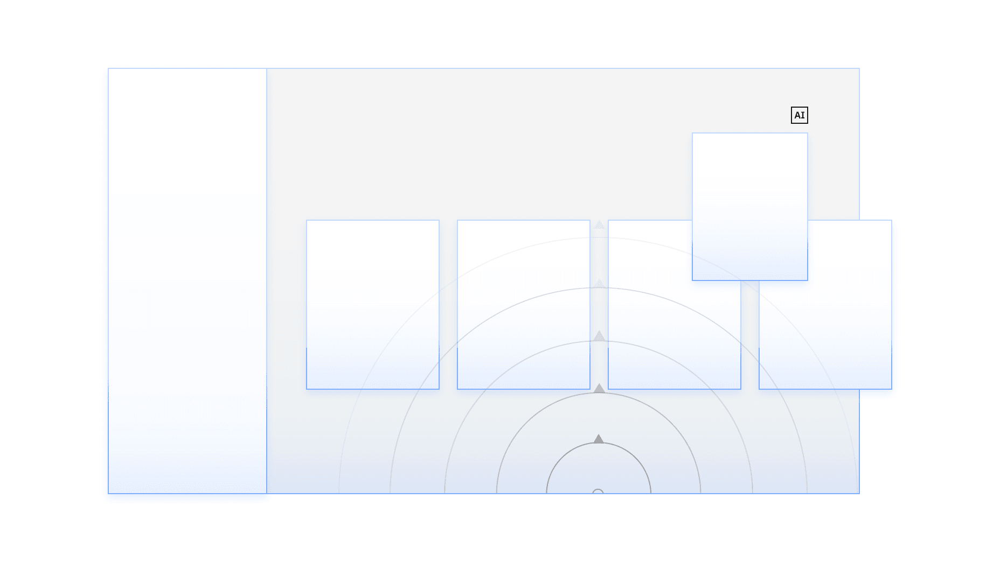
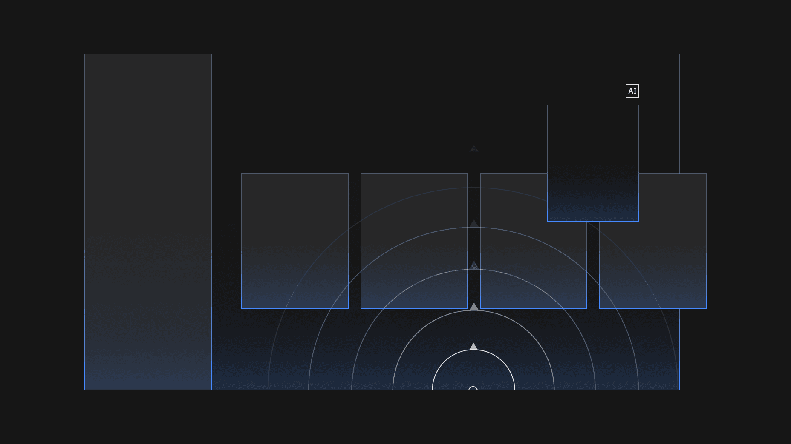
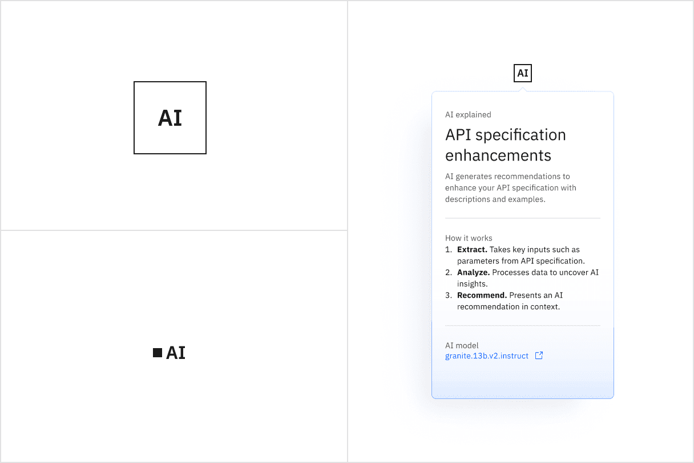
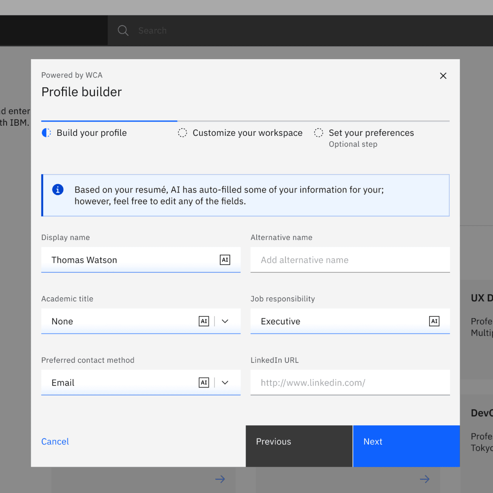
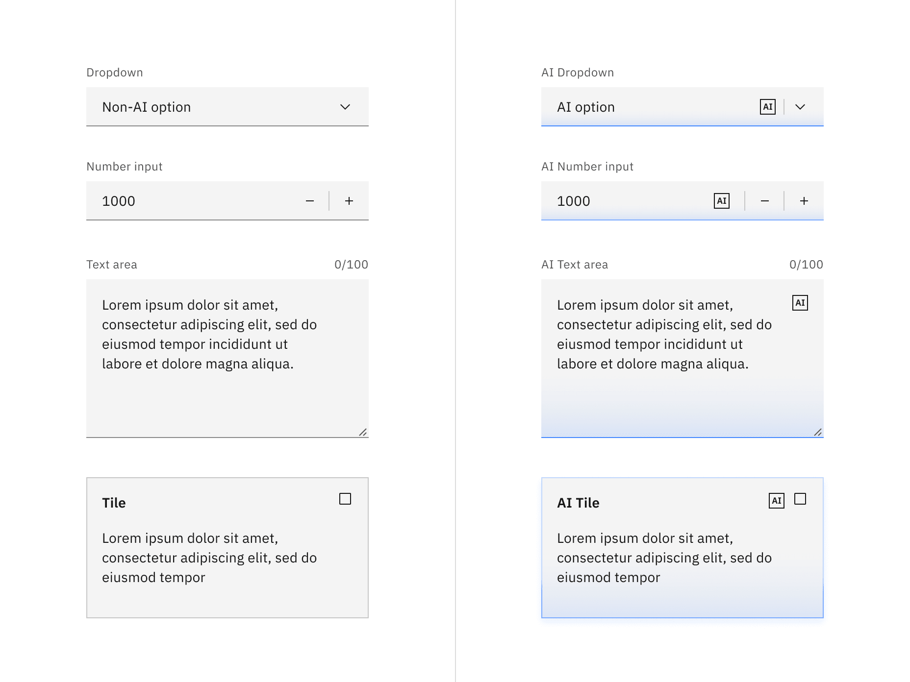
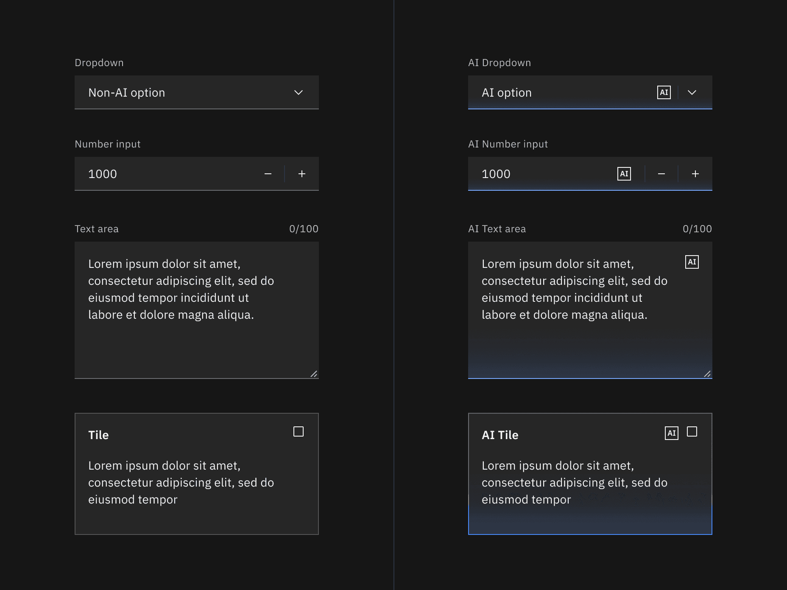
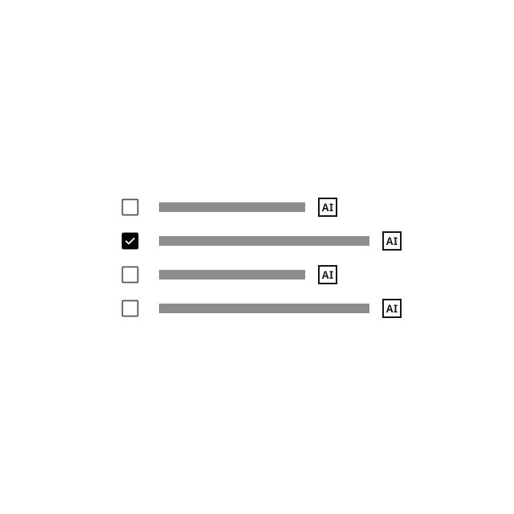
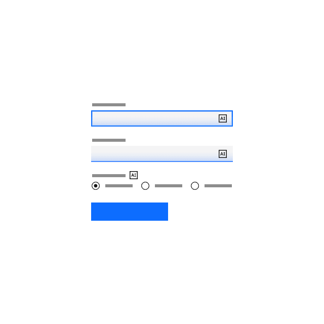
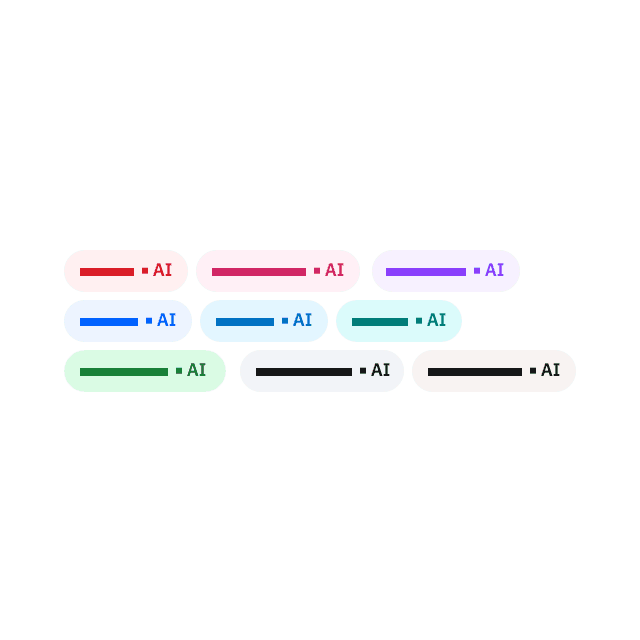

<PageDescription>

Carbon for AI is an extension of the Carbon system, designed to give AI
instances in IBM products a visually and behaviorally distinct identity.

</PageDescription>

<AnchorLinks>

<AnchorLink>Introduction</AnchorLink>
<AnchorLink>Style elements</AnchorLink>
<AnchorLink>AI explainability</AnchorLink>
<AnchorLink>AI label</AnchorLink>
<AnchorLink>AI chat</AnchorLink>
<AnchorLink>AI components</AnchorLink>
<AnchorLink>Accessibility</AnchorLink>
<AnchorLink>AI resources</AnchorLink>

</AnchorLinks>

<Row>
<Column colLg={12}>

</Column>
</Row>

## Introduction

AI introduces a range of new responsibilities when designing experiences across
our software, particularly regarding trust and transparency. Carbon for AI is
the framework for identifying AI-generated content and delivering explainability
in our products.

#### Use the AI label and styling to mark any instances of AI usage

Transparency of AI presence is key to user trust. Having a consistent identity
helps build awareness and anticipation of AI presence across our experiences.

#### Provide transparency of AI at each level of the experience

Whether AI exists within a single word or across the entire page, users should
clearly understand how pervasive an AI is implemented.

#### Integrate explainability into the overall user workflow and experience

This integration requires you to minimize distractions and show explanations
only when needed or requested by the user.

#### Don’t use the Carbon for AI styling as decoration

While these new styling elements are enticing, they are strictly intended to
identify any instances of AI being used in an experience.

### What Carbon for AI provides

- A set of guidelines and considerations for incorporating AI into products
- Visual guidance and style elements to represent AI’s presence
- A set of reusable core components with the AI styling already applied
- New custom AI components used for AI transparency and explainability

### Assets

| AI Asset                                                         | Status  | Figma library                                                                                                               | Code                                                                                                                                                                                                                     |
| ---------------------------------------------------------------- | ------- | --------------------------------------------------------------------------------------------------------------------------- | ------------------------------------------------------------------------------------------------------------------------------------------------------------------------------------------------------------------------ |
| [AI style elements](/guidelines/carbon-for-ai/#style-elements)   | Stable  | [(v11) All themes](<https://www.figma.com/design/YAnB1jKx0yCUL29j6uSLpg/(v11)-All-themes---Carbon-Design-System?m=auto>)    | [@carbon/themes](https://github.com/carbon-design-system/carbon/blob/cd57b295688aad843fc7d7b4585db4ee1987afe8/packages/themes/src/white.js#L209)                                                                         |
| [AI Carbon components](/guidelines/carbon-for-ai/#ai-components) | Stable  | [(v11) All themes](<https://www.figma.com/design/YAnB1jKx0yCUL29j6uSLpg/(v11)-All-themes---Carbon-Design-System?m=auto>)    | [React](https://react.carbondesignsystem.com/?path=/docs/components-ailabel--overview), [Web-components](https://web-components.carbondesignsystem.com/?path=/docs/components-ai-label--overview)                        |
| [AI chat](/guidelines/carbon-for-ai/#ai-chat)                    | Preview | [Chat component library](https://www.figma.com/design/j6Wh5Ud6cDLwlx1i4pmQo7/Chat-Component-Library---Carbon-for-AI?m=auto) | [watsonx Assistant](https://web-chat.global.assistant.watson.cloud.ibm.com/docs.html), [@carbon-labs/ai-chat](https://github.com/carbon-design-system/carbon-labs/tree/main/packages/web-components/src/components/chat) |

## Style elements

Carbon for AI styling builds on the core Carbon library principles, using light
as a metaphor to “illuminate” AI-generated content. This makes AI-generated or
AI-recommended content distinctive and stands out for users. _For IBMers only_:
To learn more about the Carbon for AI styling, see
[Design for AI: Style elements](https://w3.ibm.com/w3publisher/design-for-ai/carbon-for-ai/ai-style-elements).

#### Designed to illuminate AI to the users

Carbon for AI uses light-inspired effects like brightness, glow, and gradients
to emphasize AI instances across the experience.

#### An extension of the IBM Design Language

Carbon for AI is designed to coexist alongside the Carbon themes but has its own
unique visual characteristics that distinguishes it as AI while following the
IBM Design Language DNA and principles.

#### New color and style tokens for creating your AI experiences

To accommodate for these AI styles, we are introducing a new suite of color and
style tokens that can be found within the main Carbon themes. Using the AI
tokens does not require a different theme or elements package. When building
custom AI component variants or instances in your UI use these new color tokens
to stay consistent with the AI styling. For a full list of the new tokens, go to
[color tokens](/elements/color/tokens).

<Row>
<Column colLg={12}>

<Tabs>

<Tab label="Light mode">

</Tab>

<Tab label="Dark mode">

</Tab>

</Tabs>

</Column>
</Row>

## AI explainability

Explainability is a set of processes and methods that make AI decisions more
comprehensible to humans. _For IBMers only_: To learn more about explainability,
see
[Design for AI: Explainability](https://w3.ibm.com/w3publisher/design-for-ai/ai-ethics/explainability).

#### Well-designed explainability:

- Builds trust with users
- Improves understanding of an AI system
- Increases usage and interaction
- Enables product teams to gain further insights to improve the AI system

#### Use the AI label as the path to explainability

The AI label is the primary indicator to communicate that AI is present, and
it’s how users can access explainability content.

#### Start with summarized explanations

As a first layer of explainability, use the explainability pop-over attached to
the AI label to provide a quick, in-context option to explain AI results for a
particular instance.

<Row>
<Column colLg={12}>

<Tabs>

<Tab label="Light mode">

</Tab>

<Tab label="Dark mode">

</Tab>

</Tabs>

</Column>
</Row>

### Explainability resources

<Row className="resource-card-group">
<Column colLg={4} colMd={4} noGutterSm>
  <ResourceCard
    subTitle="Designing for Explainable AI"
    href="https://ibm.ent.box.com/v/designingXAI"
    >

<MdxIcon name="bee" />

  </ResourceCard>
</Column>
<Column colLg={4} colMd={4} noGutterSm>
  <ResourceCard
    subTitle="AI Explainability kit (Beta)"
    href="https://www.figma.com/design/jLtMeH3RsHnDs7xF9xUS8f/Carbon-AI---AI-Details-Beta?m=auto&t=Fz8SUpQOgZSNH9Ab-6"
    >

<MdxIcon name="figma" />

  </ResourceCard>
</Column>
</Row>

## AI label

<InlineNotification>

**Formerly AI slug:** The AI label was previously called "AI Slug" but has been
updated to better reflect its usage. This name change will be reflected in code
and Figma once it moves to stable in the near future.

</InlineNotification>

The AI label is a component used as an indicator of AI instances in the UI. It
is intended for any scenario where AI is generating content to reinforce AI
transparency, accountability, and explainability at any interface level. It
enables more effective recognition and recall of AI instances in a way that is
identifiable across any IBM product.

The AI label is also the trigger for the explainability popover which serves as
the first layer of explainability. It provides a consistent, up-front way to
access explainability with the option to dig into more details if needed.

<Row>
<Column colLg={8}>

<Tabs>

<Tab label="Light mode">

</Tab>

<Tab label="Dark mode">

</Tab>

</Tabs>

</Column>
</Row>

### When to use the AI label

#### Mark AI-generated content with an AI label

AI transparency is key, and the AI label is an accessible, interactive element
that can mark these instances as presented in the interface. The label has been
designed to work in many instances where AI-generated content can be surfaced as
in components, see the
[component section](/guidelines/carbon-for-ai/#ai-components) for more details.

#### Use the AI label to provide a consistent visual reference point for AI

For recognition and recall, users need a consistent, identifiable visual
reference to look to when they need to understand more details about how the AI
was built.

#### Use the AI label as a pathway to explainability

Users must clearly understand how to access more details about how an AI was
built. By providing a bridge to explainability from the AI label, users are
given a recognizable location to learn more about the AI model.

For more information about using the AI label, see the
[AI label](/components/ai-label/usage/) component page.

<Row>
<Column colLg={8}>

</Column>
</Row>

## AI chat

AI chat is a conversational framework between a user and an AI that can aid in
creating tasks, finding insights, tracking documents, and more. _For IBMers
only:_ To learn more about chat, see
[Design for AI: Chat pattern](https://w3.ibm.com/w3publisher/design-for-ai/carbon-for-ai/ai-chat-patterns).

<Row>
<Column colLg={12}>

<Tabs>

<Tab label="Light mode">

</Tab>

<Tab label="Dark mode">

</Tab>

</Tabs>

</Column>
</Row>

### Chat resources

<Row className="resource-card-group">

<Column colLg={4} colMd={4} noGutterSm>
  <ResourceCard
    subTitle="For IBMers only"
    title="Chat component library"
    href="https://www.figma.com/design/j6Wh5Ud6cDLwlx1i4pmQo7/Chat-Component-Library---Carbon-for-AI?m=auto"
    actionIcon="launch">
    <MdxIcon name="figma" />
  </ResourceCard>
</Column>

<Column colLg={4} colMd={4} noGutterSm>
  <ResourceCard
    subTitle="Carbon AI Chat GitHub repo"
    href="https://github.com/carbon-design-system/carbon-ai-chat"
    actionIcon="launch">
    <MdxIcon name="github" />
  </ResourceCard>
</Column>
</Row>

## AI components

Carbon components with an AI presence are styled using Carbon for AI. Each AI
component is required to have an embedded AI label and explainability popover
that alerts users to AI-generated content. When the AI label is turned on, the
component transforms to the AI visual style but still functions like the
standard one.

#### Start designing

The AI presence styling for core Carbon components is available in the "(v11)
All themes" Figma library. To use it, simply grab the normal component asset,
and then in the layers panel, go to "Change variable modes" and choose "AI
presence," followed by "All AI elements."

#### Start developing

Components in Carbon come with the AI style properties already available for use
through a mix-in. For more details on how to use the AI label in code, see the
[React](https://react.carbondesignsystem.com/?path=/docs/components-ailabel--overview)
and
[Web-components](https://web-components.carbondesignsystem.com/?path=/docs/components-ai-label--overview)
storybooks.

<Row>
<Column colLg={12}>

<Tabs>

<Tab label="Light mode">

</Tab>

<Tab label="Dark mode">

</Tab>

</Tabs>

</Column>
</Row>

### Revert functionality

These components can toggle between the AI variant and the default variant
depending on the user’s interaction. If the user manually overrides the
AI-suggested content then the component will change from the AI variant to the
default variant. Once edited, the user should still be able to switch back to
the initially AI-generated content via a revert to AI button.

<Row>
<Column colLg={8}>

</Column>
</Row>

### Component list

The following list of components are the core components that have an available
AI variant. All of the AI components in Carbon have been designed to work
harmoniously together, as parts of a greater whole.

<Row className="image-card-group">

<Column colMd={3} colLg={3} noGutterSm>

<ImageCard
subTitle="Checkbox"
subTitleColor="dark"
hoverColor="dark"
href="/components/checkbox/usage/#ai-presence">

</ImageCard>

<ImageCard
subTitle="Form"
subTitleColor="dark"
hoverColor="dark"
href="/components/form/usage/#ai-presence">

</ImageCard>

<ImageCard
subTitle="Select"
subTitleColor="dark"
hoverColor="dark"
href="/components/select/usage/#ai-presence">

</ImageCard>

</Column>

<Column colMd={3} colLg={3} noGutterSm>

<ImageCard
subTitle="Data table"
subTitleColor="dark"
hoverColor="dark"
href="/components/data-table/usage/#ai-presence">

</ImageCard>

<ImageCard
subTitle="Modal"
subTitleColor="dark"
hoverColor="dark"
href="/components/modal/usage/#ai-presence">

</ImageCard>

<ImageCard
subTitle="Tag"
subTitleColor="dark"
hoverColor="dark"
href="/components/tag/usage/#ai-presence">

</ImageCard>

</Column>

<Column colMd={3} colLg={3} noGutterSm>

<ImageCard
subTitle="Date picker"
subTitleColor="dark"
hoverColor="dark"
href="/components/date-picker/usage/#ai-presence">

</ImageCard>

<ImageCard
subTitle="Number input"
subTitleColor="dark"
hoverColor="dark"
href="/components/number-input/usage/#ai-presence">

</ImageCard>

<ImageCard
subTitle="Text input"
subTitleColor="dark"
hoverColor="dark"
href="/components/text-input/usage/#ai-presence">

</ImageCard>

</Column>

<Column colMd={3} colLg={3} noGutterSm>

<ImageCard
subTitle="Dropdown"
subTitleColor="dark"
hoverColor="dark"
href="/components/dropdown/usage/#ai-presence">

</ImageCard>

<ImageCard
subTitle="Radio button"
subTitleColor="dark"
hoverColor="dark"
href="/components/radio-button/usage/#ai-presence">

</ImageCard>

<ImageCard
subTitle="Tile"
subTitleColor="dark"
hoverColor="dark"
href="/components/tile/usage/#ai-presence">

</ImageCard>

</Column>

</Row>

## Accessibility

When designing an AI experience, ask if the user knows AI is being used. The
base principle of Carbon for AI is to mark where AI is present while providing
explainability whenever available. This level of transparency helps build trust
between users and the system. This transparency is crucial as the line between
AI and human is becoming increasingly blurred.

#### Tested for color contrast

The Carbon for AI style elements and components are tested for accessibility to
ensure that colors, type, and contrast adhere to Carbon’s existing accessibility
standards.

#### AI label provides accessible AI visibility

The AI label is the primary indicator to communicate that AI is present. To
ensure that the AI label remains accessible across light and dark themes, use
the provided component.

#### Light spread is limited for readability

Carbon for AI utilizes light sources to distinguish it from base Carbon
components. These light sources glow on container edges, but the spread is
limited and subtle to ensure accessible contrast with UI content.

<Row>
<Column colLg={8}>

<Tabs>

<Tab label="Light mode">

</Tab>

<Tab label="Dark mode">

</Tab>

</Tabs>

</Column>
</Row>

## AI resources

<Row className="resource-card-group">

<Column colLg={4} colMd={4} noGutterSm>
  <ResourceCard
    subTitle="For IBMers only"
    title="Design for AI"
    href="https://w3.ibm.com/w3publisher/design-for-ai"
    actionIcon="launch">
    <MdxIcon name="bee" />
  </ResourceCard>
</Column>
</Row>

## Feedback

Help us improve this component by providing feedback, asking questions, and
leaving any other comments on GitHub. _For IBMers only_: Questions and feedback
can be directed to Slack in the channels
[#carbon-design-system](https://ibm-studios.slack.com/messages/C0M053VPT/) or
[#carbon-for-ai](https://ibm-studios.slack.com/messages/C0603LZUKRV).
