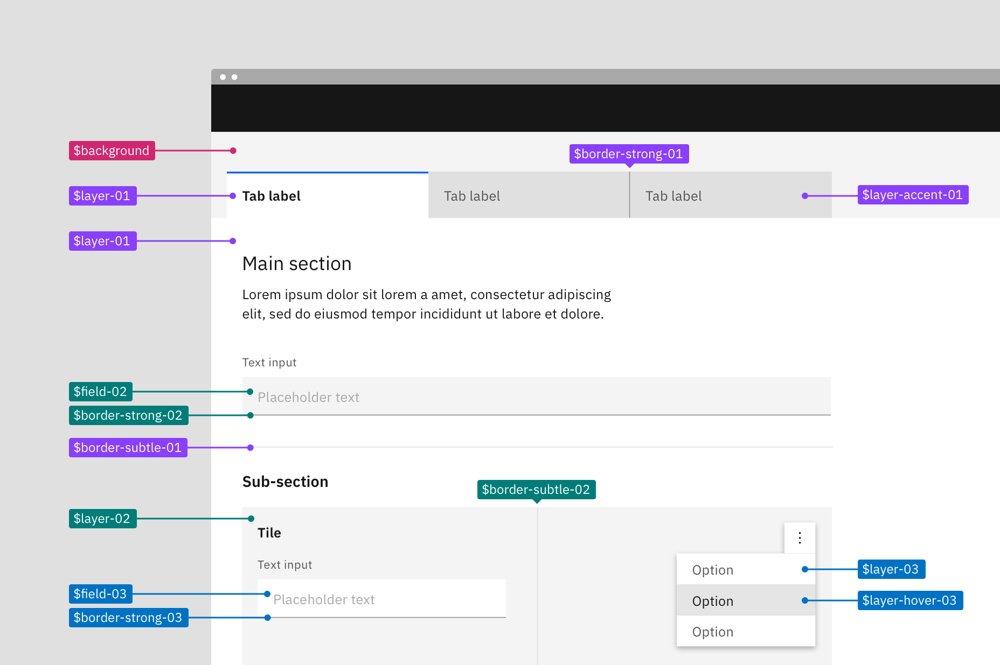
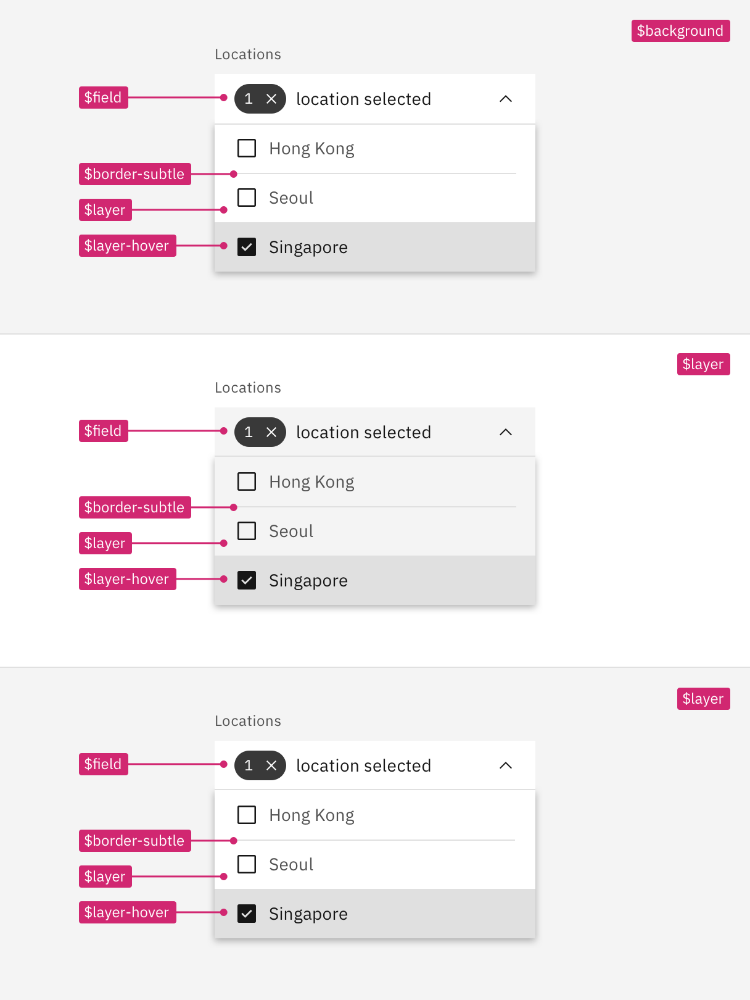
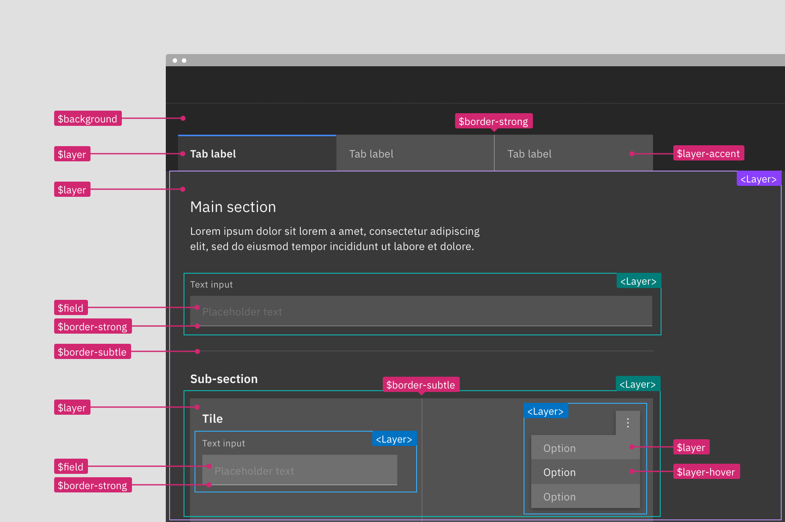
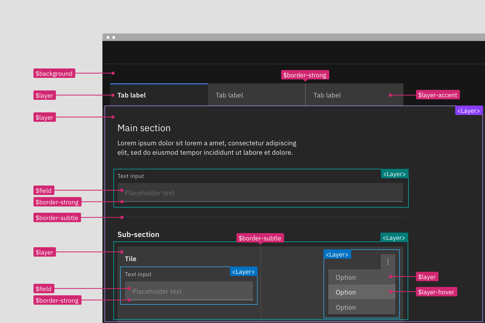

<PageDescription>

Intro about implementing color within a single theme and with multiple themes.
TBD

</PageDescription>

<AnchorLinks>

<AnchorLink>Implementing the layering model</AnchorLink>
<AnchorLink>Light or dark mode</AnchorLink>
<AnchorLink>Inline theming</AnchorLink>
<AnchorLink>Resources</AnchorLink>

</AnchorLinks>

## Implementing the layering model

There are two ways to implement the layering model within a single theme, either
by using explicit layer tokens or smart contextual layer tokens. Both ways are
acceptable with different pros and cons that should be weighed in deciding which
to use when building your product.

| Token type                                                                          | Definition                                                                                                                                                                                             |
| ----------------------------------------------------------------------------------- | ------------------------------------------------------------------------------------------------------------------------------------------------------------------------------------------------------ |
| [Layer set tokens](/guidelines/color/implementation#layer-set-tokens)               | Explicit tokens used to manually map the layering model onto components. They come in sets based on their level in the layering model and are part of the theme package.                               |
| [Contextual layer tokens](/guidelines/color/implementation#contextual-layer-tokens) | Abstracted tokens that automatically infer value based on the context a component inside the layering model. They are part of the component package and don't have an explicit value assigned to them. |

<Row>
<Column colLg={12}>

</Column>
</Row>

<Caption>
  A visual spec using layer set tokens (left) versus contextual tokens (right).
</Caption>

### Token list

| Contextual tokens         | Layer set 01                 | Layer set 02                 | Layer set 03                 |
| ------------------------- | ---------------------------- | ---------------------------- | ---------------------------- |
| `$layer`                  | `$layer-01`                  | `$layer-02`                  | `$layer-03`                  |
| `$layer-active`           | `$layer-active-01`           | `$layer-active-02`           | `$layer-active-03`           |
| `$layer-hover`            | `$layer-hover--01`           | `$layer-hover-02`            | `$layer-hover-03`            |
| `$layer-selected`         | `$layer-selected-01`         | `$layer-selected-02`         | `$layer-selected-03`         |
| `$layer-selected-hover`   | `$layer-selected-hover-01`   | `$layer-selected-hover-02`   | `$layer-selected-hover-03`   |
| `$layer-accent`           | `$layer-acccent-01`          | `$layer-accent-02`           | `$layer-accent-03`           |
| `$layer-accent-active`    | `$layer-acccent-active01`    | `$layer-accent-active-02`    | `$layer-accent-active-03`    |
| `$layer-accent-hover`     | `$layer-acccent-hover-01`    | `$layer-accent-hover-02`     | `$layer-accent-hover-03`     |
| `$field`                  | `$field-01`                  | `$field-02`                  | `$field-03`                  |
| `$field-hover`            | `$field-hover-01`            | `$field-hover-02`            | `$field-hover-03`            |
| `$border-subtle`          | `$border-subtle-01`          | `$border-subtle-02`          | `$border-subtle-03`          |
| `$border-subtle-selected` | `$border-subtle-selected-01` | `$border-subtle-selected-02` | `$border-subtle-selected-03` |
| `$border-strong`          | `$border-strong-01`          | `$border-strong-02`          | `$border-strong-03`          |

 

### Layer set tokens

Layer tokens are sets of explicit tokens used to manually map the layering model
onto components. They are part of the theme package and come in predefined sets
that pair ui and interaction colors together to accurately match the layering
model and enforce correct color contrast.

There are four levels of layering within a theme: base layer, layer 01, layer
02, and layer 03.  With each layer of color added you move up to the next
layering level, for example `$layer-02` would stack on top of `$layer-01`.
Notice, not all layer set tokens use `$layer` as its token base name. Token sets
also include `border` and `field` tokens as well as interactive state tokens for
the various layers. Field is considered a layer level and uses the next level
token from the layer it is placed on.

These layer set tokens are identified by a number suffix (-01, -02, -03)
attached to the base token name, such as `$field-03`. The number indicates which
level or set the token is a part of. Border tokens pair with its same number, so
`$field-03` pairs with `$border-strong-03` in a text input.  Only certain color
tokens are a part of these layering sets. Other tokens for elements like `text`
and `icon` work across layer sets.  _Note: previously in v10 many color tokens
had numeral suffixes, now in v11 only layering tokens will have this
distinction._

<Row>
<Column colLg={8}>

<Tabs>

<Tab label="White">

</Tab>

<Tab label="Gray 10">

</Tab>

<Tab label="Gray 90">

</Tab>

<Tab label="Gray 100">

</Tab>

</Tabs>

</Column>
</Row>

 

#### Example of how to apply layer set tokens in a layout

Referencing the image below, the starting base level is the page area behind and
above the tabs; it uses `$background` from the base set. The tab component is
layered on top of the page background to create the first layer. The selected
tab uses `$layer-01` and the unselected tabs use `$layer-accent-01` which is not
considered a proper layer but a supporting color for `$layer` inside of
components. The tab content area attached to the selected tab is also only one
layer above the base and so also uses `$layer-01` as its background.

In the tabs main section, the text input field is placed on top of `$layer-01`
making it a part of the next layer level and will use tokens from layer set 02,
`$field-02` and `$border-strong-02`. Also a part of the second layer level are
the tiles in the sub-section, this includes the tile background `$layer-02` as
well as the border between the tiles `$border-subtle-02`. However, components
added on top of the tiles—the text input and overflow menu—are considered part
of third layer level and will use tokens from layer set 03.

- Base layer: Magenta
- Layer set 01: Purple
- Layer set 02: Teal
- Layer set 03: Cyan

<Row>
<Column colLg={12}>

<Tabs>

<Tab label="White">

</Tab>

<Tab label="Gray 10">

</Tab>

<Tab label="Gray 90">

</Tab>

<Tab label="Gray 100">

</Tab>

</Tabs>

</Column>
</Row>

 

#### Building components with layer tokens

Building component with layer tokens works much like how you would have built
component variants in v10. For each layer level that a component lives on, a
separate component variation must be built using the explicit layer set tokens.
In v10, these color variants were known as the `light` prop variants, however
these new layering tokens allows for a three levels color variant in components
that wasn't possible in v10.

Spec each component variant with it corresponding layer set tokens. For elements
that are not part of the layering model like type or icons use the normal color
tokens as you would have in v10. These tokens will be the same across variants
as they are high enough contrast not to need to change with each layer.

<Row>
<Column colLg={8}>

</Column>
</Row>

<Caption>
  Example component spec in the white theme using the layer set 01 tokens.
</Caption>

### Contextual layer tokens

Contextual tokens are smart tokens used to automatically map the layering model
onto components in code. A contextual token is aware of what layer it is placed
on and will call the correct layer set token needed for that layer level. There
is only one set of contextual tokens and it requires only one variant of a
component to be built. Contextual tokens are a part of the component package
instead of the theme package and are used in the v11 Carbon components. To
implement the nesting layers correctly in code use the layer component with the
contextual tokens.

Contextual tokens have all the same type of tokens as the layer set except
without the number prefixes. It doesn't matter what layer it sits on, the
contextual token is always the same across layer levels.

<Row>
<Column colLg={8}>

<Tabs>

<Tab label="White">

</Tab>

<Tab label="Gray 10">

</Tab>

<Tab label="Gray 90">

</Tab>

<Tab label="Gray 100">

</Tab>

</Tabs>

</Column>
</Row>

 

#### Example of how to apply contextual layers tokens in a layout

Referencing the image below, the starting base level is still the page area
behind and above the tabs; it uses `$background`. However, there are no sets so
with each level added simply reuse the same tokens. The tabs and the tile live
on different levels but they both use the `$layer` token that will output a
different values in code with the help of the layer component.

- Contextual token: magenta

<Row>
<Column colLg={12}>

<Tabs>

<Tab label="White">

</Tab>

<Tab label="Gray 10">

</Tab>

<Tab label="Gray 90">

</Tab>

<Tab label="Gray 100">

</Tab>

</Tabs>

</Column>
</Row>

#### Building components with contextual tokens

Build a single component as you would normally but apply the contextual color
tokens instead of the layer set tokens. Then in your product code use the layer
component to express the nested layer visuals. Even if the component is never
used at other layer levels it is still acceptable and encouraged to use the
contextual tokens.

Note: Contextual tokens are only available in code and are not a part of the
design assets. Designer should use the layer set tokens when creating assets but
can include contextual tokens in their specs and redlines.

<Row>
<Column colLg={8}>

</Column>
</Row>

### Using the layer component

The layer component is used with the contextual tokens to implement the layering
model in code. The layer component and contextual tokens are essentially a short
cut for development because the layer component will apply the correct values to
a single component without having to develop explicit hard coded variants.

<InlineNotification>

**Coming soon:** Dev content is currently be worked on. Check back at a later
date for more information.

</InlineNotification>

## Light or dark mode

Light or dark mode is a theme setting that allows the end user to choose either
an UI that is predominately light or dark in color. The UI will automatically
switch from using light colors backgrounds with dark color text to using dark
color backgrounds with light color text. The themes use color tokens to
interpret which values are need for each theme. It is the color tokens that
allows a UI to so easily switch from one mode to the next. You cannot implement
light or dark mode without using color tokens everywhere in your product. Hard
coded values will not change when the mode is switched.

Adding the ability to change between a light or dark mode in your product is not
required as an IBM product but is highly encouraged. Most operating system
nowadays (ex: MacOS, iOS, Windows, Android and Linux/GNOME 3) support dark and
light modes, offering APIs so that websites and application can automatically
match users preferred mode.

For users, choosing light versus dark mode is not just an aesthetic choice.
While research shows that unimpaired sighted user preform better in light mode,
it also shows that dark mode is better for people with cataract and related
disorders. Dark mode emits less light and can therefor reduces eyes strain and
help prevent headaches and migraine.

<Tabs>

<Tab label="Light mode">

</Tab>

<Tab label="Dark mode">

</Tab>

</Tabs>

### Designing for light or dark mode

You can build a light or dark mode by using the Carbon themes and color tokens.
Your product will need to choose a light Carbon theme (White or Gray 10) and a
dark Carbon theme (Gray 100 or Gray 90).  All color in your designs and
components wither Carbon, PAL or custom made should be redlined using the Carbon
color tokens (it would also be to your advantage to use the color token layer
styles from the Carbon design asset libraries when designing).

Redlining a design in one theme should be enough and not require duplicate
designs. However, if products teams do want to have design comps in both light
and dark mode then use this handy Sketch theme switcher plug-in made by an
IBMer.

#### Creating a mode control

Since this is a user preference you'll need to add a control somewhere in your
product for the user to make a theme mode selection. This is commonly done in a
display settings, user profile, or account area. At the moment, the placement
and design of this control is up to product teams, further guidance and designs
for a mode control in IBM products may be offered in the future.

<Row>
<Column colLg={12}>

</Column>
</Row>

<Caption>
  In IBM Cloud (beta), the theme control can be accessed through the user
  profile panel in the header (left). The "Change theme" link triggers a model
  where the user can save their theme preference (right).
</Caption>

#### Inline themes

Mixing themes inline is still allowed with light or dark mode. Mixing inline
theme contrast between elements in different modes is also allowed. It is very
common for products to have side panels or UI Shell elements be high contrast in
light mode but low contrast in dark mode. These relationships can be mapped in
code using the the theme component. Note that smaller components built with an
inverse tokens (like tooltip) should remain high contrast when switching modes.

#### Consider illustrations 

You'll need to account for illustrations and other imagery like pictograms
changing color between modes. Otherwise you may end up having very high contrast
images in one mode vs the other. A low effort way to help design for this is to
use transparent backgrounds on images and tokens with svgs files. More in depth
ways to account for this would be switching out the artifacts entirely when
changing modes.

<InlineNotification>

More guidance and information on how to properly treat illustrations, images,
and pictograms in light or dark mode may be available in the future. For now,
checkout some helpful guidance around this topic on
[IBM Cloud PAL](https://pages.github.ibm.com/ibmcloud/pal/dark-mode-guidelines/designers/#illustrations-in-dark-mode)
(internal only).

</InlineNotification>

### Developing for light or dark mode

<InlineNotification>

**Coming soon:** This content is currently be worked on. Check back at a later
date for more information.

</InlineNotification>
