<PageDescription>

Implementing complex color relationships can be challenging. Provided here are
some methods and techniques to help solve your product's color and theming
needs.

</PageDescription>

<AnchorLinks>

<AnchorLink>Implementing layering</AnchorLink>
<AnchorLink>Layering tokens</AnchorLink>
<AnchorLink>Contextual tokens</AnchorLink>
<AnchorLink>Inline theming</AnchorLink>
<AnchorLink>Light or dark mode</AnchorLink>

</AnchorLinks>

## Implementing layering

There are two ways to implement the
[layering model](/guidelines/color/overview#layering-model) in a theme, either
by using explicit tokens or contextual tokens. These techniques can be used
independently in a product or can be used together. Both methods produce the
same visual result, the difference lays in how you develop with them. Designers
only need to be concerned with the layering tokens.

The explicit layering tokens are standard design tokens. Each layering token
corresponds to a specific layer on the page and is used exactly like any other
token from Carbon. Contextual tokens are a special case of layering tokens where
the value changes depending on where the token is used on a page. This type of
token is incredibly useful for building reusable components that work across
layers.

| Token type          | Definition                                                                                                                                |
| ------------------- | ----------------------------------------------------------------------------------------------------------------------------------------- |
| _Layering tokens_   | Explicit layerings tokens used to manually map the layering model onto components. They come in sets that pair with individual UI layers. |
| _Contextual tokens_ | Abstract code tokens used to automatically map the layering model onto components depending on where it used on the page.                 |

<Row>
<Column colLg={12}>

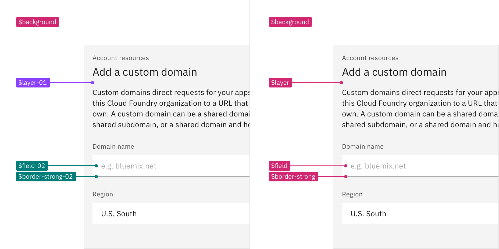

</Column>
</Row>

<Caption>
  A visual spec using layering tokens (left) versus contextual tokens (right).
</Caption>

<br />

## Layering tokens

Layering tokens are explicit tokens used to manually map the layering model onto
components. They are used just like any other color token, and in fact, are a
replacement for the `ui` color tokens from v10. Layering tokens come in
predefined sets that coordinate with the different layer levels. For each layer
that a component needs to lives on a separate component variation must be built
using the tokens from that layer set.

### When to use layering tokens

- As an easy starting point when first working with the layering model, they are
  exactly like the tokens you already know and love
- When building components that may only need to be on one layer or have only
  one color variant

### How layering tokens work

There are four layers within a theme: base layer, layer 01, layer 02, and
layer 03. Layers stack one on top of the other in a set order. Each step in UI
color (excluding interaction colors) is another layer and will require the use
of a different set of layering tokens.

<InlineNotification>

**Migration note:** Previously, in v10 most color tokens had numeral endings,
now in v11 only layering tokens will have this distinction. For more
information, see the [migration guide](/migrating/guide/design#color-tokens).

</InlineNotification>

#### Layer sets

Layering tokens are divided into sets and are identified by a number (-00, -01,
-02, -03) attached to the end of token name. Any token with an `-01` ending
belongs to the 01 layering set and so on. The exception are tokens in the base
set which use `background` tokens without a number ending as well as tokens with
`-00` classification.

Tokens from the same set are used together when building components. For
example, in a dropdown both the input and menu will use tokens from the same set
(see image below). In addition to the `$layer` tokens, layer sets also include
border and field tokens, as well as interactive states tokens. A field is
considered a layer on top of the background it is placed on, for example a field
placed on a `$layer-02` background will use `$field-03`. Border tokens however,
pair with its same number, for example `$field-03` pairs with
`$border-strong-03` in a text input.

Not all color tokens are part of a layer set. Some tokens groups, like `text`
and `icon`, work across layers. For a list of the layering tokens, see the color
[usage tab](/guidelines/color/usage).

<Row>
<Column colLg={8}>

<Tabs>

<Tab label="White">

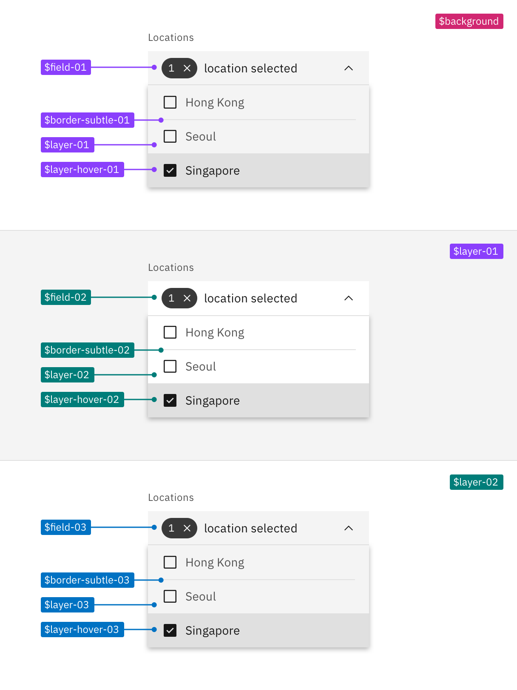

</Tab>

<Tab label="Gray 10">

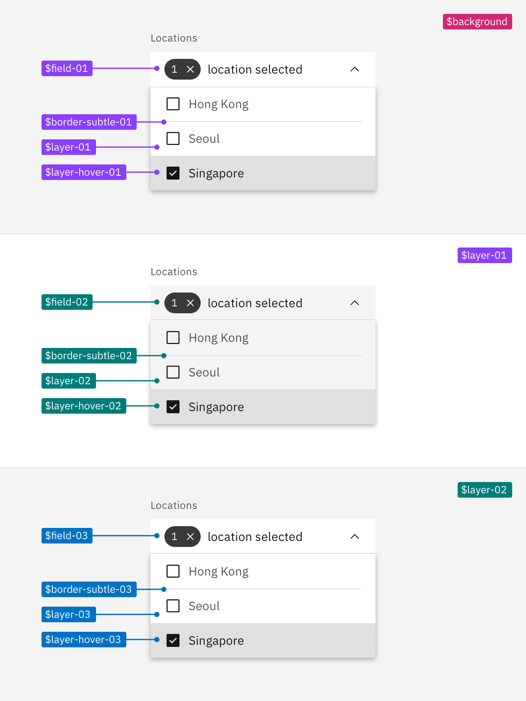

</Tab>

<Tab label="Gray 90">

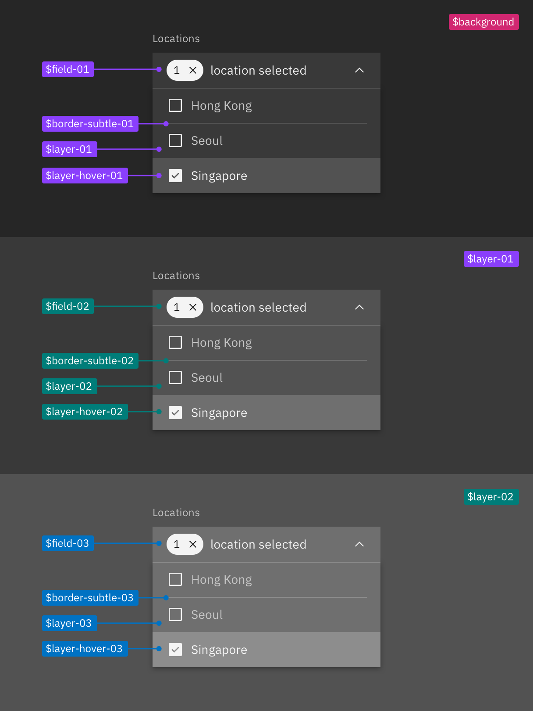

</Tab>

<Tab label="Gray 100">


</Tab>

</Tabs>

</Column>
</Row>

<Caption>
  A dropdown using tokens from the four layer sets: base set (magenta), 01 layer
  set (purple), 02 layer set (teal), and 03 layer set (cyan).
</Caption>

<br />

#### Applying layering tokens in a layout

Referencing the image below, the starting base layer is the page area behind and
above the tabs; it uses `$background` from the base set. The tab component is
layered on top of the page background to create the first layer. The selected
tab uses `$layer-01` and the unselected tabs use `$layer-accent-01` which is not
considered a proper layer but a supporting color for `$layer` inside of
components. The tab content area attached to the selected tab is also only one
layer above the base and so also uses `$layer-01` as its background.

In the tab’s main section, the text input field is placed on top
of `$layer-01` making it a part of the next layer level and will use tokens from
the 02 layer set, so `$field-02` and `$border-strong-02`. Also a part of the
second layer level are the tiles in the sub-section which includes the tile
background `$layer-02` as well as the border between the
tiles `$border-subtle-02`. However, components added on top of the tiles—the
text input and overflow menu—are considered part of third layer level and will
use tokens from the 03 layer set.

<Row>
<Column colLg={12}>

<Tabs>

<Tab label="White">

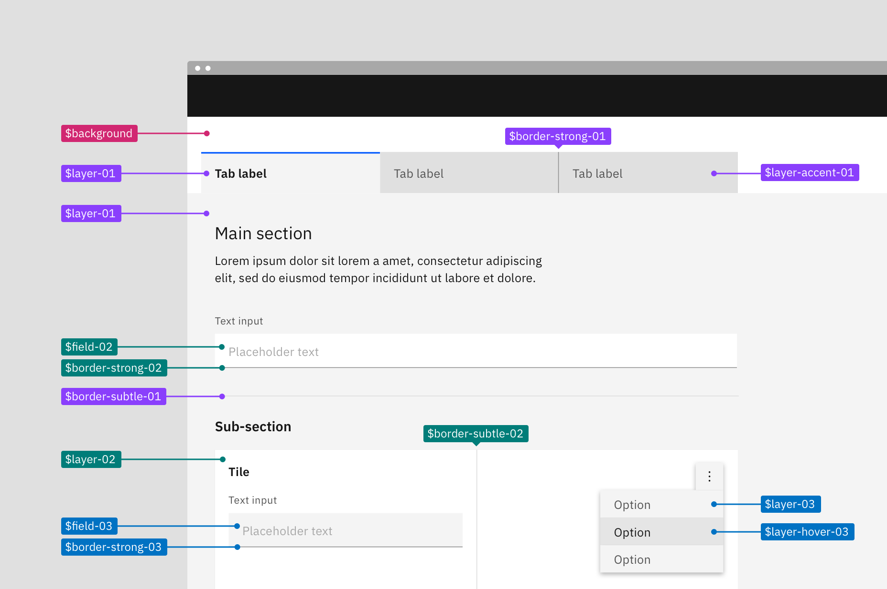

</Tab>

<Tab label="Gray 10">


</Tab>

<Tab label="Gray 90">


</Tab>

<Tab label="Gray 100">


</Tab>

</Tabs>

</Column>
</Row>

<Caption>
  An example layout applying tokens from the four different layer sets: base set
  (magenta), 01 layer set (purple), 02 layer set (teal), and 03 layer set
  (cyan).
</Caption>

<br />

#### Building components with layer tokens

Building components with layering tokens works just like how you would have
always built component color variations in Carbon. For each layer that a
component lives on, a separate component variation must be built using the
tokens from that layering set.

Spec each component variant with its corresponding layering set. For elements
that are not part of the layer sets like type or icons, apply color tokens as
you normally would. Non-layer tokens will be the same across variants because
they have enough contrast not to need a change with each layer.

<InlineNotification>

**Migration note:** In v10, the additional color variants were known as
the light prop variants. The `light` variants now use the 02 layer set. These
new tokens also allow for a third color variant using the 03 layer set in
components that was not possible in v10.

</InlineNotification>

<Row>
<Column colLg={8}>

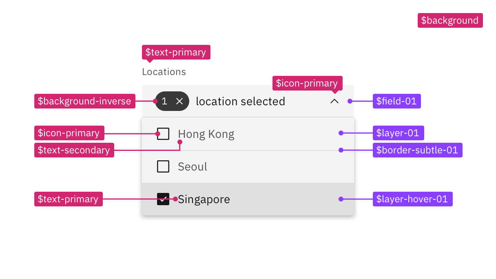

</Column>
</Row>

<Caption>
  Example component spec in the white theme using the 01 layer set tokens.
</Caption>

## Contextual tokens

Contextual tokens are code specific tokens used to automatically map the
layering model onto components depending on where it used on the page. A
contextual token is aware of what layer it is placed on and will call the
correct values for that layer. There is only one set of contextual tokens and
they require only one component variant to be built.

Contextual tokens can be used in place of layering tokens. The two types of
tokens have similar token names except the contextual tokens do not have the
number terminal. Contextual tokens keep the same name no matter which layer it
sits on.

### When to use contextual tokens

- When building reusable components that need to work across layers.

### How contextual tokens work

Layering is still possible using the contextual tokens. However, the value of
the token is not fixed per theme like with a normal design token from the
layering sets. Contextual tokens have a variable value within a theme that is
controlled through the use of a special component called the layer component.

<Row>
<Column colLg={8}>

<Tabs>

<Tab label="White">


</Tab>

<Tab label="Gray 10">


</Tab>

<Tab label="Gray 90">

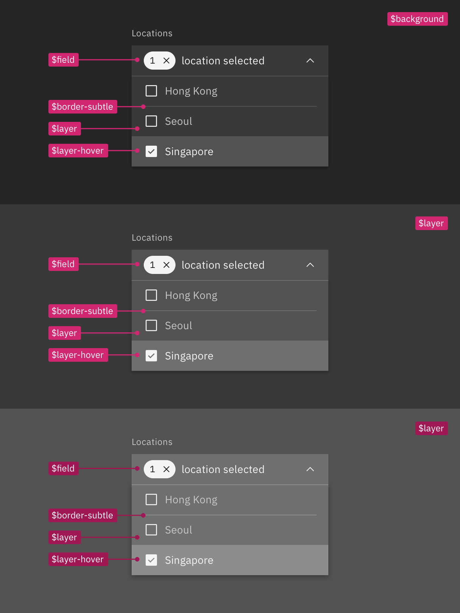

</Tab>

<Tab label="Gray 100">


</Tab>

</Tabs>

</Column>
</Row>

<Caption>
  A dropdown across three layers in a theme, all using the same contextual
  tokens.
</Caption>

<br />

#### Using the layer component

The layer component is used to render a single component on different layers.
Components built with contextual tokens when placed inside the layer component
will automatically map to the correct layer based on where it sits in the layer
structure. Components can be nested inside the layer component up to three
level, the last level corresponding to the 03 layer set tokens. By default,
tokens use the 01 layer set tokens in the first layer.

For more guidance on the layer component, go to the
[Storybook](https://react.carbondesignsystem.com/?path=/docs/components-layer--default#layer).

```css Layer component
<Layer>
  <ChildComponent />
  <Layer>
    <ChildComponent />
    <Layer>
      <ChildComponent />
    </Layer>
  </Layer>
</Layer>
```

<br />

#### Applying contextual layer tokens in a layout

When applying contextual tokens, there are no layer sets so each layer uses the
same tokens but will be wrapped in a different level of the layer component. For
example, referencing the image below, the two text inputs are on different
layers and they both use the `$field` token but will render in different values
based on where it is nested in layer component. The tab content area is wrapped
in the first level of the layer component (shown in purple) and therefore the
text input in the main section is nested in second level of layer component
(shown in teal).

<Row>
<Column colLg={12}>

<Tabs>

<Tab label="White">

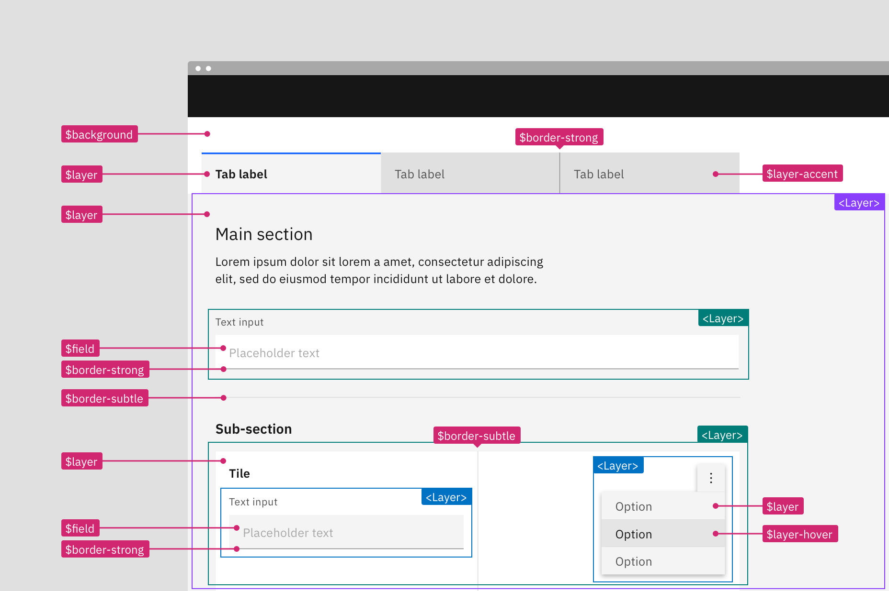

</Tab>

<Tab label="Gray 10">

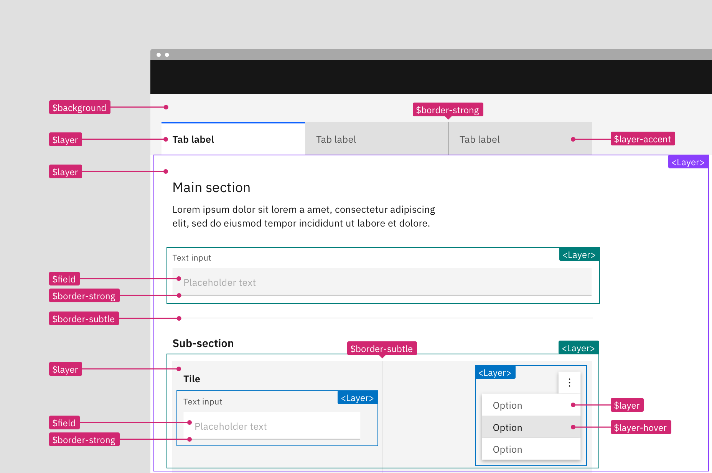

</Tab>

<Tab label="Gray 90">


</Tab>

<Tab label="Gray 100">


</Tab>

</Tabs>

</Column>
</Row>

<Caption>
  A layout using contextual tokens within a single theme. The components are
  wrapped in the layer component to control the visual output: first layer
  (purple), second nested layer (teal), and third nested layer (cyan).
</Caption>

### Building components with contextual tokens

Build a single component as you would normally but apply the contextual color
tokens instead of the layer set tokens. Then in your product code wrap the
component in the layer component to express the nested layer visuals. Even if
the component is never used at other layer levels it is still acceptable and
encouraged to use the contextual tokens.

#### Designing for contextual tokens

Contextual tokens are only available in code and are not a part of the design
assets. Designers should use the layer set tokens when creating assets but can
include contextual tokens in their specs and redlines. To convert a layer set
token to a contextual token, simply drop the numbers at the end of the token
name.

<Row>
<Column colLg={8}>


</Column>
</Row>

## Inline theming

Inline theming is used when a section of a UI needs to be a different theme from
the rest of the page. Inline theming allows themes to be nested within each
other without needing custom styles or overrides.

In product, a common use-case for inline theming is applying a contrasting theme
to the UI Shell or side panels. This is especially common in light themed
products or light modes. For example, the majority of a page may use the White
theme while the UI Shell and the right side panels use an inline Gray 100 theme.
This type of theme pairing creates a high contrast moment that can add emphasis
and focus to a work flow.

<Row>
<Column colLg={8}>


</Column>
</Row>

### When to use inline theming

Only use inline theming for major shifts in color, like high contrast moments.
The more subtle transitions of color in a product are handled within each theme
through the layering model tokens. It is unlikely that you'll need to inline a
White theme within the Gray 10 theme or the Gray 90 theme within the Gray100
theme.

### How inline theming works

In order to implement inline theming, you must use the Carbon color tokens and
themes. For the section of the product you want to inline theme, simply apply
the core Carbon tokens like you were doing for the rest of the page, then wrap
the targeted section in the Theme component to assign a new theme.

#### Theme component

The theme component allows you to specify the theme for a page, or a portion of
a page. It is most often used to implement inline theming in order to specify
what theme a section of the page should render with.

For more guidance on the theme component, go to the
[Storybook](https://react.carbondesignsystem.com/?path=/docs/components-theme--default#theme).

```css Theme component
<Theme theme="g100">
  <ChildComponent />
</Theme>
```

### Designing for inline theming

When designing for inline theming, you'll need to pull assets that you want in
your frame from other theme library files in Figma. Assets will have the same
token names across libraries but will show different values. Specify in the
design deliverables which sections of the page will be using an inline theme.

<Row>
<Column colLg={12}>


</Column>
</Row>

## Light or dark mode

Light or dark mode is a theme setting that allows the end user to choose either
an UI that is predominately light or dark in color. The UI will automatically
switch from using light colors backgrounds with dark color text to using dark
color backgrounds with light color text.

<Row>
<Column colLg={8}>


</Column>
</Row>

### When to use modes

Adding the ability to change between a light or dark mode in your product is not
required as an IBM product but is highly encouraged. Attention to detail,
customization, and being at the forefront of innovation separates IBM over our
competitors.

#### Respecting our users preferences

Most operating system nowadays (ex: MacOS, iOS, Windows, Android and
Linux/GNOME 3) support dark and light modes, offering APIs so that websites and
application can automatically match users preferred mode. Many users prefer
working on dark themed IDEs and using dark mode in their machines.

#### Creating optimal user conditions

For some users, choosing light versus dark mode is more than an aesthetic
choice. While some [research](https://www.nngroup.com/articles/dark-mode/) shows
that unimpaired sighted user preform better in light mode, it also shows that
dark mode is better for people with cataract and related disorders. Dark mode
emits less light and can therefor reduces eyes strain and help prevent headaches
and migraine.

### How modes works

The themes use color tokens to interpret which values are needed for each theme.
It is the color tokens that allows a UI to so easily switch from one mode to the
next. You cannot implement light or dark mode without using color tokens
everywhere in your product. Hard coded values will not change when the mode is
switched.

<Tabs>

<Tab label="Light mode">


</Tab>

<Tab label="Dark mode">


</Tab>

</Tabs>

### Designing for modes

You can build a light or dark mode by using the Carbon themes and color tokens.
Your product will need to choose a light Carbon theme (White or Gray 10) and a
dark Carbon theme (Gray 100 or Gray 90).  All color in your designs and
components whether Carbon, PAL or custom made should be redlined using the
Carbon color tokens (it would also be to your advantage to use the color token
layer styles from the Carbon design asset libraries when designing).

Redlining a design in one theme should be enough and not require duplicate
designs. However, products teams may want to have design comps in multiple
themes. In Figma, we recommend that you duplicate your files, then swap your
current theme library for another. This replaces local instances with matching
instances from the other library. For step-by-step instructions, visit this
[Figma tutorial](https://help.figma.com/hc/en-us/articles/4404856784663-Swap-style-and-component-libraries).

#### Creating a mode control

Since this is a user preference, you'll need to add a control somewhere in your
product for the user to make a theme mode selection. This is commonly done in a
display setting, user profile, or account area. At the moment, the placement and
design of this control is up to product teams, further guidance and designs for
a mode control in IBM products may be offered in the future.

<Row>
<Column colLg={12}>

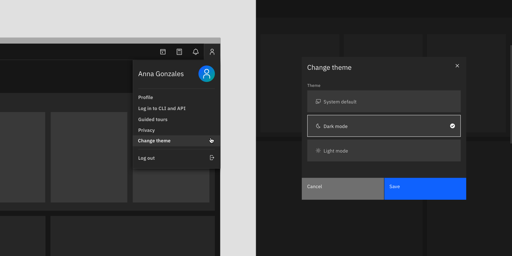

</Column>
</Row>

<Caption>
  In IBM Cloud (beta), the theme control can be accessed through the user
  profile panel in the header (left). The "Change theme" link triggers a model
  where the user can save their theme preference (right).
</Caption>

#### Inline themes with modes

Mixing themes inline is still allowed with light or dark mode. Mixing inline
theme contrast between elements in different modes is also allowed. It is very
common for products to have side panels or UI shell elements be high contrast in
light mode but low contrast in dark mode. These relationships can be mapped in
code using the the
[theme component](https://react.carbondesignsystem.com/?path=/docs/components-theme--default).
Note that smaller components built with an inverse tokens (like tooltip) should
remain high contrast when switching modes.

<Row>
<Column colLg={8}>


</Column>
</Row>

<Caption>
  Light mode with an inline theme Gray 100 panel (left) and the dark mode
  without an inline theme (right)
</Caption>

#### Consider illustrations 

You'll need to account for illustrations and other imagery like pictograms
changing color between modes. Otherwise you may end up having very high contrast
images in one mode vs the other. Whenever possible, switch out assets entirely
bettwen modes to reflect the theme either by using tokens in the svg code or
manually swapping out a png. When not possible, a low effort way to design
images for modes is to use transparent backgrounds.

<InlineNotification>

**Additional guidance:** Checkout some helpful PAL guidance around how to
properly treat illustrations, images, and pictograms in light or dark mode on
[IBM Cloud PAL](https://pages.github.ibm.com/ibmcloud/pal/dark-mode-guidelines/designers/#illustrations-in-dark-mode),
_for IBMers only_.

</InlineNotification>

<DoDontRow>
  <DoDont
    type="do"
    colLg={6}
    caption="Use light colored assets, tones, and backgrounds for illustrations in the light themes (the best solution)">


  </DoDont>
  <DoDont
    type="do"
    colLg={6}
    caption="Use dark colored assets, tones, and backgrounds for illustrations in the dark themes (the best solution)">

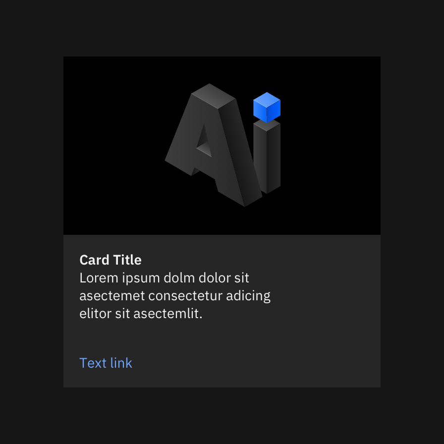

  </DoDont>
</DoDontRow>

<DoDontRow>
 <DoDont type="dont" colLg={6} caption="Don’t use images with colored backgrounds when switching between modes because they will appear broken and in high contrast in the opposite mode">


  </DoDont>
  <DoDont
    type="do"
    colLg={6}
    caption="If only one image is available between modes, use an image with a transparent background and swap the container color background to match the mode (acceptable solution)">

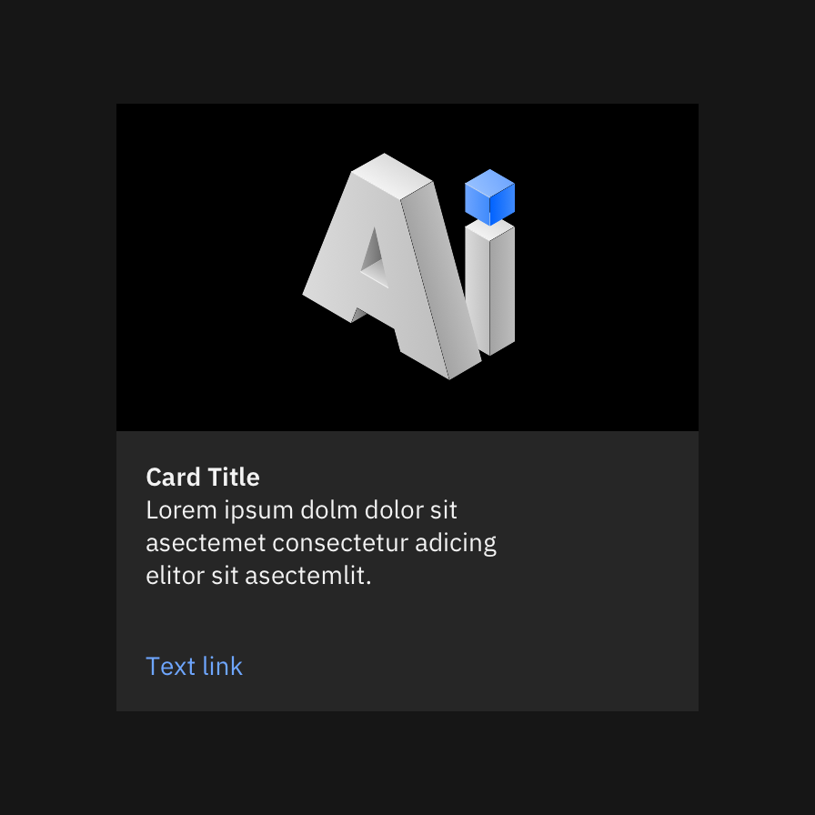

  </DoDont>
</DoDontRow>
