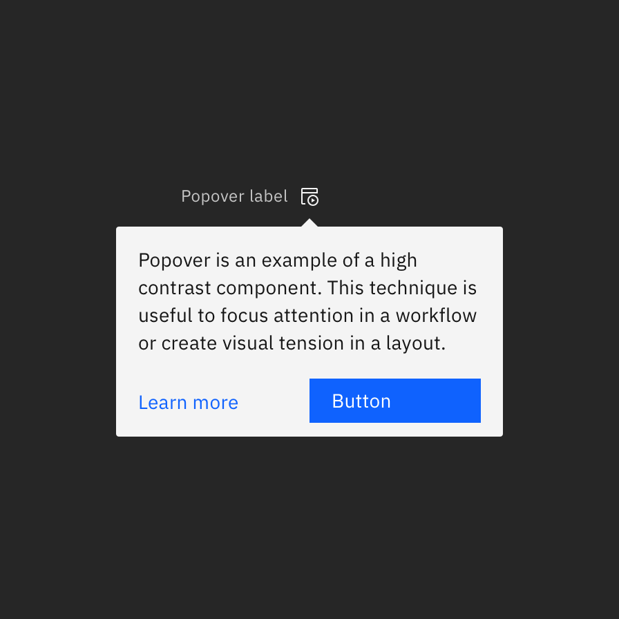
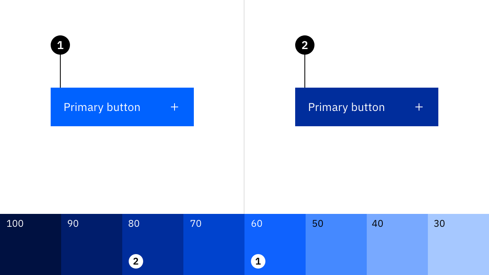
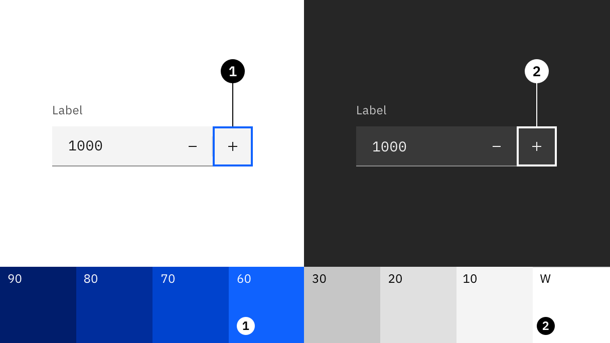

import ColorBlock from 'components/ColorBlock';
import ColorGrid from 'components/ColorGrid';

<PageDescription>

Maintaining consistent and engaging digital interfaces throughout IBM, whether
applications or experiences, demands extended guidance around color usage. The
following concepts provide the foundation as we strive to achieve balance and
harmony through our User Interface design.

</PageDescription>

<AnchorLinks>

<AnchorLink>Introduction</AnchorLink>
<AnchorLink>Color anatomy</AnchorLink>
<AnchorLink>Applying color</AnchorLink>
<AnchorLink>Accessibility</AnchorLink>
<AnchorLink>Resources</AnchorLink>

</AnchorLinks>

<Video title="Color Overview" vimeoId="281513790" />

 

 

## Introduction

Application of the color palette brings a unified and recognizable consistency
to IBM's array of digital products and interfaces. This consistency is grounded
in a set of well-defined rules about how to work with the Carbon component
library in the context of dark and light themes.

<GifPlayer color="dark">

</GifPlayer>

## Color anatomy

Carbon’s default themes are derived from the IBM Design Language color palette.
The neutral gray family is dominant in the default themes, making use of subtle
shifts in value to organize content into distinct zones.

The core blue family serves as the primary action color across all IBM products
and experiences. Additional colors are used sparingly and purposefully.

  <ColorGrid colorFamily="blue" />
  <ColorGrid colorFamily="gray" />

{/* possible TODO: remove inline style */}
<ColorGrid colorFamily="alerts" style="margin-top: 2rem" />
<Caption>Alerts Colors</Caption>

### Layering model

Colors in the neutral gray palette are layered on top of each other to create
depth and spatial associations. The layering model defines the logic of how
colors stack on top of each other in a UI when using the Carbon themes. Aspects
of the layering model are built directly into the themes, color tokens, and
components.

The layering model differs between the _light_ and _dark_ themes.

- In the light themes, layers alternate between White and Gray 10.
- In the dark themes, layers become one step lighter with each added layer.

<Row>
<Column colLg={8}>

</Column>
</Row>

 

## Applying color

Carbon uses tokens and themes to manage color. Tokens are role-based, and themes
specify the color values that serve those roles in the UI.

| Term                                                    | Definition                                                                                                                                                                                             |     |
| ------------------------------------------------------- | ------------------------------------------------------------------------------------------------------------------------------------------------------------------------------------------------------ | --- |
| [Theme](/guidelines/color/overview/#themes)             | A theme is a collection of colors designed to create a specific aesthetic. Themes control the color value assigned to a token. For example, White theme, Gray 10 theme, Gray 90 theme, Gray 100 theme. |     |
| [Token](/guidelines/color/overview/#tokens)             | A token is the role-based identifier that assigns a color. Unlike hex codes, tokens apply universally across themes. For example, `$layer`, `$border-subtle`, `$support-error`.                        |     |
| [Role](/guidelines/color/overview/#color-roles)         | A role is the systematic usage of a color. Roles cannot be changed between themes.                                                                                                                     |     |
| [Value](/guidelines/color/overview/#interaction-states) | A value is the unique visual attribute (hex code, rgba value) assigned to a token through the use of a theme.                                                                                          |

### Themes

Themes serve as an organizational framework for color in Carbon, with each theme
based on a specific primary background color. And they actually get their names
from their background color. There are two default _light_ themes and two
default _dark_ themes.

The light themes are based on White and Gray 10 backgrounds, and the dark themes
use Gray 100 and Gray 90 backgrounds. Within each theme, the values for the
universal color tokens use the primary background color as the base of its
layering model.

<Row className="color-blocks">
<Column colSm={1} colMd={1} colLg={2}>

  

    White
  

Light

</Column>
<Column colSm={1} colMd={1} colLg={2}>

  

    Gray 10
  

</Column>
<Column colSm={1} colMd={1} colLg={2}>

  

    Gray 100
  

Dark

</Column>
<Column colSm={1} colMd={1} colLg={2}>

  

    Gray 90
  

</Column>
</Row>

 
<Title> Global background colors </Title>

| Theme    | Primary background      | Token         | Hex value |                                             |
| -------- | ----------------------- | ------------- | --------- | ------------------------------------------: |
| White    | Global Background Light | `$background` | `#ffffff` |  <ColorBlock size="xs">#ffffff</ColorBlock> |
| Gray 10  | Global Background Light | `$background` | `#f4f4f4` | <ColorBlock  size="xs">#f4f4f4</ColorBlock> |
| Gray 90  | Global Background Dark  | `$background` | `#262626` | <ColorBlock  size="xs">#282828</ColorBlock> |
| Gray 100 | Global Background Dark  | `$background` | `#161616` | <ColorBlock  size="xs">#171717</ColorBlock> |

 

#### Light themes

There are two light themes in Carbon: White and Gray 10. In the light themes,
layers alternate between White and Gray 10. For enabled UI colors light themes
primarily uses the color range of White to Gray 20.

- **White theme**: uses white background as it layering model base and is paired
  with components using Gray 10 containers to start.
- **Gray 10 theme:** uses Gray 10 backgrounds as it layering model baseand is
  paired with components using white containers to start.

All of the themes are available in
[Design kits](https://carbondesignsystem.com/designing/kits/sketch/).

<DoDontRow>
  <DoDont caption="Gray 10 dropdown on White background." colLg={6}>

  </DoDont>
  <DoDont colLg={6} caption="White dropdown on a Gray 10 background.">

  </DoDont>
</DoDontRow>

<DoDontRow>
  <DoDont colLg={6} caption="White overflow menu on Gray 10 card.">

  </DoDont>
  <DoDont type="dont" colLg={6} caption="Avoid use of midtones.">

  </DoDont>
</DoDontRow>

<Caption>Components with common colors across both light themes.</Caption>

 

#### Dark themes

There are two dark themes: Gray 90 and Gray 100. In the dark themes, layers
become one step lighter with each added layer. For enabled UI colors, dark
themes primarily use the color range of Gray 100 through Gray 70.

- **Gray 90 theme**: uses Gray 90 backgrounds and is paired with components
  using Gray 80 containers to start.
- **Gray 100 theme:** uses Gray 100 backgrounds and is paired with components
  using Gray 90 containers to start.

All of the themes are available in
[Design kits](https://carbondesignsystem.com/designing/kits/sketch/).

<DoDontRow>
  <DoDont
    colLg={6}
    caption="Gray 90 dropdown on Gray 100 background.">

  </DoDont>
  <DoDont colLg={6} caption="Gray 80 dropdown on Gray 90 background.">

  </DoDont>
</DoDontRow>

<DoDontRow>
  <DoDont
    colLg={6}
    caption="Gray 70 is sometimes used when compound components are being applied, such as an overflow menu.">

  </DoDont>
  <DoDont type="dont" colLg={6} caption="Do not apply components that are darker than the background unless using high-contrast mode.">

  </DoDont>
</DoDontRow>

<Caption>
  Components with common colors across both dark UI backgrounds.
</Caption>

 

#### High contrast

In some cases, it is helpful to apply light components to dark backgrounds or
dark components to light backgrounds. This technique is useful to focus
attention or create visual tension. Some high contrast moments are baked into
the themes used `inverse` tokens, like with the tooltip component. Other times
high contrast moments can be achieved through applying inline theming for
instances like a dark UI Shell Header with a light theme page.

<DoDontRow>
  <DoDont colLg={6}>

  </DoDont>
  <DoDont colLg={6}>

  </DoDont>
</DoDontRow>

 

### Tokens

Color in Carbon is managed through tokens. Tokens are an abstracted method of
applying color in a consistent, reusable, and scalable way. Each color token is
assigned a role and a value. The role determines where the token is applied in
the UI and the value is the actual color (that is, the hex code) that will
appear in an assigned theme. Tokens are used in place of a one-off hex code,
allowing for changes in values to be made at scale, for easy color management.
The token names themselves stay the same in code no matter which theme is being
used.

Here's an example of how tokens work: instead of coding all instances of input
labels in a UI to be `#565656`, the _form_ component in Carbon specifies the
label color to use the token `$text-secondary`. The value of the token will
automatically be called in a relay effect through a theme file which will assign
it the value of `#565656`. For a different theme, that same `$text-secondary`
token could be mapped to a different hex value like `#ffffff`. By using the
token name instead of the hex code, any color updates within a theme can be
applied instantly, and any UI (or portion of a UI) can switch between different
themes easily.

See the [color usage tab](/guidelines/color/usage) for the full list of color
tokens.

<Row>
<Column colLg={12}>

</Column>
</Row>

<Caption>Color tokens for components are the same across themes.</Caption>

 

### Color roles

The systematic and consistent use of color is achieved by applying tokens based
on their _role_. Roles are important to follow as a single color value may be
assigned to multiple color tokens. The
[color usage tab](https://carbondesignsystem.com/guidelines/color/usage) lists
the role(s) for each color token in the second column.

For quick reference, the role of a token is also represented in the token name
itself. The token names are divided into parts to help you make decisions and
understand options. The first part of the token name references the general UI
element the color is being applied to, like `background`, `text`, `border`. If
the element can be styled in more than one way then the last half of the token
name will further describe its how it should be used. For example
`$border-subtle` is used when a border or divider rule needs a low contrasting
(subtle) aesthetic.

### Interaction states

In addition to the core set of enabled-state tokens, there are five other
primary interaction states defined with tokens for each theme. Interaction
tokens are signified by the addition of a state name added to the end of the
base token name. For example, the `$background` hover state token is
`$background-hover`.

The color layering model for interaction tokens is as follows:

- For values between Black and Gray 70, interaction gets lighter.
- For values between Gray 60 and White, interaction gets darker.

<Row>
<Column colLg={12}>

</Column>
</Row>

 

#### Hover

Hover is a subtle visual change that appears when a mouse cursor moves over an
interactive element. Hover states have their own tokens and are identified the
`-hover` added to the end of the base token name, such as `$background-hover`.

For container backgrounds in the IBM themes, hover states token values are "half
steps" between two adjacent colors on the IBM color palette steps. These values
fall outside of the IBM color palette steps and are calculated in code through
an `adjustLightness` function with either a `+` or `-` number value. For
example, `$background-hover: adjustLightness($background, -5)`. _Note that in
the Sketch assets, hex codes are still used as values for hover states for ease
of use and are built into the layer style tokens._

- For values between Black and 70, interaction gets `+` adjustment.
- For values between 60 and White, interaction gets `-` adjustment.

Elements like text or icons that use `secondary` colors for their enabled state,
will change to `primary` color on hover, giving them a subtle emphasis. Often
times this shift in color (to the text or icon element) will also be accompanied
by a background hover color shift as well. For example, an overflow menu uses
`$text-secondary` and `$layer` in its enabled state. On hover, the text switches
to `$text-primary` and the background to `$layer-hover`.

<Row>
<Column colLg={8}>

</Column>
</Row>

<Caption>
  Shown in the white theme, (1) `$layer` enabled color and (2) `$layer-hover`
  hover color.
</Caption>

 

#### Active

The active state can be used to indicate a `click`, `tap` or down press of a
button. Active tokens are identified by `-active` added to the end of the base
token name, such as `$button-primary-active`. Active state values are two full
steps lighter or darker on the IBM color scale. For example, the Blue 60 active
state is Blue 80.

- For values between 100 and 70, the active state is two full steps lighter.
- For values between 60 and 10, the active state is two full steps darker.

The exceptions are that White value shares the same active state as Gray 10
value, and Black value shares the same active state as Gray 100 value.

<Row>
<Column colLg={8}>

</Column>
</Row>

<Caption>
  Shown in the White theme, (1) `$button-primary` enabled color and (2)
  `$button-primary-active` active color.
</Caption>

 

#### Selected

Selected states indicate item(s) or option(s) that have been chosen in the UI by
the user through any input method. Selected tokens are identified by the
`-selected` added to the end of the base token name, such as `$layer-selected`.
The color logic for selected state is either one full step lighter or darker on
the IBM color scale. For example, the Gray100 selected state is Gray 90.

- For values between 100 and 70, the selected state is one full step lighter.
- For values between 60 and 10, the selected state one full step darker.

The exception is that White shares the same selected state as Gray 10, and Black
shares the same selected state as Gray 100.

<Row>
<Column colLg={8}>

</Column>
</Row>

<Caption>
  Shown in the white theme, (1) `$layer` enabled color and (2) `$layer-selected`
  selected color.
</Caption>

 

#### Focus

The focus state draws attention to the active element on a page when using the
keyboard or voice to navigate. In Carbon, the focus of an element is most
commonly indicated by a 2px border around the element. In order to make it easy
to identify and locate on a page, most focus states use only one color per theme
controlled through the `$focus` color token.

- In the light themes, the focus state usually appears as a Blue 60 border.
- In the dark themes, the focus state usually appears as a White border.

The exception is high contrast moments where a `$focus-inverse` color is used
instead.

Focus states are required on all interactive elements and must pass 3:1 color
contrast accessibility. Often times to achieve proper 3:1 contrast a
`$focus-inset` border is used between the focus border and the element itself.

<Row>
<Column colLg={8}>

</Column>
</Row>

<Caption>
  (1) White theme `$focus` color and (2) Gray 90 theme `$focus` color.
</Caption>

 

#### Disabled

A disabled state is applied to a component when the user is not allowed to
interact with the component due to either permissions, dependencies, or
pre-requisites. Disabled states completely remove the interactive function of a
component and therefore don't receive hover or focus. Disabled state styling is
not subject to WC3 contrast compliance standards and is intentionally
de-emphasized in a faded fashion.

Disabled elements are always styled in the Gray family no matter its base color.
Component-specific styling will depend on the elements within it and what layers
they are placed on. Some tokens have their own specific disabled tokens, such as
`$layer-disabled`, while other elements are grouped together and share a
disabled token like `$text-disabled`.

- For the light themes, disabled color values range from White to Gray 50
- For the dark themes, disabled color values range from Gray 90 to Gray 40

## Accessibility

Using various forms of contrast is the most important consideration when making
user-friendly color and interface choices. Awareness of standards and best
practices is the key to accessible color selections.

<Row className="resource-card-group">
<Column colMd={4} colLg={4} noGutterSm>
    <ResourceCard
      subTitle="IBM Design Language: Accessibility"
      aspectRatio="2:1"
      href="https://www.ibm.com/design/language/color#accessibility"
      >

<MdxIcon name="bee" />

  </ResourceCard>
</Column>
<Column colMd={4} colLg={4} noGutterSm>
    <ResourceCard
      subTitle="IBM Accessibility: Color and Contrast"
      aspectRatio="2:1"
      href="https://www.ibm.com/able/toolkit/design/visual/color-and-contrast"
      >

<MdxIcon name="bee" />

  </ResourceCard>
</Column>
</Row>

### Contrast ratios

Contrast is the difference in brightness between any two elements. The
[Web Content Acessibility Guidelines (WCAG)](https://www.w3.org/TR/WCAG20/) set
specific ratios that achieve the minimum required contrast for legibility.
Generally speaking, small text is any size below 24px and requires a 4.5:1
contrast ratio. Large text is anything above 24px and requires a 3:1 contrast
ratio. Graphical elements, such as data visualizations, also require a 3:1
contrast ratio.

The IBM palette is comprised of twelve color grades—Black, White and ten values
for each hue. The following table indicates the minimum number of steps required
to achieve commonly used contrast ratios between any two colors.

<Row>
<Column colLg={8}>
<ArtDirection>

</ArtDirection>
</Column>
</Row>

| Color 1 | Color 2 (4.5:1 contrast)   | Color 2 (3:1 contrast)     |
| ------- | -------------------------- | -------------------------- |
| Black   | 50 through White (6 steps) | 60 through White (5 steps) |
| 100     | 50 through White (5 steps) | 60 through White (4 steps) |
| 90      | 50 through White (4 steps) | 60 through White (3 steps) |
| 80      | 40 through White (4 steps) | 50 through White (3 steps) |
| 70      | 30 through White (4 steps) | 40 through White (3 steps) |
| 60      | 20 through White (4 steps) | 20 through White (4 steps) |
| 50      | 90 through Black (4 steps) | 80 through Black (3 steps) |
| 40      | 80 through Black (4 steps) | 70 through Black (3 steps) |
| 30      | 70 through Black (4 steps) | 70 through Black (4 steps) |
| 20      | 70 through Black (5 steps) | 60 through Black (4 steps) |
| 10      | 60 through Black (5 steps) | 50 through Black (4 steps) |
| White   | 60 through Black (6 steps) | 50 through Black (5 steps) |

## Resources

<Row className="resource-card-group">
<Column  colLg={4} colMd={4} noGutterSm>
  <ResourceCard
    subTitle="RGB color palettes (.ase and .clr)"
    href="https://github.com/carbon-design-system/carbon/raw/main/packages/colors/artifacts/IBM_Colors.zip"
    >

<MdxIcon name="ase" />

  </ResourceCard>
</Column>
<Column colLg={4} colMd={4}  noGutterSm>
  <ResourceCard
    subTitle="Elements package: Color"
    href="https://github.com/carbon-design-system/carbon/tree/main/packages/colors"
    >

<MdxIcon name="github" />

  </ResourceCard>
</Column>
</Row>
