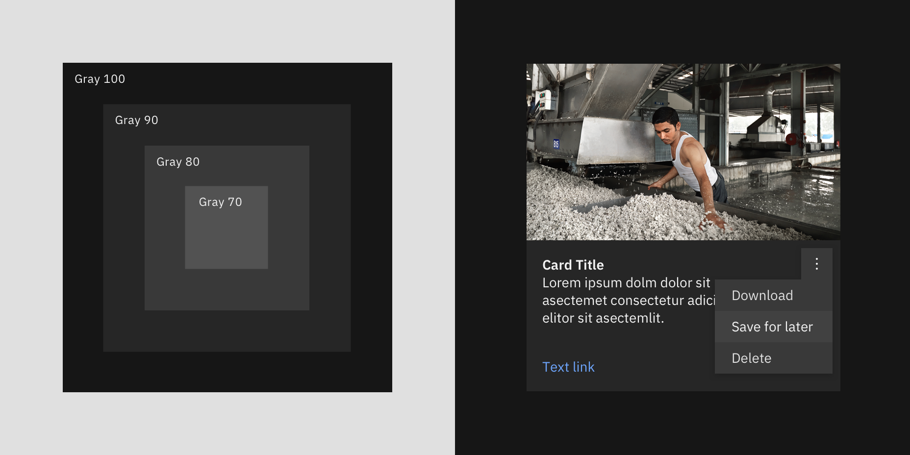
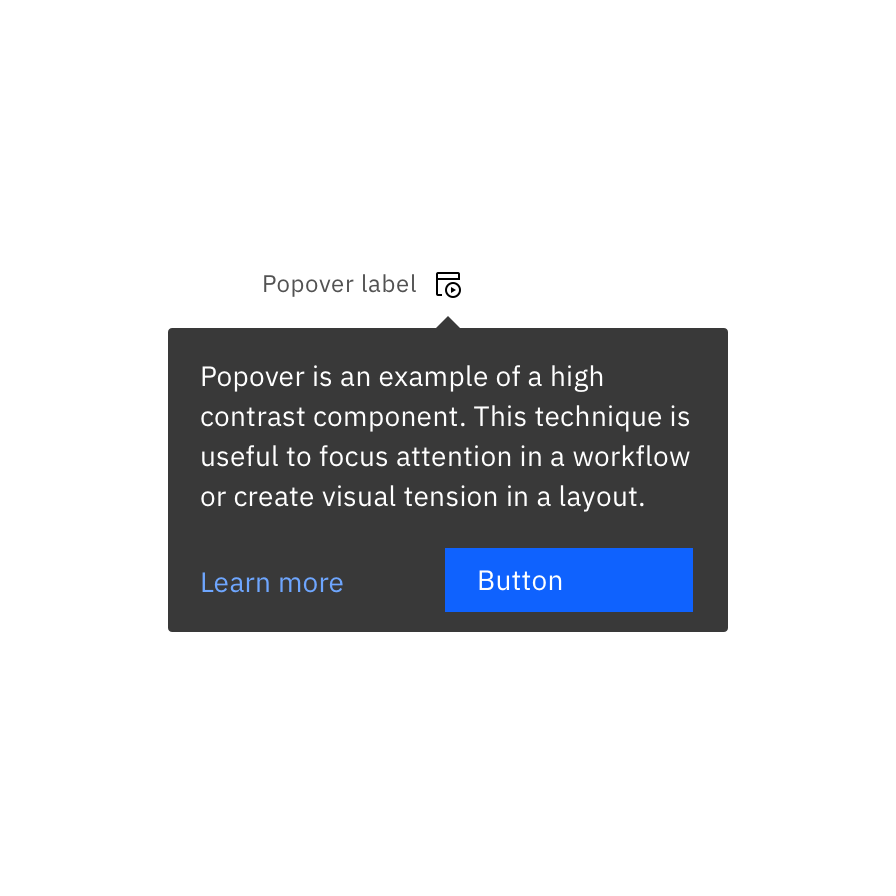
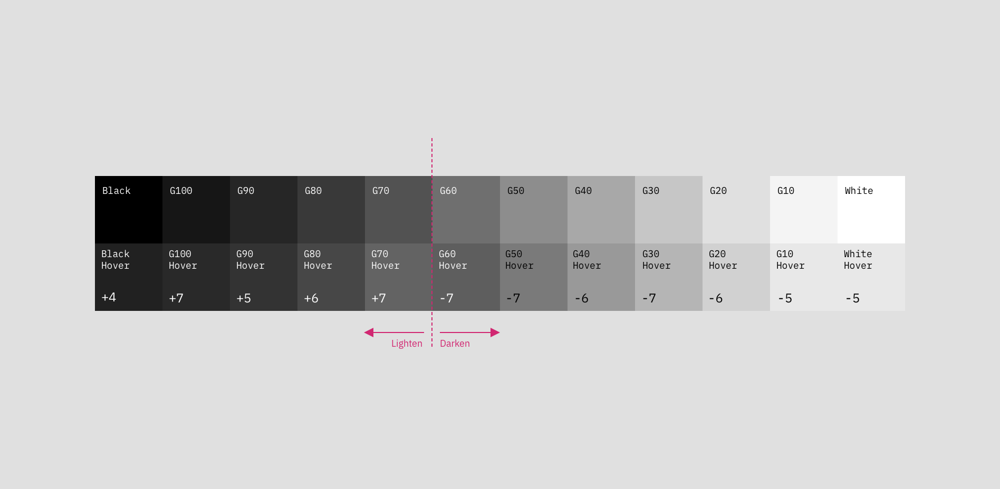

import ColorBlock from 'components/ColorBlock';
import ColorGrid from 'components/ColorGrid';

<PageDescription>

Maintaining consistent and engaging digital interfaces throughout IBM, whether
applications or experiences, demands extended guidance around color usage. The
following concepts are the foundation as we strive to achieve balance and
harmony through our User Interface design.

</PageDescription>

<AnchorLinks>

<AnchorLink>Introduction</AnchorLink>
<AnchorLink>Color anatomy</AnchorLink>
<AnchorLink>Themes</AnchorLink>
<AnchorLink>Implementing color</AnchorLink>
<AnchorLink>Accessibility</AnchorLink>
<AnchorLink>Resources</AnchorLink>

</AnchorLinks>

<Video title="Color Overview" vimeoId="281513790" />

 

 

## Introduction

Application of the color palette brings a unified and recognizable consistency
to IBM's array of digital products and interfaces. This consistency is grounded
by a set of well-defined rules on how to work with the Carbon component library
in the context of dark and light themes.

A set of well-defined rules about how to work with the Carbon component library
in the context of dark and light themes, grounds this consistency and makes it
easy to apply.

<Caption></Caption>

## Color anatomy

Carbon’s default themes are derived from the IBM Design Language color palette.
The neutral gray family is dominant in the default themes, making use of subtle
shifts in value to organize content into distinct zones.

The core blue family serves as the primary action color across all IBM products
and experiences. Around this family, additional colors are used sparingly and
purposefully.

  <ColorGrid colorFamily="blue" />
  <ColorGrid colorFamily="gray" />

{/* possible TODO: remove inline style */}
<ColorGrid colorFamily="alerts" style="margin-top: 2rem" />
<Caption>Alerts Colors</Caption>

## Themes

Themes serve as an organizational framework for color in Carbon, with each theme
based on a specific primary background color. And they actually get their names
from their background color. There are two default "light" themes and two
default "dark" themes.

The light themes are based on White and Gray 10 backgrounds, and the dark themes
use Gray 100 and Gray 90 backgrounds. Within each theme, the values for the
universal color tokens use the primary background color as the base of its
layering model.

<Row className="color-blocks">
<Column colSm={1} colMd={1} colLg={2}>

  

    White
  

Light

</Column>
<Column colSm={1} colMd={1} colLg={2}>

  

    Gray 10
  

</Column>
<Column colSm={1} colMd={1} colLg={2}>

  

    Gray 100
  

Dark

</Column>
<Column colSm={1} colMd={1} colLg={2}>

  

    Gray 90
  

</Column>
</Row>

 
<Title> Global background colors </Title>

| Theme    | Primary background      | Token         | Hex value |                                             |
| -------- | ----------------------- | ------------- | --------- | ------------------------------------------: |
| White    | Global Background Light | `$background` | `#ffffff` |  <ColorBlock size="xs">#ffffff</ColorBlock> |
| Gray 10  | Global Background Light | `$background` | `#f4f4f4` | <ColorBlock  size="xs">#f4f4f4</ColorBlock> |
| Gray 90  | Global Background Dark  | `$background` | `#262626` | <ColorBlock  size="xs">#282828</ColorBlock> |
| Gray 100 | Global Background Dark  | `$background` | `#161616` | <ColorBlock  size="xs">#171717</ColorBlock> |

 

### Light themes

There are two light themes: White and Gray 10.

- **White theme**: Uses white background as it layering model base and is paired
  with components using Gray 10 containers.
- **Gray 10 theme:** Uses Gray 10 backgrounds as it layering model baseand is
  paired with components using white containers.

Some components, such as buttons and toggles, share the same colors across both
themes. If you're not sure which color to use, refer to the
[core color token](https://carbondesignsystem.com/guidelines/color/usage) table.

All of the themes are available in
[Design kits](https://carbondesignsystem.com/designing/kits/sketch/).

#### Layering model

Colors in the neutral gray palette are layered on top of each other to create
depth and spacial associations. The layering model defines the logic of how the
gray colors stack on top of each other in a UI when using the Carbon themes.

The layering model differs between the "light" and "dark" themes. In the light
themes, layers alternate between White and Gray 10.

<Row>
<Column colLg={12}>

</Column>
</Row>

<DoDontRow>
  <DoDont caption="Gray 10 dropdown on White background." colLg={6}>

  </DoDont>
  <DoDont colLg={6} caption="White dropdown on a Gray 10 background.">

  </DoDont>
</DoDontRow>

<DoDontRow>
  <DoDont colLg={6} caption="White overflow menu on Gray 10 card.">

  </DoDont>
  <DoDont type="dont" colLg={6} caption="Avoid use of midtones.">

  </DoDont>
</DoDontRow>

<Caption>Components with common colors across both light themes.</Caption>

 

### Dark themes

There are two dark themes: Gray 90 and Gray 100.

- **Gray 90 theme**: Uses Gray 90 backgrounds and is paired with components
  using Gray 80 containers.
- **Gray 100 theme:** Uses Gray 100 backgrounds and is paired with components
  using Gray 90 containers.

Some components, such as buttons and toggles, share the same colors across both
themes. If you're not sure which color to use, refer to the
[core color token](https://carbondesignsystem.com/guidelines/color/usage) table.

All of the themes are available in
[Design kits](https://carbondesignsystem.com/designing/kits/sketch/).

<DoDontRow>
  <DoDont
    colLg={6}
    caption="Gray 90 dropdown on Gray 100 background.">

  </DoDont>
  <DoDont colLg={6} caption="Gray 80 dropdown on Gray 90 background.">

  </DoDont>
</DoDontRow>

<DoDontRow>
  <DoDont
    colLg={6}
    caption="Gray 70 is sometimes used when compound components are being applied, such as an overflow menu.">

  </DoDont>
  <DoDont type="dont" colLg={6} caption="Do not apply components that are darker than the background unless using high-contrast mode.">

  </DoDont>
</DoDontRow>

<Caption>
  Components with common colors across both dark UI backgrounds.
</Caption>

 

#### Layering model

Colors in the neutral gray palette are layered on top of each other to create
depth and spacial associations. The layering model defines the logic of how the
gray colors stack on top of each other in a UI when using the Carbon themes.

The layering model differs between the "light" and "dark" themes. In the dark
themes, layers become one step lighter with each added layer.

<Row>
<Column colLg={12}>

</Column>
</Row>

### High contrast

In some cases, it is helpful to apply light components to dark backgrounds or
dark components to light backgrounds. This technique is useful to focus
attention or create visual tension.

<DoDontRow>
  <DoDont colLg={6}>

  </DoDont>
  <DoDont colLg={6}>

  </DoDont>
</DoDontRow>

## Implementing color

Carbon uses tokens and themes to manage color. Tokens are role-based, and themes
specify the color values that serve those roles in the UI.

| Term    | Definition                                                                                                                                                                                  |     |
| ------- | ------------------------------------------------------------------------------------------------------------------------------------------------------------------------------------------- | --- |
| _Theme_ | A collection of colors designed to create a specific aesthetic. Themes control the color value assigned to a token. For example, White theme, Gray 10 theme, Gray 90 theme, Gray 100 theme. |     |
| _Token_ | The role-based identifier that assigns a color. Used instead of a hex code. Tokens apply universally across themes. For example, `$layer`, `$border-subtle`, `$support-error`.              |     |
| _Role_  | The systematic usage(s) of a color. Roles cannot be changed between themes.                                                                                                                 |     |
| _Value_ | The unique visual attribute (hex code, rgba value) assigned to a token through the use of a theme.                                                                                          |

### Tokens

Color in Carbon is managed through tokens. Tokens are an abstracted method of
applying color in a consistent and scalable way. Each color token is assigned a
role and a value. The role determines where the token is applied in the UI and
the value is the actual color (that is, the hex code) that will appear in an
assigned theme. Tokens are used in place of a one-off hex code, allowing for
changes in values to be made at scale for easy color management. The token names
themselves stay the same in code no matter which theme is being used.

Here's an example of how tokens work: instead of coding all instances of input
labels in a UI to be `#565656`, the _form_ component in Carbon specifies the
label color to use the token `$text-secondary`. The value of the token will
automatically be called in a relay effect through a theme file which will assign
it the value of `#565656`. For a different theme, that same `text-secondary`
token could be mapped to a different hex value like `#ffffff`. By using the
token name instead of the hex code, any color updates within a theme can be
applied instantly, and any UI (or portion of a UI) can switch between different
themes easily.

See [color usage tab](/guidelines/color/usage) for the full list of color
tokens.

### Color roles

The systematic and consistent use of color is achieved by applying tokens based
on their _role_. Roles are important to follow as a single color value may be
assigned to multiple color tokens. The
[color usage tab](https://carbondesignsystem.com/guidelines/color/usage) lists
the role(s) for each color token in the second column.

For quick reference, the role of a token is also represented in the token name
itself. The token names are divided into parts to help you make decisions and
understand options. The first part of the token name references the general UI
element the color is being applied to, like `background`, `text`, `border`. If
the element can be styled in more than one way then the last half of the token
name will further describe its how it should be used. For example
`border-subtle` is used when a border or divider rule needs a low contrasting
(subtle) aesthetic.

### Interaction states

In addition to the core set of enabled-state tokens, there are five other
primary interaction states defined with tokens for each theme. Interaction
tokens are signified by the addition of a state name added to the end of the
base token name. For example, the `background` hover state token is
`background-hover`.

The color layering model for interaction tokens is as follows:

- For values between Black and Gray 70, interaction gets lighter.
- For values between Gray 60 and White, interaction gets darker.

<Caption>Light theme interactive tokens.</Caption>

<Caption>Dark theme interactive tokens.</Caption>

#### Hover

Hover is a subtle visual change that appears when a mouse cursor moves over an
interactive element. Hover states have their own tokens and are identified the
`-hover` added to the end of the base token name, such as `$background-hover`.

For container backgrounds in the IBM themes, hover states token values are "half
steps" between two adjacent colors on the IBM color palette steps. These values
fall outside of the IBM color palette steps and are calculated in code through
an `adjustLightness` function with either a `+` or `-` number value. For
example, `$background-hover: adjustLightness($background, -5)`. _Note that in
the Sketch assets, hex codes are still used as values for hover states for ease
of use and are built into the layer style tokens._

- For values between Black and 70, interaction gets `+` adjustment.
- For values between 60 and White, interaction gets `-` adjustment.

<Row>
<Column colLg={12}>

</Column>
</Row>

For elements like text or icons that are use `secondary` colors for its enabled
state when hovered will change to the `primary` color to subtly emphasis the
element. Often times this shift in color to the text or icon element will also
be accompanied with a background hover color shift as well. For example, in an
overflow menu items use `$text-secondary` and `$layer` in its enabled state. On
hover, the text switches to `$text-primary` and the background to
`$layer-hover`.

<Row>
<Column colLg={12}>

</Column>
</Row>

#### Active

The active state can be used to indicate a `click`, `tap` or down press of a
button. Active tokens are identified by `-active` added to the end of the base
token name, such as `$button-primary-active`.

Active state values are two full steps lighter or darker on the IBM color scale.
For example, the Blue 60 active state is Blue 80.

- For values between 100 and 70, the active state is two full steps lighter.
- For values between 60 and 10, the active state is two full steps darker.

The exceptions are that White value shares the same active state as Gray 10
value, and Black value shares the same active state as Gray 100 value.

<Row>
<Column colLg={12}>

</Column>
</Row>

#### Selected

Selected states indicated item(s) or option(s) that have been chosen in the UI
by the user through any input method. Selected token are identified by the
`-selected` added to the end of the base token name, such as `$layer-selected`.

The color logic for selected state is either one full step lighter or darker on
the IBM color scale. For example, the Gray100 selected state is Gray 90.

- For values between 100 and 70, the selected state is one full step lighter.
- For values between 60 and 10, the selected state one full step darker.

The exception is that White shares the same selected state as Gray 10, and Black
shares the same selected state as Gray 100.

<Row>
<Column colLg={12}>

</Column>
</Row>

#### Focus

The focus state draws attention to the active element on a page when using the
keyboard or voice to navigate. In Carbon, the focus of an element is most
commonly indicated by a 2px border around the element. In order to make it easy
to identify and locate on a page most focus states use only one color per theme
controlled through the `$focus` color token.

- In the light themes, the focus state usually appears as a Blue 60 border.
- In the dark themes, the focus state usually appears as a White border.

The exception is high contrast moments where a `$focus-inverse` color is used
instead.

Focus states are required on all interactive elements and must pass 3:1 color
contrast accessibility. Often times to achieve proper 3:1 contrast a
`$focus-inset` border is used between the focus border and the element itself.

#### Disabled

A disabled state is applied to a component when the user is not allowed to
interact with the component due to either permissions, dependencies, or
pre-requisites. Disabled states completely remove the interactive function of a
component and therefore don't receive hover or focus. Disabled state styling is
not subject to WC3 contrast compliance standards and is intentionally
de-emphasized in a faded fashion.

Disabled elements are always styled in the Gray family no matter its base color.
Components specific styling will depend on the elements within it and what
layers they are placed on. Some tokens have their own specific disabled tokens,
such as `$layer-disabled`, while other elements are grouped together and share a
disabled token like `$text-disabled`.

- For the light themes, disabled color values range from White to Gray 50
- For the dark themes, disabled color values range from Gray 90 to Gray 40

## Accessibility

Using various forms of contrast is the most important consideration when making
user-friendly color and interface choices. Awareness of standards and best
practices is the key to accessible color selection.

The color families in the IBM palette contain ten values from 10 to 100. White
and Black sit outside those values. Black text is WCAG AA accessible on colors
ranging from 10 to 50. White text is accessible on colors from 60 to 100.

<ArtDirection>

</ArtDirection>

Beyond black and white, the IBM color palette provides a range of accessible
combinations. Subtracting the foreground value from the background value (or
vice versa) helps determine whether that color combination meets the WCAG AA
contrast ratio success criteria. If the difference between two values is 50 or
greater, the colors are accessible. Anything below a difference of 50 may fail
accessibility standards.

<ArtDirection>

</ArtDirection>

<Caption>Blue color family, 60 background</Caption>

For a complete look at color-related accessibility topics in Carbon, visit the
[Accessibility](/guidelines/accessibility/color) section.

## Resources

<Row className="resource-card-group">
<Column  colLg={4} colMd={4} noGutterSm>
  <ResourceCard
    subTitle="RGB color palettes (.ase and .clr)"
    href="https://github.com/carbon-design-system/carbon/raw/main/packages/colors/artifacts/IBM_Colors.zip"
    >

<MdxIcon name="ase" />

  </ResourceCard>
</Column>
<Column colLg={4} colMd={4}  noGutterSm>
  <ResourceCard
    subTitle="Elements package: Color"
    href="https://github.com/carbon-design-system/carbon/tree/main/packages/colors"
    >

<MdxIcon name="github" />

  </ResourceCard>
</Column>
</Row>
