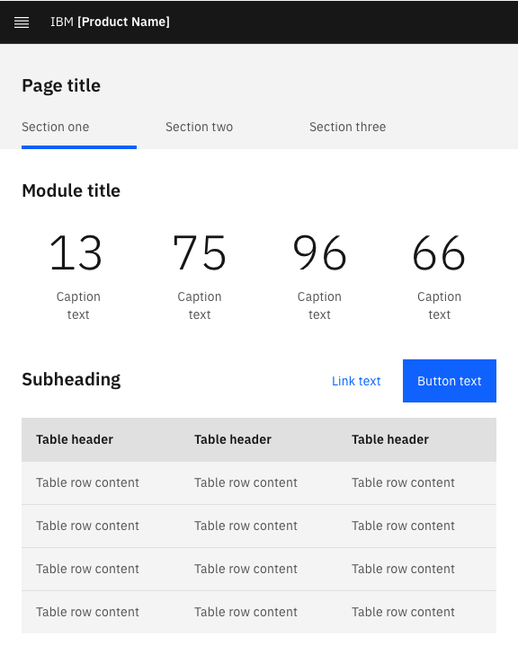

> "If you leave alphabet soup on the stove and go out, it could spell disaster."

<AnchorLinks>

<AnchorLink>Use sentence case capitalization</AnchorLink>
<AnchorLink>Capitaizing abbreviations</AnchorLink>
<AnchorLink>Capitalizing proper nouns</AnchorLink>
<AnchorLink>Capitalizing all other words</AnchorLink>
<AnchorLink>Referring to UI elements</AnchorLink>

</AnchorLinks>

## Use sentence case capitalization

Use sentence style capitalization for all text elements in the UI (headings, sub-heading, navigation labels, field labels, button labels, etc.).

- In sentence style capitalization, only the initial letter of the initial word is capitalized (plus any proper nouns).
- Studies show that this is the easiest and quickest form to read (especially when the text is more than a few words in length).
- It makes it easy to distinguish between common nouns and proper nouns (e.g. in the following example text, the initial capital letter used in the word “Padlock” suggests that this is the name of a product or service).

<Row>
  <Column colMd={4} colLg={4}>
    <DoDontExample
      type="do"
      caption="Sentence style capitalization"
      text="Secure your enterprise applications with Padlock"
      aspectRatio="1:1"
    />
  </Column>
</Row>

### Do not use headline case or all caps capitalization

**Headline (or title) case capitalization** is where the initial letter of most words is capitalized (but not articles, coordinating conjunctions, or prepositions - except if any of these are the first or last word).

- It can be difficult to implement consistently as it requires everyone who writes any copy to understand and follow fairly complex grammatical rules about which words should and shouldn’t be capitalized.
- It can make it difficult for the reader to distinguish between proper nouns and common nouns.

**All caps (or uppercase) capitalization** is where every letter is capitalized.

- All caps typically requires more space in the UI per letter than sentence case text does.
- It can be difficult for the reader to distinguish between proper nouns and common nouns.
- It has been shown to be more difficult to read (especially when text is more than a few words) as individual letter shapes are less distinguishable from each other when rendered in all caps.

<Row>
  <Column colMd={4} colLg={4}>
    <DoDontExample
      caption="Headline (or title) case capitalization"
      text="Secure Your Enterprise Applications with Padlock"
      aspectRatio="1:1"
    />
  </Column>
  <Column colMd={4} colLg={4}>
    <DoDontExample
      caption="All caps (or uppercase) capitalization"
      text="SECURE YOUR ENTERPRISE APPLICATIONS WITH PADLOCK"
      aspectRatio="1:1"
    />
  </Column>
</Row>

## Capitaizing abbreviations

### IBM product and service names

When referencing the name of any IBM product, use the official (full) name, not an abbreviation or just the product name initials (unless a shortened name has been specifically approved, as with IBM CICS).

<Row>
  <Column colMd={4} colLg={4}>
    <DoDontExample
      type="do"
      text="Experience WebSphere Application Server on IBM Cloud..."
      aspectRatio="1:1"
    />
  </Column>
  <Column colMd={4} colLg={4}>
    <DoDontExample text="Experience WAS on IBM Cloud..." aspectRatio="1:1" />
  </Column>
</Row>

### Other abbreviations

Use all uppercase letters for well-recognized abbreviations. This applies to both initialisms, such as IBM, and to acronyms, such as GIF.

- ASCII
- CAPTCHA
- FAQ
- HTML
- OK (not Ok or Okay)
- WDSL

Note: If an abbreviation might not be known to the target audience it’s good practice to spell it out in full the first time you use it. However, don’t spell out commonly known abbreviations (e.g. PDF, CEO, etc.).

<Row>
  <Column colMd={4} colLg={4}>
    <DoDontExample
      type="do"
      text="The configuration can be exported as a WSDL file."
      aspectRatio="1:1"
    />
  </Column>
  <Column colMd={4} colLg={4}>
    <DoDontExample
      text="The configuration can be exported as a wsdl file."
      aspectRatio="1:1"
    />
  </Column>
</Row>

## Capitalizing proper nouns

The names of people, places, and products all take initial capitals. For example:

- Charlie Chaplin
- Paris, France
- Porsche Boxster

While this general rule is simple, things are a little more complicated these days due to the fact that various official company and product names now use non-standard capitalization. If you mention any of these in your text, ensure you write them accurately. Here are some examples (all written correctly):

- developerWorks
- GitHub
- iTunes
- JavaScript
- WebSphere

Also, do remember that there are many words that can act as either a common noun or a proper noun, depending on the context. So, you always need to think about how the word is being used. Here are some examples:

| Word                | Used as a common noun                            | Used as a proper noun                              |
| ------------------- | ------------------------------------------------ | -------------------------------------------------- |
| agile               | The group uses agile tools and processes         | Debs referred her manager to the Agile Manifesto   |
| design              | Jodi works in the design organization            | Jodi works for IBM Design                          |
| editor              | Joe used a text editor to update the config file | Joe used IBM Flow Editor to define his data models |
| front end developer | Jane is hoping to recruit a front end developer  | Megan’s job title is Senior Front End Developer    |

<Row>
  <Column colMd={4} colLg={4}>
    <DoDontExample
      type="do"
      text="Our JavaScript plugin is available in GitHub."
      aspectRatio="1:1"
    />
  </Column>
  <Column colMd={4} colLg={4}>
    <DoDontExample
      text="Our Javascript plugin is available in Github."
      aspectRatio="1:1"
    />
  </Column>
</Row>

## Capitalizing all other words

Unless the word begins a sentence or is a proper noun, don’t give it a capital letter.

Don’t give a word a capital letter to denote “specialness”. If you want to emphasize a particular word or phrase within a sentence, use _italic_ or **bold** formatting (but not both).

<Row>
  <Column colMd={4} colLg={4}>
    <DoDontExample
      type="do"
      text="You can use a global policy to apply changes to all users."
      aspectRatio="1:1"
    />
  </Column>
  <Column colMd={4} colLg={4}>
    <DoDontExample
      text="You can use a Global Policy to apply changes to all users."
      aspectRatio="1:1"
    />
  </Column>
</Row>

## Referring to UI elements

When you refer to a UI element, use the same capitalization as used in the UI.

<Row>
  <Column colMd={4} colLg={4}>
    <DoDontExample
      type="do"
      text="After you have configured your notification settings, click Next."
      aspectRatio="1:1"
    />
  </Column>
  <Column colMd={4} colLg={4}>
    <DoDontExample
      type="do"
      text="To view more detailed information, click the Status and logs tab."
      aspectRatio="1:1"
    />
  </Column>
</Row>
