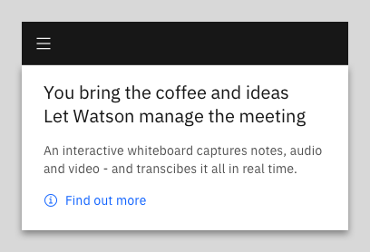
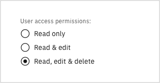
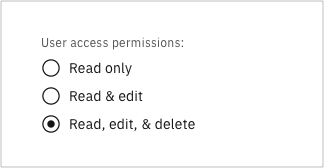
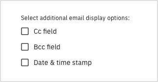
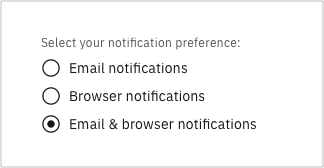

> "Every time you use an apostrophe to make a word plural, a puppy dies."

<AnchorLinks>

<AnchorLink>Periods</AnchorLink>
<AnchorLink>Colons</AnchorLink>
<AnchorLink>Commas</AnchorLink>
<AnchorLink>Apostrophes</AnchorLink>
<AnchorLink>Exclamation marks</AnchorLink>
<AnchorLink>Symbols</AnchorLink>

</AnchorLinks>

## Periods

Full sentences end with a period. Period.

**Exception:** Feel free to omit the period at the end of a main heading or strapline on a web page or within the product UI.

<Row>
  <Column colMd={4} colLg={4}>

<DoDontExample
type="do"
captionTitle=""
caption=""
>

</DoDontExample>

  </Column>
  <Column colMd={4} colLg={4}>

<DoDontExample
  type="do"
  captionTitle=""
  caption=""
  >

</DoDontExample>

  </Column>
</Row>

However, ensure you are consistent, i.e. don’t use periods in some headings but not in others.

<Row>
  <Column colMd={4} colLg={4}>

<DoDontExample
  captionTitle=""
  caption=""
  >

</DoDontExample>

  </Column>
</Row>

### Periods and space between sentences

In body text, add one space (not two) after the period that comes at the end on a sentence.

### Periods and bullet point lists

When writing bullet point lists, adopt one of the following two approaches, based on which one makes most sense for the content:

- Option 1: Write every entry in the list as a full sentence and include a period at the end of each one.
- Option 2: Write every entry as a short phrase (i.e. not a full sentence) and don’t use periods.

Don’t use a period at the end of short labels and phrases that are not complete sentences. For example, don’t use periods in button labels, links, short field labels, etc.

### Periods and parentheses

When parentheses are used to contain supplementary information towards the end of a sentence, the period goes outside of the parentheses.
Example:

> _Use only alphanumeric characters (A-Z and 0-9)._

However, if an entire sentence is contained within parentheses, the period goes inside the closing parenthesis.
Example:

> _Use only alphanumeric characters. (If you switch to using Transport Layer Security then any UTF-8 character encoding can be used.)_

## Colons

Colons are most commonly used to introduce a list of items. Never use a semi-colon for this purpose.

In most cases, the word directly following a colon shouldn’t have a capital letter. Example:

> As a customer, I expect the following from a cloud vendor: robust security, high availability, and a pay-for-use charging model.

**Exception:** The only exception is if the text following the colon constitutes a complete (independent) clause - that is, if the text following the colon could stand on its own as a complete sentence. Example:

> Remember Thomas Watson’s famous mantra: Good design is good business.

Colons are also used to separate two independent clauses when the second explains or illustrates the first.

## Commas

A comma marks a slight pause or break between different parts of a sentence. Used properly, commas make the meaning of sentences clear by grouping and separating words,
phrases, and clauses. Note in particular the following uses of commas.

### Commas used to separate items in a list

In a list of three or more items, always include a comma after the last but one item. (This is sometimes referred to as a _serial_ or _Oxford_ comma.)

<Row>
  <Column colMd={4} colLg={4}>
    <DoDontExample
      type="do"
      text="IBM Product X offers fast, secure, and scalable message delivery."
      aspectRatio="1:1"
    />
  </Column>
</Row>

**Exception:** In button labels, checkbox labels, or radio button labels, don’t use the serial comma in a list of three or more items if an ampersand is being used.

<Row>
  <Column colMd={4} colLg={4}>

<DoDontExample
type="do"
captionTitle=""
caption=""
>

</DoDontExample>

  </Column>
  <Column colMd={4} colLg={4}>

<DoDontExample
  captionTitle=""
  caption=""
  >

</DoDontExample>

  </Column>
</Row>

### Commas used to indicate parenthetical content

In this usage, a pair of commas is used in a similar way to a pair of parentheses: to separate out additional or non-essential information. Example:

> IBM Product X v8, our latest and greatest release, won the gold award.

### Commas used to mark off relative clauses

If a sentence starts with a subordinate (aka dependent) clause, use a comma to indicate where the subordinate clause ends and the main clause begins.
The preceding sentence is a case in point. Here’s another example:

> With its great feature set and first class design, IBM Product X was the overall winner.

### Commas used to indicate the person being addressed in direct speech

Here a comma alone can be the difference between: “What is this thing called love?” and “What is this thing called, love?” Or the difference between “Let’s eat Grandma.” and “Let’s eat, Grandma.”

There are many other uses for commas beside the few mentioned here. If you would like to read about the other uses consult a standard grammar guide.\*

\*You might also want to consider getting out more! 😉

## Apostrophes

Apostrophes are used in contractions to indicate missing letters (e.g. _can’t_) and to show possession (e.g. _the user’s credentials_).

However, don’t use an apostrophe and letter _s_ (i.e. _’s)_ to indicate the possessive form of abbreviations or company or product names.

<Row>
  <Column colMd={4} colLg={4}>
    <DoDontExample
      type="do"
      text="The IBM Cloud catalog..."
      aspectRatio="1:1"
    />
  </Column>
  <Column colMd={4} colLg={4}>
    <DoDontExample text="IBM Cloud's catalog..." aspectRatio="1:1" />
  </Column>
</Row>

## Exclamation marks

Avoid using exclamation marks. Exclamation marks might be fine strewn through your Facebook comments, but they don’t look appropriate in a professional product UI.

By all means offer the user encouragement, but do this through stating clearly what they have achieved so far. (Don’t write like an excited cheerleader! Not cool! No way!)

**Exception:** Feel free to use an exclamation mark in a welcome greeting, such as in a sign-up email:

<Row>
  <Column colMd={4} colLg={4}>
    <DoDontExample type="do" text="Welcome, Emma!" aspectRatio="1:1" />
  </Column>
</Row>

## Symbols

Don’t use symbols in place of words.

**Exception:** In button labels, checkbox labels, and radio button labels, an ampersand (_&_) can be used in place of the word “and” to reduce space.

### Ampersands in button labels

<Row>
  <Column colMd={4} colLg={4}>
    <DoDontExample type="do" text="Save & close" aspectRatio="1:1" />
  </Column>
</Row>

### Ampersands in checkbox labels

<Row>
  <Column colMd={4} colLg={4}>

<DoDontExample
  type="do"
  captionTitle=""
  caption=""
>

</DoDontExample>

  </Column>
</Row>

### Ampersands in radio button labels

<Row>
  <Column colMd={4} colLg={4}>

<DoDontExample
  type="do"
  captionTitle=""
  caption=""
>

</DoDontExample>

  </Column>
</Row>

As ever, ensure you are consistent across your product UI.
