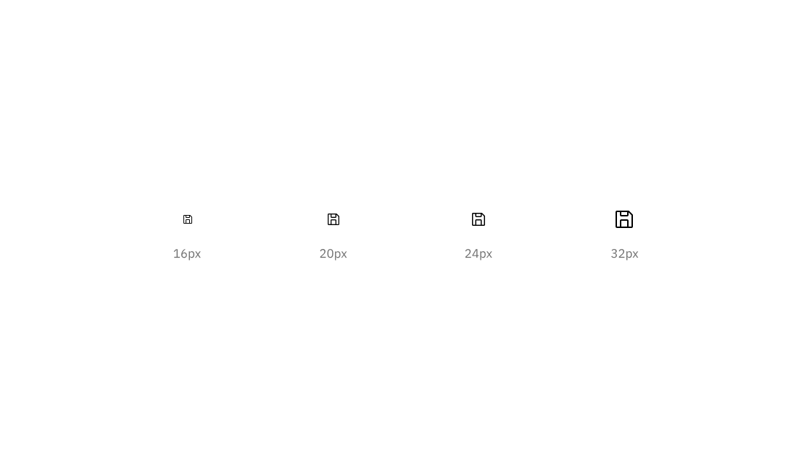
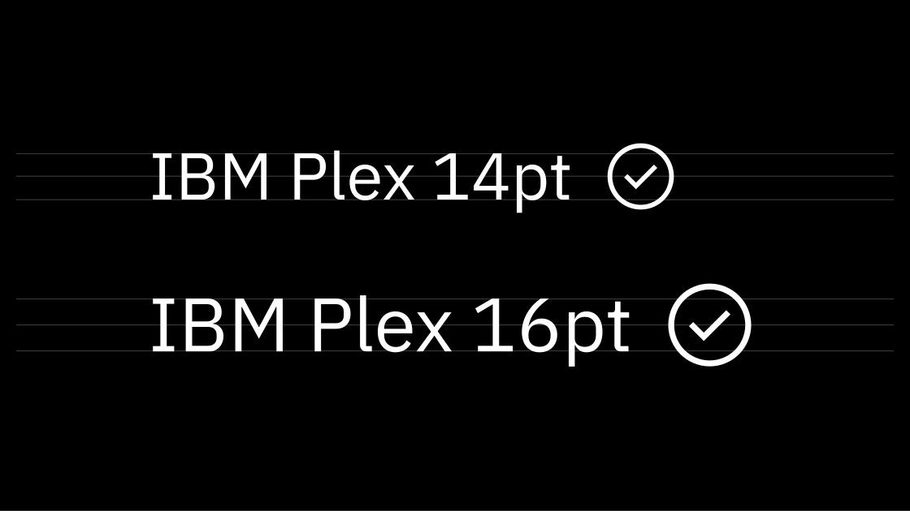
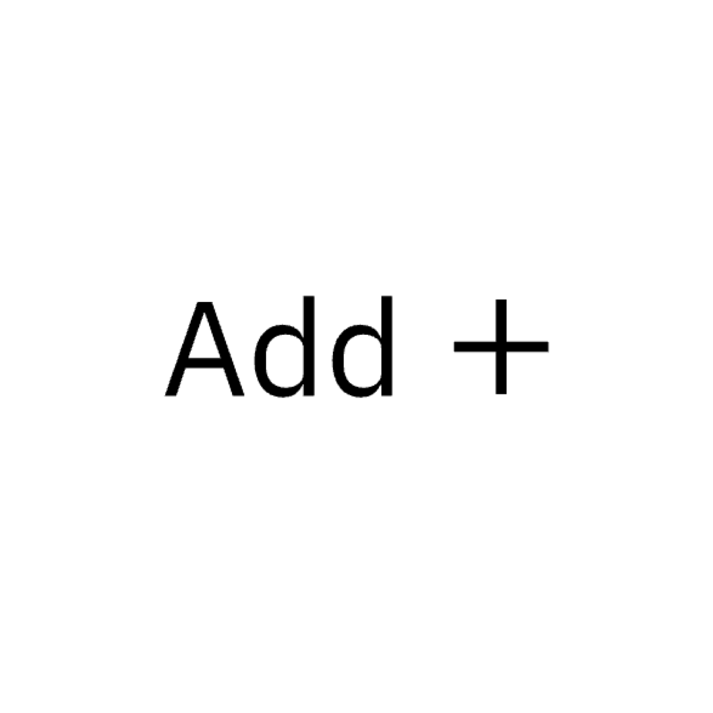
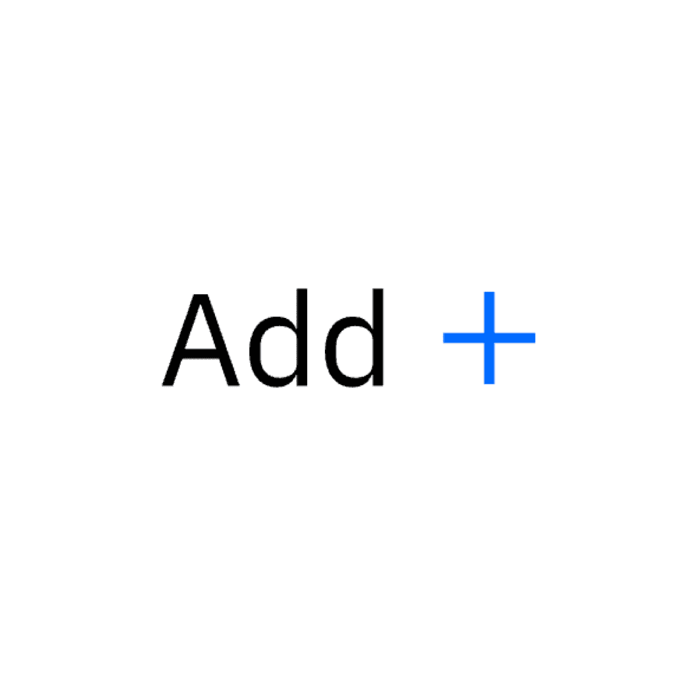

---
label:
  Icons are visual symbols used to represent ideas, objects, or actions. They
  communicate messages at a glance, afford interactivity, and draw attention to
  important information.
title: Icons
description:
  Icons are visual symbols used to represent ideas, objects, or actions. They
  communicate messages at a glance, afford interactivity, and draw attention to
  important information.
tabs: ['Library', 'Usage', 'Code']
---

<PageDescription>

Icons are visual symbols used to represent ideas, objects, or actions. They
communicate messages at a glance, afford interactivity, and draw attention to
important information.

</PageDescription>

## Resources

<Row className="resource-card-group">
<Column colLg={4} colMd={4} noGutterSm>
  <ResourceCard
    subTitle="Elements package: Icons"
    href="https://github.com/carbon-design-system/carbon/tree/v10/packages/icons"
    >

<MdxIcon name="github" />

  </ResourceCard>
</Column>
<Column colLg={4} colMd={4}  noGutterSm>
  <ResourceCard
    subTitle="Elements package: Icons-React"
    href="https://github.com/carbon-design-system/carbon/tree/v10/packages/icons-react"
    >

<MdxIcon name="github" />

 </ResourceCard>
</Column>
<Column colLg={4} colMd={4}  noGutterSm>
  <ResourceCard
    subTitle="IBM Icons (16px, 20px) library"
    href="sketch://add-library/cloud/028e0598-591e-428c-a490-f6ec64b15ea7"
    >
      <MdxIcon name="sketch" />
 </ResourceCard>
</Column>
<Column colLg={4} colMd={4}  noGutterSm>
  <ResourceCard
    subTitle="IBM Icons (24px, 32px) library"
    href="sketch://add-library/cloud/d530998a-c94c-4f1c-bc0e-c05417e067e3"
    >
      <MdxIcon name="sketch" />
 </ResourceCard>
</Column>
</Row>

 
 

## Designing with icons

### Sizing

Carbon components typically use icons on 16px artboards. Icons on 20px, 24px,
and 32px artboards can also be used within the UI. Be sure icon size is
consistent throughout your product.

<Caption>
  16px and 20px icons are optimized to feel balanced when paired with 14pt and
  16pt IBM Plex. Use 24px and 32px when larger icons are needed.
</Caption>

<DoDontRow>
  <DoDont
    type="do"
    caption="Do use the correct icon size with IBM Plex.">

  </DoDont>
  <DoDont type="dont" caption="Don’t alter the icon-text size ratio.">

  </DoDont>
</DoDontRow>

### Touch targets

All touch targets for interactive icons need to be 44px or larger. Developers
can add padding to a touch target with CSS to meet the 44px requirement.

<Caption>A 22px icon centered in a 48px touch target.</Caption>

### Color

Icons are always a solid, monochromatic color and need to pass the same color
contrast ratio as typography (4.5:1). The color of the icon should reflect the
importance of the icon’s action which should always be to help guide a user. For
more information on color, see the
[Color guidelines](/guidelines/color/overview).

It's also important to note that Carbon v10 icons themselves do not have
interaction states, only their backgrounds do.

<DoDontRow>
  <DoDont
    type="do"
    caption="Do match your icon color with your text color when pairing them.">

  </DoDont>
  <DoDont type="dont" caption="Don’t use different colors for text and icons.">

  </DoDont>
</DoDontRow>

### Alignment

When used next to text, icons should be center-aligned.

<DoDontRow>
  <DoDont
    type="do"
    caption="Do center-align icons when they’re next to text.">

  </DoDont>
  <DoDont type="dont" caption="Don’t baseline-align icons to the text.">

  </DoDont>
</DoDontRow>
