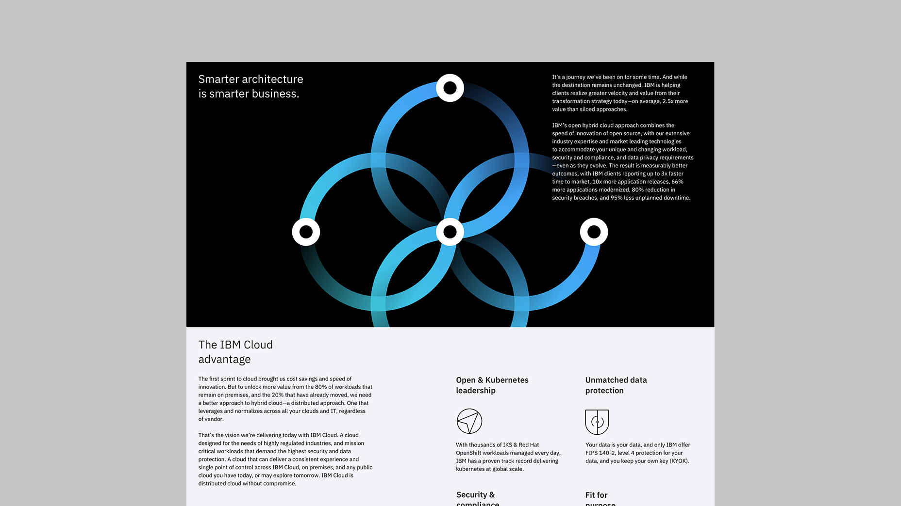
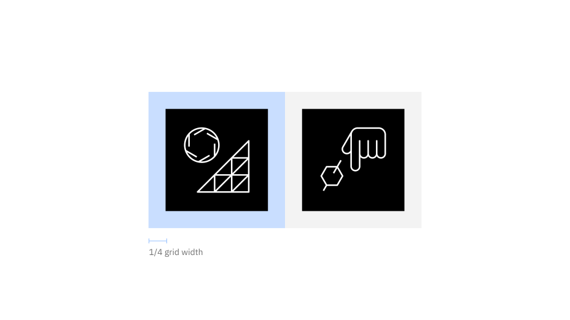
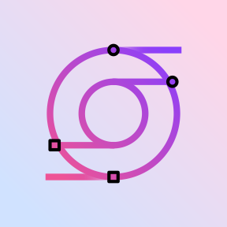
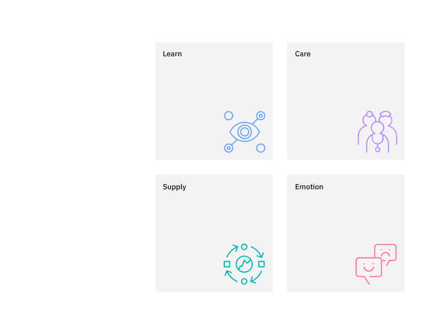

import { Bee } from '@carbon/icons-react';

<PageDescription>

Use pictograms to communicate in a glance, offer interactivity, or simplify
complex ideas. Shown here are examples for many use cases such as websites,
product UI’s, signage, events, and merchandise. When used appropriately, they
become an elegant addition to the IBM experience.

</PageDescription>

<AnchorLinks>
  <AnchorLink>Productive versus expressive</AnchorLink>
  <AnchorLink>Sizing</AnchorLink>
  <AnchorLink>Alignment</AnchorLink>
  <AnchorLink>Containers</AnchorLink>
  <AnchorLink>Clearance</AnchorLink>
  <AnchorLink>Color</AnchorLink>
  <AnchorLink>Pictograms in action</AnchorLink>
</AnchorLinks>

## Resources

<Row className="resource-card-group">
<Column colMd={4} colLg={4} noGutterSm>
    <ResourceCard
      subTitle="IBM Design Language library"
      aspectRatio="2:1"
      href="sketch://add-library/cloud/nwqmk"
      >

  </ResourceCard>
</Column>
<Column colMd={4} colLg={4} noGutterSm>
    <ResourceCard
      subTitle="IBM pictograms (.svg)"
      href="https://github.com/carbon-design-system/carbon/tree/v10/packages/pictograms/src/svg"
      >

</ResourceCard>
</Column>
<Column colMd={4} colLg={4} noGutterSm>
    <ResourceCard
      subTitle="IBM productive pictogram master"
      aspectRatio="2:1"
      href="https://github.com/carbon-design-system/carbon/raw/v10/packages/pictograms/master/productive-pictogram-master.ai"
      actionIcon="download"
      >

  </ResourceCard>
</Column>
<Column colMd={4} colLg={4} noGutterSm>
    <ResourceCard
      subTitle="IBM expressive pictogram master"
      aspectRatio="2:1"
      href="https://github.com/carbon-design-system/carbon/raw/v10/packages/pictograms/master/expressive-pictogram-master.ai"
      actionIcon="download"
      >

  </ResourceCard>
</Column>
</Row>

## Productive versus expressive

Productive and expressive pictograms are two distinct types of artwork that work
best in different contexts. Productive pictograms are the go-to pictogram type
for most contexts; they work across a variety of scales and environments whether
physical or digital. They're illustrative and simple, allowing for one or many
to be used to convey complex ideas.

Expressive pictograms represent a more dynamic option to the standard pictogram,
using gradients, layering and transparency to build a sense of depth and
movement in the artwork. Due to their visual complexity, expressive pictograms
should be used selectively and only in scenarios that call for a graphic with
strong presence.

<ArtDirection>

</ArtDirection>
<Caption>Productive pictograms in context</Caption>

<ArtDirection>

</ArtDirection>
<Caption>Expressive pictogram in context</Caption>

<DoDontRow>
<DoDont type="do" caption="Treat pictograms as illustations with sufficient sizing.">

</DoDont>
<DoDont type="dont" caption="Don’t use pictograms as a replacement for UI icons, that is not their purpose.">

</DoDont>
</DoDontRow>

<DoDontRow>
<DoDont type="do" caption="Use expressive pictograms as large, bold graphics.">

</DoDont>
<DoDont type="dont" caption="Don’t overuse expressive pictograms. They should be used sparingly.">

</DoDont>
</DoDontRow>

<DoDontRow>
<DoDont type="dont" caption="Don’t use productive pictograms as logos or in a lockup for product headers, merchandise or events.">

</DoDont>
<DoDont type="dont" caption="Don’t use expressive pictograms as logos or in a lockup for product headers, merchandise or events.">

</DoDont>
</DoDontRow>

## Sizing

Pictograms are used in a range of sizes, the minimum being 48px while the
maximum size may vary based on application. Use pictograms at their original
sizes or scale at accepted increments.

<ArtDirection>

</ArtDirection>
<ArtDirection>

</ArtDirection>

## Alignment

Pictograms are optically aligned to the center of the icon grid within the
boundary box. Centering ensures all pictograms will be aligned correctly when
exported and used side by side.

<ArtDirection>

</ArtDirection>

## Containers

Pictograms can be represented in a circular or rectangular container calculated
based on the padding size.

<ArtDirection>

</ArtDirection>

<ArtDirection>

</ArtDirection>

<DoDontRow>
<DoDont type="do" caption="Keep pictograms at scale and optically center in container when necessary.">

</DoDont>
<DoDont type="dont" caption="Don’t resize pictograms outside of accepted proportions.">

</DoDont>
</DoDontRow>

<DoDontRow>
<DoDont type="do" caption="Do use accepted shapes: circle or square for containers.">

</DoDont>
<DoDont type="dont" caption="Don’t create new shapes for containers.">

</DoDont>
</DoDontRow>

<DoDontRow>
<DoDont type="do" caption="Always optically center align pictograms in their containers.">

</DoDont>
<DoDont type="dont" caption="Don’t crop pictograms in container.">

</DoDont>
</DoDontRow>

## Clearance

When designing with pictograms, all artwork should include minimum padding based
on 1/4 of the scaled grid size. The padding can be increased by increments of
1/4 grid units.

<ArtDirection>

</ArtDirection>

<Caption>
  Padding and spacing rules apply whether using pictograms with or without
  containers.
</Caption>

<ArtDirection>

</ArtDirection>

<Caption>Padding starts at the edge of the container shape.</Caption>

<ArtDirection>

</ArtDirection>

<Caption>Padding is the same for both circle and square containers.</Caption>

<DoDontRow>
<DoDont type="do" caption="Follow the clearance rule to allow for legibility and touch.">

</DoDont>
<DoDont type="dont" caption="Don’t collapse the pictogram clearance area.">

</DoDont>
</DoDontRow>

## Color

Pictograms on backgrounds must always pass color contrast requirements. When
pairing pictograms with backgrounds, follow color family rules to ensure that
the pictogram does not clash with or blend into the background. Dark background
colors should range between values 70–100 while light backgrounds should not
exceed values 10–20.

<ArtDirection>

</ArtDirection>

<DoDontRow>
<DoDont type="do" caption="Follow the 5-step color rule and only match tones from the same color family or use grayscale backgrounds.">

</DoDont>
<DoDont type="do" caption="Follow gradient rules when placing them on backgrounds.">

</DoDont>
</DoDontRow>

<DoDontRow>
<DoDont type="dont" caption="Don’t place dark tones on dark backgrounds.">

</DoDont>
<DoDont type="dont" caption="Don’t place light tones on light backgrounds.">

</DoDont>
</DoDontRow>

<DoDontRow>
<DoDont type="dont" caption="Don’t place gradient picto’s on backgrounds that are not 80 and above or 20 and below.">

</DoDont>
<DoDont type="dont" caption="Don’t place gradient picto’s on gradient backgrounds.">

</DoDont>
</DoDontRow>

### Expressive pictogram color

Expressive pictograms have four color themes: dark, light, monochromatic dark,
and monochromatic light. To ensure accessibility, use the color theme that
corresponds with the pictogram’s background color.

<ArtDirection>

</ArtDirection>

| Background color value | Pictogram theme             |
| ---------------------- | --------------------------- |
| White, 10–20           | Light                       |
| 30–50                  | Monochromatic light (Black) |
| 50–70                  | Monochromatic dark (White)  |
| 80–100, Black          | Dark                        |

<DoDontRow>
<DoDont type="do" caption="Use dark-theme pictograms on dark backgrounds and light-theme pictograms on light backgrounds.">

</DoDont>
<DoDont type="dont" caption="Don’t use light-theme pictograms on dark backgrounds or dark-theme pictograms on light backgrounds.">

</DoDont>
</DoDontRow>
<DoDontRow>
<DoDont type="dont" caption="Don’t place expressive pictograms on backgrounds that aren't 80 and above or 20 and below.">

</DoDont>
<DoDont type="dont" caption="Don’t place expressive pictograms on gradient backgrounds.">

</DoDont>
</DoDontRow>

## Pictograms in action

<ImageGallery>

<ImageGalleryImage alt="pictogram on sign" title="Pictogram on sign" col={8}>

</ImageGalleryImage>

<ImageGalleryImage alt="expressive pictogram on web" title="Expressive pictogram on web" col={4}>

</ImageGalleryImage>

<ImageGalleryImage alt="pictogram on hat" title="Pictogram on hat" col={4}>

</ImageGalleryImage>

<ImageGalleryImage alt="expressive pictogram on poster" title="Expressive pictogram on poster" col={8}>

</ImageGalleryImage>

<ImageGalleryImage alt="pictogram on card" title="Pictogram on card" col={8}>

</ImageGalleryImage>

<ImageGalleryImage alt="pictogram on wallpaper" title="Pictogram on wallpaper" col={4}>

</ImageGalleryImage>

</ImageGallery>
